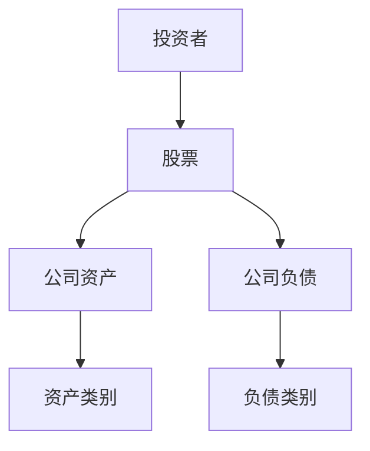
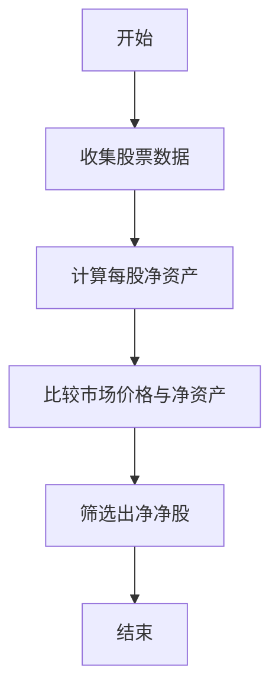
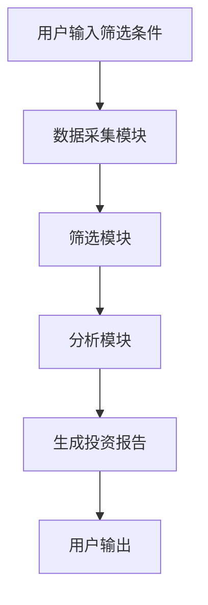
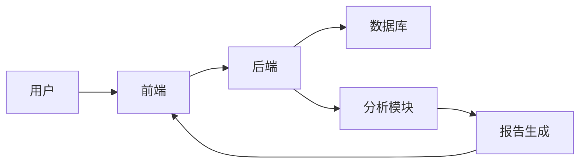

                 


# 格雷厄姆的净净股投资策略

## 关键词：格雷厄姆、净净股、投资策略、价值投资、股票分析

## 摘要：格雷厄姆的净净股投资策略是一种基于价值投资的经典方法，旨在通过分析股票的内在价值和市场价格之间的差异来寻找被低估的投资机会。本文将从格雷厄姆的投资理念出发，详细阐述净净股的核心概念、筛选方法、数学模型、系统架构设计以及实际项目实现，帮助读者全面理解并掌握这一经典投资策略。

---

## 第一部分：格雷厄姆的净净股投资策略基础

### 第1章：格雷厄姆与净净股投资概述

#### 1.1 格雷厄姆的生平与投资理念

##### 1.1.1 格雷厄姆的生平简介
本杰明·格雷厄姆（Benjamin Graham）是20世纪著名的投资学家，被誉为“价值投资之父”。他出生于1894年，早年在哥伦比亚大学学习法律，后转向金融领域。格雷厄姆的职业生涯始于1920年代，他创立了格雷厄姆-纽曼投资公司，并在1949年出版了经典著作《证券分析》。

##### 1.1.2 格雷厄姆的价值投资理念
格雷厄姆的投资理念以“安全边际”为核心，主张以低于股票内在价值的价格买入股票。他认为，市场波动往往会导致股票价格偏离其实际价值，投资者应利用这种偏差来寻找投资机会。

##### 1.1.3 净净股策略的核心思想
净净股策略是格雷厄姆提出的一种具体投资方法，旨在通过分析公司的净资产（即股东权益）与市场价格之间的关系，寻找被市场低估的股票。

#### 1.2 净净股投资的定义与特点

##### 1.2.1 净净股的定义
净净股（Net-Net Stocks）是指市场价格低于公司净资产的股票。具体来说，当市场价格（P）小于公司每股净资产（N）时，该股票即被视为净净股。

##### 1.2.2 净净股的核心特点
- **低估性**：市场价格低于净资产，意味着股票具有较高的安全边际。
- **稳定性**：公司资产主要由现金和易于变现的资产组成，风险较低。
- **防御性**：在市场下跌时，这类股票的跌幅通常有限。

##### 1.2.3 净净股与传统投资策略的区别
下表对比了净净股策略与传统成长型投资策略的核心区别：

| 对比维度 | 净净股策略 | 传统成长型策略 |
|----------|------------|----------------|
| 投资目标 | 寻找低估股票 | 寻找高成长公司 |
| 估值方法 | 基于净资产 | 基于未来盈利 |
| 风险偏好 | 低风险偏好 | 高风险偏好 |
| 适用场景 | 市场低迷时 | 市场牛市时 |

#### 1.3 净净股投资的背景与意义

##### 1.3.1 净净股投资的背景
净净股策略诞生于20世纪初，当时市场波动剧烈，投资者普遍关注股票的安全性和稳定性。

##### 1.3.2 净净股投资的意义
- **防御性投资**：在市场下跌时，净净股的跌幅有限，能够保护投资者的本金。
- **价值发现**：通过分析净资产与市场价格的差异，投资者可以发现被市场忽视的低估股票。
- **长期稳健**：净净股策略注重安全边际，适合长期稳健的投资目标。

---

### 第2章：净净股投资的核心概念与联系

#### 2.1 净净股投资的核心概念

##### 2.1.1 净资产的概念
净资产（Net Worth）是指公司资产负债表中股东权益的总和，包括股本、公积金、未分配利润等。

##### 2.1.2 市场价格与内在价值的关系
市场价格（P）与内在价值（V）之间的差异是净净股策略的核心关注点。当P < V时，股票具有投资价值。

##### 2.1.3 净净股投资的逻辑框架
$$ P < N $$

其中，P为市场价格，N为每股净资产。

#### 2.2 净净股投资的核心要素对比

##### 2.2.1 净资产与负债的对比
- 净资产代表公司的所有者权益，负债则是公司需要偿还的债务。在选择净净股时，应优先考虑负债较少的公司。

##### 2.2.2 市场价格与内在价值的对比
市场价格受市场情绪影响较大，而内在价值基于公司基本面。净净股策略的核心是利用市场价格的低估。

##### 2.2.3 净净股与非净股的对比
下表对比了净净股与非净股的核心差异：

| 对比维度 | 净净股 | 非净股 |
|----------|--------|--------|
| 市场价格 | P < N  | P ≥ N |
| 投资价值 | 高     | 低     |
| 风险偏好 | 低     | 高     |

#### 2.3 净净股投资的ER实体关系图



---

## 第3章：净净股投资的算法原理

### 3.1 净净股投资的筛选算法

#### 3.1.1 算法概述
净净股筛选算法的核心是通过比较股票的市场价格与每股净资产，找出满足P < N条件的股票。

#### 3.1.2 算法步骤
1. 收集目标股票的基本数据，包括市场价格（P）和每股净资产（N）。
2. 对比P和N，筛选出满足P < N的股票。
3. 进一步分析这些股票的财务状况，确认其具有较高的安全边际。

#### 3.1.3 算法实现
以下是一个简单的Python代码示例，用于筛选净净股：

```python
import pandas as pd

# 假设df为股票数据，包含'price'和'book_value'两列
net_net_stocks = df[df['price'] < df['book_value']]
print(net_net_stocks)
```

### 3.2 净净股投资的数学模型

#### 3.2.1 净资产计算公式
$$ \text{净资产} = \text{资产} - \text{负债} $$

#### 3.2.2 内在价值计算公式
$$ \text{内在价值} = \text{每股净资产} \times \text{安全边际系数} $$

#### 3.2.3 市场价格与内在价值的比较
$$ \text{市场价格} < \text{内在价值} $$

### 3.3 净净股投资的流程图



---

## 第4章：净净股投资的系统分析与架构设计

### 4.1 投资系统功能设计

#### 4.1.1 系统功能模块
- 数据采集模块：从数据库或API获取股票数据。
- 筛选模块：根据净净股筛选条件，筛选出符合条件的股票。
- 分析模块：对筛选出的股票进行进一步分析，评估其投资价值。
- 报告生成模块：生成投资报告，供投资者参考。

#### 4.1.2 系统功能流程图



### 4.2 系统架构设计

#### 4.2.1 系统架构图



#### 4.2.2 系统接口设计
- 数据接口：提供API用于数据采集。
- 筛选接口：根据筛选条件返回符合条件的股票。
- 分析接口：对股票进行进一步分析，返回评估结果。

### 4.3 系统交互设计

#### 4.3.1 系统交互流程图


---

## 第5章：净净股投资的项目实战

### 5.1 项目环境安装

#### 5.1.1 安装Python环境
```bash
python --version
pip install numpy pandas matplotlib
```

#### 5.1.2 数据库安装
```bash
pip install pymysql
```

### 5.2 系统核心实现

#### 5.2.1 数据采集模块
```python
import pymysql

# 连接数据库
conn = pymysql.connect(host='localhost', user='root', password='password', db='stocks')
cursor = conn.cursor()
cursor.execute("SELECT price, book_value FROM stock_prices")
data = cursor.fetchall()
conn.close()

# 转换为DataFrame
df = pd.DataFrame(data, columns=['price', 'book_value'])
```

#### 5.2.2 筛选模块
```python
net_net_stocks = df[df['price'] < df['book_value']]
print(net_net_stocks)
```

#### 5.2.3 分析模块
```python
import pandas as pd

# 计算安全边际
net_net_stocks['safety_margin'] = (net_net_stocks['book_value'] - net_net_stocks['price']) / net_net_stocks['book_value']

# 显示结果
print(net_net_stocks.head())
```

### 5.3 案例分析

#### 5.3.1 实际案例
假设某公司股票的市场价格为10元，每股净资产为15元，则P < N，该股票属于净净股。

#### 5.3.2 投资决策
根据筛选结果，投资者可以进一步分析这些股票的财务状况，确认其具有较高的投资价值。

### 5.4 项目总结

#### 5.4.1 项目总结
通过本项目，我们实现了净净股筛选系统的开发，验证了格雷厄姆投资策略的有效性。

#### 5.4.2 项目小结
净净股投资策略是一种简单而有效的投资方法，通过筛选市场价格低于净资产的股票，投资者可以找到被市场低估的投资机会。

---

## 第6章：净净股投资的最佳实践与小结

### 6.1 最佳实践 tips

#### 6.1.1 风险管理
在实际投资中，应注重分散投资，避免过度集中。

#### 6.1.2 定期复盘
定期检查投资组合，评估其表现并进行调整。

### 6.2 小结

格雷厄姆的净净股投资策略是一种基于价值投资的经典方法，通过分析股票的内在价值和市场价格之间的关系，投资者可以找到被市场低估的投资机会。本文从理论到实践，详细介绍了净净股投资的策略、算法、系统设计和项目实现，为投资者提供了全面的指导。

### 6.3 注意事项

- **数据准确性**：确保数据来源可靠，避免因数据错误导致投资决策失误。
- **市场波动**：尽管净净股策略注重安全边际，但市场波动仍可能影响股票价格。
- **长期投资**：净净股策略适合长期投资，短期内可能无法获得超额收益。

### 6.4 拓展阅读

- 《证券分析》（本杰明·格雷厄姆）
- 《投资学原理》（威廉·夏普）

---

## 作者：AI天才研究院/AI Genius Institute & 禅与计算机程序设计艺术/Zen And The Art of Computer Programming

