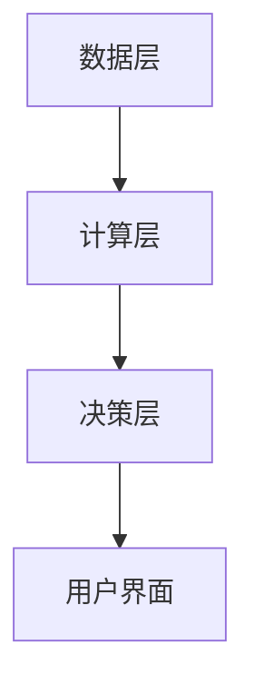

                 


# 格雷厄姆的净净股票策略：寻找极度低估的公司

> **关键词**：价值投资、净净股票策略、本杰明·格雷厄姆、安全边际、低估公司、投资策略、股票分析

> **摘要**：本文深入探讨了格雷厄姆的净净股票策略，这一策略专注于寻找市场价格远低于其内在价值的公司。文章首先介绍了格雷厄姆的投资理念，然后详细讲解了净净股票策略的核心概念，包括企业内在价值的计算和安全边际的重要性。接着，文章通过系统分析和架构设计，展示了如何实施这一策略，并通过实际案例分析和项目实战，帮助读者更好地理解和应用。最后，文章讨论了策略的优化与改进，并提出了未来的发展方向。

---

# 第一部分: 格雷厄姆的净净股票策略概述

## 第1章: 投资大师本杰明·格雷厄姆及其价值投资理念

### 1.1 格雷厄姆的生平简介

本杰明·格雷厄姆（Benjamin Graham）是20世纪著名的投资大师，被誉为“价值投资之父”。他出生于1894年，早年在哥伦比亚大学学习，后来投身华尔街，成为一名成功的投资家和作家。格雷厄姆的职业生涯中，他不仅积累了巨大的财富，还撰写了多本关于投资的经典著作，如《证券分析》和《聪明的投资者》。

### 1.2 格雷厄姆的价值投资理念

格雷厄姆的投资理念的核心是“安全边际”和“内在价值”。他认为，投资者应该寻找那些市场价格远低于其内在价值的股票，通过购买这些股票来获得长期稳定的收益。他强调，投资的本质是寻找低估的公司，而不是追求市场的短期波动。

### 1.3 格雷厄姆对现代投资学的贡献

格雷厄姆的价值投资理论对现代投资学产生了深远的影响。他的理念不仅影响了后来的投资者，如沃伦·巴菲特，还为学术界提供了丰富的研究素材。格雷厄姆的理论强调了基本面分析的重要性，为后来的价值投资策略奠定了基础。

---

## 第2章: 净净股票策略的核心概念

### 2.1 净净股票策略的定义与背景

净净股票策略是格雷厄姆提出的一种投资策略，旨在寻找那些市场价格远低于其内在价值的股票。这一策略的核心在于识别那些资产被低估的公司，从而在市场中寻找低估的投资机会。

### 2.2 净净股票策略的关键要素

#### 2.2.1 企业内在价值的计算方法

企业的内在价值是其未来现金流的现值。格雷厄姆在计算内在价值时，通常使用以下公式：

$$
\text{内在价值} = \sum_{t=1}^{n} \frac{CF_t}{(1 + r)^t}
$$

其中，\( CF_t \) 是第 \( t \) 年的现金流，\( r \) 是折现率，\( n \) 是预测的年数。

#### 2.2.2 市场价格与内在价值的对比

净净股票策略的核心在于比较市场价格与内在价值。当市场价格远低于内在价值时，股票具有投资价值。

#### 2.2.3 安全边际的概念与作用

安全边际是市场价格与内在价值之间的差额。格雷厄姆认为，安全边际越大，投资的风险越小。安全边际的存在为投资者提供了缓冲区，以应对市场的不确定性。

### 2.3 净净股票策略与其他投资策略的对比

#### 2.3.1 基本面分析与技术分析的对比

基本面分析注重企业的财务状况和内在价值，而技术分析则关注市场的价格走势和交易量。净净股票策略属于基本面分析的一种，注重内在价值的计算和市场价格的对比。

#### 2.3.2 成长型投资与价值型投资的对比

成长型投资关注企业的未来增长潜力，而价值型投资关注企业的当前价值。净净股票策略属于价值型投资的一种，注重寻找被市场低估的企业。

#### 2.3.3 净净股票策略的独特性与适用场景

净净股票策略的独特性在于其注重安全边际，强调在市场低估时买入。这一策略适用于市场波动较大的情况下，能够帮助投资者避免重大损失。

---

## 第3章: 净净股票策略的数学模型与公式

### 3.1 企业内在价值的计算公式

企业内在价值的计算公式如下：

$$
\text{内在价值} = \frac{\text{净利润} \times (1 + g)}{r - g}
$$

其中，\( g \) 是净利润增长率，\( r \) 是折现率。

### 3.2 安全边际的计算方法

安全边际的计算公式为：

$$
\text{安全边际} = \text{内在价值} - \text{市场价格}
$$

当安全边际为正时，股票具有投资价值。

### 3.3 净净股票策略的数学模型

净净股票策略的数学模型如下：

1. 计算企业的内在价值。
2. 对比市场价格与内在价值。
3. 计算安全边际。
4. 确定投资决策。

---

## 第4章: 净净股票策略的系统分析与架构设计

### 4.1 系统分析

#### 4.1.1 问题场景介绍

投资者需要寻找那些市场价格远低于其内在价值的股票，以实现长期稳定的收益。

#### 4.1.2 系统功能设计

系统功能包括：数据收集、内在价值计算、安全边际计算、投资决策。

#### 4.1.3 系统架构设计

系统架构包括：数据层、计算层、决策层。

#### 4.1.4 系统接口设计

系统接口包括：数据输入接口、计算接口、决策接口。

#### 4.1.5 系统交互设计

系统交互包括：用户输入数据、系统计算、用户查看结果。

### 4.2 系统架构设计

系统架构如下：



---

## 第5章: 净净股票策略的项目实战

### 5.1 环境安装

需要安装Python和相关库，如Pandas、NumPy、Matplotlib。

### 5.2 系统核心实现源代码

```python
import pandas as pd
import numpy as np

def calculate_intrinsic_value(net_profit, growth_rate, discount_rate):
    return net_profit * (1 + growth_rate) / (discount_rate - growth_rate)

def calculate_margin_of_safety(intrinsic_value, market_price):
    return intrinsic_value - market_price

# 示例数据
net_profit = 100
growth_rate = 0.05
discount_rate = 0.10
market_price = 50

intrinsic_value = calculate_intrinsic_value(net_profit, growth_rate, discount_rate)
margin_of_safety = calculate_margin_of_safety(intrinsic_value, market_price)

print(f"内在价值: {intrinsic_value}")
print(f"安全边际: {margin_of_safety}")
```

### 5.3 代码应用解读与分析

通过上述代码，我们可以计算出企业的内在价值和安全边际。如果安全边际为正，说明股票具有投资价值。

### 5.4 实际案例分析和详细讲解剖析

以某公司为例，计算其内在价值和安全边际，分析其是否符合净净股票策略的投资标准。

### 5.5 项目小结

通过项目实战，我们可以更好地理解净净股票策略的实施过程，并能够将其应用于实际投资中。

---

## 第6章: 净净股票策略的优化与改进

### 6.1 策略优化

可以结合技术分析，如趋势分析和成交量分析，进一步优化策略。

### 6.2 策略改进

可以通过引入大数据分析，提高内在价值计算的准确性。

### 6.3 结合市场环境的变化

根据市场环境的变化，调整策略的参数和计算方法。

---

## 第7章: 净净股票策略的总结与展望

### 7.1 全文总结

本文深入探讨了格雷厄姆的净净股票策略，分析了其核心概念和实施方法，并通过案例分析和项目实战，帮助读者更好地理解和应用这一策略。

### 7.2 未来展望

未来，随着技术的进步和市场的变化，净净股票策略将不断完善和优化，为投资者提供更多的机会。

---

## 附录: 净净股票策略相关工具与资源

### 1. 工具安装

需要安装Python、Pandas、NumPy、Matplotlib等工具。

### 2. 相关资源

- 《证券分析》和《聪明的投资者》是了解格雷厄姆投资理念的经典著作。
- 网站和论坛，如投资组合管理软件和数据分析平台，可以提供更多的资源和工具。

---

**作者：AI天才研究院/AI Genius Institute & 禅与计算机程序设计艺术 /Zen And The Art of Computer Programming**

