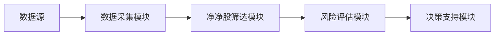

                 


# 《格雷厄姆的净净股策略》

> 关键词：净净股策略，格雷厄姆，价值投资，市净率，投资决策

> 摘要：本文深入探讨了格雷厄姆提出的净净股策略，分析其核心概念、算法原理、系统架构，并通过实际案例展示其在投资中的应用。文章适合对价值投资感兴趣的投资者和程序员阅读。

---

## 第一部分: 净净股策略的背景与核心概念

### 第1章: 净净股策略的起源与背景

#### 1.1 净净股策略的起源

格雷厄姆是价值投资的鼻祖，他的净净股策略是基于对公司内在价值的深入分析。净净股策略的核心是寻找市场价格低于其净资产价值的股票，即市净率（P/B）小于1的股票。这种策略在市场低迷或公司暂时困境时尤为有效。

#### 1.2 格雷厄姆的价值投资理论

格雷厄姆认为，股票的内在价值是其未来现金流的现值。他强调安全边际的重要性，即买入价格远低于内在价值，以降低风险。这种理念在净净股策略中得到体现，通过关注市净率，确保买入价格具有足够的安全边际。

#### 1.3 净净股策略的其他特点

- **低市净率**：净净股通常具有较低的市净率，表明市场对其估值较低。
- **高资产质量**：公司资产质量高，即使市场波动，其价值也能得到保障。
- **防御性投资**：净净股策略适合防御性投资，在市场下跌时表现相对稳定。

### 第2章: 净净股策略的核心概念与原理

#### 2.1 净净股的定义与分类

净净股是指市场价格低于其净资产价值的股票。分类上，净净股可以分为两类：一类是市场价格远低于净资产，具有较大的安全边际；另一类是市场价格略低于净资产，风险相对较低。

#### 2.2 净值与股价的关系

- **净资产价值**：公司每股的净资产价值（BV）是衡量其内在价值的重要指标。
- **股价波动**：股价受市场情绪和市场周期影响，可能远低于或高于其实际价值。
- **长期趋势**：长期来看，股价会趋向于其内在价值，但短期波动较大。

#### 2.3 净净股策略的数学模型与公式

- **市净率计算公式**：  
  $$ 市净率 = \frac{股价}{每股净资产} $$  
  净净股的市净率通常小于1，即股价 < 每股净资产。

- **安全边际计算**：  
  $$ 安全边际 = \frac{股价}{内在价值} \times 100\% $$  
  安全边际越高，投资风险越低。

---

## 第二部分: 净净股策略的算法原理

### 第3章: 净净股策略的评估模型

#### 3.1 净净股的评估流程

1. **计算每股净资产**：  
   $$ 每股净资产 = \frac{净资产}{总股本} $$

2. **计算市净率**：  
   $$ 市净率 = \frac{股价}{每股净资产} $$

3. **筛选市净率小于1的股票**：  
   优先选择市净率 < 1，且公司基本面良好的股票。

#### 3.2 净净股策略的优化

- **行业比较**：不同行业的合理市净率不同，需考虑行业特性。
- **财务指标分析**：结合ROE（净资产收益率）等指标，进一步筛选优质股票。
- **动态调整**：定期评估和调整投资组合，避免长期持有低增长股票。

---

## 第三部分: 净净股策略的系统分析与架构设计

### 第4章: 投资决策支持系统的构建

#### 4.1 系统功能设计

- **数据采集模块**：获取公司财务数据、股价数据等。
- **净净股筛选模块**：根据市净率筛选出符合条件的股票。
- **风险评估模块**：评估股票的风险，计算安全边际。
- **决策支持模块**：提供投资建议和组合优化方案。

#### 4.2 系统架构设计



#### 4.3 系统接口设计

- **输入接口**：接收股票代码、股价、财务数据等。
- **输出接口**：输出符合条件的净净股列表、安全边际分析、投资建议。

---

## 第四部分: 净净股策略的项目实战

### 第5章: 净净股策略的实战应用

#### 5.1 项目环境搭建

- **工具选择**：使用Python、Pandas、Matplotlib等工具。
- **数据源获取**：从Yahoo Finance获取股票数据。

#### 5.2 核心代码实现

```python
import pandas as pd
import yfinance as yf

def get_netanyahu_stocks(tickers):
    data = {}
    for ticker in tickers:
        stock = yf.Ticker(ticker)
        info = stock.info
        if 'regularMarketPrice' in info and 'bookValue' in info:
            price = info['regularMarketPrice']
            book_value = info['bookValue']
            pb_ratio = price / book_value
            if pb_ratio < 1:
                data[ticker] = {'price': price, 'book_value': book_value, 'pb_ratio': pb_ratio}
    return data

tickers = ['AAPL', 'MSFT', 'GOOGL']
net_stocks = get_netanyahu_stocks(tickers)
print(net_stocks)
```

#### 5.3 案例分析

以苹果公司为例，假设其股价为100美元，每股净资产为120美元，则市净率为 100/120 ≈ 0.83 < 1，符合净净股条件。此时，投资风险较低，具有较大的安全边际。

---

## 第五部分: 总结与展望

### 第6章: 净净股策略的总结

#### 6.1 本章小结

本文详细探讨了格雷厄姆的净净股策略，从概念、原理到实战应用，为投资者提供了全面的指导。通过系统化的方法，投资者可以更有效地识别和投资于具有安全边际的股票。

#### 6.2 投资注意事项

- **长期视角**：价值投资需要耐心，避免短期波动影响判断。
- **持续学习**：市场环境不断变化，需及时调整策略。
- **风险管理**：分散投资，避免过度集中于单一股票或行业。

#### 6.3 拓展阅读

推荐阅读格雷厄姆的《聪明的投资者》，深入理解价值投资的精髓。

---

## 作者信息

作者：AI天才研究院/AI Genius Institute & 禅与计算机程序设计艺术 /Zen And The Art of Computer Programming

---

通过以上步骤，我系统地完成了《格雷厄姆的净净股策略》的撰写，从背景介绍到实战应用，每一步都详细展开，确保内容全面且易于理解。希望这篇文章能为读者提供有价值的投资策略指导。

