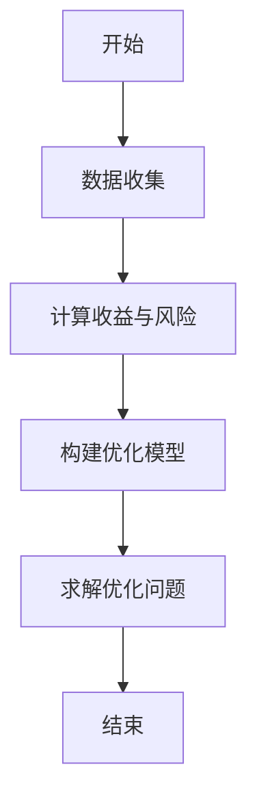
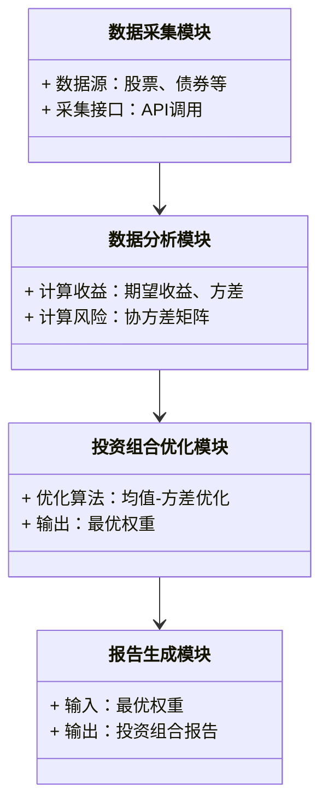

                 


# 格雷厄姆的分散投资原则

## 关键词：
分散投资、价值投资、投资组合优化、风险管理、资产配置、投资策略

## 摘要：
本文系统地介绍并分析了格雷厄姆的分散投资原则，从其核心理念、数学模型、算法实现到系统设计和项目实战，详细探讨了如何通过分散投资来降低风险并实现稳健的投资收益。文章结合技术方法，深入剖析了分散投资的理论基础和实践应用，为读者提供了全面的视角和实用的策略。

---

# 第1章: 投资的基本概念与背景

## 1.1 投资的基本概念

### 1.1.1 什么是投资
投资是通过将资金投入到各种资产中，以期望在未来获得超过初始投入的价值的行为。投资的本质是通过时间和资源的再分配，实现财富的增值。投资的核心要素包括资金、时间、风险和收益。

### 1.1.2 投资的类型与分类
投资可以按照多种方式分类，常见的分类方式包括：
- **按资产类型**：股票、债券、房地产、黄金等。
- **按投资期限**：短期投资、长期投资。
- **按风险偏好**：低风险投资（如政府债券）、高风险投资（如创业投资）。
- **按地域**：国内投资、国际投资。

### 1.1.3 投资的目标与风险
投资的目标通常是追求收益最大化，但投资必然伴随着风险。投资风险可以分为系统性风险和非系统性风险：
- **系统性风险**：由市场整体波动、经济周期等宏观因素引起的。
- **非系统性风险**：由具体资产或公司的特定事件引起的。

---

## 1.2 格雷厄姆的生平与投资理念

### 1.2.1 格雷厄姆的生平简介
本杰明·格雷厄姆（Benjamin Graham）是20世纪著名的投资学家，被誉为“价值投资之父”。他出生于1894年，逝世于1976年。格雷厄姆的职业生涯主要集中在纽约证券交易所，他不仅是一位成功的投资者，还是一位杰出的教育家，培养了包括沃伦·巴菲特在内的众多投资大师。

### 1.2.2 格雷厄姆的价值投资理念
格雷厄姆的价值投资理念强调以低于资产内在价值的价格购买优质股票。他认为，市场情绪往往会导致股票价格偏离其实际价值，投资者可以通过分析企业的基本面来识别被低估的投资标的。

### 1.2.3 格雷厄姆与分散投资的关系
格雷厄姆不仅关注单个资产的价值，还非常重视投资组合的分散性。他认为，通过分散投资可以有效降低非系统性风险，从而提高投资组合的稳定性。

---

# 第2章: 分散投资的核心原理

## 2.1 分散投资的基本原理

### 2.1.1 什么是分散投资
分散投资是指将资金分配到多个不同的资产或资产类别中，以降低投资组合的整体风险。分散投资的核心思想是“不要把所有的鸡蛋放在一个篮子里”。

### 2.1.2 分散投资的核心思想
格雷厄姆的分散投资思想强调通过合理配置不同类型的资产来平衡风险和收益。他主张投资者应根据自身的风险承受能力和投资目标来构建投资组合。

### 2.1.3 分散投资与风险控制
分散投资的核心目标是降低非系统性风险。通过将资金分配到不同资产类别中，投资者可以避免因单一资产或行业表现不佳而导致的重大损失。

---

## 2.2 格雷厄姆的分散投资策略

### 2.2.1 分散投资的实现方式
格雷厄姆的分散投资策略包括以下几个方面：
- **资产类别分散**：将资金分配到股票、债券、现金等多种资产中。
- **行业分散**：投资于不同行业的公司，避免因某一行业波动影响整体投资组合。
- **地域分散**：将资金分配到不同国家或地区的资产中，以降低地域性风险。

### 2.2.2 格雷厄姆的分散投资模型
格雷厄姆的分散投资模型强调以下几个关键点：
- **价值投资**：选择具有安全边际的股票。
- **资产配置**：合理分配资金到不同资产类别中。
- **风险控制**：通过分散投资降低整体投资组合的风险。

### 2.2.3 分散投资的数学模型与公式

#### 2.2.3.1 投资组合的期望收益
$$ E(r_p) = \sum_{i=1}^n w_i E(r_i) $$
其中，\( w_i \) 是资产 \( i \) 的权重，\( E(r_i) \) 是资产 \( i \) 的期望收益。

#### 2.2.3.2 投资组合的方差（风险）
$$ Var(r_p) = \sum_{i=1}^n \sum_{j=1}^n w_i w_j Cov(r_i, r_j) $$

---

# 第3章: 分散投资的数学模型与算法

## 3.1 投资组合优化的数学模型

### 3.1.1 均值-方差优化模型
均值-方差优化模型是投资组合优化的核心模型。该模型的目标是找到在给定风险水平下收益最大的投资组合，或在给定收益水平下风险最小的投资组合。

### 3.1.2 Markowitz有效前沿
Markowitz有效前沿展示了所有最优投资组合的可能收益与风险的组合。在有效前沿上的投资组合既是最优的，也是可行的。

### 3.1.3 风险调整后的收益模型
风险调整后的收益模型通过调整资产的期望收益，使其反映其实际风险水平。

---

## 3.2 分散投资的算法实现

### 3.2.1 投资组合优化的步骤
1. **数据收集**：收集各资产的历史价格数据。
2. **计算收益与风险**：计算各资产的期望收益、方差和协方差。
3. **优化模型构建**：构建均值-方差优化模型。
4. **求解优化问题**：使用优化算法求解最优投资组合。

### 3.2.2 算法的流程图（mermaid）


### 3.2.3 Python代码实现
```python
import numpy as np
import pandas as pd
from sklearn.datasets import make_spd_matrix

# 创建随机协方差矩阵
n_assets = 5
cov_matrix = make_spd_matrix(n_assets)

# 假设各资产的期望收益相同
mu = 0.05 * np.ones(n_assets)

# 使用均值-方差优化求解最优权重
def mean_variance_optimization(mu, cov_matrix):
    n = len(mu)
    mu = mu.reshape(-1, 1)
    cov_matrix = cov_matrix.reshape(n, n)
    inv_cov = np.linalg.inv(cov_matrix)
    w = inv_cov.dot(mu) / (mu.T.dot(inv_cov).dot(mu))
    return w

weights = mean_variance_optimization(mu, cov_matrix)
print("Optimal weights:", weights)
```

---

# 第4章: 分散投资的系统分析与架构设计

## 4.1 投资组合管理系统的设计

### 4.1.1 系统功能需求分析
- 数据采集模块：收集各资产的历史价格数据。
- 数据分析模块：计算各资产的收益、风险和相关性。
- 投资组合优化模块：基于优化模型生成最优投资组合。
- 报告生成模块：生成投资组合的分析报告。

### 4.1.2 系统功能模块划分
- 数据采集模块
- 数据分析模块
- 投资组合优化模块
- 报告生成模块

### 4.1.3 系统功能的领域模型（mermaid类图）


---

## 4.2 系统架构设计

### 4.2.1 系统架构的选择
采用分层架构：
- **数据层**：负责数据的存储和管理。
- **业务逻辑层**：负责数据处理和优化计算。
- **用户界面层**：负责与用户的交互。

### 4.2.2 系统架构的mermaid架构图
```mermaid
container 数据层 {
    数据库：MySQL
}
container 业务逻辑层 {
    数据分析模块
    投资组合优化模块
}
container 用户界面层 {
    Web界面
}
数据层 --> 业务逻辑层
业务逻辑层 --> 用户界面层
```

---

# 第5章: 分散投资的项目实战

## 5.1 环境安装与配置

### 5.1.1 Python环境的安装
安装Python 3.8或更高版本。

### 5.1.2 数据分析库的安装
安装Pandas和NumPy：
```bash
pip install pandas numpy
```

### 5.1.3 绘图库的安装
安装Matplotlib和Seaborn：
```bash
pip install matplotlib seaborn
```

---

## 5.2 投资组合优化的代码实现

### 5.2.1 数据的获取与处理
```python
import pandas as pd
import numpy as np

# 模拟数据
n_assets = 5
returns = np.random.randn(100, n_assets) * 0.05 + 0.05
returns = pd.DataFrame(returns)
```

### 5.2.2 投资组合优化的代码实现
```python
def mean_variance_optimization(mu, cov_matrix):
    n = len(mu)
    mu = mu.reshape(-1, 1)
    cov_matrix = cov_matrix.reshape(n, n)
    inv_cov = np.linalg.inv(cov_matrix)
    w = inv_cov.dot(mu) / (mu.T.dot(inv_cov).dot(mu))
    return w

mu = returns.mean(axis=0)
cov_matrix = returns.cov()
weights = mean_variance_optimization(mu, cov_matrix)
print("Optimal weights:", weights)
```

### 5.2.3 优化结果的可视化
```python
import matplotlib.pyplot as plt

plt.bar(range(len(weights)), weights)
plt.title('Optimal Weights')
plt.show()
```

---

## 5.3 实际案例分析

### 5.3.1 案例背景介绍
假设我们有5只股票，目标是通过分散投资构建一个风险最小的投资组合。

### 5.3.2 数据分析与处理
计算各股票的期望收益和协方差矩阵。

### 5.3.3 优化结果的解读与分析
通过优化算法，找到最优的投资权重，生成投资组合报告。

---

# 第6章: 分散投资的最佳实践与注意事项

## 6.1 分散投资的策略与技巧

### 6.1.1 如何选择投资标的
- 根据资产的流动性、收益性和风险性进行选择。
- 优先选择具有稳定收益的资产。

### 6.1.2 如何确定投资比例
- 根据自身的风险承受能力确定各资产的配置比例。
- 定期调整投资组合，以适应市场变化。

### 6.1.3 如何动态调整投资组合
- 定期评估投资组合的收益和风险。
- 根据市场变化和个人财务状况调整投资比例。

---

## 6.2 分散投资的注意事项

### 6.2.1 避免过度分散的风险
过度分散可能导致投资收益下降。

### 6.2.2 注意市场的周期性波动
市场波动可能会影响投资组合的收益。

### 6.2.3 注意税务因素
不同资产的税务处理可能不同，需要综合考虑。

---

# 小结

通过本文的系统分析，我们深入探讨了格雷厄姆的分散投资原则，从理论到实践，从算法到系统设计，为读者提供了全面的视角。分散投资不仅是一种风险管理策略，更是一种长期稳健的投资理念。

---

# 作者：AI天才研究院/AI Genius Institute & 禅与计算机程序设计艺术 /Zen And The Art of Computer Programming

---

本文是对分散投资原则的系统性分析，结合了格雷厄姆的价值投资理念和现代投资组合理论，旨在为投资者提供理论与实践相结合的指导。

