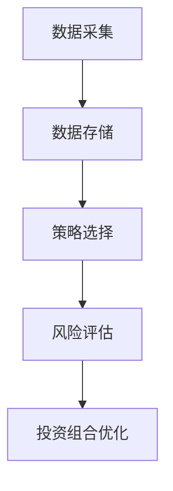

                 


# 格雷厄姆的分散投资原则 vs 巴菲特的集中投资：如何权衡

> 关键词：分散投资，集中投资，格雷厄姆，巴菲特，投资策略，风险管理，资产配置

> 摘要：本文通过详细分析格雷厄姆的分散投资原则和巴菲特的集中投资策略，探讨这两种投资方法的优缺点、适用场景以及如何在实际投资中权衡两者。文章结合数学模型、算法原理和系统架构，为读者提供全面的理论支持和实践指导。

---

# 第一部分: 投资策略概述

## 第1章: 投资的基本概念与原则

### 1.1 投资的基本概念
#### 1.1.1 什么是投资
投资是指将资金投入到某种资产或项目中，以期在未来获得收益或资本增值。投资的核心在于通过合理配置资产，平衡风险与收益。

#### 1.1.2 投资的基本原则
- **分散化**：通过投资不同资产或行业降低风险。
- **长期视角**：投资不是短期交易，而是长期价值的积累。
- **风险管理**：识别和控制潜在风险是投资成功的关键。

#### 1.1.3 投资的目标与风险
- **目标**：实现财富增长，保值增值。
- **风险**：包括市场风险、流动性风险和通货膨胀风险。

### 1.2 分散投资与集中投资的定义
#### 1.2.1 分散投资的定义与特点
分散投资是指将资金分配到多个不同的资产或行业中，以降低单一投资的风险。其特点是风险较低，收益相对稳定。

#### 1.2.2 集中投资的定义与特点
集中投资是指将大部分资金投入到少数几种资产或行业中，追求高回报。其特点是风险较高，但潜在收益也更大。

#### 1.2.3 两种投资策略的优缺点对比
| 策略 | 优点 | 缺点 |
|------|------|------|
| 分散投资 | 风险低，稳定性强 | 收益有限，难以实现超额收益 |
| 集中投资 | 收益潜力大 | 风险高，市场波动影响较大 |

---

## 第2章: 格雷厄姆的分散投资原则

### 2.1 格雷厄姆的背景与投资理念
#### 2.1.1 格雷厄姆的生平简介
本杰明·格雷厄姆（Benjamin Graham）是20世纪著名的投资学家，被誉为“价值投资之父”。

#### 2.1.2 格雷厄姆的价值投资理论
格雷厄姆倡导以低于内在价值的价格买入优质股票，并长期持有，以实现稳定的收益。

#### 2.1.3 分散投资的核心思想
格雷厄姆强调分散投资的重要性，认为通过投资不同行业和资产类别可以有效降低风险。

### 2.2 分散投资的策略与实践
#### 2.2.1 分散投资的实施方法
- **资产类别分散**：将资金分配到股票、债券、房地产等多种资产中。
- **行业分散**：投资于不同行业的公司，避免单一行业波动带来的风险。

#### 2.2.2 分散投资的风险管理
- **风险分散**：通过多样化投资降低特定资产或行业的风险。
- **定期再平衡**：根据市场变化定期调整投资组合，保持风险可控。

#### 2.2.3 分散投资的资产配置
- **股债平衡**：通常建议股票和债券的比例为60:40，根据个人风险偏好调整。

---

## 第3章: 巴菲特的集中投资策略

### 3.1 巴菲特的背景与投资理念
#### 3.1.1 巴菲特的生平简介
沃伦·巴菲特（Warren Buffett）是全球著名投资人，继承并发扬了格雷厄姆的价值投资理念。

#### 3.1.2 巴菲特的集中投资理论
巴菲特认为，集中投资于少数优质企业可以实现超额收益，关键在于选择具有强大竞争优势的公司。

#### 3.1.3 集中投资的核心思想
巴菲特强调长期持有优质资产，避免频繁交易，追求企业价值的长期增长。

### 3.2 集中投资的策略与实践
#### 3.2.1 集中投资的实施方法
- **选择优质企业**：投资于具有强大护城河和竞争优势的公司。
- **长期持有**：避免短期波动，耐心等待价值增长。

#### 3.2.2 集中投资的风险管理
- **深度研究**：在投资前进行详尽的公司研究，降低选择错误的风险。
- **分散风险**：虽然集中投资，但选择不同行业的优质企业，避免过度集中。

#### 3.2.3 集中投资的资产配置
- **股票为主**：通常将大部分资金投入少数优质股票，其余用于固定收益资产。

---

# 第二部分: 投资策略的核心概念与联系

## 第4章: 分散投资与集中投资的核心概念

### 4.1 投资组合的风险与收益
#### 4.1.1 投资组合的方差计算
方差是用来衡量投资组合风险的指标，公式为：
$$ \text{方差} = \sum_{i=1}^{n} w_i^2 \sigma_i^2 + \sum_{i=1}^{n} \sum_{j \neq i} w_i w_j \sigma_{ij} $$
其中，\( w_i \) 是资产 \( i \) 的权重，\( \sigma_i^2 \) 是资产 \( i \) 的方差，\( \sigma_{ij} \) 是资产 \( i \) 和 \( j \) 的协方差。

#### 4.1.2 投资组合的预期收益
预期收益是各资产预期收益的加权平均值：
$$ E[R_p] = \sum_{i=1}^{n} w_i E[R_i] $$

#### 4.1.3 投资组合的夏普比率
夏普比率衡量投资组合的风险调整后收益：
$$ \text{夏普比率} = \frac{E[R_p] - R_f}{\sigma_p} $$
其中，\( R_f \) 是无风险利率，\( \sigma_p \) 是投资组合的波动率。

### 4.2 分散投资与集中投资的优缺点对比
| 策略 | 优点 | 缺点 |
|------|------|------|
| 分散投资 | 风险低，稳定性强 | 收益有限，难以实现超额收益 |
| 集中投资 | 收益潜力大 | 风险高，市场波动影响较大 |

---

## 第5章: 分散投资与集中投资的数学模型

### 5.1 分散投资的数学模型
#### 5.1.1 投资组合的方差公式
$$ \text{方差} = \sum_{i=1}^{n} w_i^2 \sigma_i^2 + \sum_{i=1}^{n} \sum_{j \neq i} w_i w_j \sigma_{ij} $$

#### 5.1.2 投资组合的夏普比率
$$ \text{夏普比率} = \frac{E[R_p] - R_f}{\sigma_p} $$

### 5.2 集中投资的数学模型
#### 5.2.1 优质企业的选择
选择具有强大竞争优势和长期增长潜力的企业。

#### 5.2.2 长期持有策略
$$ \text{长期收益} = \prod_{t=1}^{T} (1 + R_t) $$

---

## 第6章: 系统分析与架构设计方案

### 6.1 项目介绍
设计一个投资决策系统，帮助投资者根据市场情况选择分散或集中投资策略。

### 6.2 系统功能设计
- 数据采集模块：获取市场数据和公司信息。
- 策略选择模块：根据分析结果选择最优策略。
- 风险评估模块：计算投资组合的风险和收益。

### 6.3 系统架构设计


---

## 第7章: 项目实战

### 7.1 环境安装
安装Python和相关库（如Pandas、NumPy）。

### 7.2 核心实现
```python
import pandas as pd
import numpy as np

def calculate_sharpe_ratio(returns, risk_free_rate):
    excess_returns = returns - risk_free_rate
    sharpe_ratio = excess_returns.mean() / excess_returns.std()
    return sharpe_ratio

# 示例数据
returns = pd.Series([0.1, 0.05, -0.02, 0.08], index=[2020, 2021, 2022, 2023])
risk_free_rate = 0.02

print("夏普比率:", calculate_sharpe_ratio(returns, risk_free_rate))
```

### 7.3 实际案例分析
分析一个模拟投资组合，比较分散和集中投资的收益与风险。

---

## 第8章: 最佳实践与小结

### 8.1 分散投资与集中投资的关键点
- 分散投资适合风险厌恶型投资者，集中投资适合风险承受能力强的投资者。
- 根据市场环境调整策略，牛市适合集中投资，熊市适合分散投资。

### 8.2 风险管理的建议
- 定期评估投资组合，及时调整。
- 设置止损点，避免重大损失。

### 8.3 根据市场环境调整策略
- 市场波动大时，选择分散投资。
- 市场稳定时，选择集中投资。

---

## 第9章: 附录与拓展阅读

### 9.1 附录
- 详细的投资组合计算步骤。
- 相关数学公式的推导。

### 9.2 拓展阅读
- 格雷厄姆的《证券分析》。
- 巴菲特的《巴菲特致股东的信》。

---

作者：AI天才研究院/AI Genius Institute & 禅与计算机程序设计艺术 /Zen And The Art of Computer Programming

