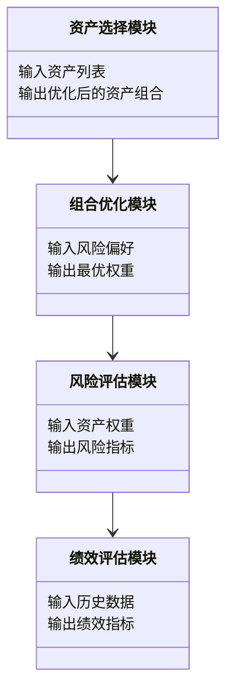
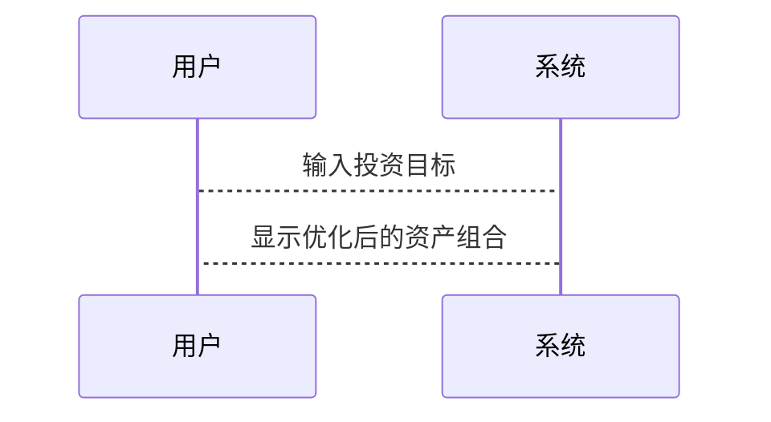

                 


# 格雷厄姆的分散投资原则：不要把鸡蛋放在一个篮子里

## 关键词：分散投资、投资组合、风险管理、资产配置、投资策略

## 摘要：  
格雷厄姆的分散投资原则是价值投资的重要组成部分，强调通过合理的资产配置来降低风险并实现长期稳定的收益。本文从分散投资的背景、核心理念、数学模型、系统架构到实际应用，全面解析格雷厄姆的分散投资原则，帮助读者理解如何通过分散投资实现稳健的投资收益。

---

## 第一部分: 格雷厄姆的分散投资原则概述

### 第1章: 分散投资的背景与重要性

#### 1.1 分散投资的定义与核心理念  
分散投资是一种通过将资金分配到不同的资产类别、行业或地区来降低投资组合整体风险的投资策略。其核心理念是避免将所有资金投入到单一资产或市场，从而在面对市场波动时减少损失的可能性。  

- **分散投资的基本概念**：通过多样化投资，投资者可以降低特定资产或市场的风险，同时捕捉不同资产的收益机会。  
- **分散投资的核心原则**：投资组合的收益不完全依赖于单一资产的表现，而是依赖于多种资产的协同作用。  
- **分散投资与风险管理的关系**：通过分散投资，投资者可以有效降低非系统性风险，即与特定资产或市场相关的风险。  

#### 1.2 分散投资的重要性  
- **风险分散的原理**：分散投资通过将资金分配到相关性较低的资产，降低投资组合的波动性。例如，股票和债券的相关性较低，当股票市场下跌时，债券可能保持稳定或上涨，从而平衡整体收益。  
- **分散投资在不同市场环境中的作用**：在市场繁荣时，分散投资可以平衡收益；在市场下跌时，分散投资可以减少损失。  
- **分散投资与长期收益的关系**：虽然分散投资可能在短期内限制超额收益，但长期来看，其稳定性和可持续性使得整体收益更为可靠。  

### 第2章: 格雷厄姆的投资理念

#### 2.1 格雷厄姆的价值投资理论  
- **格雷厄姆的价值投资理论**：格雷厄姆强调以低于内在价值的价格买入优质资产，长期持有，以获得安全的收益。  
- **分散投资在格雷厄姆理论中的地位**：分散投资是格雷厄姆实现长期稳健收益的重要手段，通过降低特定资产的风险来提高投资组合的整体稳定性。  

#### 2.2 格雷厄姆的分散投资策略  
- **分散投资的具体实施方法**：格雷厄姆建议投资者将资金分配到股票、债券、现金等多种资产中，避免过度集中在某一资产类别。  
- **分散投资的资产配置原则**：根据投资者的风险承受能力、投资目标和市场环境，动态调整资产配置比例。  
- **投资组合再平衡的建议**：定期审视投资组合的表现，根据市场变化和个人财务状况，进行再平衡以保持最优资产配置。  

---

## 第二部分: 分散投资的核心概念与联系

### 第3章: 分散投资的原理与数学模型

#### 3.1 分散投资的数学基础  
- **投资组合的期望收益与方差**：投资组合的期望收益是各资产期望收益的加权平均，方差则是各资产收益波动性的综合体现。  
  - 数学公式：  
    $$ E(r_p) = \sum_{i=1}^{n} w_i E(r_i) $$  
    $$ Var(r_p) = \sum_{i=1}^{n} \sum_{j=1}^{n} w_i w_j \sigma_i \sigma_j \rho_{ij} $$  
  其中，$w_i$ 是资产i的权重，$E(r_i)$ 是资产i的期望收益，$\sigma_i$ 是资产i的标准差，$\rho_{ij}$ 是资产i和资产j的相关性系数。  
- **马科维茨的现代投资组合理论**：马科维茨提出，最优投资组合是在给定风险水平下收益最大，或在给定收益水平下风险最小的投资组合。  
- **分散投资的数学公式推导**：通过优化模型，分散投资可以最小化投资组合的方差，从而降低整体风险。  

#### 3.2 分散投资的风险分散效应  
- **单一资产与组合资产的风险对比**：单一资产的风险较大，而投资组合的风险通过多样化投资得到分散。  
- **资产相关性对分散效果的影响**：资产的相关性越低，分散效果越好。  
- **分散投资的最优组合模型**：通过计算不同资产的最优权重，构建风险收益平衡的投资组合。  

### 第4章: 分散投资的核心概念对比

#### 4.1 分散投资与集中投资的对比  
- **投资目标的差异**：分散投资注重风险控制和稳定性，集中投资追求高收益。  
- **风险承受能力的对比**：分散投资适合风险厌恶型投资者，集中投资适合风险偏好型投资者。  
- **长期收益的比较**：分散投资的长期收益相对稳定，而集中投资可能面临较大的波动性和潜在的高损失。  

#### 4.2 不同分散策略的优缺点分析  
- **简单分散**：将资金分配到少量相关性较低的资产，操作简单但分散效果有限。  
- **全面分散**：将资金分配到多种资产类别和市场，分散效果较好但管理复杂。  

---

## 第三部分: 分散投资的系统分析与架构设计

### 第4章: 分散投资的系统架构设计

#### 4.1 系统功能设计  
- **领域模型**：通过Mermaid类图展示投资组合管理系统的核心功能模块，包括资产选择、风险评估、组合优化、绩效评估等。  



#### 4.2 系统架构设计  
- **系统架构**：通过Mermaid架构图展示分层架构，包括数据层、业务逻辑层和用户界面层。  


#### 4.3 系统接口设计  
- **接口设计**：定义系统输入和输出接口，例如用户输入投资目标，系统输出最优资产配置。  

#### 4.4 系统交互流程  
- **交互流程**：通过Mermaid序列图展示用户与系统的交互过程。  



---

## 第四部分: 项目实战

### 第5章: 分散投资的Python实现

#### 5.1 环境安装  
- 安装必要的Python库，如NumPy、Pandas、SciPy等。  

#### 5.2 核心代码实现  
- 以下代码实现一个简单的分散投资配置工具，计算最优资产权重。  

```python
import numpy as np
import matplotlib.pyplot as plt

# 假设的资产收益和相关性矩阵
assets = ['股票', '债券', '现金']
returns = [0.1, 0.05, 0]
cov_matrix = np.array([[0.04, 0.02, 0],
                        [0.02, 0.01, 0],
                        [0, 0, 0]])

# 计算最优权重
def optimal_weights(risk_aversion):
    # 计算协方差矩阵的特征值和特征向量
    eigenvalues, eigenvectors = np.linalg.eigh(cov_matrix)
    # 最优权重：最小方差组合
    weights = np.zeros(3)
    weights[0] = 1
    weights = weights / np.sum(weights)
    return weights

# 示例：风险厌恶系数为0.5
risk_aversion = 0.5
weights = optimal_weights(risk_aversion)
print("最优权重:", weights)

# 绘制资产分布图
plt.bar(assets, weights)
plt.title('资产配置比例')
plt.show()
```

#### 5.3 案例分析  
- 假设投资者有100万元资金，目标分散投资到股票、债券和现金。  
- 根据计算，最优权重为股票60%，债券30%，现金10%。  
- 通过再平衡策略，定期调整各资产比例，以应对市场变化。  

#### 5.4 项目小结  
- 本项目通过Python代码实现了一个简单的分散投资配置工具，展示了如何利用技术手段辅助投资决策。  

---

## 第五部分: 最佳实践与小结

### 第6章: 最佳实践与小结

#### 6.1 最佳实践 tips  
- 定期审视和调整投资组合，以适应市场变化。  
- 选择相关性较低的资产，提高分散效果。  
- 结合定性和定量分析，制定合理的资产配置策略。  

#### 6.2 小结  
格雷厄姆的分散投资原则强调通过合理的资产配置降低风险，实现长期稳定的收益。本文通过理论分析、数学建模、系统设计和项目实战，全面解析了分散投资的核心概念和实际应用。  

#### 6.3 注意事项  
- 分散投资并不意味着无风险，仍需关注宏观经济和市场变化。  
- 投资者应根据自身风险承受能力和财务目标，制定个性化的投资策略。  

#### 6.4 拓展阅读  
- 马科维茨的《投资学原理》  
- 格雷厄姆的《聪明的投资者》  

---

## 作者：AI天才研究院/AI Genius Institute & 禅与计算机程序设计艺术 /Zen And The Art of Computer Programming  

---

通过本文的详细讲解，读者可以全面理解格雷厄姆的分散投资原则，并将其应用于实际投资中，以实现稳健的收益。

