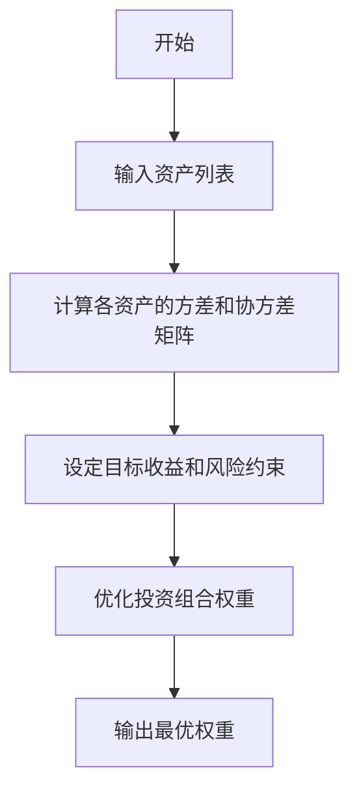
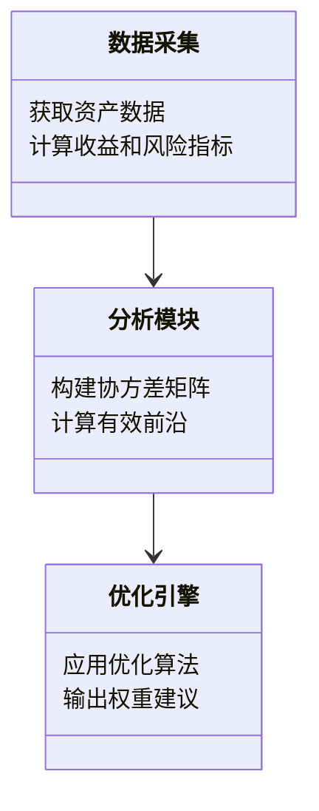

                 


# 格雷厄姆的分散投资原则：在全球化退潮中的新应用

**关键词**：格雷厄姆、分散投资、全球化退潮、投资策略、现代投资组合理论、风险控制

**摘要**：本文探讨了格雷厄姆的分散投资原则在全球化退潮背景下的新应用。通过分析分散投资的理论基础、数学模型及实际应用，结合当前投资环境的变化，提出优化的投资策略。

---

## 第一部分: 分散投资的起源与理论基础

### 第1章: 格雷厄姆的价值投资理念

#### 1.1 格雷厄姆的投资哲学
格雷厄姆是价值投资的先驱，强调以内在价值为基础进行投资。他提出分散投资是降低风险的有效方法。

#### 1.2 分散投资的核心思想
分散投资通过将资金分配到不同的资产类别或地区，降低特定风险，提高整体收益稳定性。

#### 1.3 现代投资组合理论
马科维茨提出有效前沿模型，通过优化资产配置，实现收益与风险的最佳平衡。

---

### 第2章: 全球化退潮下的投资环境变化

#### 2.1 全球化退潮的影响
地缘政治冲突、贸易壁垒增加等现象导致投资环境更加复杂，分散投资的重要性进一步凸显。

#### 2.2 新兴市场的崛起
新兴市场成为分散投资的重要部分，但需注意其波动性和政策风险。

#### 2.3 经济周期与分散投资
在不同经济周期，分散投资策略需灵活调整，如增加防御性资产配置。

---

## 第二部分: 分散投资的核心概念与数学模型

### 第3章: 分散投资的数学模型

#### 3.1 投资组合风险的计算
方差和标准差是衡量风险的重要指标，公式如下：
$$ \text{方差} = \sum_{i=1}^{n} w_i^2 \sigma_i^2 $$
$$ \text{标准差} = \sqrt{\sum_{i=1}^{n} w_i^2 \sigma_i^2} $$

#### 3.2 优化算法流程


### 第4章: 系统架构与项目实战

#### 4.1 投资组合优化系统架构


#### 4.2 优化算法实现
```python
import numpy as np

def optimize_portfolio(expected_returns, cov_matrix):
    n = len(expected_returns)
    # 初始化权重向量
    w = np.ones(n) / n
    # 迭代优化
    for _ in range(100):
        # 计算梯度
        gradient = 2 * (w.T @ cov_matrix @ w - 1)
        # 更新权重
        w = w - learning_rate * gradient
        # 约束权重和为1
        w = w / sum(w)
    return w
```

---

## 第三部分: 应用与展望

### 第5章: 应用实例分析

#### 5.1 地缘政治风险下的分散投资
通过增加新兴市场资产，减少对单一市场的依赖，降低地缘政治风险的影响。

#### 5.2 经济周期下的策略调整
在衰退期增加债券配置，提升防御性资产比例。

### 第6章: 未来展望

#### 6.1 数字化投资工具的应用
利用AI和大数据技术优化分散投资策略，提高决策效率。

#### 6.2 可持续投资与分散投资的结合
将ESG因素纳入资产配置，推动长期可持续发展。

---

## 第四部分: 总结与小结

### 6.1 总结
格雷厄姆的分散投资原则在当前环境下仍具重要价值，通过优化资产配置和风险控制，投资者可在全球化退潮中稳健前行。

### 6.2 小结
分散投资不仅是风险控制的手段，更是实现长期稳健收益的关键策略。未来，随着技术进步和市场变化，分散投资的应用将更加广泛和精细。

---

**作者**：AI天才研究院 & 禅与计算机程序设计艺术

