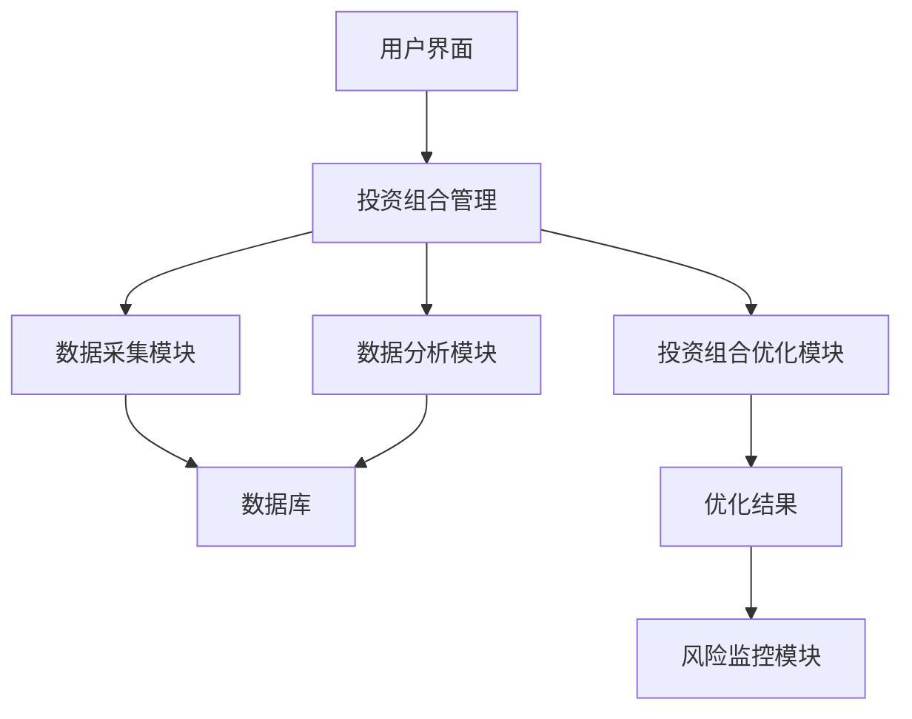

                 


# 格雷厄姆的多元化投资理念：不要把鸡蛋放在一个篮子里

## 关键词：投资学，风险分散，资产配置，投资组合优化，现代投资组合理论（MPT）

## 摘要：本文深入探讨了格雷厄姆的多元化投资理念，分析了投资组合优化的数学模型和算法原理，结合系统架构设计和项目实战，详细讲解了如何通过多元化投资降低风险、提高收益。文章从投资学的基本原理出发，逐步分析了资产配置、风险分散、相关性分析等核心概念，并通过均值-方差模型和Python代码实现，展示了投资组合优化的具体步骤。最后，结合实际案例，总结了多元化投资的最佳实践和注意事项。

---

## 第一部分: 投资学的基本原理

### 第1章: 投资的基本概念

#### 1.1 投资的基本定义
- 投资是将资源（资金、时间、精力）投入到某个项目或资产中，以期获得未来收益的行为。
- 投资的核心目标是通过合理配置资源，实现收益的最大化或风险的最小化。

#### 1.2 风险与收益的关系
- 风险是投资中不可避免的一部分，高风险通常意味着高收益，但并非所有高风险投资都能带来高收益。
- 风险与收益的权衡是投资决策的核心问题。

#### 1.3 投资的基本原则
- **分散投资**：不要把所有的资金投入到单一资产中，以降低风险。
- **长期投资**：时间是投资的朋友，通过长期持有优质资产可以获得复利效应。
- **价值投资**：寻找被市场低估的资产，长期持有，等待其价值回归。

### 第2章: 投资组合的概念

#### 2.1 投资组合的定义
- 投资组合是指将多种资产以一定比例组合在一起，以实现风险和收益的最佳平衡。

#### 2.2 投资组合的重要性
- 通过多样化投资，可以降低单一资产的风险。
- 投资组合的收益来源于各资产的收益加权平均，同时风险也通过分散化得到降低。

---

## 第二部分: 格雷厄姆的多元化投资理念

### 第3章: 多元化投资的核心思想

#### 3.1 多元化投资的定义
- 多元化投资是指将资金分配到不同的资产类别、行业或地区，以降低特定资产或市场的风险。

#### 3.2 多元化投资的优点
- **风险分散**：通过投资不同类型的资产，降低单一资产价格波动带来的风险。
- **收益稳定**：多样化投资可以平滑不同资产的收益波动，实现更稳定的收益。
- **适应性**：不同资产在不同经济周期下的表现不同，多样化投资可以适应不同的市场环境。

#### 3.3 多元化投资的实现方式
- **资产类别分散**：将资金分配到股票、债券、房地产、 commodities 等不同资产类别中。
- **行业分散**：投资不同行业的公司，避免单一行业波动带来的风险。
- **地域分散**：投资不同国家或地区的资产，降低区域经济波动的影响。

---

## 第三部分: 投资组合优化的数学模型

### 第4章: 均值-方差模型

#### 4.1 均值-方差模型的定义
- 均值-方差模型是由哈里·马科维茨提出的，用于优化投资组合风险和收益的数学模型。
- 该模型假设资产收益符合正态分布，通过优化资产配置，使得在给定收益下风险最小，或在给定风险下收益最大。

#### 4.2 均值-方差模型的公式
- 投资组合的期望收益：$$ E(r_p) = \sum_{i=1}^n w_i E(r_i) $$
- 投资组合的方差：$$ Var(r_p) = \sum_{i=1}^n \sum_{j=1}^n w_i w_j Cov(r_i, r_j) $$

#### 4.3 优化过程
1. 计算各资产的期望收益和协方差矩阵。
2. 使用拉格朗日乘数法求解优化问题，得到最优权重分配。
3. 根据优化结果调整资产配置，以实现收益-风险的最优平衡。

---

## 第四部分: 系统架构与实现

### 第5章: 投资组合管理系统的设计

#### 5.1 系统功能模块
- 数据采集模块：收集各资产的历史数据和实时数据。
- 数据分析模块：计算各资产的期望收益、方差和协方差矩阵。
- 投资组合优化模块：基于均值-方差模型优化投资组合。
- 风险监控模块：实时监控投资组合的波动性和潜在风险。

#### 5.2 系统架构设计


---

## 第五部分: 项目实战与应用

### 第6章: 模拟投资组合优化

#### 6.1 环境配置
- 安装 Python 和相关库（numpy, pandas, matplotlib）。

#### 6.2 数据采集与处理
```python
import numpy as np
import pandas as pd

# 假设我们有三个资产的数据
data = {
    '资产A': [10, 20, 30, 40, 50],
    '资产B': [15, 25, 35, 45, 55],
    '资产C': [25, 35, 45, 55, 65]
}
df = pd.DataFrame(data)
```

#### 6.3 计算协方差矩阵
```python
cov_matrix = df.cov()
print(cov_matrix)
```

#### 6.4 优化投资组合
```python
import numpy as np

def portfolio Optimization(cov_matrix, returns):
    n = len(cov_matrix)
    # 构建优化问题
    # 使用拉格朗日乘数法求解
    # 这里简化为等权重分配
    weights = np.array([1/n] * n)
    return weights

weights = portfolio_Optimization(cov_matrix, returns)
print(weights)
```

#### 6.5 结果分析
- 计算优化后的投资组合收益和风险。
- 对比不同资产配置下的收益-风险曲线。

---

## 第六部分: 最佳实践与总结

### 第7章: 多元化投资的注意事项

#### 7.1 分散化的重要性
- 不要将所有资金投入到单一资产或行业。
- 通过多样化投资降低特定风险。

#### 7.2 定期再平衡
- 定期检查投资组合的配置，根据市场变化进行调整。
- 避免过度集中于某一种资产或市场。

#### 7.3 长期投资的重要性
- 短期市场波动会影响投资组合的收益，但长期趋势更符合经济规律。
- 通过长期持有优质资产，可以获得复利效应。

---

## 结语

通过本文的分析，我们可以看到，格雷厄姆的多元化投资理念不仅是降低风险的有效方法，更是实现长期稳健收益的关键策略。结合现代投资组合理论和系统架构设计，我们可以更好地理解和实现投资目标。希望本文的内容能为投资者提供有价值的参考和启发。

---

## 作者：AI天才研究院/AI Genius Institute & 禅与计算机程序设计艺术 /Zen And The Art of Computer Programming

