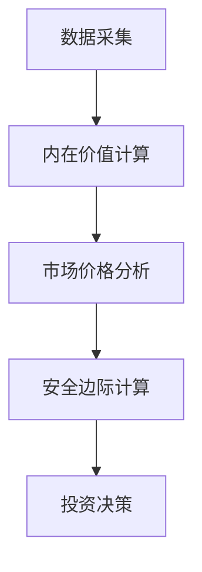

                 

# 格雷厄姆的安全边际概念

> 关键词：安全边际，价值投资，格雷厄姆，投资策略，风险控制，内在价值

> 摘要：安全边际是投资学中的一个核心概念，由本杰明·格雷厄姆提出，主要用于价值投资策略中，通过计算内在价值与市场价格之间的差异来降低投资风险。本文将详细探讨安全边际的定义、计算方法、应用场景及其在现代投资中的重要性。

---

## 第一章: 安全边际的起源与背景

### 1.1 投资学中的安全边际概念

#### 1.1.1 价值投资的起源

价值投资是一种以基本面分析为基础的投资策略，强调以低于内在价值的价格购买资产。本杰明·格雷厄姆是该理论的创始人之一，他通过研究市场的波动性和投资者的心理行为，提出了安全边际的概念。

#### 1.1.2 安全边际的定义

安全边际是内在价值与市场价格之间的差额，用于衡量资产的实际价值与市场定价之间的差异。这个概念的核心在于通过买入被市场低估的资产来降低投资风险。

#### 1.1.3 安全边际的意义

安全边际为投资者提供了风险缓冲，即使市场波动或公司业绩不佳，也能确保投资的本金安全。这种策略在长期投资中表现尤为突出。

---

### 1.2 安全边际的核心要素

#### 1.2.1 内在价值的计算

内在价值是基于资产未来现金流的现值计算得出的。格雷厄姆通过分析企业的盈利能力、资产状况和行业地位来估算其真实价值。

#### 1.2.2 市场价格的影响因素

市场价格受市场情绪、宏观经济环境和投资者心理的影响，常常偏离其内在价值。安全边际正是利用这种偏差，为投资者提供获利空间。

#### 1.2.3 安全边际的数学表达式

$$ 安全边际 = 内在价值 - 市场价格 $$

---

### 1.3 安全边际的特点与优势

#### 1.3.1 特点

- **防御性**：通过低估资产价格，降低市场波动带来的风险。
- **长期稳定性**：适合长期投资者，避免短期市场波动的干扰。
- **可量化**：通过具体的计算方法，量化安全边际的大小。

#### 1.3.2 优势

- **风险控制**：通过安全边际，投资者能够控制潜在的损失。
- **超额收益**：当市场价格低于内在价值时，投资者能够获得超额收益。

---

## 第二章: 安全边际的计算与应用

### 2.1 安全边际的计算方法

#### 2.1.1 基本公式

$$ 安全边际 = 内在价值 - 市场价格 $$

#### 2.1.2 内在价值的估算

格雷厄姆通过分析企业的盈利能力、资产状况和行业地位来估算内在价值。例如，使用市盈率（P/E）和市净率（P/B）等指标来评估资产的价值。

#### 2.1.3 安全边际的案例分析

以某公司为例，假设其内在价值为100元，市场价格为80元，则安全边际为20元。这意味着即使市场价格波动，投资者仍能获得20元的缓冲空间。

---

### 2.2 安全边际的应用策略

#### 2.2.1 选择低估资产

投资者应寻找市场价格低于内在价值的资产，尤其是在市场低迷时期。

#### 2.2.2 风险控制

通过设定安全边际的最低标准（如10%以上），投资者可以避免购买高风险资产。

#### 2.2.3 时机选择

安全边际较大的资产通常在市场低估时出现，投资者应抓住这种时机进行投资。

---

## 第三章: 安全边际的系统分析

### 3.1 系统架构设计

#### 3.1.1 功能模块

- 数据采集：收集资产的财务数据和市场数据。
- 安全边际计算：基于内在价值和市场价格计算安全边际。
- 投资决策：根据安全边际结果制定投资策略。

#### 3.1.2 系统架构图

---

### 3.2 系统接口设计

#### 3.2.1 数据接口

- 输入：资产的财务数据和市场数据。
- 输出：安全边际计算结果。

#### 3.2.2 用户界面

- 输入：用户选择的资产和计算参数。
- 输出：安全边际结果和投资建议。

---

## 第四章: 项目实战与案例分析

### 4.1 项目背景

选择一家公司作为案例，分析其安全边际。

### 4.2 数据准备

收集该公司的财务报表和市场数据。

### 4.3 安全边际计算

使用格雷厄姆的方法计算其内在价值和市场价格，得出安全边际。

### 4.4 投资建议

基于计算结果，提出投资建议。

---

## 第五章: 安全边际的最佳实践

### 5.1 小结

安全边际是价值投资的核心，通过合理计算和应用，投资者能够降低风险并获得超额收益。

### 5.2 注意事项

- 定期更新数据，避免过时。
- 结合市场环境，灵活调整策略。

### 5.3 拓展阅读

推荐相关书籍和论文，深入理解安全边际的应用。

---

## 作者：AI天才研究院/AI Genius Institute & 禅与计算机程序设计艺术 /Zen And The Art of Computer Programming

