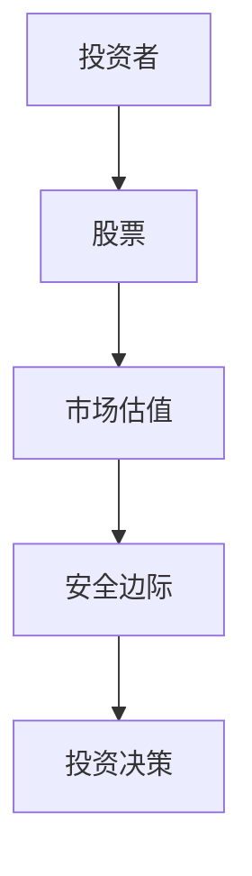
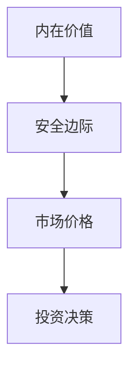

                 


# 格雷厄姆的安全边际理论在高估值市场中的调整

> 关键词：安全边际理论，高估值市场，投资策略，价值投资，市场调整

> 摘要：本文探讨了格雷厄姆的安全边际理论在高估值市场中的应用与调整。首先，文章介绍了安全边际理论的基本概念及其在传统市场中的应用。然后，分析了高估值市场的特点及其与传统市场的区别，提出了在高估值市场中调整安全边际理论的必要性。接着，详细讲解了调整后安全边际理论的核心概念、计算方法和数学模型。最后，通过实际案例分析了调整后理论的应用效果，并总结了在高估值市场中应用安全边际理论的最佳实践。

## 第一部分: 格雷厄姆的安全边际理论基础

### 第1章: 安全边际理论的背景与核心概念

#### 1.1 安全边际理论的起源与发展

- **1.1.1 格雷厄姆投资理论的起源**
  Benjamin Graham 是价值投资的先驱，他的投资理念强调安全边际，即以低于内在价值的价格买入资产。他的理论在20世纪30年代首次提出，当时正值大萧条时期，许多投资者因市场波动而遭受重大损失。Graham 的理论旨在帮助投资者在市场波动中保持稳健的投资策略。

- **1.1.2 安全边际理论的核心思想**
  安全边际理论的核心思想是通过购买价格低于其内在价值的资产，以降低投资风险。Graham 认为，内在价值是资产在理论上应有的价值，而市场价格往往受到市场情绪的影响，可能会偏离内在价值。通过购买价格低于内在价值的资产，投资者可以在市场价格下跌时仍有获利空间。

- **1.1.3 理论在现代投资中的应用**
  安全边际理论在现代投资中广泛应用，尤其是在价值投资领域。许多投资者，如 Warren Buffett，都深受 Graham 理论的影响。然而，随着市场的变化，特别是高估值市场的出现，传统安全边际理论需要进行调整以适应新的市场环境。

#### 1.2 高估值市场的定义与特征

- **1.2.1 高估值市场的定义**
  高估值市场是指市场整体估值水平远高于历史平均水平，通常表现为市盈率、市净率等估值指标显著高于正常水平。这种市场环境往往出现在市场繁荣时期，投资者情绪高涨，资金大量流入市场，导致资产价格被高估。

- **1.2.2 高估值市场的特征**
  - 市场价格远高于内在价值
  - 投资者情绪乐观，投机性交易增加
  - 资金流动性过剩，导致资产价格泡沫
  - 市场波动性增大，风险上升

- **1.2.3 高估值市场与传统市场的区别**
  - 市场估值水平：高估值市场中资产价格被高估，而传统市场中资产价格通常接近其内在价值。
  - 投资者行为：高估值市场中投资者更倾向于投机，而传统市场中投资者更注重长期价值。
  - 市场风险：高估值市场中的投资风险更高，市场波动性更大。

### 第2章: 安全边际理论的核心概念与联系

#### 2.1 核心概念原理

- **2.1.1 安全边际的定义**
  安全边际是指资产的市场价格与内在价值之间的差额。具体来说，安全边际 = 内在价值 - 市场价格。当市场价格低于内在价值时，安全边际为正，表示资产具有投资价值；当市场价格高于内在价值时，安全边际为负，表示资产被高估，投资风险增加。

- **2.1.2 安全边际的计算方法**
  安全边际的计算需要首先确定资产的内在价值，然后减去市场价格。内在价值的计算方法因资产类型而异，例如股票的内在价值可以通过股息贴现模型或现金流贴现模型计算。

- **2.1.3 安全边际与内在价值的关系**
  安全边际是内在价值与市场价格之间的差额，反映了资产的估值风险。当安全边际较高时，资产具有较高的投资价值；当安全边际较低或为负时，资产的投资风险增加。

#### 2.2 核心概念属性特征对比表格

| 特性       | 传统安全边际 | 调整后安全边际 |
|------------|--------------|----------------|
| 计算基础   | 内在价值     | 调整后内在价值 |
| 市场适用性   | 适用于低估市场 | 适用于高估市场 |
| 调整因素   | 无           | 包括流动性溢价 |

#### 2.3 ER实体关系图



### 第3章: 安全边际理论的数学模型与算法

#### 3.1 安全边际计算模型



#### 3.2 Python实现

```python
def calculate_margin_of_safety(intrinsic_value, price):
    return intrinsic_value - price
```

#### 3.3 数学公式

$$ \text{安全边际} = \text{内在价值} - \text{市场价格} $$

#### 3.4 示例

假设某股票的内在价值为 $50，市场价格为 $40，则安全边际为 $10。

### 第4章: 高估值市场中的系统分析与架构设计

#### 4.1 问题场景介绍

- **4.1.1 高估值市场中的投资风险**
  高估值市场中，资产价格被高估，投资风险增加。投资者需要重新评估其投资策略，以应对市场变化。

- **4.1.2 安全边际理论的适用**
  在高估值市场中，传统安全边际理论可能不再适用，需要进行调整以适应新的市场环境。

#### 4.2 项目介绍

- **4.2.1 系统功能设计**
  - 数据收集与处理：收集市场数据，计算资产的内在价值和市场价格。
  - 安全边际计算：根据调整后的安全边际理论，计算资产的安全边际。
  - 投资决策支持：根据安全边际结果，提供投资决策支持。

- **4.2.2 系统架构设计**
  ```mermaid
  graph TD
      A[数据源] --> B[数据处理模块]
      B --> C[安全边际计算模块]
      C --> D[投资决策支持模块]
  ```

- **4.2.3 系统接口设计**
  - 数据输入接口：接收市场数据和资产信息。
  - 数据输出接口：输出安全边际计算结果和投资建议。

- **4.2.4 系统交互流程图**
  ```mermaid
  graph TD
      A[投资者] --> B[数据输入接口]
      B --> C[数据处理模块]
      C --> D[安全边际计算模块]
      D --> E[投资决策支持模块]
      E --> F[投资者]
  ```

### 第5章: 高估值市场中的项目实战

#### 5.1 环境安装

- 需要安装 Python 和相关库（如 pandas、numpy 等）。

#### 5.2 系统核心实现源代码

```python
def calculate_adjusted_margin_of_safety(intrinsic_value, price, adjustment_factor):
    return intrinsic_value * adjustment_factor - price
```

#### 5.3 代码应用解读与分析

- 调整后的安全边际计算公式考虑了市场流动性溢价等因素，通过引入调整因子来适应高估值市场。

#### 5.4 实际案例分析

- 案例分析：假设某股票的内在价值为 $50，市场价格为 $60，调整因子为 0.8，则调整后的内在价值为 $40，安全边际为 $-20，表示资产被高估，不建议投资。

#### 5.5 项目小结

- 调整后的安全边际理论在高估值市场中能够更准确地反映资产的估值风险，帮助投资者做出更明智的投资决策。

### 第6章: 高估值市场中的最佳实践

#### 6.1 小结

- 调整后的安全边际理论在高估值市场中具有重要的应用价值，能够帮助投资者降低投资风险，提高投资收益。

#### 6.2 注意事项

- 在实际应用中，需要根据市场环境和资产特性调整安全边际的计算方法。
- 投资者需要密切关注市场变化，及时调整投资策略。

#### 6.3 拓展阅读

- Benjamin Graham 的《 Intelligent Investor 》
- Warren Buffett 的投资策略

#### 6.4 参考文献

- Benjamin Graham, 1949. *The Intelligent Investor*.
- Warren Buffett, 2007. * Berkshire Hathaway Annual Report*.

---

**作者：AI天才研究院/AI Genius Institute & 禅与计算机程序设计艺术 /Zen And The Art of Computer Programming**

