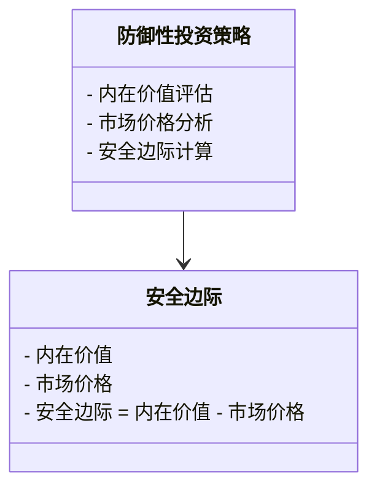
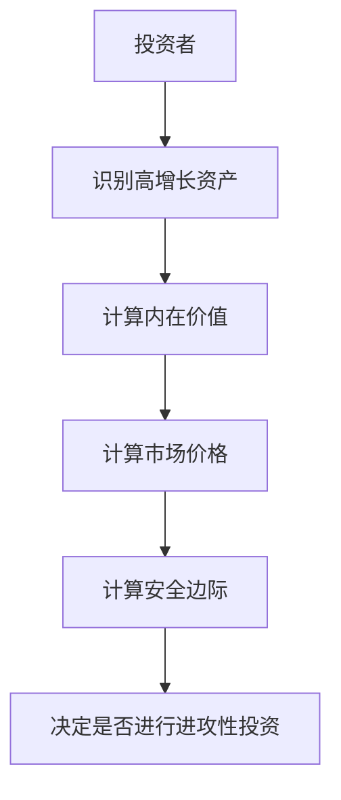
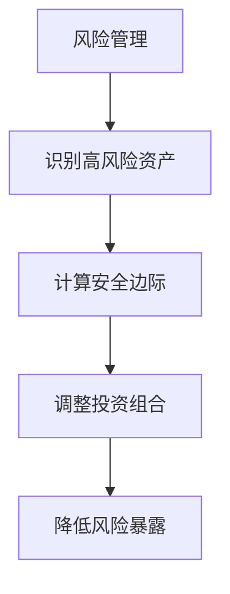

                 


# 格雷厄姆的安全边际理论实践

> 关键词：安全边际理论，投资策略，风险管理，价值投资，防御性投资，进攻性投资，量化投资

> 摘要：本文深入探讨格雷厄姆的安全边际理论，分析其在投资策略中的应用，结合实际案例和现代技术手段，系统性地阐述如何通过安全边际理论实现稳健投资。文章从理论基础、计算方法、投资策略、风险管理、案例分析、现代应用及未来展望等方面展开，为读者提供全面的理论指导和实践参考。

---

## 第一部分: 格雷厄姆的安全边际理论基础

### 第1章: 安全边际理论的背景与核心概念

#### 1.1 格雷厄姆与安全边际理论的提出
- 1.1.1 格雷厄姆的学术背景与投资理念
  - 约翰·奈斯比特·格雷厄姆（John Neave Graham）是20世纪著名的投资学家，被誉为“价值投资之父”。他提出的安全边际理论是价值投资的核心思想之一。
  - 格雷厄姆的投资理念强调以低于内在价值的价格买入优质资产，从而在市场波动中实现稳健的收益。
  - 安全边际理论的提出背景：20世纪30年代大萧条时期，格雷厄姆通过研究市场的波动性和投资者的心理行为，提出了安全边际理论，以帮助投资者在不确定的市场中降低风险。

- 1.1.2 安全边际理论的核心思想
  - 安全边际理论的核心思想是通过购买价格低于内在价值的资产，来确保投资的安全性和收益性。这种策略能够在市场下跌时提供保护，并在市场上涨时获得超额收益。
  - 格雷厄姆认为，安全边际是内在价值与市场价格之间的差额，这个差额越大，投资的安全边际越高。

- 1.1.3 安全边际理论与价值投资的关联
  - 价值投资强调以低于内在价值的价格买入资产，而安全边际理论是实现这一目标的具体方法。
  - 安全边际理论不仅是一种投资策略，更是一种风险管理工具，能够在不确定的市场环境中为投资者提供保护。

#### 1.2 安全边际的定义与特征
- 1.2.1 安全边际的定义
  - 安全边际（Safety Margin）是指资产的市场价格与其内在价值之间的差额。当市场价格低于内在价值时，资产具有安全边际，这种差额越大，投资的风险越小，收益潜力越大。
  - 安全边际的计算公式为：安全边际 = 内在价值 - 市场价格

- 1.2.2 安全边际的核心特征对比表
  | 特征                | 安全边际        |
  |---------------------|-----------------|
  | 定义                | 内在价值 - 市场价格 |
  | 目的                | 提供投资保护，降低风险 |
  | 计算方式            | 基于资产的内在价值评估 |
  | 应用场景            | 价值投资、风险管理 |

- 1.2.3 安全边际与其它投资策略的实体关系图
  ```mermaid
  graph TD
    A[价值投资] --> B[安全边际]
    A --> C[成长投资]
    A --> D[指数投资]
    B --> E[防御性投资]
    C --> F[进攻性投资]
    D --> G[被动投资]
  ```

### 第2章: 安全边际的计算与评估方法

#### 2.1 安全边际计算模型
- 2.1.1 格雷厄姆安全边际计算公式
  - 内在价值（Intrinsic Value）是资产的真正价值，通常通过 discounted cash flow（DCF）模型或其他估值方法计算。
  - 安全边际（Safety Margin） = 内在价值 - 市场价格
  - 例如，假设一只股票的内在价值为 $50，市场价格为 $40，则安全边际为 $10。

- 2.1.2 安全边际计算的数学模型
  - 内在价值计算公式：$Intrinsic\ Value = \sum_{t=1}^{n} \frac{CF_t}{(1 + r)^t}$
  - 其中，$CF_t$ 是第 t 年的自由现金流，$r$ 是折现率。
  - 安全边际计算公式：$Safety\ Margin = Intrinsic\ Value - Market\ Price$

- 2.1.3 安全边际计算的 Mermaid 流程图
  ```mermaid
  graph TD
    A[开始] --> B[计算内在价值]
    B --> C[计算市场价格]
    C --> D[计算安全边际]
    D --> E[结束]
  ```

#### 2.2 安全边际评估的影响因素
- 2.2.1 市场价格波动对安全边际的影响
  - 市场价格的波动会影响安全边际的大小。当市场价格下跌时，安全边际增大；当市场价格上涨时，安全边际减小。
  - 例如，如果一只股票的内在价值为 $50，市场价格从 $40 上涨到 $45，则安全边际从 $10 减少到 $5。

- 2.2.2 内在价值评估的准确性
  - 内在价值的评估依赖于假设和模型的选择，因此存在一定的主观性。评估的准确性直接影响安全边际的计算结果。

- 2.2.3 安全边际的动态调整机制
  - 投资者需要定期重新评估内在价值和市场价格，动态调整安全边际的计算结果，以应对市场的变化。

---

## 第二部分: 安全边际在投资策略中的应用

### 第3章: 基于安全边际的防御性投资策略

#### 3.1 防御性投资的核心原则
- 防御性投资强调以低于内在价值的价格买入资产，通过安全边际的保护作用来降低投资风险。
- 防御性投资的核心原则包括：
  1. 买入价格必须低于内在价值。
  2. 选择具有稳定现金流和良好管理的资产。
  3. 长期持有，避免频繁交易。

#### 3.2 安全边际在防御性投资中的应用
- 通过计算安全边际，投资者可以识别出具有较高安全边际的资产，从而降低投资风险。
- 例如，假设投资者发现一只股票的内在价值为 $50，市场价格为 $40，则该股票具有 $10 的安全边际，适合进行防御性投资。

#### 3.3 防御性投资策略的 Mermaid 类图


### 第4章: 安全边际在进攻性投资中的应用

#### 4.1 进攻性投资的风险与收益平衡
- 进攻性投资强调通过高风险高收益的策略来实现超额收益，但需要通过安全边际来降低风险。
- 进攻性投资的风险与收益平衡：通过选择具有较高安全边际的资产，投资者可以在进攻性投资中降低风险，同时追求超额收益。

#### 4.2 安全边际在进攻性投资中的保护作用
- 通过计算安全边际，投资者可以选择具有较高安全边际的资产，从而在市场波动中保护投资本金。
- 例如，假设投资者选择一只具有高增长潜力的股票，其内在价值为 $100，市场价格为 $80，则安全边际为 $20，适合进行进攻性投资。

#### 4.3 进攻性投资策略的 Mermaid 序列图


---

## 第三部分: 安全边际的风险管理与控制

### 第5章: 安全边际的风险管理与控制

#### 5.1 安全边际与风险管理
- 风险管理的核心是通过降低风险暴露来保护投资本金。
- 安全边际在风险管理中的作用：通过计算安全边际，投资者可以识别出具有较高安全边际的资产，从而降低投资组合的风险暴露。

#### 5.2 安全边际的组合管理策略
- 通过将具有较高安全边际的资产纳入投资组合，投资者可以降低组合的整体风险。
- 例如，投资者可以通过分散投资于具有较高安全边际的股票和债券，来降低组合的风险。

#### 5.3 安全边际的风险管理的 Mermaid 架构图


### 第6章: 安全边际的系统分析与架构设计

#### 6.1 安全边际的系统功能设计
- 系统功能模块划分：
  1. 内在价值评估模块
  2. 市场价格分析模块
  3. 安全边际计算模块
  4. 投资策略优化模块

- 功能模块之间的关系：
  - 内在价值评估模块提供内在价值数据。
  - 市场价格分析模块提供市场价格数据。
  - 安全边际计算模块计算安全边际。
  - 投资策略优化模块根据安全边际优化投资策略。

#### 6.2 安全边际的系统架构设计
- 系统架构图：
  ```mermaid
  graph TD
    A[系统输入] --> B[内在价值评估模块]
    B --> C[市场价格分析模块]
    C --> D[安全边际计算模块]
    D --> E[投资策略优化模块]
    E --> F[系统输出]
  ```

### 第7章: 安全边际的现代应用与未来发展

#### 7.1 安全边际在现代投资中的应用
- 现代投资中的安全边际应用：量化投资、指数投资、行为金融等领域的应用。
- 例如，量化投资者可以通过算法计算安全边际，选择具有较高安全边际的资产进行投资。

#### 7.2 安全边际的未来发展与研究方向
- 未来研究方向：
  1. 安全边际的动态调整与优化。
  2. 安全边际在不同类型资产中的应用。
  3. 安全边际与人工智能的结合。

---

## 第四部分: 结语与展望

### 7.3 结语
- 格雷厄姆的安全边际理论是价值投资的核心思想之一，通过计算安全边际，投资者可以在市场波动中降低风险，实现稳健的投资收益。
- 未来，随着金融市场的不断发展，安全边际理论将在更多领域得到应用，为投资者提供更有效的投资工具。

### 7.4 未来展望
- 未来的研究方向包括安全边际的动态调整、多资产类别的应用以及与人工智能的结合。
- 通过不断的研究和实践，安全边际理论将为投资者提供更科学的投资决策支持。

---

## 作者：AI天才研究院/AI Genius Institute & 禅与计算机程序设计艺术 /Zen And The Art of Computer Programming

