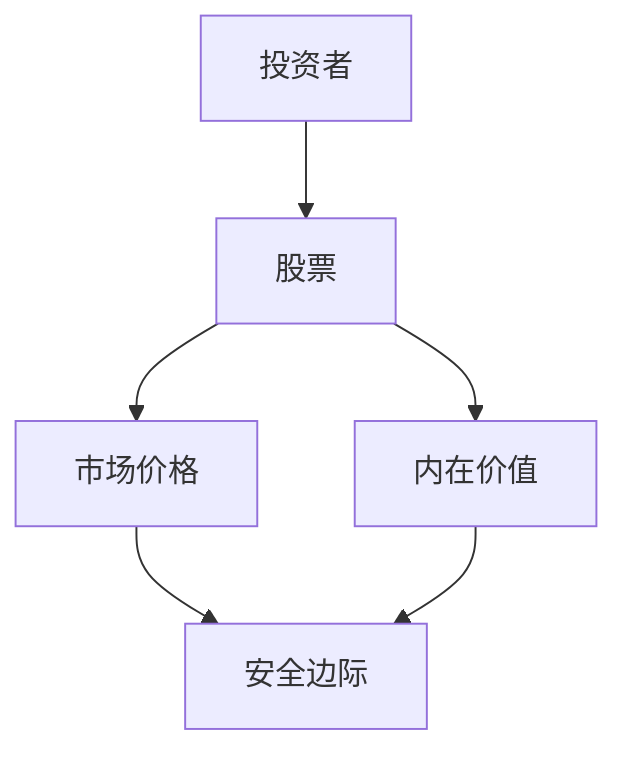
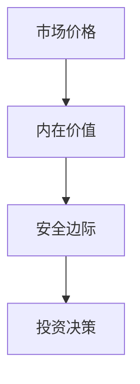

                 


# 格雷厄姆的安全边际理论：在高估值市场中的应用

> 关键词：安全边际理论，股票估值，高估值市场，投资策略，本杰明·格雷厄姆

> 摘要：本文详细探讨了格雷厄姆的安全边际理论在高估值市场中的应用。通过分析安全边际的核心概念、数学模型、系统架构以及实际案例，本文为投资者提供了在高估值市场中如何利用安全边际理论进行投资决策的深度指导。文章结合理论与实践，为读者提供了清晰的思路和实用的方法。

---

## 第一部分: 格雷厄姆的安全边际理论基础

### 第1章: 安全边际理论的背景与核心概念

#### 1.1 安全边际理论的起源与发展

- **1.1.1 本杰明·格雷厄姆及其投资理念**
  本杰明·格雷厄姆是价值投资的鼻祖，他的投资理念强调安全性和稳定性，主张以低于内在价值的价格买入优质股票。这种理念在《证券分析》一书中得到了详细阐述。

- **1.1.2 安全边际理论的提出背景**
  在20世纪30年代的经济大萧条期间，格雷厄姆意识到市场波动性和投资者情绪对股票价格的影响。他提出安全边际理论，以帮助投资者在市场波动中降低风险。

- **1.1.3 理论的核心思想与应用场景**
  安全边际理论的核心思想是通过计算股票的内在价值，并与市场价格进行比较，寻找具有安全边际的股票。这种股票通常价格低于其内在价值，具有较高的投资安全性。

#### 1.2 安全边际理论的核心概念

- **1.2.1 内在价值的定义与计算**
  内在价值是股票的真正价值，不依赖于市场波动。计算内在价值通常采用DCF（现金流折现法）或其他估值方法。

- **1.2.2 安全边际的定义与公式**
  安全边际 = 内在价值 - 市场价格。当安全边际为正时，股票具有投资价值。

- **1.2.3 安全边际与投资风险的关系**
  安全边际越大，投资风险越小。投资者应选择具有足够安全边际的股票，以避免市场波动带来的损失。

#### 1.3 安全边际理论的边界与外延

- **1.3.1 理论适用的市场环境**
  安全边际理论适用于市场估值过高或过低的情况，尤其在高估值市场中，可以通过安全边际寻找被低估的股票。

- **1.3.2 理论的局限性与不足**
  安全边际理论假设市场是有效的，但在实际市场中，信息不对称和市场情绪可能影响其应用效果。

- **1.3.3 理论与其他投资理论的联系**
  安全边际理论与技术分析、基本面分析等其他投资理论有交集，但更注重长期价值而非短期波动。

### 第2章: 安全边际理论的核心要素与概念结构

#### 2.1 核心要素分析

- **2.1.1 内在价值的计算要素**
  内在价值的计算需要考虑公司的财务状况、盈利能力、行业地位等因素。

- **2.1.2 市场价格的波动性分析**
  市场价格受投资者情绪和市场流动性影响，波动较大。

- **2.1.3 安全边际的宽度与深度**
  安全边际的宽度指内在价值与市场价格的差值，深度指长期维持安全边际的能力。

#### 2.2 核心概念的属性特征对比

- **2.2.1 内在价值与市场价格的对比**
  | 对比维度 | 内在价值 | 市场价格 |
  |----------|----------|----------|
  | 计算依据 | 公司基本面 | 市场情绪 |
  | 稳定性   | 高        | 低        |

- **2.2.2 安全边际与投资风险的对比**
  | 对比维度 | 安全边际 | 投资风险 |
  |----------|----------|----------|
  | 正相关性 | 正相关   | 负相关   |
  | 影响因素 | 市场价格 | 安全边际 |

- **2.2.3 安全边际与投资收益的对比**
  | 对比维度 | 安全边际 | 投资收益 |
  |----------|----------|----------|
  | 时间因素 | 短期波动 | 长期累积 |
  | 关系     | 正相关   | 正相关   |

#### 2.3 ER实体关系图



---

## 第3章: 安全边际理论的数学模型与公式

### 3.1 内在价值的计算公式

$$ V = \frac{E}{k} $$

其中：
- \( V \) 表示内在价值
- \( E \) 表示预期收益
- \( k \) 表示折现率

### 3.2 安全边际的计算公式

$$ M = V - P $$

其中：
- \( M \) 表示安全边际
- \( V \) 表示内在价值
- \( P \) 表示市场价格

### 3.3 安全边际与投资决策的关系



---

## 第4章: 安全边际理论的系统分析与架构设计

### 4.1 系统功能设计

- **4.1.1 领域模型**
  ```mermaid
  classDiagram
      class 投资者 {
          市场价格
          内在价值
      }
      class 股票 {
          市场价格
          内在价值
      }
      class 投资决策 {
          安全边际
      }
      投资者 --> 股票
      股票 --> 投资决策
  ```

- **4.1.2 系统架构**
  ```mermaid
  context 系统架构 {
      participant 投资者
      participant 股票
      participant 投资决策
      participant 安全边际计算模块
      投资者 --> 安全边际计算模块
      股票 --> 安全边际计算模块
      安全边际计算模块 --> 投资决策
  }
  ```

---

## 第5章: 项目实战

### 5.1 环境安装

- 安装Python和相关库（如Pandas、NumPy）。

### 5.2 系统核心实现源代码

```python
def calculate_intrinsic_value(enterprise_value, expected_free_cash_flow, discount_rate):
    return enterprise_value / (1 + discount_rate)

def calculate_market_price(stock ticker):
    # 获取股票价格的API调用
    pass

def calculate_margin_of_safety(intrinsic_value, market_price):
    return intrinsic_value - market_price

# 示例
ticker = "AAPL"
iv = calculate_intrinsic_value(enterprise_value, expected_free_cash_flow, discount_rate)
mp = calculate_market_price(ticker)
mos = calculate_margin_of_safety(iv, mp)
print(f"安全边际为: {mos}")
```

### 5.3 代码应用解读与分析

- 通过代码实现安全边际的计算，投资者可以快速筛选出具有安全边际的股票。

### 5.4 实际案例分析

- 以苹果公司为例，计算其安全边际，并判断是否具有投资价值。

### 5.5 项目小结

- 通过项目实战，投资者可以更好地理解安全边际理论的应用，并将其应用于实际投资决策中。

---

## 第6章: 最佳实践、小结与拓展阅读

### 6.1 最佳实践

- 定期更新股票估值，根据市场变化调整投资组合。
- 结合其他投资理论，如技术分析，综合判断投资机会。

### 6.2 小结

- 安全边际理论是一种有效的投资工具，尤其在高估值市场中，可以帮助投资者降低风险，提高收益。

### 6.3 注意事项

- 投资者应根据自身风险承受能力调整安全边际的宽窄。
- 避免仅依赖单一理论，结合市场环境和公司基本面进行综合判断。

### 6.4 拓展阅读

- 格雷厄姆的《证券分析》
- 纳什均衡理论
- 现代投资组合理论

---

## 作者：AI天才研究院/AI Genius Institute & 禅与计算机程序设计艺术 /Zen And The Art of Computer Programming

---

以上是《格雷厄姆的安全边际理论：在高估值市场中的应用》的完整目录大纲，涵盖了从理论到实践的各个方面，结合技术语言和实际案例，为读者提供了全面的指导。

