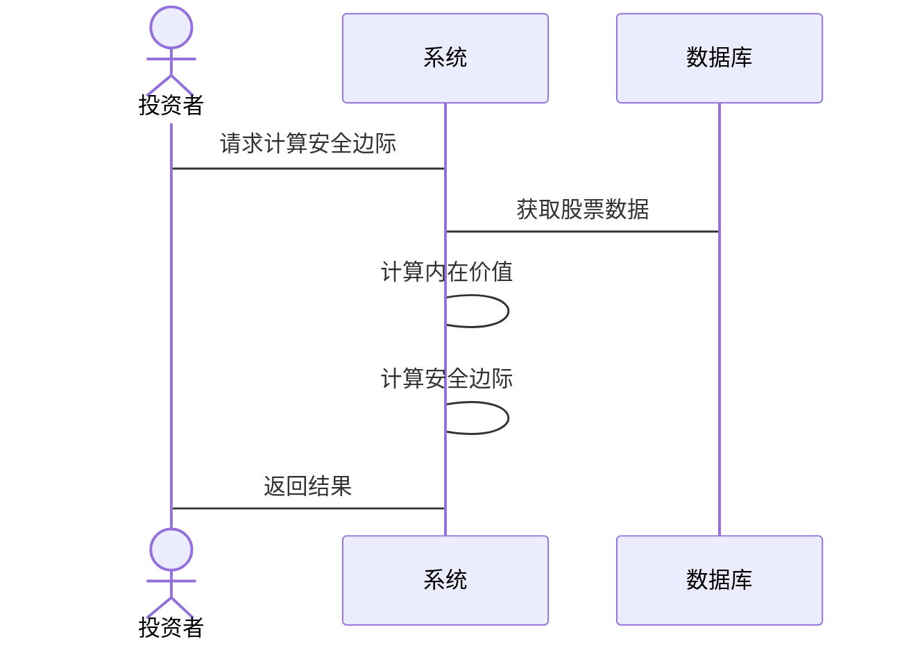

                 


# 《格雷厄姆的安全边际：如何在投资中留有余地》

## 关键词：
- 格雷厄姆
- 安全边际
- 投资策略
- 价值投资
- 风险控制

## 摘要：
本文深入探讨了本杰明·格雷厄姆提出的安全边际概念，分析其在投资决策中的重要性。通过理论与实践结合，详细阐述了安全边际的计算方法、算法原理及系统设计方案，并通过案例分析展示了其应用。文章旨在帮助投资者在不确定的市场中做出明智决策，确保投资的稳健性。

---

## 第一部分：安全边际的背景与基础

### 第1章：安全边际的定义与起源

#### 1.1 安全边际的定义
安全边际是投资学中的一个重要概念，由本杰明·格雷厄姆提出。它指的是投资者在买入股票时，支付的价格低于股票内在价值的部分。简单来说，安全边际 = 内在价值 - 市场价格。这一概念旨在降低投资风险，确保投资者在市场波动中仍能获得收益。

#### 1.2 格雷厄姆的投资理念
格雷厄姆是价值投资的鼻祖，他主张以低于内在价值的价格买入股票，从而在市场下跌时仍能保持盈利。他认为市场价格经常偏离内在价值，而安全边际的存在正是利用了这种偏离，为投资者提供了保护。

#### 1.3 安全边际的重要性
在投资过程中，市场波动和不确定性是不可避免的。安全边际为投资者提供了一个缓冲区，即使市场出现意外情况，也能确保投资本金的安全。这种理念尤其在熊市中表现得尤为重要。

#### 1.4 与其他投资策略的对比
与技术分析和成长投资相比，安全边际更注重基本面分析和风险控制。技术分析依赖价格走势，而成长投资则关注未来的增长潜力，相比之下，安全边际提供了更为稳健的投资策略。

### 第2章：安全边际的核心概念与联系

#### 2.1 核心概念原理
安全边际的核心在于识别市场低估的股票，并以合理的价格买入。通过比较市场价格与内在价值，投资者可以确定是否存在足够的安全空间。内在价值的计算通常基于公司的财务数据和行业地位。

#### 2.2 属性特征对比表格
以下是安全边际与其他投资策略的对比：

| 对比维度         | 安全边际                   | 技术分析                 | 成长投资                 |
|------------------|--------------------------|--------------------------|--------------------------|
| 核心关注点       | 内在价值与市场价格差      | 价格走势                | 未来增长潜力             |
| 风险控制         | 高                        | 中                        | 中低                     |
| 适用市场环境     | 股票市场低估时             | 市场趋势明显时            | 市场增长预期强烈时        |

#### 2.3 ER实体关系图
以下是安全边际的ER实体关系图：

```mermaid
er
  actor(投资者)
  actor(市场)
  entity(股票)
  entity(内在价值)
  entity(市场价格)
  entity(安全边际)
  relationship(投资者购买股票)
  relationship(股票具有市场价格)
  relationship(股票具有内在价值)
  relationship(安全边际 = 内在价值 - 市场价格)
```

---

## 第二部分：安全边际的算法原理

### 第3章：安全边际的算法原理

#### 3.1 算法流程图
以下是计算安全边际的流程图：

```mermaid
graph TD
    A[开始] -> B[计算内在价值]
    B -> C[确定市场价格]
    C -> D[计算安全边际（内在价值 - 市场价格）]
    D -> E[结束]
```

#### 3.2 Python代码实现
以下是计算安全边际的Python代码示例：

```python
def calculate_margin_ofSafety(intrinsic_value, market_price):
    return intrinsic_value - market_price

# 示例计算
intrinsic_value = 100  # 内在价值
market_price = 80      # 市场价格
margin_of_safety = calculate_margin_ofSafety(intrinsic_value, market_price)
print(f"安全边际为：{margin_of_safety}")
```

#### 3.3 数学模型和公式
内在价值的计算公式为：

$$ V = \frac{E}{P} $$

其中，\( V \) 是内在价值，\( E \) 是预期收益，\( P \) 是资本回报率。

安全边际的计算公式为：

$$ MOS = V - P $$

其中，\( MOS \) 是安全边际，\( V \) 是内在价值，\( P \) 是市场价格。

---

## 第三部分：系统分析与架构设计

### 第4章：系统分析与架构设计

#### 4.1 问题场景介绍
在投资决策中，投资者需要实时计算安全边际，以确定是否买入或卖出股票。系统需要处理大量的市场数据和财务数据，并提供直观的分析结果。

#### 4.2 系统功能设计
以下是系统的功能模块：

- 数据收集：获取股票的市场价格和财务数据。
- 内在价值计算：使用格雷厄姆模型计算内在价值。
- 安全边际计算：比较市场价格和内在价值，计算安全边际。
- 结果可视化：以图表形式展示安全边际。

#### 4.3 系统架构图
以下是系统的架构图：


#### 4.4 接口和交互设计
以下是系统的交互流程：



---

## 第四部分：项目实战

### 第5章：项目实战

#### 5.1 环境安装
需要安装Python和相关库，如Pandas和Matplotlib。

#### 5.2 核心代码实现
以下是核心代码：

```python
import pandas as pd
import matplotlib.pyplot as plt

def calculate_intrinsic_value(earnings, p_e):
    return earnings / p_e

def calculate_margin_of_safety(intrinsic_value, price):
    return intrinsic_value - price

# 示例数据
data = {
    '股票': ['A', 'B', 'C'],
    'earnings': [100, 150, 200],
    'p_e': [5, 7, 10]
}

df = pd.DataFrame(data)

# 计算内在价值和安全边际
df['内在价值'] = df.apply(lambda x: calculate_intrinsic_value(x['earnings'], x['p_e']), axis=1)
df['市场价格'] = 50  # 假设市场价格为50
df['安全边际'] = df.apply(lambda x: calculate_margin_of_safety(x['内在价值'], x['市场价格']), axis=1)

# 可视化
plt.figure(figsize=(10, 6))
plt.bar(df['股票'], df['安全边际'])
plt.title('安全边际分析')
plt.xlabel('股票')
plt.ylabel('安全边际')
plt.show()
```

#### 5.3 案例分析
以股票A为例，计算其安全边际：

- 内在价值 = 100 / 5 = 20
- 市场价格 = 50
- 安全边际 = 20 - 50 = -30

结果表明，股票A的安全边际为负，意味着市场价格高于内在价值，投资者应避免买入。

#### 5.4 项目总结
通过该项目，我们可以看到安全边际在实际投资中的应用。通过代码实现和可视化，投资者可以快速判断股票的投资价值。

---

## 第五部分：最佳实践与总结

### 第6章：最佳实践与总结

#### 6.1 最佳实践Tips
1. 定期检查股票的安全边际。
2. 选择安全边际为正的股票进行投资。
3. 结合其他指标（如PE、PB）进行综合分析。

#### 6.2 小结
安全边际是价值投资中的重要工具，通过合理计算和分析，投资者可以在市场波动中降低风险，实现稳健投资。

#### 6.3 注意事项
- 安全边际的计算需要准确的财务数据。
- 市场价格受多种因素影响，需关注行业和宏观经济环境。
- 长期投资比短期交易更有利于安全边际的应用。

#### 6.4 拓展阅读
- 格雷厄姆的《证券分析》
- 巴菲特的《致股东的信》

---

## 作者：AI天才研究院/AI Genius Institute & 禅与计算机程序设计艺术 /Zen And The Art of Computer Programming

