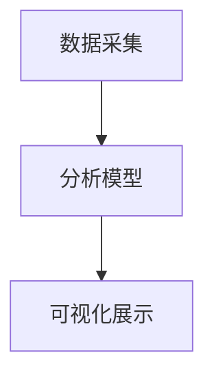
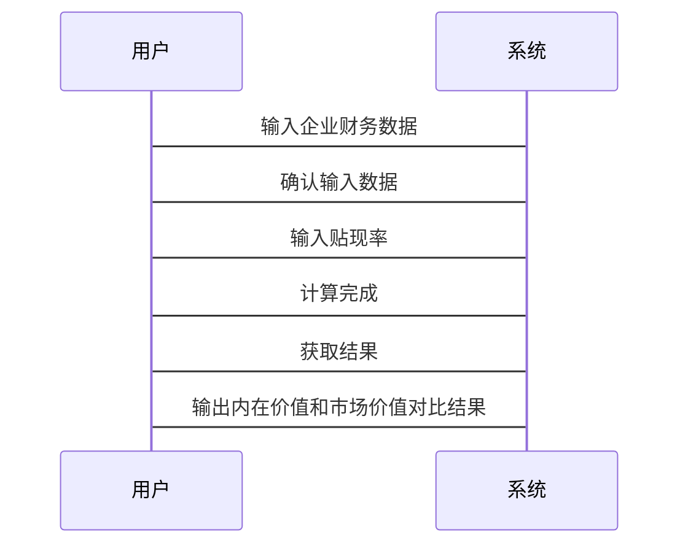

                 

# 《格雷厄姆的工作资本分析在现代企业估值中的应用》

---

## 关键词：
- 格雷厄姆
- 工作资本分析
- 企业估值
- 现金流折现模型（DCF）
- 内在价值
- 价值投资

---

## 摘要：
本文深入探讨了格雷厄姆的工作资本分析方法在现代企业估值中的应用。从工作资本分析的理论基础出发，结合数学模型与实际案例，分析其在企业价值评估中的核心作用。文章首先介绍了工作资本分析的定义、历史演变及其核心要素，随后详细阐述了其在现代企业估值中的数学模型与公式，包括现金流折现模型（DCF）和内在价值的计算方法。接着，文章通过实际案例展示了工作资本分析在不同行业的应用，重点分析了科技行业的估值过程。最后，本文提出了基于工作资本分析的系统架构与技术实现方案，并总结了最佳实践和未来发展方向。

---

# 目录

---

## 第1章 工作资本分析的理论基础

### 1.1 工作资本分析的定义与核心概念

#### 1.1.1 工作资本的定义与内涵
工作资本是企业经营活动中产生的现金流，反映了企业的盈利能力和价值创造能力。格雷厄姆的工作资本分析基于现金流折现模型（DCF），强调通过内在价值的计算来评估企业的长期投资价值。

#### 1.1.2 工作资本分析的基本原理
工作资本分析的核心是通过对企业未来现金流的预测，计算其现值，并与市场价值进行比较，从而判断企业是否被低估或高估。

#### 1.1.3 工作资本分析与现代企业估值的关系
工作资本分析是现代企业估值的重要方法之一，尤其适用于价值投资策略。它通过对企业基本面的深入分析，帮助投资者识别具有长期投资价值的企业。

### 1.2 工作资本分析的历史演变

#### 1.2.1 格雷厄姆的原始工作资本分析框架
格雷厄姆在20世纪初提出了工作资本分析的基本框架，强调对企业现金流的关注，并提出了内在价值的计算方法。

#### 1.2.2 现代工作资本分析的发展与改进
随着金融理论的发展，工作资本分析不断完善，尤其是在现金流折现模型（DCF）的应用中，引入了更多的变量和假设。

#### 1.2.3 工作资本分析在企业估值中的应用现状
目前，工作资本分析被广泛应用于企业并购、投资决策等领域，尤其是在价值投资领域具有重要地位。

### 1.3 工作资本分析的核心要素

#### 1.3.1 现金流的定义与计算
现金流是企业经营活动、投资活动和筹资活动所产生的现金流量，包括经营活动现金流、投资活动现金流和筹资活动现金流。

#### 1.3.2 净现值（NPV）的计算公式
$$ NPV = \sum_{t=1}^{n} \frac{CF_t}{(1+r)^t} $$
其中，$CF_t$为第t年的现金流，$r$为贴现率。

#### 1.3.3 内在价值的公式推导
内在价值是企业未来现金流的现值，计算公式为：
$$ Intrinsic\ Value = \sum_{t=1}^{n} \frac{FCF_t}{(1+r)^t} + \frac{TV}{(1+r)^n} $$
其中，$FCF_t$为第t年的自由现金流，$TV$为终值。

### 1.4 工作资本分析的边界与外延

#### 1.4.1 工作资本分析的适用范围
适用于企业长期价值评估，尤其适合那些现金流稳定、具有持续盈利能力的企业。

#### 1.4.2 工作资本分析的局限性
由于依赖于对未来现金流的预测和贴现率的假设，工作资本分析在实际应用中存在一定的局限性，例如对假设条件的敏感性。

#### 1.4.3 工作资本分析与其他估值方法的联系与区别
工作资本分析与其他估值方法（如相对估值法）有联系，但更注重企业的基本面和内在价值。

---

## 第2章 工作资本分析的数学模型与公式

### 2.1 工作资本分析的数学模型

#### 2.1.1 现金流折现模型（DCF）的公式
$$ DCF = \sum_{t=1}^{n} \frac{CF_t}{(1+r)^t} + \frac{TV}{(1+r)^n} $$
其中，$CF_t$为第t年的现金流，$r$为贴现率，$TV$为终值。

#### 2.1.2 内在价值的计算公式
$$ Intrinsic\ Value = \sum_{t=1}^{n} \frac{FCF_t}{(1+r)^t} + \frac{TV}{(1+r)^n} $$
其中，$FCF_t$为第t年的自由现金流，$TV$为终值。

### 2.2 工作资本分析的核心公式推导

#### 2.2.1 现金流的现值计算
通过贴现率将未来现金流折现为现值，用于计算企业内在价值。

#### 2.2.2 终值的计算方法
终值可以通过永续增长率法或退出假设法计算，具体取决于企业的业务模式和行业特点。

#### 2.2.3 内在价值与市场价值的比较
通过比较内在价值与市场价值，判断企业是否被低估或高估。

### 2.3 工作资本分析的案例分析

#### 2.3.1 某公司现金流折现模型的应用
以某公司为例，计算其未来五年的现金流，并基于合理的贴现率计算其内在价值。

#### 2.3.2 内在价值与市场价值的对比分析
通过对比计算出的内在价值与市场价值，判断该公司的投资价值。

---

## 第3章 工作资本分析在现代企业估值中的应用

### 3.1 工作资本分析的应用场景

#### 3.1.1 企业并购中的应用
在企业并购中，工作资本分析用于评估目标企业的价值，帮助制定合理的并购价格。

#### 3.1.2 投资决策中的应用
投资者可以通过工作资本分析评估企业的内在价值，指导投资决策。

#### 3.1.3 股票估值中的应用
工作资本分析被广泛应用于股票估值，尤其适合价值投资者。

### 3.2 工作资本分析的行业应用

#### 3.2.1 科技行业的应用
以科技行业为例，分析其现金流的特点，并应用工作资本分析进行估值。

#### 3.2.2 制造业的应用
以制造业为例，分析其现金流的周期性，并应用工作资本分析进行估值。

#### 3.2.3 金融行业的应用
以金融行业为例，分析其现金流的稳定性，并应用工作资本分析进行估值。

### 3.3 工作资本分析的局限性与改进方向

#### 3.3.1 局限性分析
工作资本分析依赖于对未来现金流的预测和贴现率的假设，存在一定的局限性。

#### 3.3.2 改进方向
结合其他估值方法，如相对估值法，提高估值的准确性和可靠性。

---

## 第4章 系统架构与技术实现

### 4.1 工作资本分析的系统架构设计

#### 4.1.1 系统功能模块
- 数据采集模块
- 分析模型模块
- 可视化展示模块

#### 4.1.2 系统架构图

### 4.2 工作资本分析的技术实现

#### 4.2.1 数据采集与处理
通过爬虫或其他数据接口获取企业的财务数据，进行清洗和整理。

#### 4.2.2 分析模型的实现
基于Python的金融分析库（如Pandas、NumPy）实现现金流折现模型。

#### 4.2.3 可视化展示
使用Matplotlib或Seaborn绘制现金流折现图和内在价值对比图。

### 4.3 系统接口设计

#### 4.3.1 数据接口
定义数据接口，方便数据的导入和导出。

#### 4.3.2 用户界面
设计友好的用户界面，方便用户输入参数和查看结果。

### 4.4 系统交互设计

#### 4.4.1 用户操作流程
用户输入企业财务数据，选择贴现率，点击计算，系统输出内在价值和市场价值对比结果。

#### 4.4.2 交互流程图

---

## 第5章 最佳实践与总结

### 5.1 最佳实践

#### 5.1.1 数据质量的重要性
确保输入数据的准确性和完整性，是工作资本分析的关键。

#### 5.1.2 合理选择贴现率
贴现率的选择影响最终结果，应根据企业的风险特性合理选择。

#### 5.1.3 结合行业特点
不同行业具有不同的现金流特征，应结合行业特点进行分析。

### 5.2 小结

#### 5.2.1 核心内容回顾
本文深入探讨了格雷厄姆的工作资本分析在现代企业估值中的应用，从理论基础到实际案例进行了全面分析。

#### 5.2.2 未来发展方向
未来，工作资本分析将与人工智能和大数据技术结合，进一步提升估值的准确性和效率。

---

## 作者：AI天才研究院 & 禅与计算机程序设计艺术

