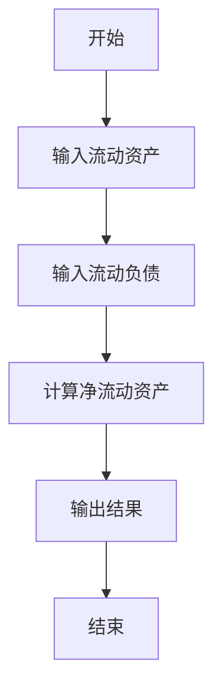
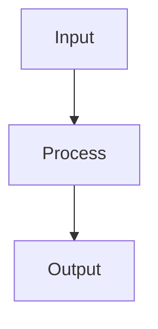
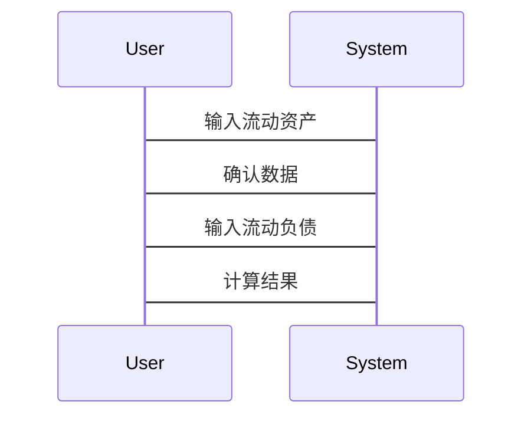

                 


# 格雷厄姆的工作资本分析：评估公司短期健康

## 关键词：工作资本分析，流动资产，流动负债，净流动资产，格雷厄姆，短期健康，投资评估

## 摘要：  
格雷厄姆的工作资本分析是一种经典的财务分析方法，旨在评估公司的短期偿债能力和财务健康状况。本文详细介绍了工作资本分析的核心概念、算法原理、系统架构以及实战案例，通过格雷厄姆的理论基础和实际应用，帮助读者理解如何通过工作资本分析评估公司的短期健康，为投资决策提供有力支持。

---

# 第1章：工作资本分析概述

## 1.1 工作资本分析的定义与核心概念

### 1.1.1 工作资本的定义  
工作资本（Working Capital），也称为营运资本，是指公司日常经营活动中可以快速转化为现金的资产与负债的差额。它反映了公司在短期内偿还债务的能力，是评估公司短期财务健康的重要指标。

### 1.1.2 核心概念：流动资产、流动负债与净流动资产  
- **流动资产**：可以在一年内变现或消耗的资产，包括现金、应收账款、存货等。  
- **流动负债**：公司在一年内需要偿还的债务，包括应付账款、短期贷款等。  
- **净流动资产**：流动资产减去流动负债，即 $Net\ Working\ Capital = Current\ Assets - Current\ Liabilities$。  

### 1.1.3 工作资本分析的背景与意义  
工作资本分析是公司财务健康评估的重要组成部分，尤其在经济下行或市场波动时，能够帮助投资者识别公司的短期偿债能力，避免因流动性不足导致的财务危机。

---

## 1.2 格雷厄姆的理论基础

### 1.2.1 格雷厄姆的价值投资理念  
本杰明·格雷厄姆是价值投资的鼻祖，他强调以低于内在价值的价格购买优质资产。工作资本分析是其投资理念的重要组成部分，用于评估公司的短期财务健康。

### 1.2.2 工作资本分析在投资中的作用  
格雷厄姆认为，公司必须具备充足的流动资产以应对短期债务，否则可能面临流动性危机。因此，工作资本分析是评估公司能否持续经营的关键指标。

### 1.2.3 格雷厄姆的短期健康指标  
格雷厄姆提出，公司的工作资本与流动负债的比率（即 $Working\ Capital/Current\ Liabilities$）应至少为2:1，以确保公司有足够的流动性应对短期债务。

---

## 1.3 工作资本分析的目标与边界

### 1.3.1 分析目标：评估公司短期偿债能力  
工作资本分析的核心目标是评估公司在短期内偿还债务的能力，确保公司能够维持正常的经营运作。

### 1.3.2 分析边界：流动资产与流动负债的范围  
- **流动资产**：包括现金、应收账款、存货等，通常在一年内可以变现或消耗。  
- **流动负债**：包括应付账款、短期贷款等，通常在一年内需要偿还。  

### 1.3.3 核心要素：现金、应收账款与存货  
- **现金**：公司最容易变现的资产，是流动资产的重要组成部分。  
- **应收账款**：公司因销售产品或服务而应收回的款项，属于流动资产。  
- **存货**：公司持有的原材料、在制品和成品，属于流动资产的一部分。

---

## 1.4 本章小结  
本章介绍了工作资本分析的定义、核心概念以及格雷厄姆的理论基础，强调了工作资本分析在评估公司短期健康中的重要性。通过理解流动资产、流动负债和净流动资产的关系，读者可以更好地掌握工作资本分析的基本原理。

---

# 第2章：工作资本分析的核心概念与联系

## 2.1 核心概念原理

### 2.1.1 流动资产的构成与特征  
流动资产包括现金、应收账款、存货等，具有变现能力强、周转速度快的特点。

### 2.1.2 流动负债的分类与属性  
流动负债包括应付账款、短期贷款等，具有偿还期限短、负债金额明确的特点。

### 2.1.3 净流动资产的计算公式  
$$ Net\ Working\ Capital = Current\ Assets - Current\ Liabilities $$

---

## 2.2 核心概念对比表

| **类别** | **流动资产**                | **流动负债**               |
|----------|-----------------------------|-----------------------------|
| 定义     | 公司在一年内可以变现或消耗的资产 | 公司在一年内需要偿还的债务 |
| 示例     | 现金、应收账款、存货          | 应付账款、短期贷款          |
| 特性     | 变现能力强、周转速度快        | 偿还期限短、负债金额明确    |

---

## 2.3 ER实体关系图

```mermaid
erd
    Company
    -------
    - id
    - name
    - working_capital
    - current_assets
    - current_liabilities

    current_assets --|> Company: 包含
    current_liabilities --|> Company: 包含
```

---

## 2.4 本章小结  
本章通过对比流动资产和流动负债的构成与特性，进一步明确了工作资本分析的核心概念。通过ER实体关系图，展示了公司与流动资产、流动负债之间的关系，为后续的分析提供了基础。

---

# 第3章：工作资本分析的算法原理

## 3.1 算法原理概述

### 3.1.1 工作资本分析的数学模型  
工作资本分析的核心公式是：$$ Net\ Working\ Capital = Current\ Assets - Current\ Liabilities $$  

### 3.1.2 算法流程图  


---

## 3.2 代码实现

### 3.2.1 环境安装  
需要安装Python和以下库：  
```bash
pip install pandas numpy
```

### 3.2.2 核心代码示例  
```python
def calculate_working_capital(current_assets, current_liabilities):
    return current_assets - current_liabilities

# 示例数据
current_assets = 500000  # 流动资产（美元）
current_liabilities = 300000  # 流动负债（美元）

net_working_capital = calculate_working_capital(current_assets, current_liabilities)
print(f"净流动资本：${net_working_capital}")
```

### 3.2.3 代码解读与分析  
上述代码定义了一个计算净流动资本的函数，并通过示例数据展示了如何应用该算法。净流动资本为正值，表明公司有足够的流动资产偿还短期债务。

---

## 3.4 本章小结  
本章通过数学模型和算法流程图，详细讲解了工作资本分析的实现原理。通过Python代码示例，读者可以理解如何将理论应用于实际计算。

---

# 第4章：工作资本分析的系统架构

## 4.1 系统分析与架构设计

### 4.1.1 问题场景：公司财务健康评估  
公司需要通过工作资本分析评估其短期偿债能力，确保财务健康。

### 4.1.2 系统功能设计：工作资本分析模块  
- **输入模块**：接收流动资产和流动负债的数据。  
- **计算模块**：执行净流动资本的计算。  
- **输出模块**：展示结果并生成报告。  

### 4.1.3 系统架构图  


---

## 4.2 接口设计与交互流程

### 4.2.1 数据接口：财务数据输入  
系统需要接收公司财务数据，包括流动资产和流动负债。

### 4.2.2 交互流程：用户输入与系统输出  
用户输入数据，系统计算并输出结果。

### 4.2.3 序列图：用户与系统交互过程  


---

## 4.4 本章小结  
本章通过系统架构设计，展示了如何将工作资本分析应用于实际系统中。通过接口设计和交互流程，确保了系统的高效运行。

---

# 第5章：工作资本分析的实战案例

## 5.1 项目实战

### 5.1.1 环境安装  
需要安装Python和以下库：  
```bash
pip install pandas numpy
```

### 5.1.2 核心实现：工作资本计算  
```python
def calculate_working_capital(current_assets, current_liabilities):
    return current_assets - current_liabilities

# 示例数据
current_assets = 500000  # 流动资产（美元）
current_liabilities = 300000  # 流动负债（美元）

net_working_capital = calculate_working_capital(current_assets, current_liabilities)
print(f"净流动资本：${net_working_capital}")
```

### 5.1.3 代码应用：案例分析与解读  
假设某公司流动资产为50万美元，流动负债为30万美元，则其净流动资本为20万美元，表明公司有足够的流动资产偿还短期债务。

---

## 5.2 案例分析

### 5.2.1 案例背景：某公司财务数据  
- 流动资产：500,000美元  
- 流动负债：300,000美元  

### 5.2.2 数据分析：流动资产与流动负债计算  
$$ Net\ Working\ Capital = 500,000 - 300,000 = 200,000\ \text{美元} $$  

### 5.2.3 结果解读：净流动资产评估  
净流动资本为20万美元，表明公司在短期内具备足够的流动性，能够偿还短期债务并维持正常的经营运作。

---

## 5.3 本章小结  
本章通过实际案例展示了工作资本分析的应用。通过计算和解读，读者可以理解如何通过工作资本分析评估公司的短期健康。

---

# 作者：AI天才研究院/AI Genius Institute & 禅与计算机程序设计艺术 /Zen And The Art of Computer Programming

---

通过以上章节，我们系统地介绍了格雷厄姆的工作资本分析方法，从理论基础到实际应用，为读者提供了全面的指导。希望本文能够帮助读者更好地理解工作资本分析的核心概念和实际应用，为投资决策提供有力支持。

