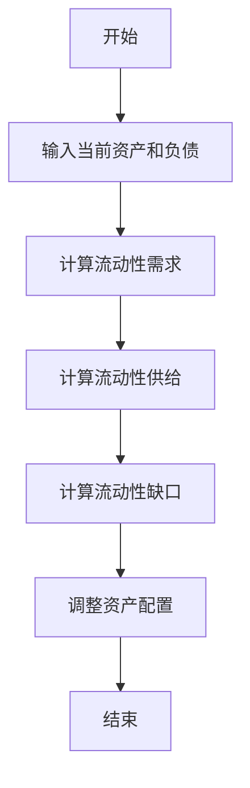
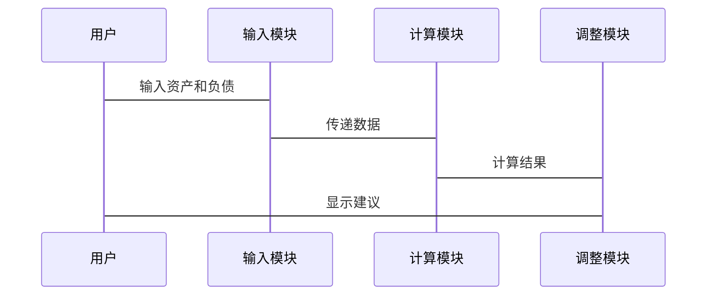

                 


# 《格雷厄姆的工作资本策略：关注流动性》

---

## 关键词：
- 工作资本策略
- 流动性管理
- 资本流动性
- 格雷厄姆策略
- 资金流动分析

---

## 摘要：
本文深入探讨了格雷厄姆的工作资本策略，重点关注流动性管理的核心概念、数学模型、算法实现及其在实际项目中的应用。文章首先介绍工作资本策略的背景与基础，接着分析流动性管理的数学模型和算法，随后详细讲解系统架构设计与项目实战，最后总结最佳实践和未来展望。通过本文，读者将全面理解如何通过格雷厄姆策略优化资本流动性，提升资金管理效率。

---

## 第一部分：工作资本策略的背景与基础

### 第1章：工作资本策略的概述

#### 1.1 工作资本策略的定义与特点
工作资本策略是一种以流动性为核心的工作资本管理方法，旨在优化资金流动效率，降低资金闲置和短缺风险。与传统资本管理不同，工作资本策略更注重动态调整资本结构，以适应业务需求的变化。

- **定义**：工作资本策略是一种以流动性为核心的工作资本管理方法，旨在优化资金流动效率，降低资金闲置和短缺风险。
- **特点**：
  1. **动态性**：根据业务需求实时调整资本结构。
  2. **流动性优先**：以流动性为核心，确保资金随时可用。
  3. **效率最大化**：通过优化资金流动，提高资本使用效率。

#### 1.2 格雷厄姆工作资本策略的理论基础
格雷厄姆的工作资本策略基于流动性管理的数学模型和算法，强调通过动态调整资本结构，实现资金流动的最优化。

- **核心原理**：通过动态调整资本结构，实现资金流动的最优化。
- **理论基础**：流动性需求与供给的数学模型。

#### 1.3 工作资本策略与传统资本管理的区别
| **维度**       | **工作资本策略**                  | **传统资本管理**                  |
|----------------|----------------------------------|----------------------------------|
| **核心目标**   | 优化资金流动效率                 | 降低资本成本                     |
| **管理重点**   | 流动性管理                        | 资本结构优化                     |
| **调整频率**   | 实时动态调整                     | 定期调整                         |

---

## 第二部分：流动性管理的数学模型与算法

### 第2章：流动性管理的数学模型

#### 2.1 流动性需求的数学表达
流动性需求由资产和负债两部分构成，公式如下：
$$L = \alpha \cdot A + \beta \cdot T$$
其中，$\alpha$ 和 $\beta$ 是权重系数，$A$ 是资产规模，$T$ 是交易量。

#### 2.2 流动性供给的数学表达
流动性供给由现金和融资两部分构成，公式如下：
$$S = \gamma \cdot C + \delta \cdot F$$
其中，$\gamma$ 和 $\delta$ 是权重系数，$C$ 是现金持有量，$F$ 是融资规模。

#### 2.3 流动性缺口的计算
流动性缺口 $D$ 是供给与需求的差值：
$$D = S - L$$

### 第3章：格雷厄姆流动性管理算法

#### 3.1 算法步骤
1. 输入当前资产和负债。
2. 计算流动性需求 $L$。
3. 计算流动性供给 $S$。
4. 计算流动性缺口 $D$。
5. 调整资产配置以优化流动性缺口。

#### 3.2 Mermaid 流程图


#### 3.3 算法实现的Python代码
```python
def calculate_liquidity(A, T, C, F):
    alpha = 0.5
    beta = 0.3
    gamma = 0.4
    delta = 0.6

    L = alpha * A + beta * T
    S = gamma * C + delta * F
    D = S - L

    return D

# 示例
A = 1000
T = 200
C = 500
F = 300

liquidity_gap = calculate_liquidity(A, T, C, F)
print(f"流动性缺口为：{liquidity_gap}")
```

---

## 第三部分：系统架构设计与项目实战

### 第4章：系统架构设计

#### 4.1 问题场景介绍
企业需要实时监控和管理流动性，确保资金流动顺畅。系统需要支持动态调整资本结构，优化流动性缺口。

#### 4.2 系统功能设计
- **输入模块**：接收资产和负债数据。
- **计算模块**：计算流动性需求、供给和缺口。
- **调整模块**：动态调整资本结构。

#### 4.3 系统架构设计


#### 4.4 系统接口设计
- **输入接口**：接收资产和负债数据。
- **输出接口**：显示流动性缺口和调整建议。

#### 4.5 系统交互设计


### 第5章：项目实战

#### 5.1 环境安装
- **Python**：安装Python 3.8及以上版本。
- **依赖库**：安装 `mermaid` 和 `matplotlib`。

#### 5.2 核心代码实现
```python
import matplotlib.pyplot as plt

def visualize_liquidity(A, T, C, F):
    alpha = 0.5
    beta = 0.3
    gamma = 0.4
    delta = 0.6

    L = alpha * A + beta * T
    S = gamma * C + delta * F
    D = S - L

    plt.figure(figsize=(8, 6))
    plt.plot([A, C], [L, S], marker='o')
    plt.xlabel('资产/现金')
    plt.ylabel('流动性')
    plt.title('流动性缺口分析')
    plt.grid(True)
    plt.show()

# 示例
A = 1000
T = 200
C = 500
F = 300

visualize_liquidity(A, T, C, F)
```

#### 5.3 案例分析
通过具体案例分析，展示如何使用格雷厄姆策略优化流动性缺口，提升资金管理效率。

---

## 第四部分：总结与展望

### 第6章：总结与展望

#### 6.1 最佳实践
- 定期监控流动性缺口。
- 根据业务需求动态调整资本结构。
- 使用工具辅助优化流动性管理。

#### 6.2 小结
本文详细介绍了格雷厄姆的工作资本策略，通过数学模型、算法实现和系统设计，展示了如何优化流动性管理。

#### 6.3 展望
未来将结合人工智能技术，进一步优化流动性管理，提升资金流动效率。

---

## 附录

### 附录A：术语表
- **流动性缺口**：供给与需求的差值。
- **权重系数**：影响流动性需求和供给的权重。

### 附录B：工具推荐
- Python：数据分析和可视化。
- Mermaid：流程图和架构图绘制。

### 附录C：参考文献
- 格雷厄姆的经典著作。
- 相关学术论文。

---

## 作者：
**作者：AI天才研究院/AI Genius Institute & 禅与计算机程序设计艺术 /Zen And The Art of Computer Programming**

---

通过本文，读者可以全面理解格雷厄姆的工作资本策略，并掌握如何在实际项目中应用这些策略来优化流动性管理。

