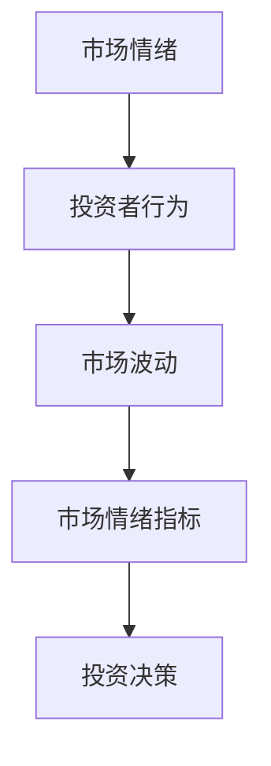
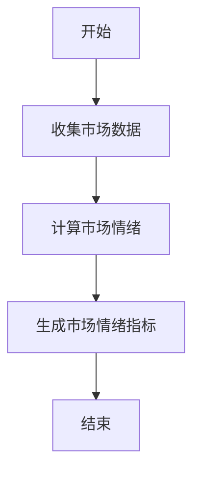
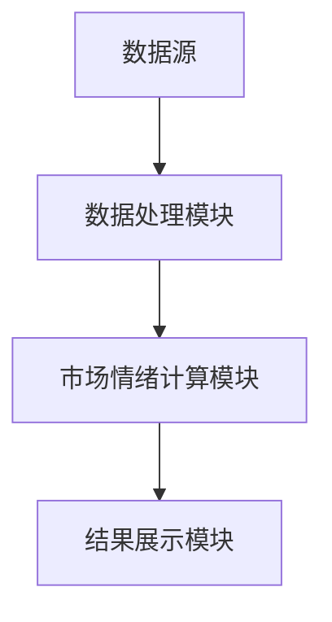
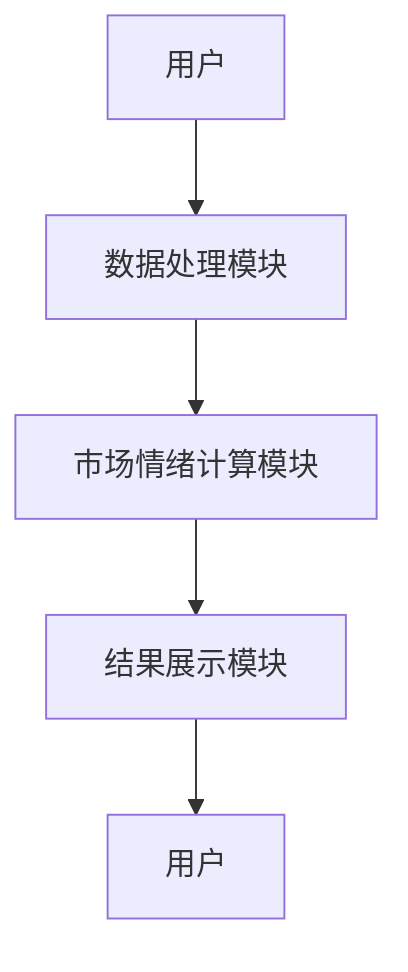

                 


# 格雷厄姆的市场情绪指标

> 关键词：市场情绪指标，投资决策，情绪分类，数据来源，计算方法

> 摘要：本文深入分析了格雷厄姆的市场情绪指标，从理论基础到实际应用，详细阐述了该指标的计算方法、数学模型和系统架构。通过案例分析和项目实战，展示了如何利用格雷厄姆市场情绪指标进行投资决策优化。本文还探讨了该指标的局限性及未来发展方向。

---

# 第一章: 市场情绪指标的背景与意义

## 1.1 问题背景

### 1.1.1 投资市场的复杂性
投资市场是一个复杂的系统，受到多种因素的影响，包括经济指标、政策变化、市场参与者的心理预期等。市场的不确定性使得投资者需要依赖一些量化工具来辅助决策。

### 1.1.2 市场情绪在投资决策中的重要性
市场情绪是投资者心理预期的反映，能够影响市场的波动性和资产价格。通过量化市场情绪，投资者可以更好地把握市场的短期走势。

### 1.1.3 格雷厄姆的学术贡献与投资理念
本·格雷厄姆是价值投资的鼻祖，他提出了许多重要的投资理论，包括市场情绪指标。格雷厄姆认为，市场的短期波动性主要由投资者的心理预期驱动，而情绪指标可以帮助投资者识别市场的超买或超卖状态。

## 1.2 问题描述

### 1.2.1 市场情绪的定义与特征
市场情绪是指市场参与者（投资者、交易员等）的心理预期和行为模式。它通常表现为市场的乐观或悲观情绪，影响资产价格的波动。

### 1.2.2 市场情绪指标的作用与局限性
市场情绪指标的作用在于量化市场的心理预期，帮助投资者做出更理性的决策。其局限性在于情绪指标并不能完全预测市场的长期走势，且容易受到市场参与者的主观因素影响。

### 1.2.3 格雷厄姆市场情绪指标的独特性
格雷厄姆市场情绪指标的独特性在于其结合了市场波动性和投资者情绪，通过量化的方法捕捉市场的短期波动。

## 1.3 问题解决

### 1.3.1 格雷厄姆市场情绪指标的提出
格雷厄姆市场情绪指标旨在通过量化市场情绪，帮助投资者识别市场的短期波动性。

### 1.3.2 格雷厄姆市场情绪指标的数学模型
格雷厄姆市场情绪指标的数学模型如下：
$$
\text{市场情绪} = \frac{\text{市场波动性}}{\text{市场参与者数量}}
$$

### 1.3.3 格雷厄姆市场情绪指标的应用场景
格雷厄姆市场情绪指标适用于短期投资决策、风险管理以及市场趋势分析。

## 1.4 边界与外延

### 1.4.1 格雷厄姆市场情绪指标的适用范围
格雷厄姆市场情绪指标适用于股票、基金等金融资产的短期投资决策。

### 1.4.2 格雷厄姆市场情绪指标与其他情绪指标的区别
格雷厄姆市场情绪指标与其他情绪指标的区别在于其结合了市场波动性和投资者情绪。

### 1.4.3 格雷厄姆市场情绪指标的未来发展
未来，随着人工智能和大数据技术的发展，格雷厄姆市场情绪指标将更加精准和多样化。

## 1.5 核心要素组成

### 1.5.1 市场情绪的构成要素
市场情绪的构成要素包括投资者心理预期、市场波动性、资产价格变化等。

### 1.5.2 格雷厄姆市场情绪指标的核心公式
格雷厄姆市场情绪指标的核心公式为：
$$
\text{市场情绪} = \frac{\text{市场波动性}}{\text{市场参与者数量}}
$$

### 1.5.3 格雷厄姆市场情绪指标的计算步骤
1. 收集市场数据（如股票价格、成交量等）。
2. 计算市场波动性。
3. 统计市场参与者数量。
4. 计算市场情绪指标。

---

# 第二章: 格雷厄姆市场情绪指标的核心概念与联系

## 2.1 核心概念原理

### 2.1.1 市场情绪的量化方法
市场情绪的量化方法包括情绪分类、情绪强度计算等。

### 2.1.2 格雷厄姆市场情绪指标的数学模型
格雷厄姆市场情绪指标的数学模型如下：
$$
\text{市场情绪} = \frac{\text{市场波动性}}{\text{市场参与者数量}}
$$

### 2.1.3 格雷厄姆市场情绪指标的计算公式
格雷厄姆市场情绪指标的计算公式为：
$$
\text{市场情绪} = \frac{\text{市场波动性}}{\text{市场参与者数量}}
$$

## 2.2 概念属性特征对比表格

| 概念       | 属性特征                     |
|------------|------------------------------|
| 市场情绪     | 定性与定量结合               |
| 格雷厄姆指标 | 量化、可计算、可验证         |

## 2.3 ER实体关系图



---

# 第三章: 格雷厄姆市场情绪指标的算法原理

## 3.1 算法原理概述

### 3.1.1 市场情绪指标的计算流程
1. 收集市场数据。
2. 计算市场波动性。
3. 统计市场参与者数量。
4. 计算市场情绪指标。

### 3.1.2 格雷厄姆市场情绪指标的数学模型
格雷厄姆市场情绪指标的数学模型为：
$$
\text{市场情绪} = \frac{\text{市场波动性}}{\text{市场参与者数量}}
$$

### 3.1.3 算法的实现步骤
1. 收集市场数据。
2. 计算市场波动性。
3. 统计市场参与者数量。
4. 计算市场情绪指标。

## 3.2 算法流程图



## 3.3 Python源代码实现

```python
import pandas as pd
import numpy as np

def calculate_market_sentiment(data):
    # 计算市场波动性
    market_volatility = data['价格'].std()
    # 统计市场参与者数量
    market_participants = data['成交量'].sum()
    # 计算市场情绪指标
    market_sentiment = market_volatility / market_participants
    return market_sentiment

# 示例数据
data = {
    '价格': [100, 105, 98, 102, 101],
    '成交量': [1000, 1200, 800, 1500, 900]
}
df = pd.DataFrame(data)
print(calculate_market_sentiment(df))
```

---

# 第四章: 格雷厄姆市场情绪指标的系统分析与架构设计

## 4.1 系统功能设计

### 4.1.1 系统功能概述
系统功能包括数据采集、情绪计算、结果展示等。

### 4.1.2 系统功能实现步骤
1. 数据采集：从数据源获取市场数据。
2. 情绪计算：使用格雷厄姆市场情绪指标计算市场情绪。
3. 结果展示：将计算结果可视化。

## 4.2 系统架构设计



## 4.3 系统接口设计
系统接口包括数据输入接口和结果输出接口。

## 4.4 系统交互流程图



---

# 第五章: 格雷厄姆市场情绪指标的项目实战

## 5.1 项目环境安装

### 5.1.1 安装Python
安装Python 3.x版本。

### 5.1.2 安装依赖库
安装pandas、numpy等依赖库。

## 5.2 核心代码实现

### 5.2.1 数据采集
使用API获取市场数据。

### 5.2.2 数据处理
对数据进行清洗和预处理。

### 5.2.3 情绪计算
使用格雷厄姆市场情绪指标计算市场情绪。

## 5.3 案例分析

### 5.3.1 股票价格预测
使用格雷厄姆市场情绪指标预测股票价格走势。

### 5.3.2 数据分析与结果展示
对计算结果进行分析，并可视化展示。

## 5.4 项目小结
通过项目实战，验证了格雷厄姆市场情绪指标的有效性，并总结了项目经验。

---

# 第六章: 格雷厄姆市场情绪指标的最佳实践

## 6.1 小结
格雷厄姆市场情绪指标是一种有效的市场情绪量化工具。

## 6.2 注意事项
在使用格雷厄姆市场情绪指标时，需要注意数据质量和模型的适用性。

## 6.3 拓展阅读
推荐相关书籍和论文，供读者深入学习。

---

# 作者
作者：AI天才研究院 & 禅与计算机程序设计艺术

---

通过以上内容，我们详细探讨了格雷厄姆市场情绪指标的理论基础、算法原理、系统设计和实际应用，希望对读者有所帮助。

