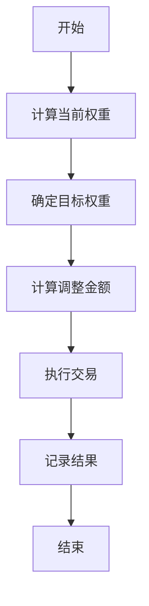
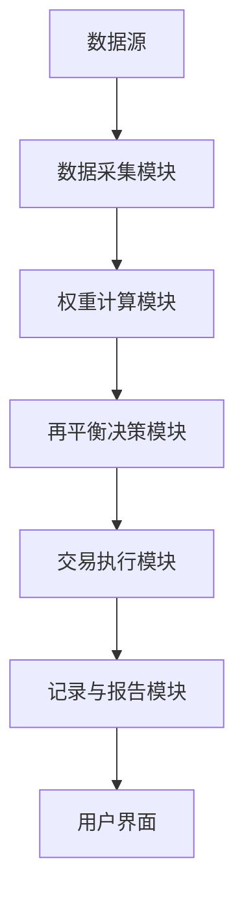

                 


# 格雷厄姆的投资组合再平衡策略

## 关键词
投资组合再平衡，格雷厄姆投资策略，资产配置，风险管理，价值投资，量化投资

## 摘要
本文深入探讨了格雷厄姆的投资组合再平衡策略，分析了其理论基础、数学模型、实施步骤及其在现代投资管理中的应用。通过详细讲解再平衡策略的重要性、实现方法及技术工具，本文为投资者提供了科学的投资管理思路。

---

# 第1章：投资组合再平衡概述

## 1.1 投资组合再平衡的定义与重要性

### 1.1.1 投资组合再平衡的定义
投资组合再平衡是指根据市场变化和个人投资目标的调整，定期或不定期地调整投资组合的资产配置，使其恢复到预定的目标比例。

### 1.1.2 再平衡的重要性与作用
- **分散风险**：通过调整资产配置，降低投资组合的波动性。
- **优化收益**：使投资组合在不同市场环境下保持最优收益风险比。
- **适应市场变化**：及时应对市场波动和投资者风险偏好的变化。

### 1.1.3 再平衡的适用范围与边界
- 适用于所有类型的投资组合，尤其适合长期投资。
- 边界包括市场剧烈波动、投资者风险承受能力变化等。

## 1.2 格雷厄姆的投资理念与再平衡策略

### 1.2.1 格雷厄姆的价值投资理论
- 强调安全边际和长期稳健投资。
- 通过分散投资降低风险。

### 1.2.2 格雷厄姆的再平衡策略
- 通过定期调整投资组合的资产配置，维持目标比例。
- 强调纪律性和系统性，避免情绪化决策。

---

# 第2章：投资组合再平衡的数学模型与算法

## 2.1 投资组合再平衡的数学模型

### 2.1.1 投资组合的权重计算公式
$$w_i = \frac{v_i}{\sum_{j=1}^{n} v_j}$$
其中，$w_i$ 是第i个资产的权重，$v_i$ 是第i个资产的价值，$\sum_{j=1}^{n} v_j$ 是总价值。

### 2.1.2 资产调整金额计算
调整金额 = 目标权重 × 总资产 - 当前权重 × 总资产

## 2.2 再平衡的算法流程

### 2.2.1 算法流程图


---

# 第3章：投资组合再平衡的策略与实施

## 3.1 定期再平衡策略

### 3.1.1 时间间隔选择
- 常见选择：季度、半年、年度。
- 适用于市场环境稳定的情况。

### 3.1.2 实施步骤
1. 计算当前权重。
2. 确定目标权重。
3. 计算调整金额。
4. 执行交易。
5. 记录结果。

## 3.2 动态再平衡策略

### 3.2.1 触发条件
- 市场波动剧烈。
- 个人风险偏好变化。

### 3.2.2 实施步骤
1. 监测市场变化。
2. 评估当前权重偏离目标的情况。
3. 及时调整投资组合。

---

# 第4章：投资组合再平衡的系统架构与实现

## 4.1 系统功能模块

### 4.1.1 数据采集模块
收集市场数据和投资组合信息。

### 4.1.2 权重计算模块
计算当前投资组合的权重。

### 4.1.3 再平衡决策模块
根据模型生成调整建议。

### 4.1.4 交易执行模块
执行具体的买卖操作。

### 4.1.5 记录与报告模块
记录调整结果并生成报告。

## 4.2 系统架构设计

### 4.2.1 系统架构图


---

# 第5章：技术实现与工具应用

## 5.1 现代技术工具

### 5.1.1 量化分析工具
- 使用Python进行数据分析和算法实现。

### 5.1.2 投资组合管理软件
- 使用MPT模型优化投资组合。

## 5.2 Python代码实现

### 5.2.1 投资组合再平衡的Python代码
```python
def calculate_weights(asset_values):
    total = sum(asset_values)
    weights = [v/total for v in asset_values]
    return weights

def rebalance_portfolio(current_weights, target_weights, total_value):
    # 计算调整金额
    adjust_amounts = [target_weights[i] * total_value - current_weights[i] * total_value for i in range(len(target_weights))]
    return adjust_amounts
```

---

# 第6章：实际案例分析与应用

## 6.1 案例分析

### 6.1.1 案例背景
投资者初始投资组合为：股票60%，债券30%，现金10%。

### 6.1.2 市场变化
市场下跌，股票价值下降，现金增加。

### 6.1.3 再平衡操作
调整后，股票50%，债券40%，现金10%。

---

# 第7章：总结与建议

## 7.1 总结
投资组合再平衡是格雷厄姆策略的重要组成部分，帮助投资者在不同市场环境下保持稳健投资。

## 7.2 实践建议
- 定期审查和调整投资组合。
- 使用技术工具辅助决策。
- 遵循纪律，避免情绪化决策。

## 7.3 注意事项
- 考虑交易成本和税务影响。
- 定期评估再平衡策略的有效性。

---

# 作者

作者：AI天才研究院/AI Genius Institute & 禅与计算机程序设计艺术 /Zen And The Art of Computer Programming

