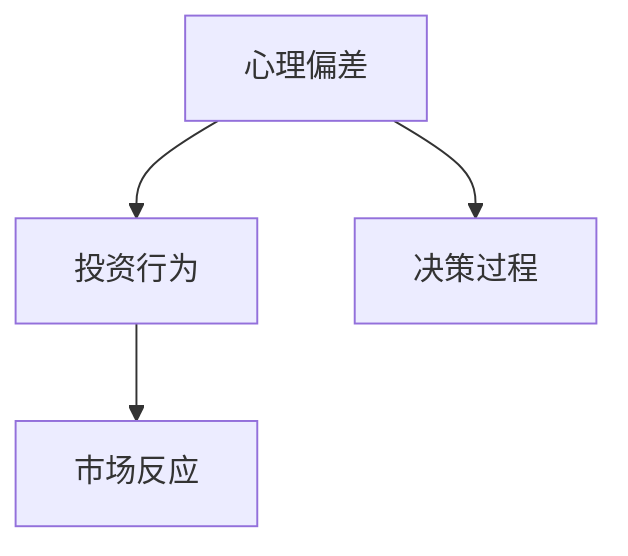
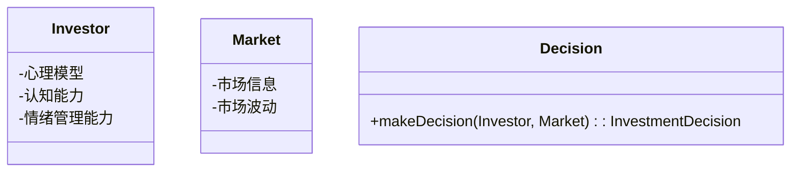
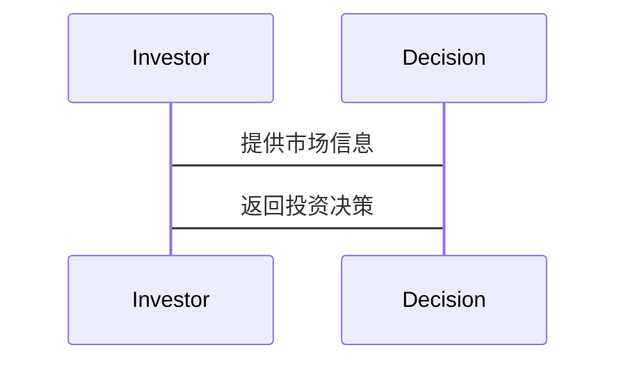

                 


# 《格雷厄姆的投资者心理建设》

---

## 关键词：投资者心理、心理建设、投资决策、心理偏差、风险管理、心理模型

---

## 摘要：

本文深入探讨了投资者心理建设的核心概念、算法原理、系统设计以及实战应用。通过分析投资者常见的心理偏差，如确认偏差和损失厌恶，揭示这些偏差对投资决策的影响。结合概率论、期望值和风险价值等数学模型，阐述了如何通过心理模型和决策算法优化投资策略。最后，通过系统架构设计和实战案例，展示了如何将心理建设应用于实际投资系统中，帮助投资者做出更理性的决策。

---

# 第一部分: 投资者心理建设的背景与重要性

## 第1章: 投资者心理建设概述

### 1.1 投资者心理建设的背景

#### 1.1.1 投资市场的复杂性与不确定性

投资市场是一个高度复杂和不确定的环境，充满了不可预测的变化和风险。投资者在面对市场波动时，往往需要做出快速而复杂的决策。然而，市场的不确定性常常导致投资者的心理状态受到严重影响，例如焦虑、恐惧或贪婪。这些情绪化反应往往会导致错误的决策，从而影响投资结果。

#### 1.1.2 投资者决策中的心理因素

投资者的决策过程不仅仅依赖于理性的分析，心理因素在其中起着至关重要的作用。投资者的信念、态度、认知和情绪都会影响他们的决策。例如，过度自信的投资者可能会忽略潜在的风险，而过于谨慎的投资者可能会错失良机。心理因素的复杂性使得投资者心理建设成为一项重要的研究领域。

#### 1.1.3 心理建设在投资中的作用

心理建设是指通过系统的方法和训练，帮助投资者理解和管理自己的心理状态，从而做出更理性的决策。心理建设能够帮助投资者克服心理偏差，增强风险意识，优化决策过程。通过心理建设，投资者可以更好地应对市场波动，避免情绪化决策，从而提高投资绩效。

### 1.2 问题背景与问题描述

#### 1.2.1 投资者常见的心理偏差

投资者在决策过程中常常会受到各种心理偏差的影响，例如：

- **确认偏差（Confirmation Bias）**：投资者倾向于寻找和关注支持自己已有观点的信息，而忽略或忽视与之相反的证据。

- **损失厌恶（Loss Aversion）**：投资者对损失的厌恶程度远超过对收益的追求，导致他们在面对潜在损失时做出保守决策。

- **过度自信（Overconfidence）**：投资者往往过于相信自己的判断能力，导致他们在决策时忽视潜在风险。

#### 1.2.2 心理偏差对投资决策的影响

心理偏差会直接影响投资者的决策过程，导致以下问题：

- **误判市场趋势**：投资者因为确认偏差，可能会误判市场的实际趋势，从而做出错误的投资决策。

- **错失投资机会**：由于损失厌恶，投资者可能会因为害怕亏损而错失潜在的高收益机会。

- **过度交易**：过度自信的投资者可能会频繁交易，试图通过短期操作获取收益，但结果往往适得其反。

#### 1.2.3 问题解决的必要性

心理偏差的存在使得投资者在决策过程中容易陷入误区。通过心理建设，可以帮助投资者识别和克服这些偏差，从而做出更理性的决策。心理建设的核心在于帮助投资者建立正确的心理模型，优化决策过程，提高投资绩效。

### 1.3 心理建设的核心概念

#### 1.3.1 心理模型的定义与特点

心理模型是指投资者在决策过程中形成的认知框架。一个有效的心理模型能够帮助投资者准确理解市场信息，评估风险和收益，并做出合理的决策。心理模型的特点包括：

- **个体化**：每个投资者的心理模型都是独特的，受到其个人经历、知识和经验的影响。

- **动态性**：心理模型会随着市场环境和投资者经验的变化而不断调整和优化。

- **复杂性**：心理模型涉及多个方面的认知和判断，具有高度的复杂性。

#### 1.3.2 投资者心理建设的目标

投资者心理建设的目标在于帮助投资者：

- **识别和克服心理偏差**：通过心理建设，投资者能够识别出常见的心理偏差，并采取措施加以克服。

- **优化决策过程**：心理建设能够帮助投资者建立更合理的决策流程，提高决策的科学性和有效性。

- **增强风险意识**：通过心理建设，投资者能够更好地理解风险的本质，并在决策过程中充分考虑风险因素。

#### 1.3.3 心理建设的边界与外延

心理建设的边界在于其核心目标是优化投资者的心理状态和决策过程。其外延则包括与心理建设相关的多个领域，例如心理学、行为经济学和金融学等。

### 1.4 心理建设的核心要素

#### 1.4.1 认知能力与决策能力

认知能力是指投资者在信息处理、问题分析和判断推理方面的能力。认知能力的高低直接影响投资者的决策质量。通过心理建设，可以提高投资者的认知能力，从而优化决策过程。

#### 1.4.2 情绪管理与风险控制

情绪管理是心理建设的重要组成部分。投资者需要学会控制自己的情绪，避免因情绪波动而做出错误的决策。风险控制则是情绪管理的延伸，通过合理的风险评估和管理，投资者可以更好地应对市场波动。

#### 1.4.3 长期思维与价值观念

长期思维是指投资者在决策过程中关注长期目标，而不是短期利益。通过心理建设，投资者可以培养长期思维，避免被短期市场波动所干扰。价值观念则是投资者在决策过程中所遵循的核心价值观，正确的价值观念能够帮助投资者做出更理性的决策。

---

## 第2章: 心理偏差与投资行为

### 2.1 心理偏差的定义与分类

心理偏差是指投资者在决策过程中因心理因素影响而产生的认知偏差。常见的心理偏差包括：

- **确认偏差**：投资者倾向于寻找和关注支持自己已有观点的信息。

- **损失厌恶**：投资者对损失的厌恶程度远超过对收益的追求。

- **过度自信**：投资者过于相信自己的判断能力。

### 2.2 心理偏差与投资行为的关系

心理偏差会直接影响投资者的投资行为。例如，确认偏差会导致投资者固守自己的观点，而忽略市场的变化；损失厌恶会导致投资者在面对潜在损失时采取保守策略；过度自信则会导致投资者过度交易。

### 2.3 心理偏差对比分析

#### 2.3.1 不同心理偏差的特征对比

以下是一个对比表格，展示了不同心理偏差的特征：

| 心理偏差   | 特征描述                              |
|------------|--------------------------------------|
| 确认偏差   | 倾向于寻找支持已有观点的信息          |
| 损失厌恶   | 对损失的厌恶程度远超过对收益的追求    |
| 过度自信   | 过度相信自己的判断能力，忽视潜在风险  |

#### 2.3.2 心理偏差的ER实体关系图

以下是心理偏差与投资行为之间的关系图（使用Mermaid）：



---

## 第3章: 心理决策模型与算法

### 3.1 心理决策模型的定义

心理决策模型是指在心理建设的基础上，通过系统的方法和算法，优化投资者的决策过程。心理决策模型的核心在于帮助投资者识别和克服心理偏差，从而做出更理性的决策。

### 3.2 心理决策模型的数学公式

心理决策模型可以通过概率论和期望值进行描述。以下是一个简单的数学模型：

$$ E[X] = \sum_{i=1}^{n} P_i \cdot X_i $$

其中，\( E[X] \) 表示期望值，\( P_i \) 表示事件 \( i \) 的概率，\( X_i \) 表示事件 \( i \) 的收益或损失。

### 3.3 心理决策模型的算法实现

以下是心理决策模型的算法实现示例（Python代码）：

```python
def calculate_expected_value(probabilities, values):
    expected_value = sum(p * v for p, v in zip(probabilities, values))
    return expected_value

probabilities = [0.3, 0.4, 0.2, 0.1]
values = [100, 50, -20, -50]

expected_value = calculate_expected_value(probabilities, values)
print(f"Expected Value: {expected_value}")
```

---

## 第4章: 系统分析与架构设计

### 4.1 问题场景介绍

在实际投资过程中，投资者需要面对复杂多变的市场环境和各种心理挑战。通过心理建设，投资者可以更好地应对这些挑战，优化决策过程。

### 4.2 系统功能设计

以下是系统功能设计的领域模型（Mermaid类图）：



### 4.3 系统架构设计

以下是系统架构设计的Mermaid图：


### 4.4 系统接口设计

系统接口设计包括投资者与系统之间的交互，例如：

- 投资者输入市场信息
- 系统输出投资建议

### 4.5 系统交互设计

以下是系统交互的Mermaid序列图：



---

## 第5章: 项目实战

### 5.1 环境安装

要运行以下代码，需要安装Python和相关库。

```bash
pip install numpy
```

### 5.2 系统核心实现源代码

以下是心理决策模型的实现代码：

```python
import numpy as np

def calculate_risk_value(returns, probabilities):
    return np.dot(returns, probabilities)

returns = [0.2, 0.1, -0.1, -0.2]
probabilities = [0.2, 0.3, 0.3, 0.2]

risk_value = calculate_risk_value(returns, probabilities)
print(f"Risk Value: {risk_value}")
```

### 5.3 代码应用解读与分析

上述代码计算了投资组合的风险价值（VaR）。通过概率和收益的乘积之和，我们可以评估投资组合的风险。

### 5.4 实际案例分析

假设一个投资者有以下四个投资选项：

- 投资A：收益率20%，概率20%
- 投资B：收益率10%，概率30%
- 投资C：收益率-10%，概率30%
- 投资D：收益率-20%，概率20%

通过计算风险价值，我们可以评估这些投资的总体风险。

### 5.5 项目小结

通过项目实战，我们可以看到心理决策模型在实际投资中的应用价值。通过计算风险价值，投资者可以更好地理解投资风险，并做出更理性的决策。

---

## 第6章: 最佳实践与小结

### 6.1 小结

本文深入探讨了投资者心理建设的核心概念、算法原理、系统设计和实战应用。通过分析心理偏差对投资行为的影响，结合数学模型和算法，帮助投资者优化决策过程。

### 6.2 注意事项

投资者在实际应用中需要注意以下几点：

- **心理模型的个体化**：心理模型因人而异，投资者需要根据自身特点调整心理模型。

- **持续学习与优化**：心理建设是一个持续的过程，投资者需要不断学习和优化自己的心理模型。

- **结合实际市场环境**：心理决策模型需要结合实际市场环境进行调整和优化。

### 6.3 拓展阅读

以下是一些拓展阅读资料：

- 《投资学》
- 《行为经济学》
- 《风险管理》

---

## 作者：AI天才研究院/AI Genius Institute & 禅与计算机程序设计艺术 /Zen And The Art of Computer Programming

---

通过本文的详细分析，我们可以看到投资者心理建设在投资决策中的重要性。通过识别和克服心理偏差，优化决策过程，投资者可以更好地应对市场波动，实现长期投资目标。

