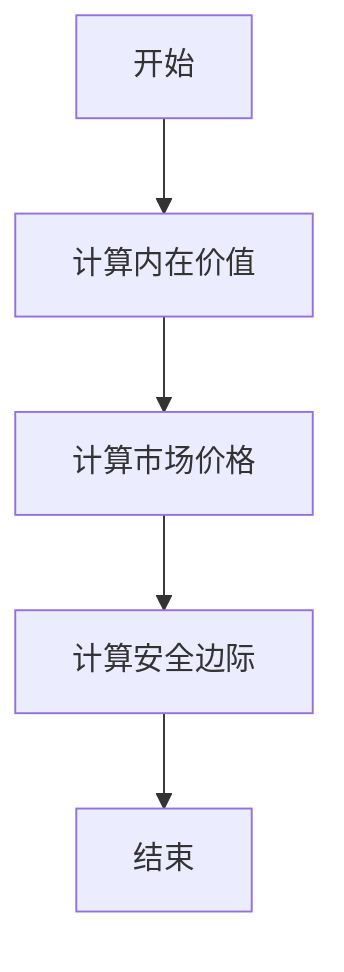
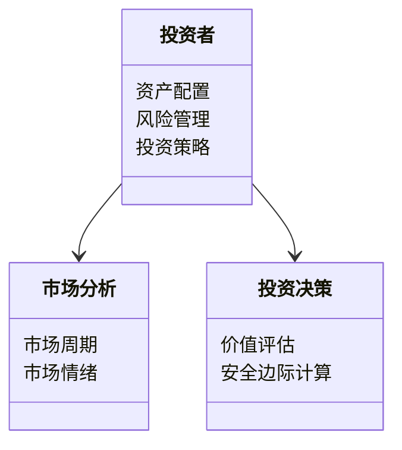
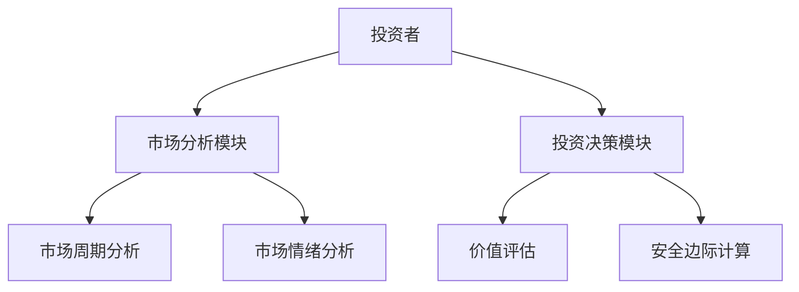
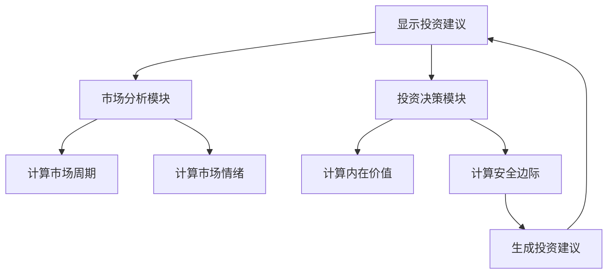

                 


# 格雷厄姆的投资者教育理念

## 关键词
- 格雷厄姆
- 投资者教育
- 价值投资
- 安全边际
- 投资策略

## 摘要
本篇文章深入探讨了格雷厄姆的投资者教育理念，从其核心思想、价值投资理论到具体的投资策略，系统地分析了格雷厄姆的投资哲学。通过结合数学模型、系统架构和实际案例，文章详细阐述了格雷厄姆的安全边际理论、市场周期分析、资产配置原则等关键概念，为投资者提供了实用的指导。

---

# 第一部分：格雷厄姆的投资者教育理念概述

## 第1章：投资者的基石：格雷厄姆的教育理念

### 1.1 格雷厄姆的生平与贡献

#### 1.1.1 格雷厄姆的生平简介
本章节将介绍格雷厄姆的生平及其在投资领域的贡献。通过分析格雷厄姆的成长经历，读者可以理解其投资哲学的形成背景。

#### 1.1.2 格雷厄姆对投资学的贡献
格雷厄姆被誉为“价值投资之父”，他的著作和理论对现代投资学产生了深远影响。本节将详细探讨格雷厄姆的主要贡献。

#### 1.1.3 格雷厄姆教育理念的核心思想
格雷厄姆不仅是一位成功的投资者，也是一位杰出的教育家。本节将总结其教育理念的核心思想。

### 1.2 格雷厄姆的投资者教育理念

#### 1.2.1 投资者的心理与行为
投资者的心理和行为是影响投资决策的关键因素。本节将分析格雷厄姆对投资者心理的深刻洞察。

#### 1.2.2 格雷厄姆的安全边际理论
安全边际是格雷厄姆投资理论的核心概念之一。本节将详细解释安全边际的定义、计算方法及其在投资决策中的应用。

#### 1.2.3 长期投资与价值投资的结合
格雷厄姆倡导长期投资与价值投资相结合的投资策略。本节将探讨这种策略的优势和实施方法。

## 第2章：格雷厄姆的投资哲学

### 2.1 格雷厄姆的价值投资理论

#### 2.1.1 价值投资的定义与特点
本节将定义价值投资并分析其特点，包括其与成长投资的对比。

#### 2.1.2 格雷厄姆的价值投资框架
格雷厄姆的价值投资框架包括哪些关键要素？本节将详细阐述。

#### 2.1.3 价值投资与成长投资的对比
通过对比分析，读者可以更好地理解价值投资的优势和适用场景。

### 2.2 格雷厄姆的安全边际概念

#### 2.2.1 安全边际的定义
安全边际是如何定义的？本节将给出明确的定义。

#### 2.2.2 安全边际的计算方法
通过公式和实例，本节将详细讲解安全边际的计算方法。

#### 2.2.3 安全边际在投资决策中的应用
安全边际如何帮助投资者做出更明智的投资决策？本节将提供具体的应用场景。

## 第3章：格雷厄姆的市场观

### 3.1 格雷厄姆的市场周期理论

#### 3.1.1 市场周期的定义与阶段划分
本节将定义市场周期并分析其阶段划分。

#### 3.1.2 格雷厄姆对市场周期的分析
通过实例分析，本节将展示格雷厄姆如何分析市场周期。

#### 3.1.3 市场周期对投资策略的影响
市场周期如何影响投资策略？本节将给出具体的策略调整建议。

### 3.2 格雷厄姆的市场心理分析

#### 3.2.1 投资者心理的波动性
本节将探讨投资者心理的波动性及其对市场的影响。

#### 3.2.2 市场情绪与投资决策的关系
市场情绪如何影响投资决策？本节将提供深刻的分析。

#### 3.2.3 格雷厄姆对市场心理的洞察
通过格雷厄姆的视角，本节将提供独特的市场心理分析。

## 第4章：格雷厄姆的投资策略

### 4.1 格雷厄姆的防御性投资策略

#### 4.1.1 防御性投资的定义与特点
本节将定义防御性投资并分析其特点。

#### 4.1.2 防御性投资的核心原则
格雷厄姆的防御性投资有哪些核心原则？本节将详细阐述。

#### 4.1.3 防御性投资的实施步骤
通过具体的步骤，本节将指导读者如何实施防御性投资策略。

### 4.2 格雷厄姆的进攻性投资策略

#### 4.2.1 进攻性投资的定义与特点
本节将定义进攻性投资并分析其特点。

#### 4.2.2 进攻性投资的风险与收益
进攻性投资的风险与收益如何平衡？本节将给出具体的策略建议。

#### 4.2.3 进攻性投资的适用场景
在什么情况下适合采用进攻性投资？本节将提供具体的适用场景分析。

## 第5章：格雷厄姆的资产配置与风险管理

### 5.1 格雷厄姆的资产配置理论

#### 5.1.1 资产配置的定义与重要性
本节将定义资产配置并分析其重要性。

#### 5.1.2 格雷厄姆的资产配置原则
格雷厄姆有哪些独特的资产配置原则？本节将详细阐述。

#### 5.1.3 资产配置的动态调整
如何根据市场变化动态调整资产配置？本节将提供具体的调整策略。

### 5.2 格雷厄姆的风险管理策略

#### 5.2.1 风险管理的定义与作用
本节将定义风险管理并分析其在投资中的作用。

#### 5.2.2 格雷厄姆的风险控制方法
格雷厄姆有哪些独特的风险控制方法？本节将详细讲解。

#### 5.2.3 风险管理在投资组合中的应用
如何在投资组合中应用风险管理策略？本节将提供具体的实施建议。

## 第6章：格雷厄姆的长期投资策略

### 6.1 长期投资的核心理念

#### 6.1.1 长期投资的定义与优势
本节将定义长期投资并分析其优势。

#### 6.1.2 格雷厄姆对长期投资的诠释
通过格雷厄姆的视角，本节将诠释长期投资的深层含义。

#### 6.1.3 长期投资的实施步骤
如何实施长期投资策略？本节将提供具体的步骤指导。

---

# 第二部分：格雷厄姆投资理念的系统分析

## 第7章：安全边际的数学模型与算法实现

### 7.1 安全边际的数学模型

#### 7.1.1 安全边际的定义公式
$$\text{安全边际} = \text{市场价格} - \text{内在价值}$$

#### 7.1.2 内在价值的计算公式
$$\text{内在价值} = \frac{\text{每股收益} \times (1 + g)}{r - g}$$
其中，$g$ 是增长率，$r$ 是期望回报率。

#### 7.1.3 安全边际的计算步骤
1. 计算目标公司的内在价值。
2. 比较市场价格与内在价值。
3. 确定安全边际的大小。

### 7.2 安全边际的算法实现

#### 7.2.1 Python代码实现
```python
def calculate_margin_of_safety(price, intrinsic_value):
    return price - intrinsic_value

# 示例计算
price = 50
intrinsic_value = 40
margin_of_safety = calculate_margin_of_safety(price, intrinsic_value)
print(f"安全边际为: {margin_of_safety}")
```

#### 7.2.2 算法流程图


## 第8章：价值投资的系统架构设计

### 8.1 系统功能设计

#### 8.1.1 领域模型


#### 8.1.2 系统架构


### 8.2 系统接口设计

#### 8.2.1 接口定义
- 输入：市场数据、公司财务数据
- 输出：安全边际、投资建议

#### 8.2.2 接口实现
```python
def get_market_data(company):
    # 获取市场数据
    pass

def calculate_intrinsic_value(company):
    # 计算内在价值
    pass
```

### 8.3 系统交互流程图



## 第9章：投资策略的项目实战

### 9.1 环境安装

#### 9.1.1 安装Python
```bash
python --version
pip install --upgrade pip
```

#### 9.1.2 安装必要的库
```bash
pip install pandas numpy matplotlib
```

### 9.2 核心实现

#### 9.2.1 计算内在价值
```python
import pandas as pd

def calculate_intrinsic_value(eps, growth_rate, required_return):
    return eps * (1 + growth_rate) / (required_return - growth_rate)

# 示例
eps = 5
growth_rate = 0.05
required_return = 0.10
intrinsic_value = calculate_intrinsic_value(eps, growth_rate, required_return)
print(f"内在价值为: {intrinsic_value}")
```

#### 9.2.2 计算安全边际
```python
def calculate_margin_of_safety(price, intrinsic_value):
    return price - intrinsic_value

price = 60
intrinsic_value = 50
margin_of_safety = calculate_margin_of_safety(price, intrinsic_value)
print(f"安全边际为: {margin_of_safety}")
```

### 9.3 实际案例分析

#### 9.3.1 案例背景
分析某公司的内在价值和安全边际。

#### 9.3.2 数据分析
使用Python进行数据处理和可视化。

#### 9.3.3 投资决策
基于分析结果，制定投资策略。

---

# 第三部分：总结与展望

## 第10章：格雷厄姆教育理念的总结与展望

### 10.1 核心观点总结

#### 10.1.1 价值投资的核心
价值投资的核心在于寻找被市场低估的企业。

#### 10.1.2 安全边际的重要性
安全边际是保护投资者免受市场波动影响的关键。

#### 10.1.3 长期投资的优势
长期投资能够帮助投资者规避短期市场波动，实现财富的稳步增长。

### 10.2 未来展望

#### 10.2.1 数字化投资工具的发展
随着技术的进步，数字化投资工具将更加普及。

#### 10.2.2 价值投资的演变
价值投资的理论和实践将不断创新，适应新的市场环境。

#### 10.2.3 教育理念的传承
格雷厄姆的教育理念将继续影响未来的投资者。

---

# 结语

格雷厄姆的投资者教育理念为现代投资学奠定了坚实的基础。通过本文的深入分析，读者可以更好地理解格雷厄姆的投资哲学，并将其应用于实际投资实践中。希望本文能为投资者提供有价值的指导和启发。

---

# 作者

作者：AI天才研究院/AI Genius Institute & 禅与计算机程序设计艺术 /Zen And The Art of Computer Programming

