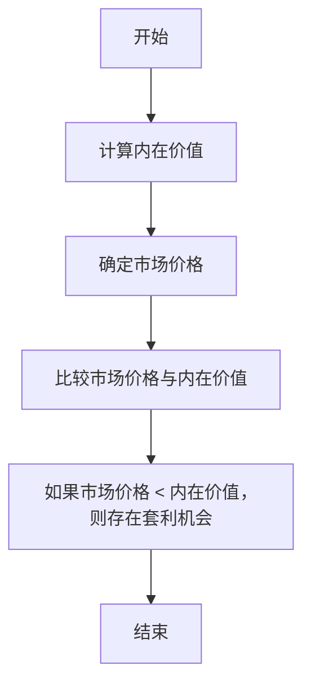
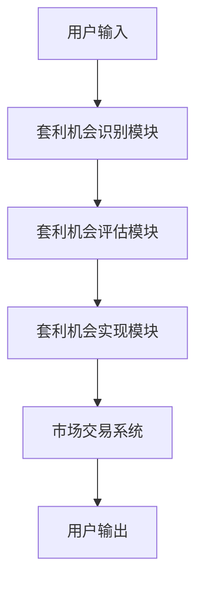

                 


# 格雷厄姆的特殊情况投资：现代市场中的套利机会

> **关键词**：格雷厄姆，特殊情况投资，套利机会，现代市场，投资策略

> **摘要**：本文深入探讨了格雷厄姆的特殊情况投资策略在现代市场中的应用，结合数学模型和实际案例，分析了套利机会的识别、评估和实现过程，提出了系统化的解决方案。

---

# 第一部分：引言

## 第1章：引言：特殊情况投资与套利机会

### 1.1 格雷厄姆的投资理念

格雷厄姆是价值投资的先驱，他提出的投资理念以基本面分析和安全边际为核心。在特殊情况投资中，格雷厄姆强调寻找市场价格偏离内在价值的机会，通过套利策略实现超额收益。

### 1.2 套利机会的定义与分类

套利机会是指在不同市场或时间点上，由于信息不对称或市场 inefficiency，同一资产的市场价格存在差异，投资者通过买入低价资产并卖出高价资产来获利的机会。

### 1.3 现代市场中的特殊情况投资

在现代市场中，套利机会仍然存在，但由于市场的高效性和信息传播速度的提升，套利机会的窗口期越来越短。格雷厄姆的特殊情况投资策略在现代市场中需要结合技术分析和算法交易来实现。

---

## 第2章：特殊情况投资的核心概念与数学模型

### 2.1 核心概念与原理

格雷厄姆的特殊情况投资基于以下几个核心概念：
1. **内在价值**：资产的真实价值，与市场价格可能存在差异。
2. **套利机会**：市场价格与内在价值之间的差异。
3. **安全边际**：买入价格低于内在价值，确保投资的安全性。

### 2.2 核心概念对比表

| 核心概念       | 定义                                                                 |
|----------------|--------------------------------------------------------------------|
| 内在价值       | 资产的真实价值，通过基本面分析确定。                                  |
| 市场价格       | 资产在市场上的交易价格。                                              |
| 套利机会       | 市场价格与内在价值之间的差异，提供套利空间。                          |

### 2.3 格雷厄姆特殊情况投资的算法原理

以下是套利机会识别的算法流程图：



---

## 第3章：现代市场中的套利机会分析

### 3.1 现代市场中的套利机会类型

1. **跨市场套利**：利用不同市场之间的价格差异进行套利。
2. **跨期套利**：利用同一资产在不同时间点的价格差异进行套利。
3. **股权套利**：利用同一公司股票在不同市场或不同交易时间的价格差异进行套利。

### 3.2 现代市场中的套利风险

套利风险主要包括市场风险、流动性风险和操作风险。以下是风险度量的公式：

$$
\text{风险值} = \sqrt{\text{市场价格波动率}^2 + \text{流动性风险}^2}
$$

### 3.3 套利机会的定价模型

套利定价模型（APT）是套利机会定价的核心工具。以下是APT的公式：

$$
E(r_i) = \beta_i \cdot E(r_m) + \alpha_i
$$

其中，$E(r_i)$ 是资产 $i$ 的预期收益，$\beta_i$ 是资产 $i$ 的 beta 系数，$E(r_m)$ 是市场预期收益，$\alpha_i$ 是资产 $i$ 的特异风险溢价。

---

## 第4章：特殊情况投资的系统分析与架构设计

### 4.1 系统分析与设计

以下是系统架构图：


### 4.2 系统接口与交互设计

以下是系统交互流程图：



---

## 第5章：特殊情况投资的项目实战

### 5.1 项目环境安装与配置

以下是项目环境安装步骤：

1. 安装Python和相关库（如NumPy、Pandas、Matplotlib）。
2. 安装交易 API（如Interactive Brokers）。
3. 配置数据库（如MySQL）用于存储市场数据。

### 5.2 核心系统实现

以下是套利机会识别算法的Python代码：

```python
import numpy as np

def calculate_intrinsic_value(asset_data):
    # 计算内在价值
    return asset_data.mean() * 0.9

def is_arbitrage_opportunity(calculated_intrinsic_value, market_price):
    # 判断是否存在套利机会
    return calculated_intrinsic_value < market_price

# 示例数据
asset_data = np.array([100, 101, 99, 102, 100])
market_price = 101

intrinsic_value = calculate_intrinsic_value(asset_data)
arbitrage_opportunity = is_arbitrage_opportunity(intrinsic_value, market_price)

print(f"内在价值：{intrinsic_value}")
print(f"是否存在套利机会：{arbitrage_opportunity}")
```

---

## 第6章：案例分析与实战解读

### 6.1 案例分析

假设某股票在A市场报价为$100，而在B市场报价为$98。根据格雷厄姆的策略，如果股票的内在价值为$99，则存在套利机会，买入B市场的股票并卖出A市场的股票。

### 6.2 代码应用解读与分析

以上代码通过计算资产的内在价值并与市场价格进行比较，判断是否存在套利机会。代码简单明了，但实际应用中需要考虑更多的因素，如交易成本和市场风险。

---

## 第7章：总结与展望

### 7.1 总结

格雷厄姆的特殊情况投资策略在现代市场中仍然具有重要的应用价值。通过结合数学模型和算法交易，投资者可以更高效地识别和利用套利机会。

### 7.2 未来展望

随着人工智能和大数据技术的发展，套利机会的识别和评估将更加精准和快速。未来的研究方向包括算法优化和风险管理。

---

## 作者

作者：AI天才研究院/AI Genius Institute & 禅与计算机程序设计艺术 /Zen And The Art of Computer Programming

