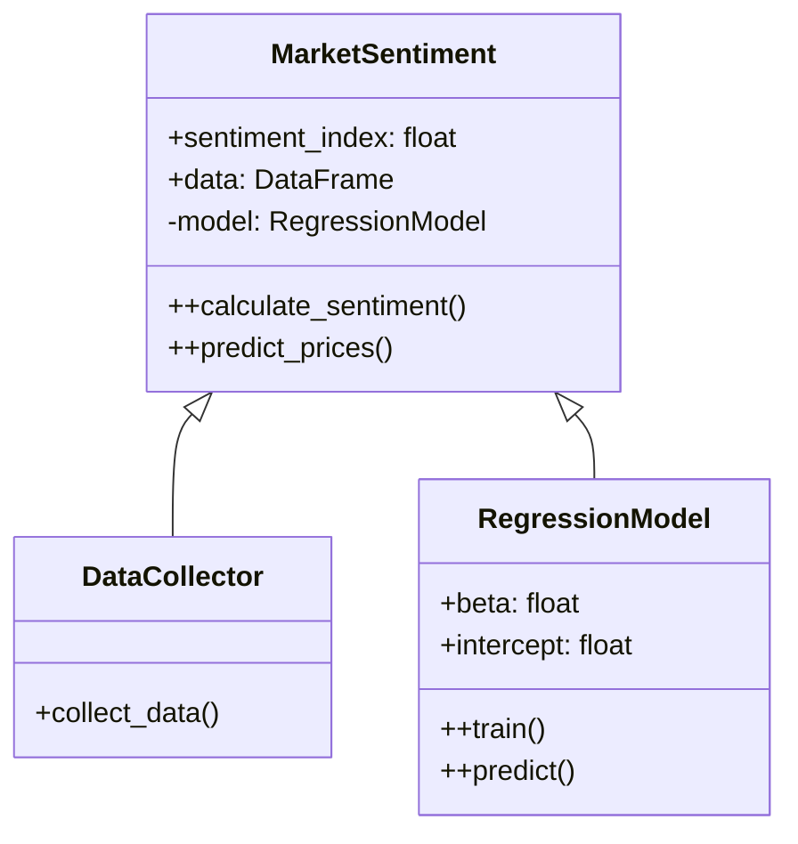

                 


# 格雷厄姆的股价与价值关系：市场先生的情绪

---

## 关键词：  
- 价值投资  
- 市场情绪  
- 股价波动  
- 格雷厄姆  
- 投资策略  
- 安全边际  

---

## 摘要：  
本文深入探讨了格雷厄姆的价值投资理论与市场情绪的关系，分析了市场情绪如何影响股价波动，并结合实际案例，展示了如何通过市场情绪分析在投资中寻找安全边际。文章从背景介绍、核心概念、算法原理、系统架构、项目实战等多方面展开，为投资者提供了全面的理论支持和实践指导。

---

## 正文：  

### 第1章：背景介绍  

#### 1.1 价值投资的起源与发展  
价值投资是一种以基本面分析为基础的投资策略，起源于20世纪初。本杰明·格雷厄姆是该领域的先驱，他提出了“安全边际”概念，强调以低于内在价值的价格买入资产。  

#### 1.2 市场情绪与股价波动  
市场情绪是指投资者在市场中的心理状态，通常由贪婪和恐惧驱动。市场情绪的波动会导致股价偏离其内在价值，从而为价值投资者提供了获利的机会。  

---

### 第2章：核心概念与联系  

#### 2.1 核心概念的定义与属性  
| 概念         | 定义                                                                 | 属性               |
|--------------|----------------------------------------------------------------------|--------------------|
| 市场情绪     | 投资者对市场的看法和预期，通常由贪婪和恐惧驱动。                   | 波动性、周期性、传染性 |
| 股价波动     | 股票价格的短期变化，通常受市场情绪影响。                          | 不可预测性、非线性 |
| 内在价值     | 股票基于基本面分析的合理价格。                                     | 稳定性、可计算性     |

#### 2.2 市场情绪与股价波动的关系  
市场情绪是股价波动的主要驱动力之一。当市场情绪高涨时，股价可能被高估；当市场情绪低落时，股价可能被低估。  

#### 2.3 格雷厄姆的“市场先生”理论  
格雷厄姆将市场情绪比作“市场先生”，认为投资者应忽视短期波动，专注于长期价值。  

---

### 第3章：算法原理与实践  

#### 3.1 市场情绪的量化指标  
常用的市场情绪指标包括：  
1. **恐慌指数（VIX）**：衡量市场波动性的指标。  
2. **情绪指数**：基于投资者行为数据计算的指标。  

#### 3.2 市场情绪分析的数学模型  
##### 3.2.1 情绪指数计算模型  
$$ \text{情绪指数} = \frac{\text{上涨股票数量} - \text{下跌股票数量}}{\text{总股票数量}} $$  

##### 3.2.2 市场情绪与股价关系的回归模型  
$$ \text{股价} = \beta \times \text{情绪指数} + \epsilon $$  

##### 3.2.3 代码实现  
```python
import pandas as pd
import numpy as np

# 示例数据：假设我们有股票价格和情绪指数
data = pd.DataFrame({
    'price': [100, 105, 98, 102, 101],
    'sentiment_index': [20, 25, 18, 22, 21]
})

# 计算回归系数
beta = np.cov(data['price'], data['sentiment_index'])[0, 1] / np.var(data['sentiment_index'])

# 输出结果
print(f"回归系数 beta = {beta}")
```

---

### 第4章：系统分析与架构设计  

#### 4.1 系统功能设计  
##### 4.1.1 领域模型（Mermaid 类图）  


##### 4.1.2 系统架构（Mermaid 架构图）  
```mermaid
container Market Sentiment Analysis System {
    DataCollector
    MarketSentiment
    RegressionModel
}
```

---

### 第5章：项目实战  

#### 5.1 环境安装  
- 安装Python和相关库：`pip install pandas numpy scikit-learn`  

#### 5.2 核心功能实现  
##### 5.2.1 数据采集  
```python
import pandas as pd
from sklearn.linear_model import LinearRegression

# 数据采集
def collect_data():
    # 示例数据
    data = pd.DataFrame({
        'date': ['2023-01-01', '2023-01-02', '2023-01-03', '2023-01-04', '2023-01-05'],
        'price': [100, 105, 98, 102, 101],
        'sentiment': [20, 25, 18, 22, 21]
    })
    return data

data = collect_data()
print(data)
```

##### 5.2.2 情绪指数预测  
```python
# 情绪指数预测
model = LinearRegression()
model.fit(data[['sentiment']], data['price'])
print(f"回归系数 beta = {model.coef_[0]}")
print(f"截距 intercept = {model.intercept_}")
```

---

### 第6章：小结与注意事项  

#### 6.1 小结  
本文通过分析市场情绪与股价波动的关系，展示了如何利用格雷厄姆的价值投资理论在实际投资中寻找安全边际。通过量化市场情绪和构建分析系统，投资者可以更好地应对市场波动。  

#### 6.2 注意事项  
1. 投资需谨慎，市场情绪仅是参考指标，需结合基本面分析。  
2. 数据质量和模型选择对结果影响重大，需谨慎处理。  
3. 长期投资需坚持价值理念，避免被短期情绪左右。  

---

## 作者：  
AI天才研究院/AI Genius Institute  
禅与计算机程序设计艺术 /Zen And The Art of Computer Programming

