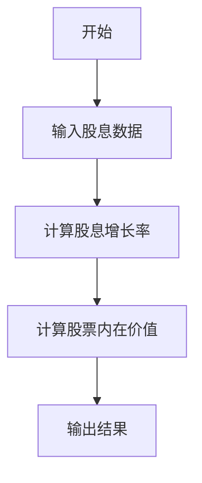
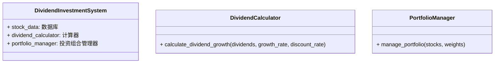

                 


# 格雷厄姆的股息投资理念：稳定现金流的重要性

## 关键词：价值投资、股息率、股息增长模型、现金流、投资策略、稳定收益

## 摘要：本文深入探讨了格雷厄姆的股息投资理念，分析了稳定现金流在投资中的重要性。通过详细讲解股息投资的核心概念、算法原理、系统架构和实际案例，帮助读者理解如何通过股息投资实现长期稳定的收益。文章还提供了股息增长模型的数学公式和Python代码实现，帮助读者掌握格雷厄姆的投资策略，并在实际投资中应用。

---

## 第1章: 格雷厄姆的股息投资理念概述

### 1.1 格雷厄姆的生平与投资思想

格雷厄姆是价值投资的鼻祖，他的投资理念深刻影响了现代投资理论。他出生于1897年，曾在哥伦比亚大学教授金融课程，并在华尔街积累了丰富的投资经验。格雷厄姆的投资哲学强调安全边际和长期稳定收益，他主张通过分析企业的内在价值来选择投资标的。

**问题背景**：在20世纪初，传统投资理论主要关注市场波动和短期收益，而格雷厄姆提出了一种基于企业基本面分析的投资方法。他认为，投资者应关注企业的股息支付能力，而非单纯的股价波动。

**问题解决**：格雷厄姆提出的价值投资理念，特别是股息投资策略，为投资者提供了一种稳定获得收益的方法。他强调选择那些具有稳定股息支付能力和良好财务状况的企业进行投资。

**边界与外延**：股息投资的边界在于企业必须具备稳定的股息支付能力，而外延则包括股息增长模型、股息率分析等具体方法。

**核心要素**：股息投资的核心要素包括股息支付率、股息增长率、股息率和企业内在价值。

---

### 1.2 股息投资的基本概念

**股息的定义与分类**：股息是公司分配给股东的利润部分，通常以现金或股票形式支付。股息可以分为普通股息、特别股息和股票股息等类型。

**股息投资的核心要素**：股息投资的核心要素包括股息支付率、股息增长率、股息率和企业内在价值。

**股息投资的目标与意义**：股息投资的目标是通过选择具有稳定股息支付能力的企业，实现长期稳定的收益。其意义在于，股息投资能够为投资者提供稳定的现金流，降低投资风险。

---

## 第2章: 股息投资的核心概念与联系

### 2.1 股息投资的核心原理

**股息支付率的计算公式**：股息支付率 = (股息总额 / 净利润) × 100%

**股息增长模型的数学表达**：股息增长模型的公式为：

$$ V = \frac{D_1}{r - g} $$

其中，V是股票的内在价值，D1是下一年度的股息，r是折现率，g是股息增长率。

**股息与股票价值的关系**：股息是股票价值的重要组成部分，稳定的股息支付能力能够提升股票的内在价值。

---

### 2.2 核心概念对比分析

**股息投资与资本增值的对比**：股息投资注重稳定的现金流，资本增值注重股价的上涨。

**股息率与市盈率的对比**：股息率是股息与股价的比率，市盈率是股价与每股收益的比率。

**股息支付率与股息增长的对比**：股息支付率反映企业股息支付能力，股息增长反映企业股息增长能力。

---

## 第3章: 股息投资的算法原理

### 3.1 股息增长模型的算法流程



### 3.2 股息增长模型的Python实现

```python
def dividend_growth_model(dividends, growth_rate, discount_rate):
    return dividends * (1 + growth_rate) / (discount_rate - growth_rate)
```

**数学模型和公式**：股息增长模型的公式为：

$$ V = \frac{D_1}{r - g} $$

其中，D1是下一年度的股息，r是折现率，g是股息增长率。

---

## 第4章: 系统分析与架构设计方案

### 4.1 问题场景介绍

股息投资需要一个稳定可靠的系统来支持数据分析和投资决策。系统需要能够处理大量数据，进行复杂的计算，并提供直观的可视化结果。

### 4.2 系统功能设计



### 4.3 系统架构设计


---

## 第5章: 项目实战

### 5.1 环境安装

需要安装Python和相关库，如pandas、numpy、matplotlib等。

### 5.2 核心代码实现

```python
import pandas as pd
import numpy as np

def calculate_dividend_growth(dividends, growth_rate, discount_rate):
    return dividends * (1 + growth_rate) / (discount_rate - growth_rate)

data = pd.read_csv('stock_data.csv')
dividends = data['dividends'].values
growth_rate = 0.05
discount_rate = 0.10

intrinsic_value = calculate_dividend_growth(dividends, growth_rate, discount_rate)
print(intrinsic_value)
```

### 5.3 实际案例分析

以某公司为例，假设其股息为2元，股息增长率为5%，折现率为10%，则其内在价值为：

$$ V = \frac{2 \times (1 + 0.05)}{0.10 - 0.05} = 44元 $$

---

## 第6章: 注意事项与最佳实践

### 6.1 注意事项

- 选择具有稳定股息支付能力和良好财务状况的企业。
- 注意市场波动和宏观经济因素的影响。
- 定期调整投资组合以应对变化。

### 6.2 小结

股息投资是一种长期稳定的收益策略，通过选择具有稳定股息支付能力和良好财务状况的企业，投资者可以实现长期稳定的收益。

### 6.3 注意事项

- 风险提示：股息投资并非无风险，需关注企业财务状况和市场波动。
- 操作指南：投资者应根据自身风险承受能力和投资目标选择合适的企业和股息率。

### 6.4 拓展阅读

- 格雷厄姆的《证券分析》
- 现代投资组合理论

---

## 作者：AI天才研究院/AI Genius Institute & 禅与计算机程序设计艺术/Zen And The Art of Computer Programming

