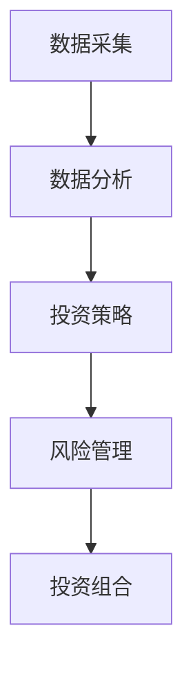

                 


# 格雷厄姆的股息投资策略：稳定收入的来源

## 关键词：股息投资，格雷厄姆，股息率，内在价值，风险管理

## 摘要

格雷厄姆的股息投资策略是一种追求长期稳定收益的投资方法，通过选择高股息率且具备良好基本面的股票，构建一个风险可控、收益稳定的投资组合。本文详细介绍了格雷厄姆的投资理念、选股标准、风险管理策略，以及如何通过系统架构和实战案例实现股息投资的目标。文章从理论到实践，全面解析了格雷厄姆的股息投资策略，为投资者提供了实用的指导。

---

## 第1章 股息投资的背景与概念

### 1.1 投资的基本概念

#### 1.1.1 投资的定义与分类

- **投资的定义**：将资金投入某一领域，以期在未来获得收益或资本增值的行为。
- **分类**：包括股票、债券、基金、房地产等多种形式。

#### 1.1.2 股票投资的基本原理

- **股票的定义**：代表公司所有权的凭证，投资者通过持有股票成为公司股东，享有分红和增值收益。
- **股票投资的核心目标**：通过买入低估值股票，长期持有，获得股息和资本增值。

#### 1.1.3 股息的定义与作用

- **股息的定义**：公司分配给股东的利润部分，通常以现金或股票形式发放。
- **股息的作用**：为投资者提供稳定的收入来源，增强股票的流动性。

### 1.2 股息投资的重要性

#### 1.2.1 股息投资的优势

- **稳定的收入来源**：股息收入不受市场波动的影响，提供持续的现金流。
- **复利效应**：通过股息再投资，实现财富的长期增长。

#### 1.2.2 股息投资的风险与收益

- **风险**：市场波动可能导致股价下跌，影响股息收入。
- **收益**：长期来看，股息投资的收益相对稳定且可观。

#### 1.2.3 股息投资的长期稳定性

- **长期持有**：通过长期持有优质股票，降低短期波动的影响。
- **价值投资**：选择具有持续盈利能力的公司，确保股息来源的稳定性。

### 1.3 格雷厄姆的生平与投资理念

#### 1.3.1 格雷厄姆的生平简介

- **本杰明·格雷厄姆**：20世纪著名投资家，价值投资理论的奠基人，被誉为“价值投资之父”。

#### 1.3.2 格雷厄姆的价值投资理念

- **安全边际**：买入低于内在价值的股票，确保投资的安全性。
- **长期持有**：通过长期持有优质股票，实现资本增值和股息收入。

#### 1.3.3 格雷厄姆股息投资的核心思想

- **追求稳定收益**：通过股息收入和资本增值的结合，实现财富的稳步增长。
- **注重基本面分析**：选择具有强大盈利能力和良好财务状况的公司。

---

## 第2章 格雷厄姆股息投资的核心策略

### 2.1 股息投资的基本原则

#### 2.1.1 稳定的股息收入来源

- **选择高股息率股票**：优先选择股息率高且稳定的公司。
- **股息支付能力**：确保公司有足够的现金流支付股息。

#### 2.1.2 高质量的股息支付能力

- **股息支付率**：股息支付率 = 股息/净利润，通常建议不超过70%。
- **股息增长能力**：选择股息增长潜力大的公司，确保长期收益。

#### 2.1.3 股票的安全边际

- **安全边际的定义**：买入价格低于内在价值，确保投资的安全性。
- **安全边际的计算**：内在价值 = 市盈率 × 净利润，或通过股息折现模型评估。

### 2.2 格雷厄姆的选股标准

#### 2.2.1 公司基本面分析

- **盈利能力**：关注净利润率、ROE等指标，确保公司具有稳定的盈利能力。
- **财务状况**：关注资产负债率、流动比率等指标，确保公司财务健康。

#### 2.2.2 股息率的合理区间

- **股息率的计算**：股息率 = 股息/股价。
- **合理区间**：通常建议股息率在2%-6%之间，过高可能不可持续，过低可能收益不足。

#### 2.2.3 股票的内在价值评估

- **内在价值的计算公式**：  
  $$ \text{内在价值} = \sum_{t=1}^{\infty} \frac{\text{现金流}}{(1 + r)^t} $$  
  其中，r为折现率，现金流为未来预期的现金流。

### 2.3 股息投资的长期策略

#### 2.3.1 长期持有与复利效应

- **长期持有的优势**：减少交易成本，享受资本增值和股息再投资的复利效应。
- **复利效应的计算**：  
  $$ A = P(1 + r)^n $$  
  其中，A为终值，P为本金，r为年收益率，n为年数。

#### 2.3.2 股息再投资的重要性

- **股息再投资的优势**：通过再投资股息，增加持股数量，实现财富的滚雪球效应。
- **实例**：假设投资100元，年股息率5%，每年将股息再投资，30年后可能增长到约430元。

#### 2.3.3 股票组合的分散化

- **分散投资的意义**：降低单一股票风险，实现风险分散。
- **分散化策略**：将资金分配到不同行业、不同公司的股票中，降低整体风险。

---

## 第3章 格雷厄姆股息投资的核心数学模型与公式

### 3.1 股息率的计算公式

#### 3.1.1 股息率的定义

- 股息率是衡量股票投资回报的重要指标，反映了每股股息与股价的比率。

#### 3.1.2 股息率的计算公式

$$ \text{股息率} = \frac{\text{股息}}{\text{股价}} $$

例如，某股票股息为2元，股价为40元，则股息率为5%。

### 3.2 股票内在价值的评估

#### 3.2.1 内在价值的定义

- 内在价值是股票的真正价值，与市场波动无关，取决于公司的基本面。

#### 3.2.2 内在价值的计算公式

$$ \text{内在价值} = \sum_{t=1}^{\infty} \frac{\text{现金流}}{(1 + r)^t} $$

其中，r为折现率，现金流为未来预期的现金流。

### 3.3 股息增长模型

#### 3.3.1 股息增长模型的定义

- 股息增长模型用于估算股票的内在价值，假设股息以固定速率增长。

#### 3.3.2 股息增长模型的公式

$$ P = \frac{D_1}{r - g} $$

其中，P为股票价格，D1为下一年度的股息，r为折现率，g为股息增长率。

---

## 第4章 股息投资的风险管理与策略优化

### 4.1 股息投资的主要风险

#### 4.1.1 市场波动风险

- 市场波动可能导致股价下跌，影响股息收入和资本价值。

#### 4.1.2 公司基本面变化风险

- 公司盈利能力和财务状况的变化可能影响股息支付能力和股价。

#### 4.1.3 利率变化的影响

- 利率上升可能导致债券收益率上升，影响股票的相对吸引力。

### 4.2 风险管理的策略

#### 4.2.1 分散投资的重要性

- 通过投资不同行业的股票，降低单一股票的风险。

#### 4.2.2 定期调整投资组合

- 根据市场变化和个人财务状况，定期审视和调整投资组合。

#### 4.2.3 保持安全边际的原则

- 买入价格低于内在价值，确保投资的安全性。

### 4.3 股息投资的优化策略

#### 4.3.1 高质量股息股票的筛选

- 选择股息率合理、股息支付率稳定、公司基本面良好的股票。

#### 4.3.2 股票估值的动态调整

- 定期评估股票的内在价值，及时调整投资策略。

#### 4.3.3 风险与收益的平衡

- 根据自身的风险承受能力，合理配置股息率和风险水平。

---

## 第5章 股息投资的系统架构与实现

### 5.1 投资系统的总体架构

#### 5.1.1 系统功能模块划分

- 数据采集模块：获取股票的基本数据，如股价、股息、净利润等。
- 数据分析模块：计算股息率、股息支付率、内在价值等指标。
- 投资策略模块：根据格雷厄姆的策略筛选符合条件的股票。
- 风险管理模块：评估投资组合的风险，动态调整策略。

#### 5.1.2 系统架构图



### 5.2 系统核心实现源代码

```python
import pandas as pd

def calculate_dividend_yield(stock_data):
    return stock_data['dividend'] / stock_data['price']

def assess_intrinsic_value(stock_data, discount_rate):
    return stock_data['cash_flow'].cumsum() / (1 + discount_rate)

def screen_stocks(stock_list, min_dividend_yield, max_dividend_payout):
    qualified_stocks = []
    for stock in stock_list:
        if (stock['dividend'] / stock['net_profit'] <= max_dividend_payout and
            calculate_dividend_yield(stock) >= min_dividend_yield):
            qualified_stocks.append(stock)
    return qualified_stocks

# 示例数据
stock_data = {
    'stock1': {'price': 40, 'dividend': 2, 'net_profit': 5, 'cash_flow': 5},
    'stock2': {'price': 30, 'dividend': 1.5, 'net_profit': 4, 'cash_flow': 4}
}

min_dividend_yield = 0.05
max_dividend_payout = 0.7

qualified_stocks = screen_stocks(stock_data.values(), min_dividend_yield, max_dividend_payout)
print("Qualified Stocks:", [stock['name'] for stock in qualified_stocks])
```

### 5.3 实际案例分析与代码解读

#### 5.3.1 数据采集与分析

- 使用pandas库读取股票数据，计算股息率和股息支付率。

#### 5.3.2 策略实现

- 根据设定的股息率和股息支付率筛选合格股票，输出结果。

#### 5.3.3 系统交互

- 用户输入参数，系统自动筛选并输出符合条件的股票列表。

---

## 第6章 股息投资的实战与风险管理

### 6.1 实战案例分析

#### 6.1.1 案例背景

- 投资者希望通过股息投资实现稳定的收益，选择格雷厄姆的策略进行投资。

#### 6.1.2 股票筛选

- 根据股息率和股息支付率筛选出符合条件的股票，构建投资组合。

#### 6.1.3 投资组合管理

- 定期评估投资组合的表现，及时调整持仓，确保收益与风险的平衡。

### 6.2 风险管理技巧

#### 6.2.1 定期复盘与调整

- 每季度复盘投资组合，评估表现，调整持仓。

#### 6.2.2 保持安全边际

- 确保买入价格低于内在价值，降低投资风险。

#### 6.2.3 应对市场变化

- 在市场波动时，采取适当的防御策略，如增加防御性股票的配置。

### 6.3 应对市场变化的策略

#### 6.3.1 市场上涨时

- 保持投资组合的稳定性，避免过度追涨。

#### 6.3.2 市场下跌时

- 利用市场波动，寻找被低估的股票，增加长期收益。

---

## 结语

格雷厄姆的股息投资策略是一种追求长期稳定收益的有效方法，通过选择高股息率且具备良好基本面的股票，投资者可以在风险可控的前提下实现财富的稳步增长。本文从理论到实践，详细解析了格雷厄姆的股息投资策略，为投资者提供了实用的指导。

---

## 作者：AI天才研究院/AI Genius Institute & 禅与计算机程序设计艺术 /Zen And The Art of Computer Programming

