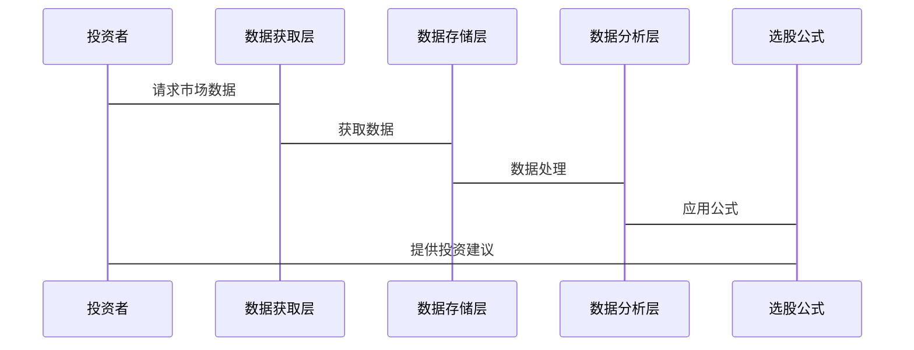

                 


# 《格雷厄姆的股票选择公式及其现代应用》

> 关键词：格雷厄姆, 股票选择公式, 价值投资, 现代应用, 数据分析, 系统架构

> 摘要：本文深入探讨了本杰明·格雷厄姆的股票选择公式，分析其背后的数学原理、投资理念及其在现代投资环境下的应用。通过结合大数据和机器学习技术，本文展示了如何优化和改进传统的格雷厄姆选股公式，以适应当前复杂的金融市场环境。文章还详细介绍了基于格雷厄姆公式构建的选股系统的架构设计和实现过程，并通过实际案例分析展示了其在现代投资中的应用效果。

---

## 第1章：格雷厄姆的股票选择公式基础

### 1.1 价值投资的起源与发展

#### 1.1.1 投资学说的历史演变
投资学说从古典经济学时期开始，经历了多次演变和变革。从早期的道氏理论到后来的凯恩斯主义，投资学说逐步从单纯的市场分析转向了基本面分析和价值投资。本杰明·格雷厄姆作为20世纪初的投资大师，他的价值投资理论为现代投资学奠定了重要基础。

#### 1.1.2 格雷厄姆的学术贡献与投资理念
格雷厄姆是哥伦比亚大学的教授，他的《聪明的投资者》一书成为投资领域的经典著作。格雷厄姆的价值投资理念强调“安全边际”，即以低于内在价值的价格买入优质股票，以确保投资的安全性。

#### 1.1.3 价值投资的核心思想与原则
价值投资的核心思想是寻找市场低估的股票，通过基本面分析来判断其内在价值。格雷厄姆提出的选股公式为投资者提供了一种量化的方法，帮助他们在市场中找到被低估的投资标的。

### 1.2 格雷厄姆股票选择公式概述

#### 1.2.1 格雷厄姆的选股标准与方法
格雷厄姆的选股公式基于对公司盈利能力、财务状况和市场估值的分析。他提出的核心公式是：
$$内在价值 = \frac{当前收益 + 预测收益}{预期收益率}$$

#### 1.2.2 格雷厄姆安全边际的概念与重要性
安全边际是指股票的市场价格低于其内在价值的部分。格雷厄姆认为，安全边际能够降低投资风险，并为投资者提供一个安全的缓冲区。

#### 1.2.3 格雷厄姆公式的基本框架与应用
格雷厄姆的选股公式通过计算公司的内在价值，并将其与市场价格进行比较，从而筛选出被低估的股票。这种方法在当时被认为是革命性的，为现代投资分析提供了重要参考。

---

## 第2章：格雷厄姆股票选择公式的详细解析

### 2.1 格雷厄姆选股公式的应用步骤

#### 2.1.1 确定公司的当前收益
当前收益是公司过去一段时间内的盈利情况，通常以每股收益（EPS）来衡量。

#### 2.1.2 预测未来收益
通过分析公司的财务状况、行业地位和市场前景，预测未来几年的收益情况。

#### 2.1.3 确定合理的预期收益率
预期收益率是基于公司未来收益和当前市场环境的综合判断，通常考虑行业平均水平和公司历史表现。

#### 2.1.4 计算内在价值并比较市场价格
通过公式计算公司股票的内在价值，将其与市场价格进行对比，判断是否存在低估。

### 2.2 格雷厄姆选股公式的数学推导

#### 2.2.1 内在价值的计算公式推导
格雷厄姆的内在价值公式可以简化为：
$$内在价值 = \frac{当前收益 \times (1 + 增长率)}{预期收益率}$$

#### 2.2.2 收益率的计算与假设
收益率的计算基于公司未来收益的增长率和当前市场的无风险利率。假设收益率为8%，增长率则根据公司历史表现和行业前景确定。

#### 2.2.3 价格与价值的对比分析
通过比较市场价格与内在价值，判断是否存在投资机会。如果市场价格低于内在价值，则股票具有投资价值。

### 2.3 格雷厄姆选股公式的实例分析

#### 2.3.1 某公司实例分析
以某公司为例，假设其当前收益为10元，预测未来收益为12元，预期收益率为8%。根据公式计算：
$$内在价值 = \frac{10 + 12}{0.08} = 27.5$$

#### 2.3.2 公式在实例中的应用与结果
如果市场价格为25元，则市场价格低于内在价值，股票被低估，具有投资价值。

#### 2.3.3 结果分析与投资决策
基于分析结果，投资者可以选择买入该股票，等待其价格回归内在价值。

---

## 第3章：现代投资环境下的格雷厄姆选股公式

### 3.1 现代市场环境的变化与挑战

#### 3.1.1 现代市场的复杂性与不确定性
现代市场环境更加复杂，受到宏观经济、政策变化和全球化的多重影响。

#### 3.1.2 信息爆炸与数据驱动的投资决策
随着信息技术的发展，投资者可以获取更多的数据和信息，但如何筛选和利用这些数据成为新的挑战。

#### 3.1.3 技术进步对投资策略的影响
大数据和人工智能技术的应用，使得投资策略更加精准和高效。

### 3.2 格雷厄姆选股公式的现代改进

#### 3.2.1 结合大数据的选股策略优化
通过大数据分析，可以更准确地预测公司收益和市场估值，优化选股公式。

#### 3.2.2 现代金融模型对格雷厄姆公式的补充
现代金融模型如CAPM和APT为格雷厄姆公式提供了新的视角和方法。

#### 3.2.3 现代风险管理技术与格雷厄姆公式结合
通过引入VaR和情景分析等技术，可以更全面地评估投资风险。

### 3.3 现代应用中的数学模型与算法

#### 3.3.1 现代选股模型的数学公式
现代选股模型结合了格雷厄姆公式和现代金融模型，形成了新的数学公式。

#### 3.3.2 数据分析与机器学习在选股中的应用
通过机器学习算法，可以自动识别市场趋势和公司基本面变化，优化选股策略。

#### 3.3.3 现代模型与格雷厄姆公式的对比分析
现代模型在准确性和效率上均有显著提升，但格雷厄姆公式仍为其核心思想之一。

---

## 第4章：基于格雷厄姆选股公式的系统分析与架构设计

### 4.1 系统分析与设计概述

#### 4.1.1 问题场景介绍
本章将从系统角度分析基于格雷厄姆选股公式的投资决策系统，包括数据获取、分析、策略生成和投资执行等环节。

#### 4.1.2 项目介绍
本项目旨在构建一个基于格雷厄姆选股公式的自动化投资决策系统，结合现代数据分析技术，提升选股效率和准确性。

#### 4.1.3 系统功能设计（领域模型）


#### 4.1.4 系统架构设计（系统架构）


#### 4.1.5 系统接口设计和系统交互（系统交互）


---

## 第5章：基于格雷厄姆选股公式的项目实战

### 5.1 项目实战环境安装

#### 5.1.1 Python环境安装
安装Python和必要的库：
```bash
pip install numpy pandas matplotlib
```

#### 5.1.2 数据源获取
通过Yahoo Finance获取股票数据。

### 5.2 系统核心实现源代码

#### 5.2.1 选股公式实现
```python
def calculate_intrinsic_value(company_data, expected_yield):
    current_earnings = company_data['current_earnings']
    projected_earnings = company_data['projected_earnings']
    return (current_earnings + projected_earnings) / expected_yield
```

#### 5.2.2 数据分析实现
```python
import pandas as pd
import numpy as np

def analyze_stocks(stocks):
    df = pd.DataFrame(stocks)
    df['intrinsic_value'] = df.apply(lambda x: calculate_intrinsic_value(x, 0.08), axis=1)
    df['is_undervalued'] = df['intrinsic_value'] > df['market_price']
    return df
```

#### 5.2.3 投资策略实现
```python
def generate_investment_strategy(df):
    undervalued_stocks = df[df['is_undervalued']]
    return undervalued_stocks[['stock_code', 'intrinsic_value', 'market_price']]
```

### 5.3 代码应用解读与分析

#### 5.3.1 代码功能解读
上述代码实现了基于格雷厄姆公式的选股逻辑，包括内在价值计算和低估股票筛选。

#### 5.3.2 代码优化与改进
结合现代数据分析技术，优化代码性能和准确性。

### 5.4 实际案例分析与详细讲解

#### 5.4.1 案例背景介绍
以某行业为例，分析该行业内的几只股票。

#### 5.4.2 数据分析与计算
通过代码计算每只股票的内在价值和市场价格，判断是否存在低估。

#### 5.4.3 投资决策与结果分析
基于分析结果，生成投资策略并进行投资。

### 5.5 项目小结

#### 5.5.1 项目总结
通过本项目，我们成功构建了一个基于格雷厄姆选股公式的自动化投资决策系统。

#### 5.5.2 项目意义
本项目展示了如何将传统投资理论与现代技术相结合，提升投资效率和准确性。

---

## 第6章：基于格雷厄姆选股公式的最佳实践

### 6.1 小结

#### 6.1.1 格雷厄姆选股公式的核心思想
格雷厄姆选股公式通过计算内在价值和市场价格，筛选出被低估的股票。

#### 6.1.2 现代应用的重要意义
结合大数据和机器学习技术，优化选股策略，提升投资效率。

### 6.2 注意事项

#### 6.2.1 数据质量与准确性
数据质量直接影响分析结果，需确保数据的准确性和完整性。

#### 6.2.2 投资风险与道德风险
投资有风险，需谨慎评估和管理风险。同时，需遵守道德规范，避免不正当竞争。

#### 6.2.3 系统维护与更新
定期维护和更新系统，确保其适应市场环境的变化。

### 6.3 拓展阅读

#### 6.3.1 推荐书籍
- 《聪明的投资者》——本杰明·格雷厄姆
- 《投资学》——理查德·A·艾德温

#### 6.3.2 推荐网站与工具
- Yahoo Finance
- Bloomberg Terminal
- QuantInst

---

## 作者：AI天才研究院/AI Genius Institute & 禅与计算机程序设计艺术 /Zen And The Art of Computer Programming

