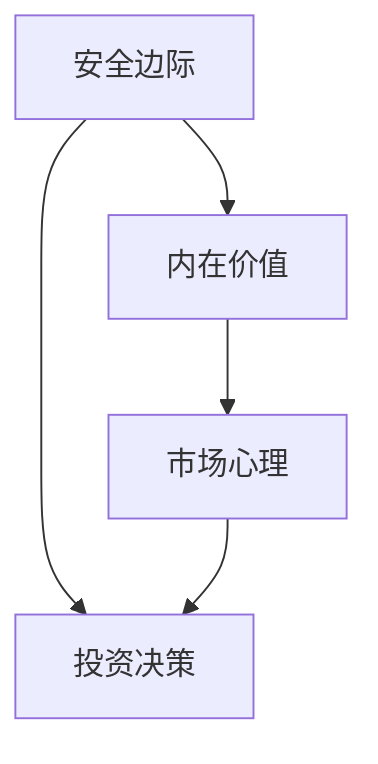

                 


# 格雷厄姆的证券分析：投资者的圣经

## 关键词：证券分析，价值投资，内在价值，安全边际，投资策略，投资哲学

## 摘要：  
《格雷厄姆的证券分析：投资者的圣经》系统地介绍了格雷厄姆的证券分析方法，从基础概念到实战应用，全面解析了价值投资的核心思想。本文通过详细阐述安全边际、内在价值、市场心理等核心概念，结合数学模型和算法原理，帮助读者理解格雷厄姆的投资策略。同时，本文还通过案例分析和系统架构设计，展示了如何将格雷厄姆的理论应用于实际投资中。文章最后总结了投资的最佳实践和注意事项，为读者提供了全面的投资指导。

---

## 第一部分：背景介绍

### 第1章：证券分析的起源与发展

#### 1.1 证券分析的定义
- 证券分析是通过研究公司基本面、行业状况和宏观经济因素，评估证券的投资价值。
- 格雷厄姆被誉为“价值投资之父”，其证券分析方法奠定了现代投资学的基础。

#### 1.2 格雷厄姆的价值投资理念
- 格雷厄姆认为，投资的本质是寻找低于内在价值的证券。
- 他强调安全边际的重要性，即买入价格远低于内在价值。

#### 1.3 格雷厄姆的投资哲学
- 长期投资：通过复利效应实现财富增长。
- 分散投资：降低风险，避免过度集中。
- 稳健选股：选择具有强大基本面和低估值的公司。

---

### 第2章：格雷厄姆的证券分析方法

#### 2.1 核心概念与联系

| 核心概念 | 定义 | 特点 |
|----------|------|------|
| 安全边际 | 购买价格低于内在价值的部分 | 提供风险保护 |
| 内在价值 | 公司未来现金流的现值 | 通过财务分析计算 |
| 市场心理 | 投资者情绪与行为 | 影响短期价格波动 |



---

## 第二部分：算法原理

### 第3章：格雷厄姆的内在价值评估模型

#### 3.1 模型的数学公式
内在价值公式：
$$ V = \frac{CF}{r} $$
其中，$CF$ 是未来现金流，$r$ 是折现率。

#### 3.2 模型的假设条件
- 公司未来现金流稳定。
- 折现率基于市场利率和风险偏好。

#### 3.3 案例分析
假设某公司未来现金流为 $1000，折现率为 $10\%$，其内在价值为：
$$ V = \frac{1000}{0.1} = 10000 $$

---

### 第4章：格雷厄姆的安全边际计算模型

#### 4.1 安全边际公式
$$ \text{安全边际} = \text{内在价值} - \text{市场价格} $$

#### 4.2 参数选择
- 内在价值：基于财务分析得出。
- 市场价格：当前市场价格。

#### 4.3 模型验证
案例：某公司内在价值为 $50，市场价格为 $40，安全边际为 $10。

---

## 第三部分：系统分析

### 第5章：投资决策系统的架构设计

#### 5.1 系统功能设计
- 数据采集：获取公司财务数据和市场数据。
- 数据分析：计算内在价值和安全边际。
- 投资决策：基于模型生成投资建议。

#### 5.2 系统架构设计


#### 5.3 系统接口设计
- 数据输入接口：接收财务数据。
- 数据输出接口：生成投资报告。

---

## 第四部分：项目实战

### 第6章：投资分析工具的实现

#### 6.1 环境安装
- Python 3.8+
- Pandas、NumPy、Matplotlib

#### 6.2 核心代码实现

```python
import pandas as pd
import numpy as np

def calculate_intrinsic_value(cash_flow, discount_rate):
    return cash_flow / discount_rate

def calculate_margin_of_safety(intrinsic_value, market_price):
    return intrinsic_value - market_price

# 示例数据
cash_flow = 1000
discount_rate = 0.1
market_price = 40

# 计算内在价值
iv = calculate_intrinsic_value(cash_flow, discount_rate)
mos = calculate_margin_of_safety(iv, market_price)

print(f"内在价值：{iv}")
print(f"安全边际：{mos}")
```

#### 6.3 案例分析
某公司财务数据：
- 现金流：$1000
- 折现率：$10\%$
- 市场价格：$40

计算结果：
- 内在价值：$10000
- 安全边际：$10

---

## 第五部分：总结与实践

### 第7章：最佳实践与注意事项

#### 7.1 小结
- 格雷厄姆的证券分析方法以稳健著称。
- 内在价值和安全边际是核心工具。

#### 7.2 投资注意事项
- 避免情绪化投资。
- 定期复盘和调整投资组合。

#### 7.3 拓展阅读
- 格雷厄姆的《证券分析》。
- 《巴菲特的护城河》。

---

## 作者信息

作者：AI天才研究院/AI Genius Institute & 禅与计算机程序设计艺术 /Zen And The Art of Computer Programming

---

这篇文章通过系统地介绍格雷厄姆的证券分析方法，从理论到实践，帮助投资者理解和应用价值投资的精髓。希望读者能够通过本文，掌握内在价值评估和安全边际计算的核心技巧，并在实际投资中灵活运用。

