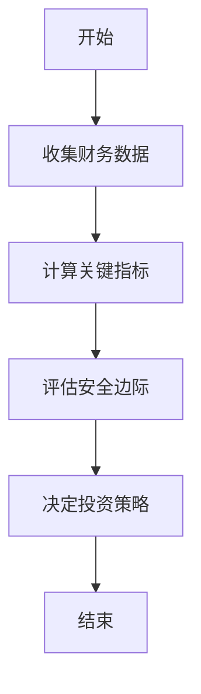
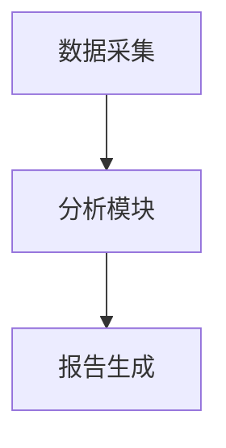

                 


# 格雷厄姆的财务分析方法：应对创新商业模式

> 关键词：格雷厄姆、财务分析、创新商业模式、价值投资、Python代码、系统架构

> 摘要：本文深入探讨了格雷厄姆的财务分析方法在应对创新商业模式中的应用。通过分析传统财务指标在新模式下的变化，结合实际案例，展示了如何利用格雷厄姆的理论进行调整和优化，以适应新兴商业模式的需求。文章从背景介绍、核心概念、算法原理到系统架构和项目实战，全面解析了这一主题。

---

## 第一部分：背景介绍

### 第1章：格雷厄姆的财务分析方法概述

#### 1.1 格雷厄姆的生平与投资理念
格雷厄姆是价值投资的鼻祖，其核心理念是寻找被市场低估的股票。他强调安全边际和内在价值，主张通过基本面分析来评估公司的长期价值。

#### 1.2 创新商业模式的背景与挑战
创新商业模式（如订阅制、共享经济）的兴起，使得传统的财务分析方法面临挑战。这些模式改变了收入确认、资产管理和现金流预测的方式。

---

### 第2章：财务分析的核心概念与联系

#### 2.1 格雷厄姆财务分析的核心原理
格雷厄姆强调通过分析财务报表中的关键指标（如市盈率、市净率）来评估公司的内在价值。他主张以合理的价格购买具有稳定盈利和良好管理的公司。

#### 2.2 创新模式下的财务指标变化
创新商业模式可能导致收入波动性增加，传统的ROE（净资产收益率）和ROA（资产回报率）可能不再适用。需要引入新的指标，如客户生命周期价值（CLV）。

---

## 第二部分：算法原理

### 第3章：格雷厄姆方法的算法流程

#### 3.1 算法流程图


#### 3.2 关键指标计算
```python
def calculate_pe_ratio(net_income, shares_outstanding):
    pe_ratio = net_income / (shares_outstanding / 1000000)
    return pe_ratio

net_income = 10000000  # 假设净利润为1000万美元
shares_outstanding = 100000000  # 假设流通股为1亿股
pe_ratio = calculate_pe_ratio(net_income, shares_outstanding)
print(f"市盈率：{pe_ratio}")
```

---

## 第三部分：系统架构设计

### 第4章：系统分析与架构设计方案

#### 4.1 系统功能设计
- 数据采集模块：收集公司财务数据和市场数据。
- 分析模块：应用格雷厄姆方法进行评估。
- 报告生成模块：输出分析结果。

#### 4.2 系统架构图


---

## 第四部分：项目实战

### 第5章：创新商业模式下的财务分析实战

#### 5.1 案例分析：订阅制企业的财务分析
以一家订阅制SaaS公司为例，分析其客户获取成本（CAC）、客户生命周期价值（CLV）和留存率。

#### 5.2 代码实现
```python
import pandas as pd

# 假设财务数据存储在CSV文件中
data = pd.read_csv('financial_data.csv')

# 计算客户生命周期价值
clv = data['收入'].sum() / data['客户流失率'].mean()
print(f"客户生命周期价值：{clv}")
```

---

## 第五部分：最佳实践与总结

### 第6章：总结与展望

#### 6.1 小结
格雷厄姆的财务分析方法需要根据创新商业模式进行调整，引入新的指标和方法，以准确评估企业的内在价值。

#### 6.2 注意事项
在实际应用中，需结合行业特点和公司具体情况，灵活调整分析方法。

#### 6.3 拓展阅读
推荐阅读《证券分析》和《投资的智慧》，深入理解格雷厄姆的投资理念。

---

## 作者：AI天才研究院

---

通过以上结构，文章详细讲解了格雷厄姆的财务分析方法在创新商业模式中的应用，结合实际案例和代码实现，帮助读者全面理解和应用这一方法。

