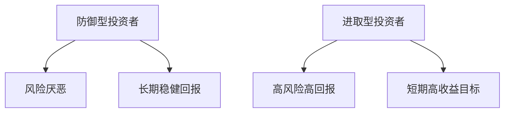

                 

# 《格雷厄姆的防御型和进取型投资者区别》

---

## 关键词：
- 格雷厄姆投资理论
- 防御型投资者
- 进取型投资者
- 投资策略
- 风险管理

---

## 摘要：
本文深入探讨了格雷厄姆提出的防御型和进取型投资者之间的区别，分析了这两种投资者在投资目标、策略和风险承受能力上的差异。文章通过详细阐述每种投资者的特征、核心原则和数学模型，结合实际案例，帮助读者理解如何根据自身风险偏好选择合适的投资策略。文章还通过系统分析和架构设计，展示了如何在实际投资中应用这些理论。

---

## 目录大纲：

### 第一部分：投资者类型的核心概念

#### 第1章：问题背景与描述
- **1.1 问题背景与描述**
  - 1.1.1 投资者行为的核心问题
  - 1.1.2 格雷厄姆投资理论的背景
  - 1.1.3 防御型与进取型投资者的定义
- **1.2 核心概念与联系**
  - 1.2.1 防御型投资者的核心要素
  - 1.2.2 进取型投资者的核心要素
  - 1.2.3 两种投资者的对比分析表
  - 1.2.4 实体关系图（ER图）Mermaid示例

- **1.3 本章小结**
  - 1.3.1 核心概念回顾
  - 1.3.2 防御型与进取型投资者的区别

### 第二部分：防御型投资者的策略与原则

#### 第2章：防御型投资者的核心策略
- **2.1 防御型投资者的核心策略**
  - 2.1.1 长期投资理念
  - 2.1.2 安全边际的概念
  - 2.1.3 风险控制的重要性
- **2.2 防御型投资者的决策模型**
  - 2.2.1 投资组合构建原理
  - 2.2.2 风险调整后的收益模型
  - 2.2.3 资产配置的数学模型
- **2.3 数学模型与公式**
  - 2.3.1 风险调整后的收益公式
    $$ \text{夏普比率} = \frac{E[r_i - r_f]}{\sigma_i} $$
  - 2.3.2 防御型投资组合优化
    $$ \text{Minimize } \sigma \text{ subject to } E[r] \geq \text{目标收益} $$
- **2.4 本章小结**
  - 2.4.1 防御型投资者的策略总结
  - 2.4.2 数学模型的应用

### 第三部分：进取型投资者的策略与原则

#### 第3章：进取型投资者的核心策略
- **3.1 进取型投资者的核心策略**
  - 3.1.1 高风险高回报的目标
  - 3.1.2 短期收益的追求
  - 3.1.3 投资杠杆的使用
- **3.2 进取型投资者的决策模型**
  - 3.2.1 高风险资产配置
  - 3.2.2 杠杆效应的原理
  - 3.2.3 高风险投资的数学模型
- **3.3 数学模型与公式**
  - 3.3.1 杠杆的收益放大效应
    $$ \text{杠杆收益} = (1 + \text{杠杆比例}) \times \text{基础收益} - \text{杠杆成本} $$
  - 3.3.2 高风险投资的风险评估
    $$ \text{VaR} = \alpha \text{分位数} \times \text{标准差} $$
- **3.4 本章小结**
  - 3.4.1 进取型投资者的

---

## 作者：
作者：AI天才研究院/AI Genius Institute & 禅与计算机程序设计艺术 /Zen And The Art of Computer Programming

