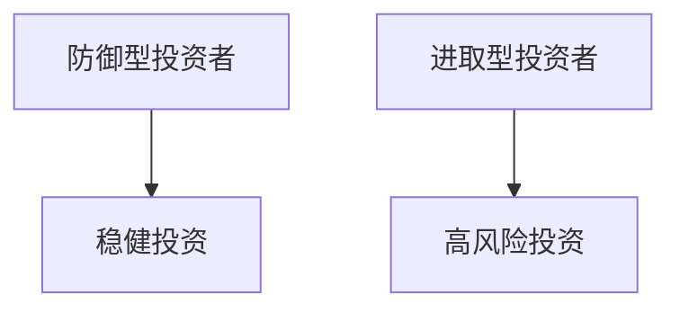
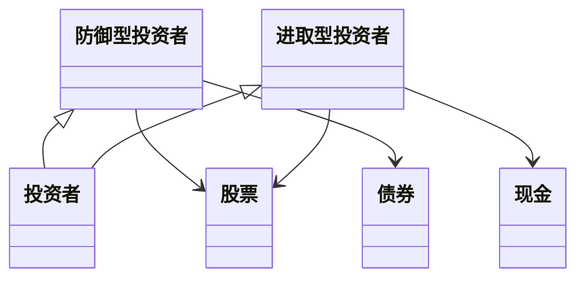

                 


# 格雷厄姆的防御型和进取型投资者：知己知彼

## 关键词：价值投资，防御型投资者，进取型投资者，内在价值，安全边际，投资策略

## 摘要

本文深入探讨了本杰明·格雷厄姆提出的防御型和进取型投资者理论，分析了这两种投资策略的核心概念、数学模型、系统架构及其在实际投资中的应用。通过对比分析，本文旨在帮助投资者根据自身风险偏好和投资目标选择合适的策略，实现稳健或高回报的投资目标。

---

## 第一部分：背景介绍

### 第1章：格雷厄姆与价值投资概述

#### 1.1 本杰明·格雷厄姆的生平与投资理念

本杰明·格雷厄姆（Benjamin Graham）是20世纪最著名的价值投资者之一，被誉为“价值投资之父”。他出生于1894年，逝世于1976年，曾在纽约证券交易所工作，后来成为哥伦比亚大学的教授，教授证券分析课程。格雷厄姆的投资理念深刻影响了包括沃伦·巴菲特在内的众多投资者。

格雷厄姆的价值投资理论强调安全边际和内在价值。他认为，投资者应该以低于内在价值的价格买入优质股票，并长期持有，以获得稳定的收益。他的经典著作《聪明的投资者》（The Intelligent Investor）是价值投资领域的圣经，至今仍被广泛阅读和引用。

#### 1.2 防御型与进取型投资者的概念

格雷厄姆将投资者分为两种主要类型：防御型投资者和进取型投资者。

- **防御型投资者**：这类投资者追求的是资本的稳妥和稳定的收益。他们注重本金的安全性，倾向于投资那些具有稳定收益和较低波动性的资产。防御型投资者通常选择那些具有较高股息收益率、良好财务状况和行业龙头地位的公司。

- **进取型投资者**：这类投资者愿意承担更高的风险，以追求更高的回报。他们通常投资于成长性较强的股票、新兴行业或创新型公司。进取型投资者愿意承担短期波动，以期获得长期的资本增值。

---

## 第二部分：核心概念与联系

### 第2章：防御型与进取型投资者的核心概念

#### 2.1 核心概念原理

防御型和进取型投资者在投资策略和目标上有显著差异。防御型投资者注重安全性和稳定性，而进取型投资者则注重高回报和增长潜力。这两种策略各有优缺点，适用于不同风险偏好的投资者。

#### 2.2 概念属性特征对比表格

以下表格详细对比了防御型和进取型投资者的核心特征：

| 投资者类型 | 风险承受 | 投资期限 | 资金规模 | 投资目标 |
|------------|----------|----------|----------|----------|
| 防御型     | 低       | 长期     | 中小     | 本金安全 |
| 进取型     | 高       | 短期     | 大       | 高回报   |

#### 2.3 ER实体关系图（Mermaid流程图）

以下Mermaid图展示了防御型和进取型投资者之间的关系：



---

## 第三部分：算法原理讲解

### 第3章：价值投资中的数学模型

#### 3.1 内在价值计算模型

内在价值是价值投资的核心概念。格雷厄姆认为，投资者应该购买那些市场价格低于其内在价值的股票。内在价值的计算方法多种多样，以下是其中一种常用的方法：

**公式：**

$$ V = \frac{E}{k} $$

其中：
- \( V \) 是内在价值
- \( E \) 是企业的预期收益
- \( k \) 是折现率（通常是企业的资本成本）

**示例：**

假设一家公司预期年收益为 $1,000,000，折现率为10%。则其内在价值为：

$$ V = \frac{1,000,000}{0.10} = 10,000,000 $$

这意味着该公司的股票如果市场价格低于 $10,000,000，可能是一个值得投资的机会。

#### 3.2 安全边际计算

安全边际是格雷厄姆提出的一个重要概念，用于衡量市场价格与内在价值之间的差距。安全边际越大，投资的风险越小。

**公式：**

$$ MS = V - P $$

其中：
- \( MS \) 是安全边际
- \( V \) 是内在价值
- \( P \) 是市场价格

**示例：**

假设某股票的内在价值为 $50，市场价格为 $40，则安全边际为：

$$ MS = 50 - 40 = 10 $$

这意味着投资者可以承受10%的股价下跌，而其投资仍能保持盈亏平衡。

---

## 第四部分：系统分析与架构设计方案

### 第4章：投资策略系统设计

#### 4.1 问题场景介绍

在实际投资中，投资者需要根据自身的风险偏好和投资目标选择合适的投资策略。防御型投资者倾向于稳健投资，而进取型投资者则寻求高回报。

#### 4.2 系统功能设计

以下领域模型类图展示了防御型和进取型投资者在系统中的角色：



---

## 第五部分：项目实战

### 第5章：投资策略的实际应用

#### 5.1 环境安装

为了进行投资分析，我们需要以下工具和环境：

- 数据分析工具：Python（Pandas、NumPy）
- 财务分析工具：Excel或类似的电子表格软件
- 数据源：股票价格、财务报表等

#### 5.2 核心实现源代码

以下是一个计算内在价值和安全边际的Python代码示例：

```python
# 计算内在价值和安全边际的代码

def calculate_intrinsic_value(earnings, discount_rate):
    return earnings / discount_rate

def calculate_margin_of_safety(intrinsic_value, market_price):
    return intrinsic_value - market_price

# 示例数据
earnings = 1000000  # 预期收益
discount_rate = 0.10  # 折现率
market_price = 40     # 市场价格

# 计算内在价值
intrinsic_value = calculate_intrinsic_value(earnings, discount_rate)
print(f"内在价值: ${intrinsic_value}")

# 计算安全边际
margin_of_safety = calculate_margin_of_safety(intrinsic_value, market_price)
print(f"安全边际: ${margin_of_safety}")
```

#### 5.3 代码应用解读与分析

以上代码示例展示了如何计算内在价值和安全边际。通过输入预期收益和折现率，我们可以计算出内在价值。如果市场价格低于内在价值，投资者可以考虑买入该股票。

#### 5.4 实际案例分析

假设我们有以下数据：

- 公司A的预期收益为 $500,000
- 折现率为 8%
- 市场价格为 $60

计算内在价值：

$$ V = \frac{500,000}{0.08} = 6,250,000 $$

计算安全边际：

$$ MS = 6,250,000 - 60 = 6,190,000 $$

由于安全边际为正，防御型投资者可能认为该股票值得购买。

---

## 第六部分：最佳实践

### 第6章：投资策略的总结与展望

#### 6.1 小结

防御型和进取型投资者在投资策略上各有特点。防御型投资者注重本金安全和稳定收益，而进取型投资者则追求高回报和增长潜力。投资者应根据自身的风险偏好和投资目标选择合适的投资策略。

#### 6.2 注意事项

- **风险控制**：无论选择哪种投资策略，风险控制都是关键。
- **持续学习**：市场环境不断变化，投资者需要不断学习和调整策略。
- **分散投资**：不要将所有资金投入到单一资产中，以降低风险。

#### 6.3 拓展阅读

- 《聪明的投资者》——本杰明·格雷厄姆
- 《投资的艺术》——约翰·坦普尔顿
- 《价值投资实战手册》——橡树资本管理公司

---

## 作者：AI天才研究院/AI Genius Institute & 禅与计算机程序设计艺术 /Zen And The Art of Computer Programming

