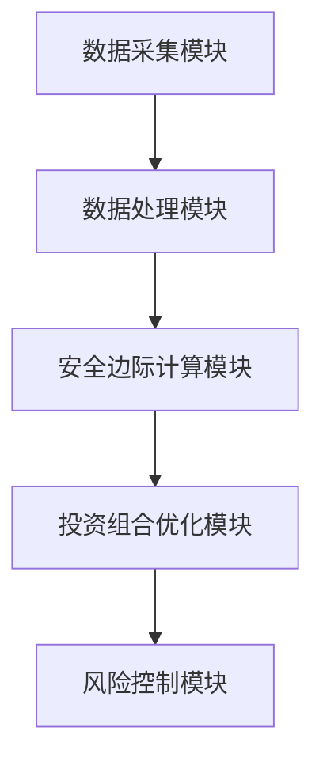

                 


# 格雷厄姆的防御型投资者策略：稳健致胜

> 关键词：防御型投资，安全边际，投资组合优化，风险控制，价值投资，格雷厄姆，稳健投资

> 摘要：本文深入探讨了格雷厄姆的防御型投资者策略，从核心概念到数学模型，从系统架构到项目实战，全面分析了防御型投资的理论与实践。文章结合算法原理、系统设计和实际案例，为投资者提供了一套稳健的投资方法，帮助他们在复杂多变的市场中实现长期稳定的收益。

---

## 第1章：防御型投资的背景与核心概念

### 1.1 投资的基本概念

#### 1.1.1 投资的定义与分类

- **定义**：投资是通过购买资产以期望在未来获得收益或资本增值的行为。
- **分类**：
  - 短期投资：注重短期价格波动，风险较高。
  - 长期投资：注重资产的长期增值，风险较低。
  - 防御型投资：以稳健和风险控制为核心，追求长期稳定的收益。

#### 1.1.2 防御型投资的定义

- 防御型投资是一种以降低风险、追求稳定收益为首要目标的投资策略。
- 通过选择具有高安全边际的资产，避免市场波动带来的重大损失。

#### 1.1.3 防御型投资的特点与优势

- **特点**：
  - 低风险：通过严格筛选资产，降低投资组合的波动性。
  - 长期性：注重资产的内在价值，而非短期价格波动。
  - 安全边际：买入价格低于内在价值，提供保护空间。
- **优势**：
  - 在市场低迷时表现稳定。
  - 长期收益稳定，适合保守型投资者。

### 1.2 格雷厄姆的投资理念

#### 1.2.1 格雷厄姆的生平与贡献

- **生平**：本杰明·格雷厄姆（1894-1976），被誉为“价值投资之父”，著有《 Intelligent Investor》。
- **贡献**：提出了价值投资理论，强调安全边际和长期投资。

#### 1.2.2 格雷厄姆的价值投资理论

- **核心思想**：买入低于内在价值的资产，通过安全边际降低风险。

#### 1.2.3 防御型投资的核心思想

- 以安全边际为核心，避免重大损失，追求长期稳定收益。

---

## 第2章：防御型投资的核心策略

### 2.1 安全边际

#### 2.1.1 安全边际的定义

- 安全边际是资产的市场价格低于其内在价值的部分，提供保护空间。

#### 2.1.2 安全边际的计算方法

- **公式**：安全边际 = 内在价值 - 市场价格
- **解释**：当市场价格低于内在价值时，安全边际为正，投资风险降低。

#### 2.1.3 安全边际的重要性

- 通过安全边际，降低市场波动对投资组合的影响。
- 为投资者提供一个安全的缓冲区，避免重大损失。

### 2.2 分散投资

#### 2.2.1 分散投资的原理

- 通过投资多种资产或行业，降低单一资产的风险。

#### 2.2.2 分散投资的实现方式

- **资产多样化**：投资股票、债券等多种资产。
- **行业分散化**：避免集中投资于单一行业。

#### 2.2.3 分散投资的风险控制

- 通过合理的资产配置，降低整体投资组合的风险。

---

## 第3章：防御型投资的数学模型与公式

### 3.1 安全边际计算公式

#### 3.1.1 公式推导与解释

- **公式**：安全边际 = 内在价值 - 市场价格
- **推导**：内在价值基于资产的盈利能力、资产状况等因素计算得出。

#### 3.1.2 实例分析

- 假设某股票的内在价值为 $50，市场价格为 $40，则安全边际为 $10。

### 3.2 投资组合优化模型

#### 3.2.1 Markowitz优化模型

- **公式**：在给定风险下，选择收益最大的投资组合。
- **应用**：用于防御型投资组合的优化，平衡风险与收益。

#### 3.2.2 防御型投资组合优化

- 通过调整权重，降低高风险资产的比例，增加低风险资产的比例。

#### 3.2.3 模型的优缺点分析

- **优点**：提供科学的资产配置方法。
- **缺点**：需要准确的输入参数，实际操作中可能存在误差。

---

## 第4章：防御型投资的系统分析与架构设计

### 4.1 系统分析

#### 4.1.1 系统组成

- 数据采集模块：收集市场数据。
- 安全边际计算模块：计算资产的安全边际。
- 投资组合优化模块：优化投资组合。
- 风险控制模块：监控和管理风险。

#### 4.1.2 系统功能需求分析

- 数据采集：实时或历史数据。
- 安全边际计算：基于价值评估模型。
- 投资组合优化：基于优化算法。
- 风险控制：实时监控和调整。

#### 4.1.3 系统边界与交互

- 输入：市场数据、资产信息。
- 输出：优化后的投资组合、风险评估报告。

### 4.2 系统架构设计

#### 4.2.1 分层架构设计

- 数据层：数据存储和管理。
- 业务逻辑层：核心算法和逻辑。
- 用户界面层：展示结果和交互。

#### 4.2.2 模块划分与职责

- 数据采集模块：负责数据的获取和清洗。
- 安全边际计算模块：负责计算安全边际。
- 投资组合优化模块：负责优化投资组合。
- 风险控制模块：负责监控和管理风险。

#### 4.2.3 系统架构图



---

## 第5章：防御型投资的项目实战

### 5.1 环境安装与配置

#### 5.1.1 Python环境搭建

- 安装Python和必要的开发工具。

#### 5.1.2 必需库的安装

- `numpy`, `pandas`, `scipy`, `matplotlib`, `plotly`

### 5.2 核心代码实现

#### 5.2.1 安全边际计算函数

```python
def calculate_margin(intrinsic_value, market_price):
    return intrinsic_value - market_price
```

#### 5.2.2 投资组合优化算法

```python
import numpy as np

def portfolio_optimization(returns, weights):
    returns = np.array(returns)
    weights = np.array(weights)
    return np.dot(returns, weights)
```

#### 5.2.3 数据可视化代码

```python
import matplotlib.pyplot as plt

plt.plot(data)
plt.title("Market Price vs Intrinsic Value")
plt.xlabel("Time")
plt.ylabel("Price")
plt.show()
```

### 5.3 案例分析与解读

#### 5.3.1 某公司股票的安全边际计算

- 假设某股票的内在价值为 $60，市场价格为 $50，则安全边际为 $10。

#### 5.3.2 投资组合优化实例

- 通过优化算法，调整资产权重，降低整体风险。

#### 5.3.3 实际投资表现分析

- 分析投资组合在不同市场条件下的表现。

---

## 第6章：总结与最佳实践

### 6.1 小结

- 防御型投资的核心是安全边际和分散投资。
- 通过科学的系统设计和优化算法，实现稳健的投资收益。

### 6.2 最佳实践 tips

- **投资前的准备工作**：充分研究和评估资产的内在价值。
- **风险控制策略**：通过分散投资降低整体风险。
- **长期投资的重要性**：耐心持有优质资产，避免短期波动影响决策。

### 6.3 未来展望

- **防御型投资的发展趋势**：随着技术进步，算法和数据驱动的投资策略将越来越重要。
- **新技术对投资的影响**：人工智能和大数据技术将为防御型投资提供新的工具和方法。
- **投资者的自我提升**：持续学习和适应市场变化，提升自身的投资能力。

---

## 附录与拓展阅读

- **附录1**：相关数学公式汇总
- **附录2**：系统架构设计详细说明
- **附录3**：项目代码和数据集

---

作者：AI天才研究院/AI Genius Institute & 禅与计算机程序设计艺术 /Zen And The Art of Computer Programming

