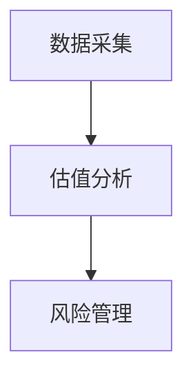
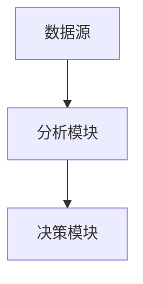

                 


# 防御型投资策略：稳健致胜

## 关键词：防御型投资，价值投资，格雷厄姆，安全边际，内在价值，投资组合优化

## 摘要：
本文详细阐述了格雷厄姆的防御型投资策略，从理论基础到实战应用，全面解析了防御型投资的核心理念、选股标准、组合优化方法以及风险管理策略。通过数学模型、算法实现和案例分析，深入探讨了防御型投资的稳健性与科学性，为投资者提供了系统化、可操作的投资指导。

---

# 第一部分: 防御型投资策略的理论基础

## 第1章: 格雷厄姆与防御型投资概述

### 1.1 格雷厄姆的生平与投资理念
格雷厄姆是20世纪最伟大的投资理论家之一，他的投资理念强调安全性和稳健性。他提出的防御型投资策略，为风险厌恶型投资者提供了避险和稳健收益的解决方案。

### 1.2 防御型投资的核心概念
防御型投资是一种以价值投资为基础的投资策略，其核心在于通过分析企业的内在价值，选择被市场低估的投资标的，同时预留安全边际以降低投资风险。

### 1.3 防御型投资的适用场景
防御型投资适用于以下场景：
- 投资者风险厌恶，追求稳健回报。
- 市场处于熊市或震荡市，防御性资产更具吸引力。
- 投资者希望避免重大损失，注重长期稳定收益。

---

## 第2章: 防御型投资的理论基础

### 2.1 格雷厄姆的价值投资理论
格雷厄姆提出，股票的内在价值是其未来现金流的现值。他强调，市场价格围绕内在价值波动，投资者应以低于内在价值的价格买入股票。

#### 内在价值计算公式：
$$ V = \frac{E}{k} $$
其中，$V$ 是内在价值，$E$ 是预期收益，$k$ 是折现率。

### 2.2 安全边际的概念与计算
安全边际是市场价格与内在价值之间的差异，它是防御型投资的核心要素之一。

#### 安全边际计算公式：
$$ \text{安全边际} = \text{市场价格} - \text{内在价值} $$

### 2.3 防御型投资的决策框架
防御型投资的决策框架包括以下步骤：
1. 确定投资目标和风险承受能力。
2. 选择具有竞争优势的企业。
3. 计算目标企业的内在价值。
4. 以低于内在价值的价格买入股票。
5. 长期持有，避免频繁交易。

---

## 第3章: 防御型投资的选股策略

### 3.1 选股标准
防御型投资的选股标准包括：
- 盈利能力：ROE（净资产收益率）应高于行业平均水平。
- 财务健康状况：低负债率，高现金流。
- 行业地位：龙头企业，竞争优势明显。

#### 盈利能力分析公式：
$$ \text{ROE} = \frac{\text{净利润}}{\text{净资产}} $$

### 3.2 估值方法
防御型投资常用的估值方法包括：
- 市盈率（P/E）分析。
- 市净率（P/B）分析。
- 股息率分析。

#### 市盈率计算公式：
$$ \text{P/E} = \frac{\text{股价}}{\text{每股收益}} $$

### 3.3 实战案例分析
以某公司为例，分析其财务数据，计算其内在价值，并确定安全边际。

---

## 第4章: 防御型投资的组合管理

### 4.1 投资组合的基本原理
防御型投资强调分散投资，通过构建多元化的投资组合降低风险。

#### 投资组合优化模型：
$$ \text{Minimize } \sigma^2 \text{ subject to } E[r] \geq \mu $$

### 4.2 风险管理策略
防御型投资的风险管理策略包括：
- 设置止损点。
- 定期调整投资组合。
- 避免过度集中投资。

### 4.3 投资组合再平衡
防御型投资者应定期对投资组合进行再平衡，确保投资组合的风险和收益符合预期。

---

## 第5章: 防御型投资的系统分析与架构设计

### 5.1 系统功能设计
防御型投资系统的功能模块包括：
- 数据采集模块：获取企业财务数据和市场数据。
- 估值分析模块：计算内在价值和安全边际。
- 风险管理模块：监控投资组合风险。

#### 系统功能设计图（Mermaid）：


### 5.2 系统架构设计
防御型投资系统的架构包括：
- 数据源：企业财务报表、市场数据。
- 分析模块：计算内在价值和安全边际。
- 决策模块：制定投资策略。

#### 系统架构图（Mermaid）：


---

## 第6章: 防御型投资的项目实战

### 6.1 环境安装
- 数据采集工具：Python的pandas库。
- 估值分析工具：Excel或Python的财务分析库。

### 6.2 核心实现代码
以下代码用于计算内在价值和安全边际：

```python
def calculate_intrinsic_value(enterprise_value, expected_cash_flow, discount_rate):
    return enterprise_value / (1 + discount_rate)

def calculate_margin_of_safety(current_price, intrinsic_value):
    return current_price - intrinsic_value
```

### 6.3 案例分析
以某公司为例，计算其内在价值和安全边际，制定投资策略。

---

## 第7章: 防御型投资的最佳实践

### 7.1 投资中的注意事项
- 避免情绪化投资。
- 定期复盘和调整。
- 保持长期投资心态。

### 7.2 投资小结
防御型投资是一种适合稳健型投资者的策略，其核心在于选择优质企业，以合理价格买入，并长期持有。

---

## 作者：AI天才研究院/AI Genius Institute & 禅与计算机程序设计艺术 /Zen And The Art of Computer Programming

