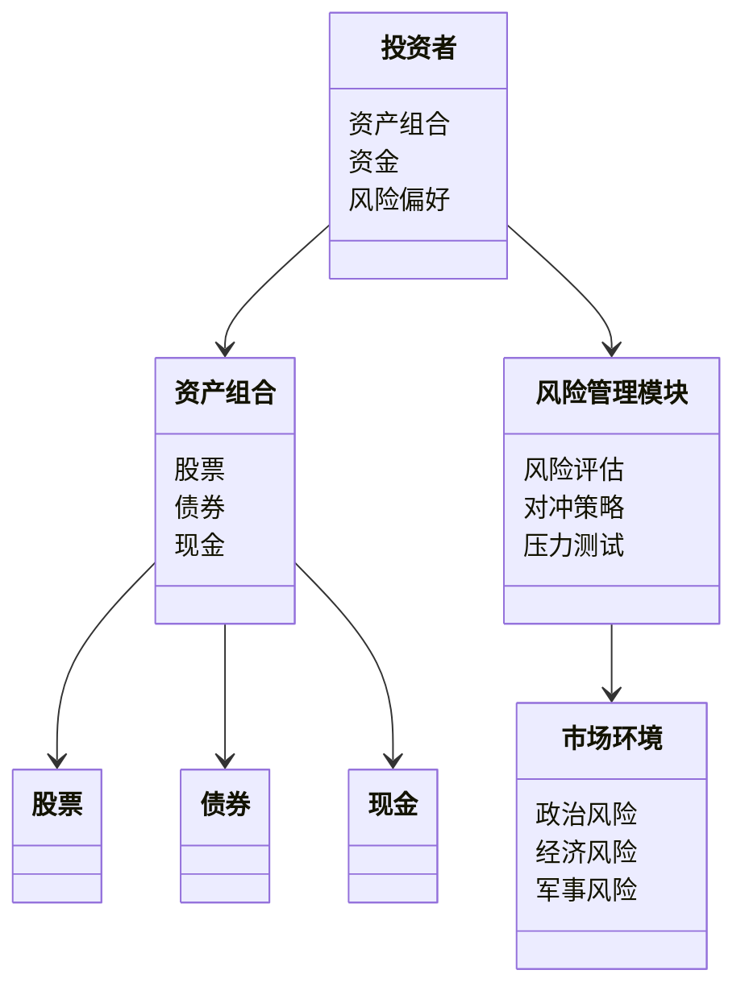
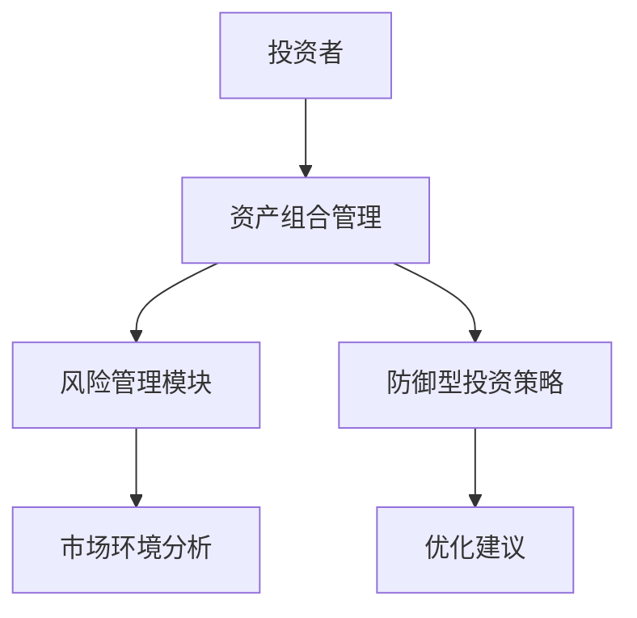
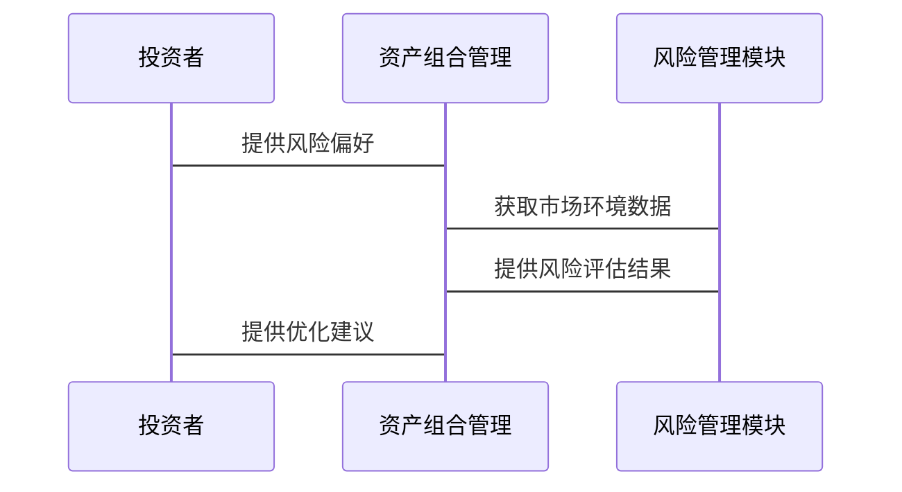

                 


# 防御型投资：在地缘政治不确定性中的重要性

> 关键词：防御型投资，格雷厄姆，地缘政治不确定性，风险管理，价值投资，资产配置

> 摘要：本文深入探讨了格雷厄姆的防御型投资策略及其在当前地缘政治不确定环境中的重要性。通过分析防御型投资的核心原则、数学模型、风险管理方法，结合实际案例，展示了如何在动荡的国际环境中保护和增长资本。文章还提供了系统架构和代码实现，帮助读者理解和应用这些策略。

---

## 第1章: 防御型投资的定义与重要性

### 1.1 防御型投资的核心概念

#### 1.1.1 防御型投资的定义
防御型投资是一种以保护资本、追求稳定收益为目标的投资策略，强调安全边际和长期价值。其核心在于通过选择低估资产和多样化配置来降低风险。

#### 1.1.2 防御型投资的特征
- **安全性**：注重本金保护，避免重大损失。
- **稳定性**：追求稳定的收益，而非高波动性。
- **长期性**：关注长期价值，而非短期波动。

#### 1.1.3 防御型投资的重要性
在地缘政治不确定性增加的背景下，防御型投资能够帮助投资者在市场波动中保持稳定，避免重大损失，实现资本保值和增值。

### 1.2 格雷厄姆的投资理念

#### 1.2.1 格雷厄姆的生平简介
本杰明·格雷厄姆是价值投资之父，他的投资理念深刻影响了巴菲特等投资者。他的理论强调安全边际和内在价值。

#### 1.2.2 格雷厄姆的价值投资理论
格雷厄姆的价值投资理论强调购买低于内在价值的资产，通过安全边际来降低风险。防御型投资是其理论的重要组成部分。

#### 1.2.3 防御型投资与地缘政治不确定性
在地缘政治不确定性中，防御型投资通过选择稳定的资产和多样化配置，帮助投资者应对不可预测的市场波动。

---

## 第2章: 防御型投资的核心原则

### 2.1 防御型投资的核心原则

#### 2.1.1 安全边际的概念
安全边际是资产的市场价格低于其内在价值的部分，确保在市场波动中不会遭受重大损失。

#### 2.1.2 股价与内在价值的关系
内在价值是资产的真实价值，而股价可能因市场情绪波动而偏离内在价值。防御型投资者通过寻找价格低于内在价值的资产来实现安全边际。

#### 2.1.3 投资的长期性与稳定性
防御型投资强调长期持有，避免频繁交易，以减少成本和风险。

### 2.2 防御型投资的数学模型

#### 2.2.1 安全边际的计算公式
安全边际 = 内在价值 - 市场价格

#### 2.2.2 内在价值的估算方法
内在价值 = (股息率 × 永久资本) / (折现率 - 股息增长率)

#### 2.2.3 风险调整后的收益模型
风险调整后的收益 = 预期收益 - 风险调整系数 × 标准差

---

## 第3章: 地缘政治不确定性对投资的影响

### 3.1 地缘政治风险的分类

#### 3.1.1 政治风险
政府政策变化、政局不稳等可能影响资产价值。

#### 3.1.2 经济风险
经济制裁、贸易摩擦等可能导致市场波动。

#### 3.1.3 军事风险
地缘冲突、战争等可能引发市场恐慌。

### 3.2 地缘政治不确定性对市场的冲击

#### 3.2.1 市场波动性分析
地缘政治事件会导致市场波动性增加，防御型投资需要应对这种不确定性。

#### 3.2.2 投资者情绪的影响
恐慌情绪可能导致非理性决策，防御型投资通过纪律性策略应对。

#### 3.2.3 市场流动性变化
流动性下降可能导致资产价格大幅波动，防御型投资需要关注流动性风险。

### 3.3 防御型投资在地缘政治中的应对策略

#### 3.3.1 避险资产的选择
选择国债、黄金等避险资产，降低地缘政治风险的影响。

#### 3.3.2 多元化投资的重要性
通过多样化配置，分散地缘政治风险的影响。

#### 3.3.3 风险分散的技术
使用对冲基金、期货等工具，降低市场波动带来的风险。

---

## 第4章: 防御型投资组合的构建

### 4.1 投资组合构建的基本原则

#### 4.1.1 资产配置的多样性
包括股票、债券、现金等多种资产，分散风险。

#### 4.1.2 风险与收益的平衡
在追求收益的同时，确保风险可控。

#### 4.1.3 长期投资的稳定性
避免短期波动，坚持长期投资策略。

### 4.2 格雷厄姆风格的投资组合

#### 4.2.1 高质量股票的选择
选择基本面稳定、估值合理的公司股票。

#### 4.2.2 优质债券的配置
选择信用评级高的债券，确保稳定的利息收入。

#### 4.2.3 现金储备的管理
保持一定比例的现金储备，应对突发事件。

### 4.3 防御型投资组合的优化

#### 4.3.1 现有组合的诊断
评估现有投资组合的风险和收益，找出改进空间。

#### 4.3.2 资产配置的调整
根据市场变化和个人风险承受能力，调整资产配置比例。

#### 4.3.3 绩效评估的方法
定期评估投资组合的绩效，确保符合预期目标。

---

## 第5章: 防御型投资的数学模型与风险管理

### 5.1 防御型投资的数学模型

#### 5.1.1 安全边际的计算公式
$$ \text{安全边际} = \text{内在价值} - \text{市场价格} $$

#### 5.1.2 内在价值的估算方法
$$ \text{内在价值} = \frac{\text{股息率} \times \text{永久资本}}{\text{折现率} - \text{股息增长率}} $$

#### 5.1.3 风险调整后的收益模型
$$ \text{风险调整后的收益} = \text{预期收益} - \text{风险调整系数} \times \text{标准差} $$

### 5.2 风险管理方法

#### 5.2.1 风险评估与对冲策略
使用VaR（在险价值）模型评估风险，并通过期权对冲来降低风险。

#### 5.2.2 压力测试
模拟极端市场情况，评估投资组合的承受能力。

#### 5.2.3 现金流分析
评估投资组合的现金流，确保流动性需求。

---

## 第6章: 系统分析与架构设计

### 6.1 系统功能设计

#### 6.1.1 领域模型类图


#### 6.1.2 系统架构图


### 6.2 系统接口设计

#### 6.2.1 输入接口
- 投资者风险偏好
- 市场环境数据

#### 6.2.2 输出接口
- 资产配置建议
- 风险评估报告

### 6.3 系统交互序列图


---

## 第7章: 项目实战

### 7.1 环境安装

#### 7.1.1 Python环境安装
安装Python和必要的库，如numpy、pandas、matplotlib。

### 7.2 核心实现

#### 7.2.1 防御型投资组合实现
```python
import numpy as np
import pandas as pd

def calculate_value_at_risk(returns, confidence_level=0.95):
    returns_sorted = np.sort(returns)
    index = int(len(returns_sorted) * confidence_level)
    var = returns_sorted[index]
    return var

# 示例数据
returns = pd.Series([0.05, 0.03, -0.02, 0.04, 0.01])
var = calculate_value_at_risk(returns)
print(f"VaR at {confidence_level} confidence level: {var}")
```

#### 7.2.2 风险管理模块实现
```python
def portfolio_optimization(risk_free_rate, expected_returns, covariance_matrix):
    # 使用现代投资组优化模型
    n = len(expected_returns)
    # 最小方差优化
    weights = np.linalg.inv(covariance_matrix) @ np.ones(n)
    weights = weights / weights.sum()
    return weights
```

### 7.3 案例分析

#### 7.3.1 案例1: 苹果公司的防御型投资分析
分析苹果公司的财务状况、股息率和股价，判断其是否符合防御型投资标准。

#### 7.3.2 案例2: 国债与黄金配置
评估国债和黄金在防御型投资组合中的比例，确保稳定性。

### 7.4 项目小结
通过实际案例分析，验证防御型投资策略的有效性，并总结经验教训。

---

## 第8章: 防御型投资的未来展望

### 8.1 防御型投资的未来趋势
随着全球化和地缘政治风险的增加，防御型投资的重要性将日益凸显。

### 8.2 对投资者的建议
- 保持长期视角
- 重视风险管理
- 持续学习和适应

### 8.3 拓展阅读
推荐阅读格雷厄姆的《聪明的投资者》及相关防御型投资策略书籍。

---

## 附录: 防御型投资相关资源

### 附录A: 防御型投资工具列表
- 股票筛选工具
- 债券评级工具
- 风险管理软件

### 附录B: 进一步学习的书籍
- 《防御型投资策略》
- 《价值投资实战》

---

## 作者：AI天才研究院/AI Genius Institute & 禅与计算机程序设计艺术 /Zen And The Art of Computer Programming

---

这篇文章详细探讨了格雷厄姆的防御型投资策略在地缘政治不确定性中的重要性，通过数学模型、系统架构和实际案例，为读者提供了全面的理解和应用指南。希望本文能帮助投资者在复杂多变的市场环境中，制定有效的投资策略，实现资本的长期保值和增值。

