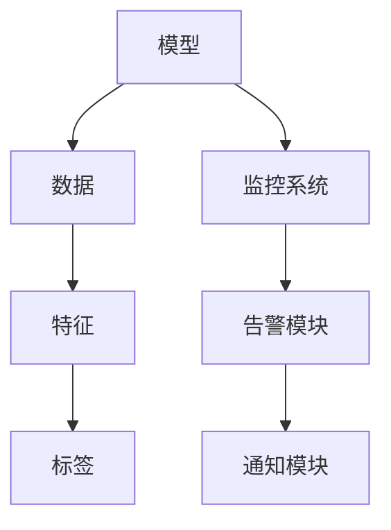
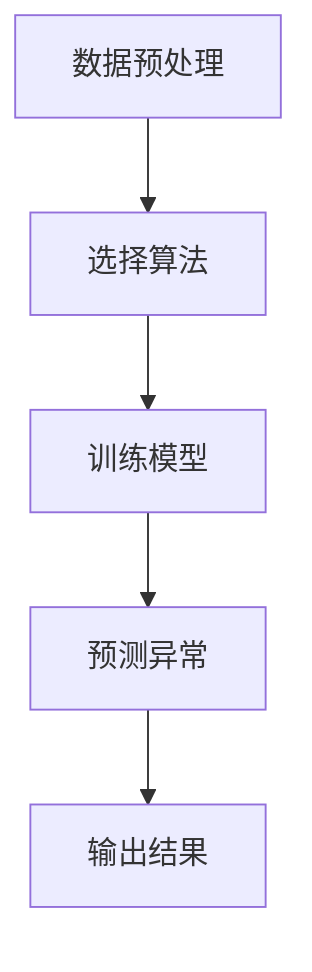
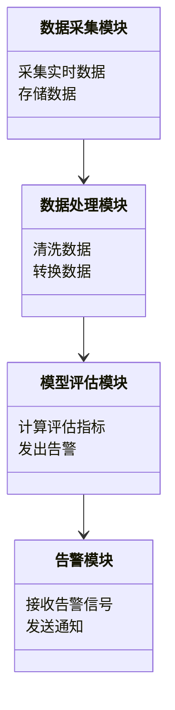

                 


# 模型监控：实时跟踪AI Agent的健康状态

**关键词**：模型监控、AI Agent、实时跟踪、健康状态、模型性能、数据监控、异常检测

**摘要**：模型监控是确保AI Agent在动态变化的环境中保持高性能和稳定性的关键。本文将深入探讨模型监控的核心概念、算法原理、系统架构设计以及实际项目中的实现，帮助读者全面理解并有效实施模型监控策略。

---

## 第1章: 模型监控的定义与背景

### 1.1 模型监控的核心概念

#### 1.1.1 模型监控的定义
模型监控是指对AI模型在运行过程中的性能、数据分布和行为进行实时或定期的检查和评估，以确保模型的准确性和稳定性。通过监控，可以及时发现模型性能下降、数据分布变化等问题，并采取相应的措施进行优化和修复。

#### 1.1.2 AI Agent的定义与特点
AI Agent（人工智能代理）是一种能够感知环境、自主决策并执行任务的智能实体。AI Agent的核心特点包括自主性、反应性、目标导向和社会能力。模型监控在AI Agent的应用中至关重要，因为它能够确保Agent在复杂环境中的表现始终符合预期。

#### 1.1.3 模型监控的背景与意义
随着AI技术的广泛应用，模型监控的需求日益增长。在金融、医疗、自动驾驶等领域，AI模型的决策直接影响业务成果和用户安全。然而，模型在运行过程中可能会因数据漂移、算法老化等原因导致性能下降。通过实时监控，可以及时发现并解决这些问题，确保AI系统的稳定性和可靠性。

---

### 1.2 模型监控的挑战与解决方案

#### 1.2.1 模型漂移的定义与影响
模型漂移是指模型在运行过程中，由于数据分布的变化或模型性能的下降，导致预测结果与实际结果出现偏差的现象。模型漂移会直接影响模型的准确性和可靠性，需要通过持续监控和优化来解决。

#### 1.2.2 数据分布变化的挑战
数据分布变化是模型漂移的主要原因之一。在实际应用中，数据的分布可能因为用户行为变化、环境变化等因素而发生改变。例如，在推荐系统中，用户的偏好可能随着时间推移而变化，导致模型的预测能力下降。

#### 1.2.3 模型性能下降的解决方案
针对模型性能下降的问题，可以通过以下方法进行解决：
1. **定期重新训练模型**：根据最新的数据重新训练模型，以适应数据分布的变化。
2. **在线更新模型**：采用增量学习的方法，逐步更新模型参数，减少离线训练的时间和资源消耗。
3. **监控和预警**：通过实时监控模型的性能指标，及时发现并预警性能下降的问题。

---

### 1.3 模型监控的边界与外延

#### 1.3.1 监控的边界范围
模型监控的边界包括以下几个方面：
- **数据范围**：监控的数据仅限于模型输入和输出的数据。
- **模型范围**：监控的对象仅限于模型本身，不包括模型之外的系统组件。
- **时间范围**：监控的时间范围可以是实时或定期的，具体取决于应用场景的需求。

#### 1.3.2 模型监控与其他AI技术的关系
模型监控是AI系统中不可或缺的一部分，它与数据预处理、特征工程、模型训练和部署等环节密切相关。通过监控，可以发现数据预处理中的问题，评估特征工程的效果，并为模型的优化提供数据支持。

#### 1.3.3 模型监控的外延领域
模型监控的外延领域包括：
- **数据质量管理**：通过监控数据的质量，确保数据的准确性和完整性。
- **模型可解释性分析**：通过监控模型的可解释性，发现模型决策中的潜在问题。
- **系统安全性评估**：通过监控模型的运行状态，评估系统的安全性。

---

### 1.4 模型监控的核心要素组成

#### 1.4.1 数据采集与处理
数据采集是模型监控的第一步，需要从数据源中获取实时或历史数据，并进行清洗、转换和预处理，以满足模型监控的需求。

#### 1.4.2 模型评估指标
模型评估指标是衡量模型性能的重要依据，包括准确率、召回率、F1值、均方误差（MSE）等。通过监控这些指标的变化，可以及时发现模型性能下降的问题。

#### 1.4.3 监控系统的架构
模型监控系统的架构包括数据采集模块、数据处理模块、模型评估模块和告警模块。通过合理的架构设计，可以确保监控系统的高效运行和可扩展性。

---

## 第2章: 模型监控的核心概念与联系

### 2.1 模型监控的维度分析

#### 2.1.1 模型准确性监控
模型准确性监控是通过评估模型的预测结果与真实结果的差异，发现模型性能下降的问题。常用的评估指标包括准确率、召回率和F1值。

#### 2.1.2 模型可用性监控
模型可用性监控是指通过检查模型的运行状态，确保模型在运行过程中不会出现崩溃、卡顿等问题。这可以通过监控模型的运行时间和资源消耗来实现。

#### 2.1.3 模型可解释性监控
模型可解释性监控是通过分析模型的决策过程，发现模型决策中的潜在问题。例如，可以通过监控模型的特征重要性变化，发现模型决策中的偏见或不公平现象。

---

### 2.2 模型监控的核心算法原理

#### 2.2.1 统计分析方法
统计分析方法是模型监控的重要工具，常用的统计方法包括均值、方差、标准差等。通过统计分析，可以发现数据分布的变化，从而判断模型是否发生漂移。

#### 2.2.2 异常检测算法
异常检测算法是通过分析数据的分布特征，发现异常数据点。常用的异常检测算法包括基于统计的孤立森林算法和基于机器学习的One-Class SVM算法。

#### 2.2.3 模型性能评估指标
模型性能评估指标是衡量模型性能的重要依据，常用的指标包括准确率、召回率、F1值、AUC等。通过监控这些指标的变化，可以及时发现模型性能下降的问题。

---

### 2.3 模型监控的实体关系图



---

## 第3章: 统计分析与异常检测

### 3.1 统计分析方法

#### 3.1.1 均值与标准差的计算
均值和标准差是常用的统计指标，用于衡量数据的集中趋势和离散程度。均值的计算公式如下：
$$\mu = \frac{1}{n}\sum_{i=1}^{n}x_i$$
标准差的计算公式如下：
$$\sigma^2 = \frac{1}{n}\sum_{i=1}^{n}(x_i - \mu)^2$$

#### 3.1.2 假设检验的基本原理
假设检验是一种统计方法，用于判断数据分布的变化是否显著。常用的假设检验方法包括t检验和卡方检验。

#### 3.1.3 统计模型在监控中的应用
统计模型可以用于分析数据分布的变化，发现数据漂移的现象。例如，可以通过t检验判断模型预测结果的变化是否显著。

### 3.2 异常检测算法

#### 3.2.1 基于统计的异常检测
基于统计的异常检测方法通过分析数据的分布特征，判断数据点是否为异常。例如，孤立森林算法可以通过计算数据点的孤立程度，发现异常数据点。

#### 3.2.2 基于机器学习的异常检测
基于机器学习的异常检测方法通过训练模型，学习正常数据的分布特征，从而发现异常数据点。例如，One-Class SVM算法可以通过训练模型，学习正常数据的分布，并将异常数据点标记为异常。

#### 3.2.3 异常检测算法的流程图



---

## 第4章: 系统分析与架构设计

### 4.1 系统功能设计

#### 4.1.1 领域模型
领域模型是系统功能设计的重要组成部分，用于描述系统的功能模块和它们之间的关系。领域模型的类图如下：



---

## 第5章: 项目实战

### 5.1 环境安装

#### 5.1.1 安装Python和相关库
需要安装的Python库包括Pandas、NumPy、Scikit-learn和Flask。

#### 5.1.2 安装步骤
```bash
pip install pandas numpy scikit-learn flask
```

### 5.2 系统核心实现源代码

#### 5.2.1 数据采集模块
```python
import pandas as pd
from sklearn.metrics import accuracy_score

def collect_data():
    # 采集实时数据
    data = pd.read_csv('data.csv')
    return data
```

#### 5.2.2 数据处理模块
```python
def preprocess_data(data):
    # 数据清洗和转换
    data = data.dropna()
    data = data.astype(float)
    return data
```

#### 5.2.3 模型评估模块
```python
def evaluate_model(y_true, y_pred):
    # 计算评估指标
    accuracy = accuracy_score(y_true, y_pred)
    return accuracy
```

#### 5.2.4 告警模块
```python
def send_notification(message):
    # 发送通知
    print(f"告警信息：{message}")
```

### 5.3 代码应用解读与分析
通过上述代码，可以实现数据采集、预处理、模型评估和告警功能。数据采集模块从CSV文件中读取数据，数据处理模块对数据进行清洗和转换，模型评估模块计算模型的准确率，并将结果发送到告警模块。如果准确率低于预设阈值，告警模块会发送通知。

### 5.4 实际案例分析
以一个分类任务为例，假设我们有一个分类模型，需要监控其准确率的变化。通过上述代码，可以定期采集数据，计算准确率，并根据准确率的变化情况发出告警。

---

## 第6章: 最佳实践与小结

### 6.1 最佳实践

#### 6.1.1 监控指标的选择
选择合适的监控指标非常重要。例如，对于分类任务，可以选择准确率、召回率和F1值；对于回归任务，可以选择均方误差（MSE）和平均绝对误差（MAE）。

#### 6.1.2 数据预处理的重要性
数据预处理是模型监控的基础，只有保证数据的准确性和完整性，才能有效地进行模型监控。

#### 6.1.3 模型的可解释性分析
模型的可解释性是模型监控的重要组成部分。通过分析模型的决策过程，可以发现模型决策中的潜在问题。

### 6.2 小结
模型监控是确保AI Agent在动态变化的环境中保持高性能和稳定性的关键。本文从模型监控的核心概念、算法原理、系统架构设计到实际项目中的实现进行了详细的探讨。通过合理的监控策略和高效的系统设计，可以有效降低模型性能下降的风险，提高AI系统的可靠性和稳定性。

---

**作者**：AI天才研究院/AI Genius Institute & 禅与计算机程序设计艺术 /Zen And The Art of Computer Programming

