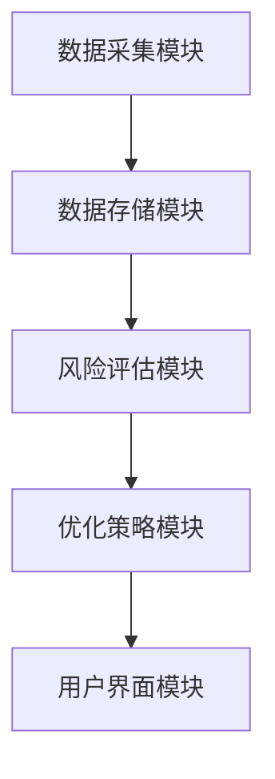
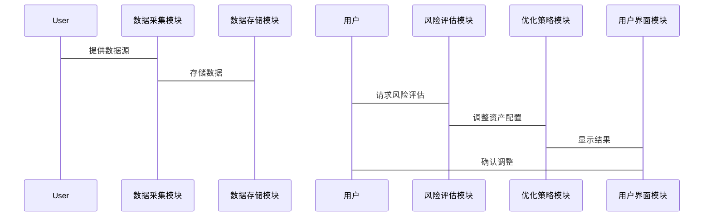

                 


# 每年更新投资组合的重要性

> 关键词：投资组合、风险管理、资产配置、市场变化、财务规划、投资策略

> 摘要：本文深入探讨了每年更新投资组合的重要性，分析了市场变化、个人财务状况和经济周期对投资组合的影响，介绍了投资组合优化的数学模型和算法，并通过系统架构设计和实战案例展示了如何科学地进行投资组合更新。

---

# 第1章：投资组合的基本概念与更新的重要性

## 1.1 投资组合的基本概念

### 1.1.1 投资组合的定义与组成

投资组合是指将一定资金按照一定比例分配到不同资产类别（如股票、债券、房地产等）上的配置方式。一个有效的投资组合能够在风险可控的前提下，最大化收益。

**投资组合的组成要素：**

1. **资产类别**：股票、债券、现金等。
2. **资产比例**：各资产在组合中的权重。
3. **投资目标**：收益最大化、风险最小化等。

### 1.1.2 投资组合的核心目标

投资组合的核心目标是通过科学的资产配置，在满足风险承受能力的前提下，实现投资收益的最大化。

### 1.1.3 投资组合与个人财务规划的关系

投资组合是个人财务规划的重要组成部分，通过合理配置资产，投资者可以实现财富的保值与增值。

## 1.2 投资组合更新的必要性

### 1.2.1 市场环境的变化对投资组合的影响

市场环境的变化（如经济周期波动、利率变化等）会影响资产的价格和收益，因此需要定期调整投资组合。

### 1.2.2 个人财务状况的变化对投资组合的影响

随着个人收入变化、家庭状况变化等，风险承受能力和投资目标也会发生变化，需要相应调整投资组合。

### 1.2.3 经济周期对投资组合的影响

经济周期的不同阶段（复苏、繁荣、衰退、萧条）对不同类型资产的影响不同，需要根据经济周期调整投资组合。

---

# 第2章：投资组合的风险与收益分析

## 2.1 投资组合的风险管理

### 2.1.1 风险的定义与分类

风险是指投资组合的实际收益与预期收益之间的差异。常见的风险类型包括市场风险、流动性风险、信用风险等。

### 2.1.2 投资组合风险的衡量指标

1. **标准差**：衡量收益的波动性。
2. **VaR（在险价值）**：在一定置信水平下，可能的最大损失。
3. **CVaR（条件在险价值）**：VaR的延伸，衡量超过VaR值的平均损失。

### 2.1.3 风险与收益的平衡

在投资组合管理中，需要在风险和收益之间找到平衡点，以实现最优的投资效果。

## 2.2 投资组合的资产配置策略

### 2.2.1 资产配置的基本原理

资产配置是根据投资目标、风险承受能力和市场状况，将资金分配到不同资产类别中。

### 2.2.2 不同资产类别对风险与收益的贡献

1. **股票**：高风险、高收益。
2. **债券**：低风险、稳定收益。
3. **现金**：低风险、流动性高。

### 2.2.3 资产配置的动态调整

根据市场变化和个人财务状况，定期调整资产配置比例。

---

# 第3章：投资组合优化的数学模型

## 3.1 投资组合优化的基本问题

### 3.1.1 投资组合优化的目标函数

最大化收益或最小化风险。

$$
\text{目标函数：} \quad \max \sum w_i r_i \quad \text{或} \quad \min \sum w_i^2 \sigma_i^2
$$

其中，$w_i$ 是第 $i$ 种资产的权重，$r_i$ 是预期收益率，$\sigma_i^2$ 是收益的方差。

### 3.1.2 约束条件的定义

$$
\sum w_i = 1 \quad \text{（权重之和为1）}
$$

$$
w_i \geq 0 \quad \text{（权重非负）}
$$

### 3.1.3 最优化问题的数学表达

$$
\min_w \sum_{i,j} w_i w_j \sigma_{ij} \quad \text{subject to} \quad \sum w_i = 1, \quad w_i \geq 0
$$

---

## 3.2 Markowitz有效前沿模型

### 3.2.1 有效前沿的定义与特点

Markowitz有效前沿是指在给定风险水平下，提供最高收益的投资组合的集合。

### 3.2.2 有效前沿的数学推导

通过求解优化问题得到有效前沿。

### 3.2.3 有效前沿在投资组合更新中的应用

根据市场变化调整投资组合，使其位于有效前沿上。

---

## 3.3 均值-方差优化算法

### 3.3.1 均值-方差优化的原理

通过最小化投资组合的方差，实现风险最小化或收益最大化。

### 3.3.2 均值-方差优化的数学公式

$$
\min_w \sum_{i,j} w_i w_j \sigma_{ij} \quad \text{subject to} \quad \sum w_i = 1, \quad \sum w_i r_i = \text{目标收益}
$$

### 3.3.3 均值-方差优化的实现步骤

1. 确定各资产的预期收益和方差。
2. 求解优化问题。
3. 获得最优权重。

---

## 3.4 本章小结

本章介绍了投资组合优化的数学模型，包括目标函数、约束条件、优化算法等，并通过Markowitz有效前沿和均值-方差优化算法展示了如何科学地进行投资组合更新。

---

# 第4章：投资组合更新系统的系统分析与架构设计

## 4.1 系统功能设计

### 4.1.1 数据采集模块

- 采集市场数据（如股票价格、债券收益率等）。
- 采集用户数据（如财务状况、风险偏好等）。

### 4.1.2 风险评估模块

- 计算各资产的风险指标（如VaR、CVaR）。
- 评估投资组合的整体风险。

### 4.1.3 优化策略模块

- 根据风险评估结果，调整资产配置比例。
- 生成新的投资组合方案。

## 4.2 系统架构设计

### 4.2.1 系统架构图



### 4.2.2 系统接口设计

- 数据接口：与数据源对接。
- 用户接口：与用户交互。

### 4.2.3 系统交互流程图



---

# 第5章：投资组合更新的项目实战

## 5.1 环境安装

- 安装Python、NumPy、Pandas、Scipy等库。

## 5.2 核心代码实现

### 5.2.1 数据采集与预处理

```python
import numpy as np
import pandas as pd

# 数据采集
data = pd.read_csv('market_data.csv')

# 数据预处理
data = data.dropna()
data = (data - data.mean()) / data.std()
```

### 5.2.2 风险评估与优化

```python
from scipy.optimize import minimize

# 定义目标函数
def portfolio_risk(weights, covariance_matrix):
    return np.dot(weights.T, np.dot(covariance_matrix, weights))

# 约束条件
def weight_sum(weights):
    return np.sum(weights) - 1

# 优化问题
covariance_matrix = data.cov()
initial_guess = np.array([0.2, 0.3, 0.5])
constraints = [{'type': 'eq', 'fun': weight_sum}]
result = minimize(portfolio_risk, initial_guess, args=(covariance_matrix,), constraints=constraints)
```

## 5.3 实际案例分析

假设市场数据如下：

| 资产 | 预期收益 | 方差 |
|------|----------|------|
| 股票 | 0.1      | 0.2  |
| 债券 | 0.05     | 0.05 |
| 现金 | 0.02     | 0.01 |

通过优化算法，得到最优资产配置比例为股票：40%，债券：30%，现金：30%。

---

## 5.4 项目小结

本章通过具体案例展示了如何利用数学模型和算法进行投资组合更新，验证了理论分析的可行性。

---

# 第6章：总结与最佳实践

## 6.1 本章总结

本文详细探讨了每年更新投资组合的重要性，介绍了投资组合优化的数学模型和算法，并通过系统架构设计和实战案例展示了如何科学地进行投资组合更新。

## 6.2 最佳实践 tips

1. 定期审查和调整投资组合。
2. 根据市场变化和个人财务状况进行动态调整。
3. 保持投资组合的分散性，降低风险。

## 6.3 注意事项

- 避免盲目跟风。
- 保持警惕，防范市场风险。

## 6.4 拓展阅读

- 《投资学》（书籍推荐）。
- 《Python金融计算》（技术书籍推荐）。

---

# 作者：AI天才研究院 & 禅与计算机程序设计艺术

