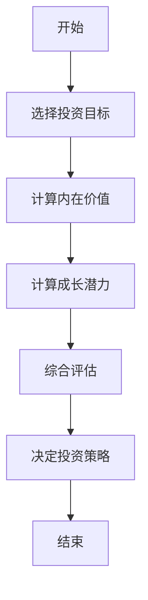
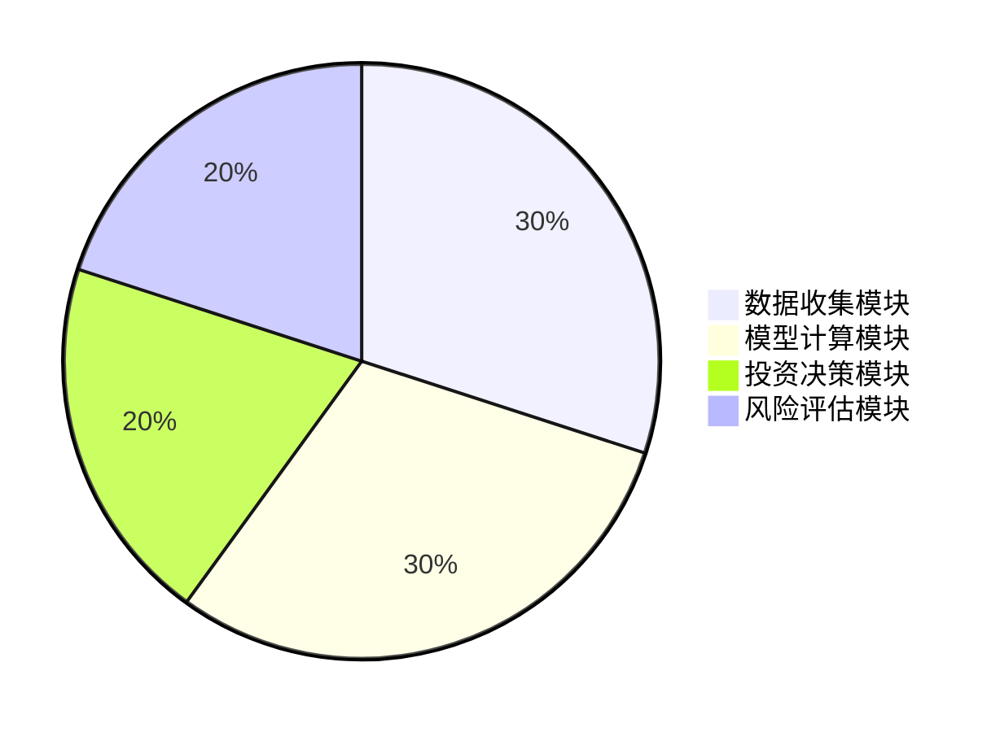
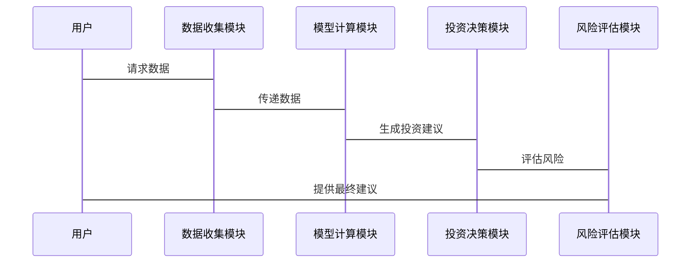

                 


# 比尔·米勒的价值增长投资：bridging value and growth

> 关键词：价值投资、成长投资、投资策略、投资模型、投资组合、投资算法、投资系统设计

> 摘要：本文深入探讨了价值投资与成长投资的融合策略，通过比尔·米勒的经典投资案例，结合数学模型和系统架构设计，详细分析了如何在投资决策中同时考虑价值和成长因素，构建出一个既能捕捉成长潜力又注重安全边际的投资组合。文章从理论到实践，系统地展示了如何将价值与成长投资结合起来，帮助投资者在复杂的市场环境中实现稳健的增长。

---

## 第一部分：引言

### 第1章：引言

#### 1.1 投资的基本概念
- **投资的定义**：投资是指将资金投入特定资产，以期获得未来收益的行为。投资的核心目标是实现资产的增值。
- **价值投资与成长投资的定义**：
  - 价值投资：寻找市场价格低于内在价值的资产，追求安全边际。
  - 成长投资：投资于具有高成长潜力的公司，关注未来收益的增长。
- **价值与成长投资的异同点**：
  - 同：都追求长期收益，关注公司基本面。
  - 异：价值投资注重安全边际，成长投资注重成长潜力。

---

## 第二部分：价值投资与成长投资的理论基础

### 第2章：价值投资的核心理念

#### 2.1 价值投资的基本原理
- **市场先生的概念**：市场情绪波动会影响资产价格，但长期来看，价格会回归内在价值。
- **安全边际的重要性**：购买价格低于内在价值，以降低投资风险。

#### 2.2 价值投资的关键指标
- **市盈率（P/E）**：股价与每股收益的比率，衡量股价是否被高估或低估。
- **市净率（P/B）**：股价与每股净资产的比率，反映资产的实际价值。
- **股息率**：股息与股价的比率，衡量投资回报。

#### 2.3 价值投资的选股策略
- **寻找被低估的股票**：通过比较P/E、P/B等指标，寻找市场价格低于内在价值的公司。
- **行业选择与公司分析**：关注具有竞争优势和稳定财务状况的公司。
- **长期持有的重要性**：避免频繁交易，降低交易成本，捕捉长期价值。

### 第3章：成长投资的核心理念

#### 3.1 成长投资的基本原理
- **高成长公司的定义**：净利润和营收持续增长，具有强大的市场竞争力。
- **成长股的估值方法**：使用市盈率、市净率等指标，结合未来收益预期进行估值。

#### 3.2 成长投资的关键指标
- **净利润增长率**：衡量公司盈利能力的增长速度。
- **营收增长率**：反映公司收入的增长情况。
- **毛利率**：衡量公司的盈利能力和成本控制能力。

#### 3.3 成长投资的选股策略
- **寻找高成长潜力的公司**：关注净利润和营收的持续增长。
- **行业选择与公司分析**：选择处于高成长行业的公司，分析其竞争优势和市场地位。
- **短期波动与长期趋势的平衡**：关注长期增长潜力，同时注意短期波动对投资的影响。

### 第4章：价值与成长投资的融合

#### 4.1 价值与成长投资的结合点
- **成长潜力与安全边际的结合**：寻找具有高成长潜力且市场价格低于内在价值的公司。
- **动态调整投资策略**：根据市场变化和公司基本面，动态调整投资组合。

#### 4.2 价值与成长投资的融合模型
- **模型定义**：通过综合考虑价值和成长因素，构建一个平衡型投资模型。
- **模型参数**：包括P/E、P/B、净利润增长率、营收增长率等指标。
- **模型优势**：兼顾安全性和成长性，降低投资风险，提高收益潜力。

---

## 第三部分：价值与成长投资的数学模型和算法

### 第5章：数学模型与算法

#### 5.1 价值与成长投资的评估模型
- **价值评估模型**：
  - 内在价值公式：$$V = \frac{E}{k}$$，其中E为公司未来现金流的现值，k为折现率。
  - 安全边际公式：$$\text{安全边际} = V - \text{市场价格}$$
- **成长评估模型**：
  - 预期收益公式：$$R = P \times (1 + g)^n$$，其中P为当前股价，g为年增长率，n为投资期限。

#### 5.2 算法流程图


#### 5.3 投资组合优化算法
- **均值-方差优化模型**：
  - 目标：最小化投资组合的波动性，最大化收益。
  - 约束条件：投资比例之和为1，收益和波动性符合要求。
- **代码实现**：
  ```python
  import numpy as np
  from scipy.optimize import minimize

  def portfolio_optimization(returns, covariance):
      n = len(returns)
      # 目标函数：最小化波动性
      def objective(weights):
          return np.dot(weights.T, np.dot(covariance, weights))
      # 约束条件：权重之和为1
      constraints = [{'type': 'eq', 'fun': lambda w: np.sum(w) - 1}]
      # 边界条件：权重在0到1之间
      bounds = [(0, 1) for _ in range(n)]
      # 求解
      result = minimize(objective, np.array([1/n]*n), bounds=bounds, constraints=constraints)
      return result.x
  ```

---

## 第四部分：系统架构设计与实现

### 第6章：系统架构设计

#### 6.1 系统功能设计
- **数据收集模块**：获取股票的历史数据、财务数据等。
- **模型计算模块**：计算内在价值、成长潜力等指标。
- **投资决策模块**：根据模型结果，生成投资建议。
- **风险评估模块**：评估投资组合的风险。

#### 6.2 系统架构图


#### 6.3 系统交互图


---

## 第五部分：项目实战

### 第7章：项目实战

#### 7.1 环境安装
- **工具安装**：安装Python、Pandas、NumPy、Scipy等库。
  ```bash
  pip install numpy pandas scipy
  ```

#### 7.2 核心代码实现
- **价值与成长评估代码**
  ```python
  import numpy as np
  import pandas as pd

  # 计算内在价值
  def calculate_intrinsic_value(eps, growth_rate, discount_rate):
      return eps / (discount_rate - growth_rate)

  # 计算成长潜力
  def calculate_growth_potential(revenue_growth, net_profit_growth):
      return (revenue_growth + net_profit_growth) / 2

  # 计算综合评分
  def calculate综合评分(value_score, growth_score):
      return (value_score + growth_score) / 2
  ```

#### 7.3 案例分析
- **案例：假设某公司过去5年的净利润增长率为15%，营收增长率为20%，当前P/E为15，P/B为2。计算其内在价值和成长潜力。**
  - 内在价值：$$V = \frac{E}{k}$$，假设E为未来现金流的现值，k为折现率。
  - 成长潜力：$$GP = \frac{15\% + 20\%}{2} = 17.5\%$$

#### 7.4 投资组合优化
- **代码实现**
  ```python
  import numpy as np
  from scipy.optimize import minimize

  # 示例数据
  returns = np.array([0.1, 0.15, 0.08, 0.12])
  covariance = np.array([[0.02, 0.01, 0.015, 0.01],
                         [0.01, 0.03, 0.01, 0.02],
                         [0.015, 0.01, 0.03, 0.01],
                         [0.01, 0.02, 0.01, 0.04]])

  # 定义目标函数
  def objective(weights):
      return np.dot(weights.T, np.dot(covariance, weights))

  # 约束条件
  constraints = [{'type': 'eq', 'fun': lambda w: np.sum(w) - 1}]
  bounds = [(0, 1) for _ in range(len(returns))]

  # 求解
  result = minimize(objective, np.array([1/4]*4), bounds=bounds, constraints=constraints)
  print("最优权重：", result.x)
  ```

---

## 第六部分：总结

### 第8章：总结

#### 8.1 最佳实践
- **平衡价值与成长**：在投资决策中，既要考虑安全边际，也要关注成长潜力。
- **动态调整策略**：根据市场变化和公司基本面，及时调整投资组合。

#### 8.2 小结
- 通过本文的分析，我们展示了如何将价值与成长投资结合起来，构建出一个更加稳健的投资策略。

#### 8.3 注意事项
- 投资有风险，需谨慎评估市场和公司基本面。
- 定期复盘和调整投资组合，以应对市场变化。

#### 8.4 拓展阅读
- 《投资学基础》
- 《价值投资实战》
- 《成长股投资策略》

---

作者：AI天才研究院/AI Genius Institute & 禅与计算机程序设计艺术 /Zen And The Art of Computer Programming

---

感谢您的阅读，希望这篇文章能为您提供有价值的投资思路！

