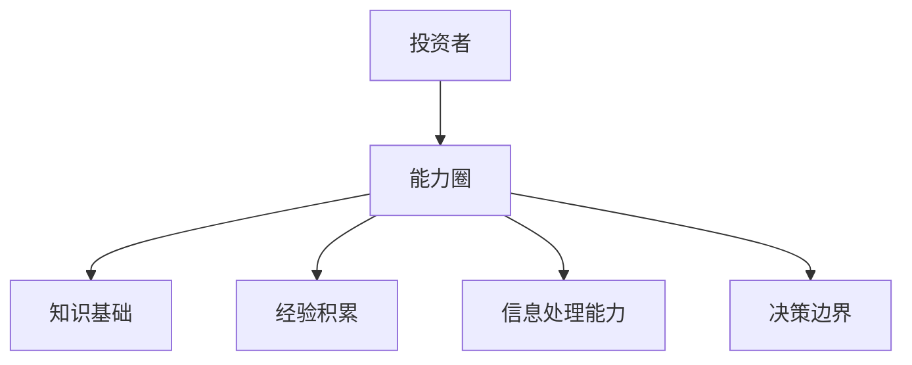
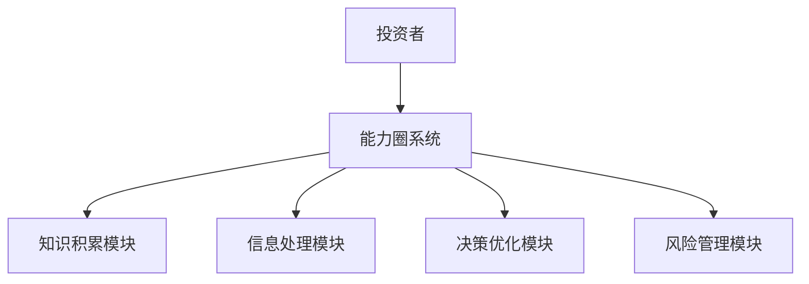
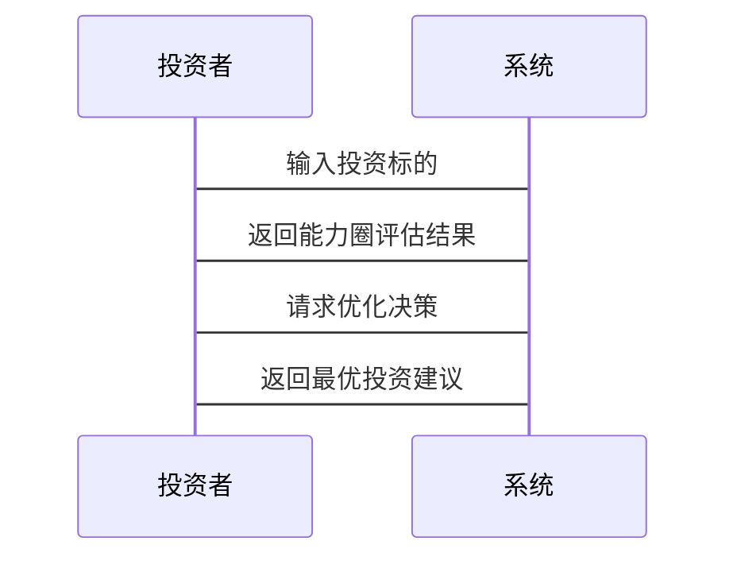

                 


# 沃伦·巴菲特的Circle of Competence理论

> 关键词：能力圈理论，巴菲特投资哲学，风险管理，投资决策，价值投资，决策模型

> 摘要：本文详细阐述了沃伦·巴菲特的Circle of Competence（能力圈）理论，从理论背景、核心概念、算法原理、系统设计到实际应用，结合技术语言和逻辑分析，深入剖析了该理论在投资决策中的应用及其对风险管理的重要性。通过案例分析和系统设计，展示了如何将能力圈理论应用于实际投资场景中，帮助投资者构建稳健的投资策略。

---

## 第一部分: 背景介绍

### 第1章: 能力圈理论的背景与基础

#### 1.1 问题背景

在投资领域，投资者常常面临信息不对称、市场波动剧烈以及决策复杂性高等挑战。传统投资理论虽然提供了许多工具和方法，但往往忽略了投资者认知的局限性和心理偏差对决策的影响。这些问题导致投资者在实际操作中容易陷入过度自信、盲目跟风或决策失误的陷阱。

#### 1.2 问题描述

巴菲特的能力圈理论正是针对这些问题提出的。它强调投资者应专注于自己熟悉且理解的领域，避免超出自身能力范围的投资决策。能力圈理论的核心在于：投资者只有在对标的资产有深刻理解的情况下，才能做出明智的投资决策。

#### 1.3 问题解决

能力圈理论通过以下几个方面解决了传统投资理论的局限性：
- **认知边界**：明确投资者的知识盲区和能力范围。
- **风险管理**：通过限制投资领域，降低投资组合的整体风险。
- **决策优化**：通过聚焦核心能力领域，提高决策的准确性和效率。

#### 1.4 边界与外延

能力圈理论的边界在于投资者的知识、经验和信息处理能力。外延则包括与之相关的投资策略、风险管理模型以及决策优化方法。能力圈理论与其他投资理论（如价值投资、趋势投资）有显著区别，它更强调个体认知的局限性和能力范围的重要性。

---

## 第二部分: 核心概念与联系

### 第2章: 核心概念解析

#### 2.1 核心概念原理

能力圈理论的核心概念包括以下几个方面：
- **知识基础**：投资者对某一领域的深入了解和专业知识。
- **经验积累**：通过长期实践形成的投资直觉和判断能力。
- **信息处理能力**：高效筛选和处理信息，识别投资机会和风险。
- **决策边界**：明确的能力范围，避免越界投资。

#### 2.2 概念属性特征对比表格

| 概念属性 | 特征描述 |
|----------|----------|
| 知识基础 | 需要深入理解的领域，如行业、商业模式、财务数据等 |
| 经验积累 | 长期实践形成的直觉和判断力，能够快速识别潜在风险和机会 |
| 信息处理能力 | 高效筛选和处理信息的能力，能够从海量数据中提炼关键信息 |
| 决策边界 | 明确的能力范围，避免超出自身知识和经验的领域 |

#### 2.3 ER实体关系图



---

## 第三部分: 算法原理讲解

### 第3章: 能力圈理论的数学模型与算法

#### 3.1 理论基础

能力圈理论可以看作是一种基于概率论和决策树的优化模型。以下是其数学模型的核心公式：

$$ P(\text{成功}) = \sum_{i=1}^{n} P(\text{能力圈}) \times P(\text{成功|能力圈}) $$

其中：
- $P(\text{能力圈})$ 表示投资者在能力圈内的概率。
- $P(\text{成功|能力圈})$ 表示在能力圈内成功的概率。

#### 3.2 投资决策优化算法

能力圈理论的决策优化算法可以通过以下步骤实现：

1. **能力圈划分**：将投资领域划分为能力圈内和能力圈外。
2. **概率评估**：对能力圈内和外的投资标的进行概率评估。
3. **决策优化**：通过概率优化，选择能力圈内的高概率标的进行投资。

以下是该算法的伪代码实现：

```python
def compute_ability_circle_probabilities():
    # 初始化能力圈内的概率
    circle_prob = 0.8  # 假设能力圈内的概率为80%
    outside_prob = 0.2  # 能力圈外的概率为20%
    
    # 计算总的成功概率
    total_success_prob = circle_prob * 0.95 + outside_prob * 0.2
    return total_success_prob

# 示例调用
total_success_prob = compute_ability_circle_probabilities()
print(f"总的成功概率为：{total_success_prob}")
```

---

## 第四部分: 系统分析与架构设计方案

### 第4章: 投资能力圈系统设计

#### 4.1 系统功能设计

- **领域模型**：基于能力圈理论构建的领域模型，包括知识基础、经验积累、信息处理能力和决策边界四个核心模块。
- **系统架构**：采用模块化设计，每个模块负责不同的功能，如知识积累模块、信息处理模块等。

#### 4.2 系统架构图



#### 4.3 接口设计与交互流程图



---

## 第五部分: 项目实战

### 第5章: 能力圈理论的实际应用

#### 5.1 项目环境安装

为了实现能力圈评估系统，需要以下环境：

- Python 3.8+
- 基础的Python库（numpy、pandas、scikit-learn）

#### 5.2 核心代码实现

以下是能力圈评估系统的Python代码示例：

```python
import numpy as np
import pandas as pd

def ability_circle_analysis(data):
    # 数据预处理
    data['能力圈'] = data['知识基础'] * data['经验积累'] * data['信息处理能力']
    # 计算能力圈内的概率
    circle_prob = data['能力圈'].mean()
    return circle_prob

# 示例数据
data = pd.DataFrame({
    '知识基础': [0.8, 0.7, 0.9],
    '经验积累': [0.7, 0.8, 0.6],
    '信息处理能力': [0.9, 0.8, 0.7]
})

# 调用函数
circle_prob = ability_circle_analysis(data)
print(f"能力圈内的平均概率为：{circle_prob}")
```

#### 5.3 案例分析与解读

假设我们有一个包含多个投资标的的数据集，通过能力圈评估系统，我们可以筛选出能力圈内的优质标的，并进行投资决策。例如，对于一个价值投资者来说，能力圈内的标的可能是那些具有稳定财务表现和良好商业模式的公司。

---

## 第六部分: 最佳实践与小结

### 第6章: 最佳实践与总结

#### 6.1 小结

能力圈理论为投资者提供了一种科学的投资决策方法，通过明确能力范围和优化投资策略，帮助投资者在复杂多变的市场中做出更明智的决策。

#### 6.2 注意事项

- 定期评估和调整能力圈。
- 避免盲目扩展能力范围。
- 结合其他投资理论进行综合分析。

#### 6.3 拓展阅读

- 巴菲特的其他投资哲学，如价值投资、安全边际理论。
- 行为金融学中的认知偏差研究。
- 投资组合优化的现代数学模型。

---

## 作者信息

作者：AI天才研究院/AI Genius Institute & 禅与计算机程序设计艺术 /Zen And The Art of Computer Programming

---

本文通过系统化的方法，深入剖析了能力圈理论在投资决策中的应用，结合技术语言和实际案例，为读者提供了一种全新的视角来理解巴菲特的投资哲学。希望本文能为投资者在实际操作中提供有价值的参考和启发。

