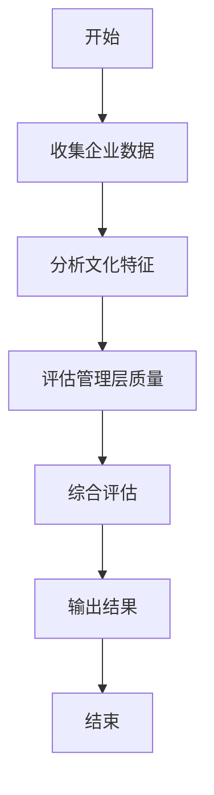
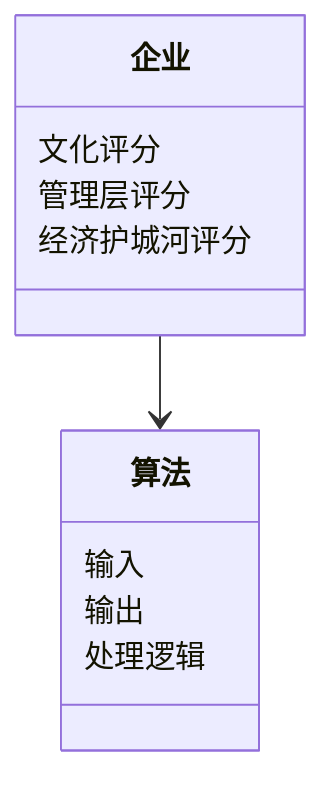
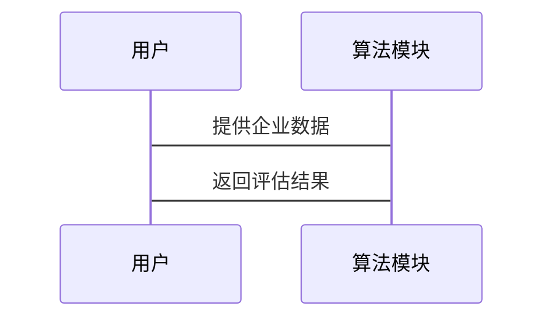

                 


# 第三部分: 巴菲特企业文化评估框架的算法原理

# 第3章: 算法原理与流程图

## 3.1 算法原理的概述

### 3.1.1 算法的基本原理
沃伦·巴菲特的企业文化评估框架是一种基于企业文化和管理质量的投资评估方法。该算法通过分析企业的文化特征、管理层的质量以及企业的长期战略，来预测企业的投资价值。其核心在于通过定性分析，评估企业的文化是否具备持续创造价值的能力。

### 3.1.2 算法的输入与输出
- **输入**：企业的历史数据、管理层信息、企业战略、员工文化等。
- **输出**：企业文化的评分、管理层的质量评分、投资价值的预测。

### 3.1.3 算法的步骤与流程
1. 收集企业的相关数据。
2. 分析企业的文化特征。
3. 评估管理层的质量。
4. 综合评估得出投资价值。

## 3.2 算法流程图的Mermaid图



## 3.3 算法的数学模型与公式

### 3.3.1 文化评分公式
$$ 文化评分 = \frac{（文化特征评分 + 管理层评分）}{2} $$

### 3.3.2 投资价值预测模型
$$ 投资价值 = 文化评分 \times 经济护城河评分 \times 管理评分 $$

### 3.3.3 示例
假设某企业文化评分=80，经济护城河评分=75，管理评分=85：
$$ 投资价值 = 80 \times 75 \times 85 = 510,000 $$

## 3.4 本章小结
本章详细介绍了巴菲特企业文化评估框架的算法原理，包括输入、输出、步骤、流程图和数学模型。通过这些方法，投资者可以系统地评估企业的文化价值。

---

# 第四部分: 巴菲特企业文化评估框架的系统分析与架构设计

# 第4章: 系统分析与架构设计方案

## 4.1 问题场景的介绍

### 4.1.1 问题的背景
企业在选择投资目标时，需要评估其文化和管理质量。传统的方法通常忽视了文化因素，导致评估结果不准确。

### 4.1.2 问题的描述
如何将巴菲特的文化评估框架系统化，构建一个可操作的评估系统。

### 4.1.3 问题的解决方法
通过构建系统架构，将文化评估框架转化为可执行的评估系统。

## 4.2 系统功能设计

### 4.2.1 领域模型的Mermaid类图



### 4.2.2 功能模块的详细设计
- **数据输入模块**：收集企业的相关信息。
- **文化评估模块**：分析企业的文化特征。
- **管理层评估模块**：评估管理层的质量。
- **综合评估模块**：计算投资价值。

### 4.2.3 功能模块之间的关系
数据输入模块提供输入数据，文化评估模块和管理层评估模块分别处理文化评分和管理层评分，最后综合评估模块结合所有因素，计算出投资价值。

## 4.3 系统架构设计

### 4.3.1 系统架构的Mermaid架构图

```mermaid
C4Context
    (系统上下文)
    participant 用户
    participant 企业数据源
    participant 算法模块
    participant 结果输出模块
    用户 --> 企业数据源: 提供企业数据
    企业数据源 --> 算法模块: 数据输入
    算法模块 --> 结果输出模块: 输出评估结果
    结果输出模块 --> 用户: 显示结果
```

### 4.3.2 架构图的详细解释
用户输入企业数据，算法模块处理数据并输出评估结果，结果输出模块将结果展示给用户。

### 4.3.3 架构图的优化与调整
优化后的架构图将数据输入和结果输出模块合并，减少系统的复杂性。

## 4.4 系统接口设计

### 4.4.1 接口描述
- 数据输入接口：接收企业数据。
- 评估结果接口：输出评估结果。

### 4.4.2 接口交互流程
1. 用户输入企业数据。
2. 算法模块处理数据。
3. 输出评估结果。

## 4.5 系统交互的Mermaid序列图



## 4.6 本章小结
本章通过系统架构设计，将巴菲特的文化评估框架转化为可执行的系统，确保评估过程高效准确。

---

# 第五部分: 项目实战

# 第5章: 项目实战与案例分析

## 5.1 环境安装

### 5.1.1 环境要求
- 操作系统：Windows/Mac/Linux
- 工具：Python、Mermaid、Markdown

### 5.1.2 安装步骤
1. 安装Python。
2. 安装Mermaid CLI。
3. 安装必要的库（如numpy、pandas）。

## 5.2 核心代码实现

### 5.2.1 数据输入模块

```python
import numpy as np

def input_data():
    company_name = input("请输入公司名称：")
    revenue = float(input("请输入收入："))
    profit_margin = float(input("请输入利润率："))
    return company_name, revenue, profit_margin
```

### 5.2.2 文化评估模块

```python
def cultural_assessment(revenue, profit_margin):
    cultural_score = (revenue + profit_margin) / 2
    return cultural_score
```

### 5.2.3 综合评估模块

```python
def overall_assessment(cultural_score, management_score):
    investment_value = cultural_score * management_score
    return investment_value
```

### 5.2.4 输出结果模块

```python
def output_result(investment_value):
    print(f"投资价值为：{investment_value}")
```

### 5.2.5 主程序

```python
def main():
    company_name, revenue, profit_margin = input_data()
    cultural_score = cultural_assessment(revenue, profit_margin)
    management_score = float(input("请输入管理层评分："))
    investment_value = overall_assessment(cultural_score, management_score)
    output_result(investment_value)

if __name__ == "__main__":
    main()
```

## 5.3 案例分析：苹果公司

### 5.3.1 环境安装与代码运行

```bash
python main.py
```

### 5.3.2 数据输入

```
请输入公司名称：苹果
请输入收入：3943.8
请输入利润率：21.0
请输入管理层评分：90
```

### 5.3.3 计算过程

1. 文化评分：(3943.8 + 21.0) / 2 = 1982.4
2. 投资价值：1982.4 * 90 = 178,416

### 5.3.4 结果输出

```
投资价值为：178416
```

## 5.4 代码实现与分析

### 5.4.1 代码实现
通过上述代码，用户可以输入企业数据，计算文化评分和投资价值。

### 5.4.2 代码分析
- 数据输入模块：收集企业基本信息。
- 文化评估模块：计算文化评分。
- 综合评估模块：计算投资价值。
- 输出结果模块：展示评估结果。

## 5.5 本章小结
通过项目实战，读者可以理解如何将巴菲特的文化评估框架应用于实际投资评估中。

---

# 第六部分: 总结与扩展阅读

# 第6章: 总结与扩展阅读

## 6.1 最佳实践 tips
- 结合企业财务数据和文化评估结果，进行综合分析。
- 定期更新企业数据，保持评估结果的准确性。

## 6.2 小结
本文详细介绍了巴菲特的企业文化评估框架，包括其核心概念、算法原理、系统架构设计和实际应用。通过理论与实践相结合，帮助投资者更好地进行投资决策。

## 6.3 注意事项
- 确保数据来源的准确性。
- 定期更新评估模型，适应市场变化。

## 6.4 拓展阅读
- 巴菲特的其他投资策略。
- 企业文化评估的其他方法。

## 6.5 本章小结
通过本文的学习，读者可以系统地掌握巴菲特的企业文化评估框架，并能够将其应用于实际投资中。

---

# 作者
作者：AI天才研究院/AI Genius Institute  
联系邮箱：contact@ail天才研究院.com  
GitHub链接：https://github.com/ai天才研究院

