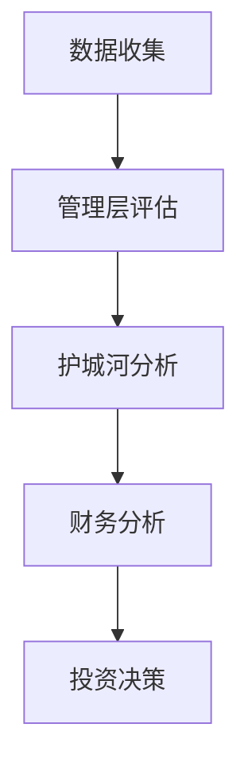

                 


# 沃伦·巴菲特的公司文化评估方法

> 关键词：沃伦·巴菲特，公司文化，管理层评估，企业护城河，投资决策

> 摘要：本文深入探讨了沃伦·巴菲特的公司文化评估方法，分析了其核心概念、评估模型和实际应用，帮助投资者更好地理解和应用这些方法。

---

# 引言

沃伦·巴菲特是世界上最著名的投资者之一，他的成功不仅源于对市场的深刻理解，更在于他对公司文化和管理层质量的高度重视。本文将详细分析巴菲特的公司文化评估方法，探讨其背后的逻辑和实际应用。

---

# 第1章: 巴菲特的公司文化评估概述

## 1.1 巴菲特的投资哲学

沃伦·巴菲特的投资哲学以价值投资为核心，他强调购买那些具有持续竞争优势和良好管理的公司。他认为，公司文化是决定企业长期成功的关键因素之一。

## 1.2 公司文化的重要性

公司文化是企业内部的行为准则和价值观的集合，直接影响员工的积极性和公司的凝聚力。巴菲特认为，优秀的企业文化能够吸引和留住优秀人才，并推动企业长期发展。

---

# 第2章: 公司文化评估的核心要素

## 2.1 管理层的质量与稳定性

### 2.1.1 管理层的特质

巴菲特认为，优秀的管理层应具备以下几个特质：
- **诚实与正直**：管理层必须值得信赖。
- **专注与执着**：对企业和股东的责任感强。
- **能力与经验**：具备行业经验和管理能力。

### 2.1.2 管理层的稳定性

管理层的稳定性是企业文化的重要组成部分。稳定的管理层能够确保企业战略的连贯性和执行的有效性。

## 2.2 企业护城河的深度与广度

### 2.2.1 什么是企业护城河

企业护城河是指公司在行业中拥有的竞争优势，这些优势可以阻止竞争对手进入市场或削弱公司的地位。常见的护城河包括技术优势、品牌影响力、成本优势等。

### 2.2.2 护城河的类型

- **成本优势**：公司通过规模效应或技术创新降低成本。
- **品牌优势**：强大的品牌能够吸引更多的客户。
- **技术优势**：拥有独特的技术或专利。
- **网络效应**：用户数量越多，平台价值越高。

## 2.3 财务健康状况与盈利能力

### 2.3.1 财务健康状况

财务健康是公司文化评估的重要部分。健康的财务状况能够支持公司的持续发展，同时也能反映管理层的财务决策能力。

### 2.3.2 盈利能力

盈利能力是公司财务健康的重要指标。巴菲特通常关注公司的ROE（净资产收益率）和ROA（资产回报率）等指标。

---

# 第3章: 巴菲特文化评估方法的核心原理

## 3.1 管理层评估的数学模型

### 3.1.1 管理层质量评分模型

我们可以使用加权评分模型来评估管理层的质量：

$$
\text{管理层评分} = \sum (\text{权重}_i \times \text{评分}_i)
$$

其中，权重_i 是每个评估维度的权重，评分_i 是该维度的评分。

例如，我们可以将管理层的正直、能力和经验分别赋予不同的权重：

$$
\text{管理层评分} = 0.4 \times \text{正直评分} + 0.3 \times \text{能力评分} + 0.3 \times \text{经验评分}
$$

## 3.2 企业护城河的量化分析

### 3.2.1 护城河深度的计算公式

护城河的深度可以通过市场份额、利润率和竞争优势的持久性来衡量：

$$
\text{护城河深度} = \text{市场份额} \times \text{利润率} \times \text{竞争优势持久性}
$$

---

# 第4章: 系统架构与投资决策

## 4.1 系统架构设计

### 4.1.1 系统功能设计

我们可以通过构建一个系统化的评估框架来实现巴菲特的文化评估方法：

1. **数据收集**：收集公司的财务数据、管理层信息和行业分析。
2. **评估模型**：使用加权评分模型评估管理层和护城河。
3. **投资决策**：基于评估结果制定投资策略。

### 4.1.2 系统架构图



---

# 第5章: 项目实战

## 5.1 环境安装

我们需要以下工具：

- 数据分析工具：Python、Pandas、NumPy
- 可视化工具：Matplotlib、Seaborn
- 项目管理工具：Git、Jupyter Notebook

## 5.2 核心实现代码

### 5.2.1 管理层评分模型

```python
def calculate_management_score(management_scores, weights):
    return sum(weight * score for weight, score in zip(weights, management_scores))

weights = [0.4, 0.3, 0.3]
management_scores = [0.8, 0.7, 0.9]
score = calculate_management_score(management_scores, weights)
print(f"管理层评分为：{score}")
```

### 5.2.2 护城河深度分析

```python
def calculate_h护城河_depth(market_share, profit_margin, competitive_edge_duration):
    return market_share * profit_margin * competitive_edge_duration

market_share = 0.7
profit_margin = 0.2
competitive_edge_duration = 5
护城河_depth = calculate_h护城河_depth(market_share, profit_margin, competitive_edge_duration)
print(f"护城河深度：{护城河_depth}")
```

## 5.3 实际案例分析

以一家公司为例，分析其管理层质量和护城河深度：

```python
# 管理层评分
management_scores = [0.85, 0.75, 0.9]
weights = [0.4, 0.3, 0.3]
score = sum(weight * score for weight, score in zip(weights, management_scores))
print(f"管理层评分为：{score}")

# 护城河深度
market_share = 0.6
profit_margin = 0.25
competitive_edge_duration = 7
护城河_depth = market_share * profit_margin * competitive_edge_duration
print(f"护城河深度：{护城河_depth}")
```

---

# 第6章: 总结与展望

## 6.1 总结

本文详细介绍了沃伦·巴菲特的公司文化评估方法，从管理层评估到企业护城河分析，提供了系统的分析框架和实际案例。

## 6.2 展望

未来，随着人工智能和大数据技术的发展，公司文化评估将更加精准和高效。投资者可以利用这些工具进一步优化投资决策。

---

# 注意事项

1. **数据准确性**：评估结果依赖于数据的准确性，需确保数据来源可靠。
2. **模型局限性**：模型是基于假设的简化，实际应用中可能需要调整。
3. **持续学习**：投资环境不断变化，需持续关注市场动态和企业文化。

---

# 拓展阅读

1. 巴菲特的经典著作《聪明的投资者》
2. 关于价值投资的其他书籍和文章
3. 技术博客和在线资源

---

# 作者

作者：AI天才研究院/AI Genius Institute & 禅与计算机程序设计艺术 /Zen And The Art of Computer Programming

