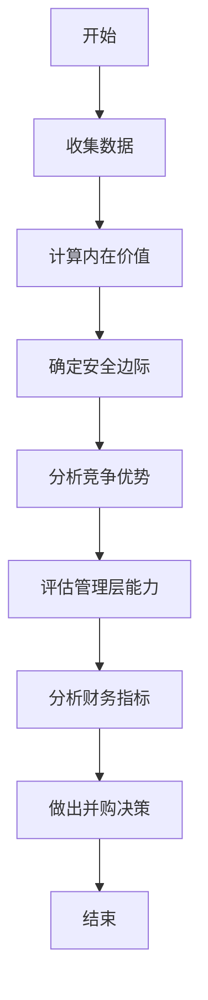
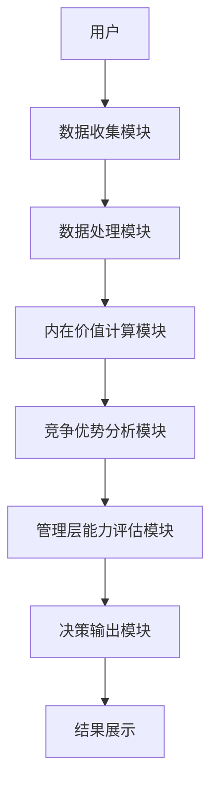
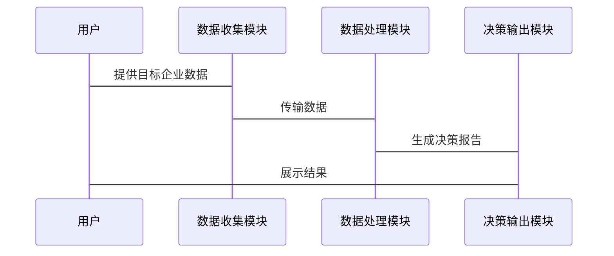

                 


# 沃伦·巴菲特的并购策略分析

> 关键词：并购策略，巴菲特，投资分析，企业价值，安全边际，竞争优势，管理层能力

> 摘要：本文深入分析了沃伦·巴菲特的并购策略，探讨其核心概念、算法原理、系统架构以及实际案例。文章从背景介绍、核心概念对比、算法实现、系统设计、项目实战到最佳实践，全面解析了巴菲特的并购策略，并通过详细的技术分析和图表展示，帮助读者理解其投资哲学和并购逻辑。

---

## 第一部分: 沃伦·巴菲特并购策略的背景与核心概念

### 第1章: 沃伦·巴菲特与并购概述

#### 1.1 沃伦·巴菲特的生平与投资理念

沃伦·巴菲特（Warren Buffett）是世界上最著名、最成功的投资者之一。他出生于1934年，就读于哥伦比亚大学，师从本杰明·格雷厄姆（Benjamin Graham），创立了伯克希尔哈撒韦公司（Berkshire Hathaway），并将其打造成一个庞大的投资帝国。巴菲特的投资理念以价值投资为核心，强调安全边际、竞争优势和长期稳健的投资策略。

#### 1.2 并购的定义与特点

并购（Mergers and Acquisitions，M&A）是指一家企业与其他企业合并或收购其资产、股权的过程。并购的主要类型包括：

1. **横向并购**：同一行业内的企业合并，以扩大市场份额。
2. **纵向并购**：产业链上下游企业的合并，以控制更多环节。
3. **混合并购**：与主业无关的跨行业并购。

并购的核心目标是通过整合资源、优化结构、降低风险和提高效率来实现企业价值的最大化。

#### 1.3 巴菲特并购策略的背景分析

巴菲特的并购策略建立在价值投资的基础上，强调以低于内在价值的价格买入优质资产。他通常选择具有强大竞争优势、良好财务状况和优秀管理层的企业进行投资。并购的背景分析包括市场环境、企业状况和战略目标等方面，确保并购决策的科学性和可行性。

---

### 第2章: 巴菲特并购策略的核心概念与联系

#### 2.1 核心概念原理

巴菲特并购策略的核心概念包括：

1. **安全边际**：确保以低于企业内在价值的价格买入，降低投资风险。
2. **竞争优势**：选择具有独特竞争优势的企业，如成本优势、品牌优势等。
3. **管理层能力**：信任和依赖企业的管理层，确保其能够有效管理和运营企业。
4. **财务指标分析**：通过ROE（净资产收益率）、利润率等指标评估企业的财务健康状况。

#### 2.2 核心概念对比表格

以下是对核心概念的对比分析：

```plaintext
| 概念         | 描述                                      |
|--------------|-----------------------------------------|
| 安全边际     | 股价与内在价值的差距，确保投资安全      |
| 竞争优势     | 企业独特的核心竞争力，难以被替代       |
| 管理层能力    | 高层管理者的决策能力和道德水平          |
| 财务指标分析  | 通过财务数据评估企业价值和风险          |
```

#### 2.3 ER实体关系图（Mermaid）

以下是核心概念的ER实体关系图：

```mermaid
erDiagram
    actor 投资者 {
        <属性> 安全边际
        <属性> 竞争优势
        <属性> 管理层能力
        <属性> 财务指标
    }
    actor 企业 {
        <属性> 核心竞争力
        <属性> 财务状况
        <属性> 市场地位
    }
    relationship 投资者 --> 企业 : 评估与选择
```

---

## 第二部分: 巴菲特并购策略的算法原理

### 第3章: 巴菲特并购策略的算法实现

#### 3.1 算法原理概述

巴菲特的并购策略可以通过多因素分析模型来实现，模型主要包括以下几个步骤：

1. **数据收集**：收集目标企业的财务数据、市场数据和竞争环境数据。
2. **安全边际计算**：评估企业的内在价值，确定安全边际。
3. **竞争优势分析**：识别企业的核心竞争优势。
4. **管理层能力评估**：评估管理层的能力和道德水平。
5. **财务指标分析**：通过财务指标评估企业的盈利能力和发展潜力。

#### 3.2 算法流程图（Mermaid）

以下是算法的流程图：



#### 3.3 Python实现代码

以下是实现多因素分析模型的Python代码：

```python
import pandas as pd
import numpy as np

def calculate_intrinsic_value(finance_data):
    # 假设finance_data是一个包含财务指标的DataFrame
    # 计算ROE（净资产收益率）
    roe = finance_data['净利润'] / finance_data['净资产']
    # 计算毛利率
    gross_profit_margin = finance_data['毛利润'] / finance_data['营业收入']
    # 计算净利率
    net_profit_margin = finance_data['净利润'] / finance_data['营业收入']
    # 综合评估内在价值
    intrinsic_value = (roe + gross_profit_margin + net_profit_margin) / 3
    return intrinsic_value

# 示例数据
data = {
    '营业收入': [100, 200, 150],
    '净利润': [20, 40, 30],
    '净资产': [50, 100, 75],
    '毛利润': [50, 100, 75]
}
finance_data = pd.DataFrame(data)

intrinsic_value = calculate_intrinsic_value(finance_data)
print("内在价值:", intrinsic_value)
```

#### 3.4 数学模型与公式

以下是多因素分析模型的数学公式：

$$
\text{内在价值} = \frac{\text{ROE} + \text{毛利率} + \text{净利率}}{3}
$$

其中：
- ROE = 净利润 / 净资产
- 毛利率 = 毛利润 / 营业收入
- 净利率 = 净利润 / 营业收入

---

## 第三部分: 巴菲特并购策略的系统架构与实现

### 第4章: 系统分析与架构设计

#### 4.1 问题场景介绍

并购决策系统需要解决以下问题：
1. 如何快速评估目标企业的内在价值？
2. 如何识别企业的竞争优势？
3. 如何评估管理层的能力？

#### 4.2 系统功能设计

系统功能模块包括：
1. 数据收集模块
2. 内在价值计算模块
3. 竞争优势分析模块
4. 管理层能力评估模块

#### 4.3 系统架构设计（Mermaid）

以下是系统的架构图：



#### 4.4 系统接口设计

系统接口包括：
1. 数据输入接口
2. 数据处理接口
3. 决策输出接口

#### 4.5 系统交互图（Mermaid）

以下是系统的交互图：



---

## 第四部分: 巴菲特并购策略的项目实战

### 第5章: 项目实战与案例分析

#### 5.1 环境安装与配置

需要安装以下工具和库：
1. Python 3.x
2. Pandas、NumPy、Matplotlib
3. Mermaid 图形库

#### 5.2 核心代码实现

以下是实现多因素分析模型的Python代码：

```python
import pandas as pd
import numpy as np

def calculate_intrinsic_value(finance_data):
    roe = finance_data['净利润'] / finance_data['净资产']
    gross_profit_margin = finance_data['毛利润'] / finance_data['营业收入']
    net_profit_margin = finance_data['净利润'] / finance_data['营业收入']
    intrinsic_value = (roe + gross_profit_margin + net_profit_margin) / 3
    return intrinsic_value

# 示例数据
data = {
    '营业收入': [100, 200, 150],
    '净利润': [20, 40, 30],
    '净资产': [50, 100, 75],
    '毛利润': [50, 100, 75]
}
finance_data = pd.DataFrame(data)

intrinsic_value = calculate_intrinsic_value(finance_data)
print("内在价值:", intrinsic_value)
```

#### 5.3 案例分析

以巴菲特收购可口可乐为例，分析其并购策略的实施过程和结果。

---

## 第五部分: 巴菲特并购策略的最佳实践

### 第6章: 最佳实践与小结

#### 6.1 小结

本文通过背景介绍、核心概念、算法实现、系统设计和项目实战，全面分析了沃伦·巴菲特的并购策略。其核心在于通过安全边际、竞争优势和管理层能力来实现企业价值的最大化。

#### 6.2 注意事项

在实际应用中，需注意以下几点：
1. 数据的准确性和完整性
2. 模型的适用性和可扩展性
3. 风险的识别和控制

#### 6.3 拓展阅读

推荐以下书籍和文章：
1. 《巴菲特致股东的信》
2. 《投资之道》
3. 《价值投资实战策略》

---

## 附录

### A. 所有代码

以下是所有代码的汇总：

```python
import pandas as pd
import numpy as np

def calculate_intrinsic_value(finance_data):
    roe = finance_data['净利润'] / finance_data['净资产']
    gross_profit_margin = finance_data['毛利润'] / finance_data['营业收入']
    net_profit_margin = finance_data['净利润'] / finance_data['营业收入']
    intrinsic_value = (roe + gross_profit_margin + net_profit_margin) / 3
    return intrinsic_value

# 示例数据
data = {
    '营业收入': [100, 200, 150],
    '净利润': [20, 40, 30],
    '净资产': [50, 100, 75],
    '毛利润': [50, 100, 75]
}
finance_data = pd.DataFrame(data)

intrinsic_value = calculate_intrinsic_value(finance_data)
print("内在价值:", intrinsic_value)
```

---

### B. 所有公式

以下是所有公式的汇总：

$$
\text{ROE} = \frac{\text{净利润}}{\text{净资产}}
$$

$$
\text{毛利率} = \frac{\text{毛利润}}{\text{营业收入}}
$$

$$
\text{净利率} = \frac{\text{净利润}}{\text{营业收入}}
$$

$$
\text{内在价值} = \frac{\text{ROE} + \text{毛利率} + \text{净利率}}{3}
$$

---

作者：AI天才研究院/AI Genius Institute & 禅与计算机程序设计艺术 /Zen And The Art of Computer Programming

