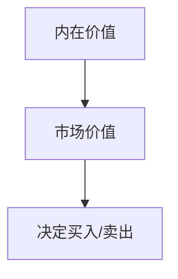
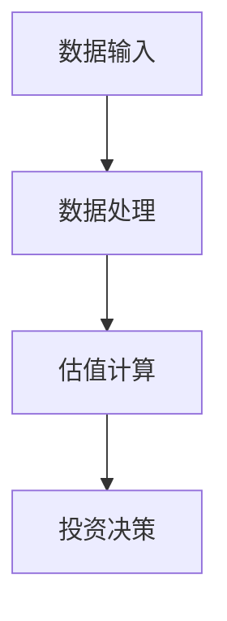

                 


# 沃伦·巴菲特的长期持股策略分析

## 关键词
- 沃伦·巴菲特
- 长期持股
- 价值投资
- 投资策略
- 股票分析

## 摘要
本文详细分析了沃伦·巴菲特的长期持股策略，从其投资哲学、选股标准到具体的投资案例和系统架构，为投资者提供深入的理论和实践指导。

---

# 第一部分: 沃伦·巴菲特的长期持股策略背景介绍

## 第1章: 沃伦·巴菲特与长期持股策略概述

### 1.1 沃伦·巴菲特的生平与投资理念
#### 1.1.1 巴菲特的成长经历与投资启蒙
沃伦·巴菲特出生于1930年，早年展现出对投资的浓厚兴趣。他在青少年时期通过阅读投资书籍和实践股票交易，积累了丰富的投资经验。

#### 1.1.2 巴菲特的投资哲学与核心理念
巴菲特倡导价值投资，强调购买低于内在价值的股票。他重视公司的基本面，如盈利能力、财务状况和竞争优势。

#### 1.1.3 长期持股策略的形成背景
在20世纪70年代，巴菲特观察到短期交易的高风险和低效率，转而采用长期持有优质股票的策略，以实现稳定的收益。

---

## 第2章: 长期持股策略的核心概念与联系

### 2.1 价值投资与长期持股的原理
#### 2.1.1 价值投资的定义与核心原则
价值投资强调购买价格低于内在价值的股票，通过长期持有实现资本增值。

#### 2.1.2 长期持股的定义与核心要素
长期持股是指投资者持有股票数年，关注公司的长期增长而非短期波动。

#### 2.1.3 价值投资与长期持股的关系
价值投资是长期持股的基础，而长期持股是价值投资的实践方式。

---

## 第3章: 巴菲特长期持股策略的算法原理

### 3.1 股票估值模型
#### 3.1.1 内在价值计算公式
$$ \text{内在价值} = \sum_{t=1}^{\infty} \frac{\text{现金流}_t}{(1+r)^t} $$

#### 3.1.2 市场价值与内在价值的对比
使用Mermaid流程图展示两者的关系：


---

## 第4章: 巴菲特长期持股策略的系统分析与架构设计

### 4.1 投资决策系统的场景分析
#### 4.1.1 投资者决策过程
从识别投资机会到评估、决策和监控。

#### 4.1.2 系统功能需求分析
包括数据收集、估值模型和投资决策模块。

### 4.2 系统架构设计
#### 4.2.1 功能模块划分
数据处理、估值计算、投资决策。

#### 4.2.2 系统架构图


---

## 第5章: 项目实战与案例分析

### 5.1 项目环境与工具安装
#### 5.1.1 投资分析工具的选择与安装
推荐使用Excel或Python进行数据分析。

### 5.2 核心算法实现
#### 5.2.1 股票估值模型的代码实现
```python
def calculate_intrinsic_value(cash_flows, discount_rate):
    iv = 0
    for t in range(len(cash_flows)):
        iv += cash_flows[t] / (1 + discount_rate) ** t
    return iv
```

### 5.3 实际案例分析与解读
#### 5.3.1 巴菲特经典投资案例分析
例如，巴菲特对可口可乐的投资，展示了长期持股的优势。

---

## 第6章: 巴菲特长期持股策略的最佳实践与小结

### 6.1 最佳实践 Tips
#### 6.1.1 价值投资的注意事项
注重基本面分析，避免情绪化决策。

#### 6.1.2 长期持股的风险管理策略
分散投资，定期评估投资组合。

### 6.2 小结与反思
长期持股策略需要耐心和对公司的深刻理解，巴菲特的成功为投资者提供了宝贵的启示。

---

作者：AI天才研究院 & 禅与计算机程序设计艺术

