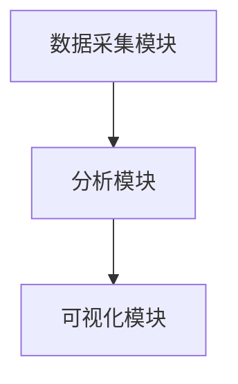

                 


# 沃伦巴菲特的并购策略分析

> 关键词：巴菲特，并购策略，价值投资，护城河，企业分析，投资哲学

> 摘要：本文系统地分析了沃伦巴菲特的并购策略，从其核心理念、分析方法到实际应用进行了深入探讨。文章结合技术术语，详细阐述了巴菲特的并购标准、护城河理论、企业盈利能力评估和管理层分析等关键点，并通过实际案例展示了其策略的实践效果。

---

## 第一部分: 背景介绍

### 第1章: 投资并购的基本概念与巴菲特的哲学

#### 1.1 投资并购的定义与重要性
投资并购是指通过购买企业部分或全部股权，以实现资本增值或控制权扩张的商业行为。在现代金融体系中，投资并购是企业扩张和财富增长的重要手段。巴菲特的并购策略以其独特性著称，强调长期价值和稳健投资。

#### 1.2 巴菲特的投资哲学
巴菲特的投资哲学可以概括为“价值投资”，即寻找那些具有持续盈利能力、强大护城河和优秀管理层的企业。他倾向于投资那些简单易懂、易于分析的行业，避免复杂的商业模式和高风险的行业。

#### 1.3 并购在投资中的重要性
并购是巴菲特投资组合的重要组成部分。他通过并购将资金投入具有长期竞争优势的企业，从而实现财富的稳步增长。并购策略的核心在于识别那些能够持续为股东创造价值的企业。

---

## 第2章: 巴菲特并购策略的核心要素

### 2.1 企业护城河的定义与类型
护城河是巴菲特评估企业的重要标准，指的是企业抵御竞争的能力。护城河的类型包括：
- **成本优势**：企业能够以更低的成本生产产品。
- **品牌优势**：强大的品牌影响力吸引消费者。
- **专利优势**：拥有独特的专利技术。
- **网络效应**：用户越多，企业价值越高。
- **文化优势**：企业内部文化和组织效率的优势。

### 2.2 企业盈利能力的评估
巴菲特通过分析企业的盈利能力来判断其内在价值。常用的指标包括：
- 净利润率
- 营业利润率
- 投资回报率

### 2.3 企业管理层的质量与稳定性
管理层是企业成功的关键因素之一。巴菲特倾向于投资那些由优秀管理层领导的企业，这些管理层具有良好的声誉、长期的任期和明确的经营战略。

---

## 第3章: 巴菲特并购策略的数学模型与算法原理

### 3.1 内在价值的计算方法
巴菲特通过计算企业的内在价值来判断其是否值得并购。内在价值的计算公式如下：

$$
\text{内在价值} = \text{未来现金流的现值}
$$

其中，未来现金流的计算基于企业的盈利能力、成长性和护城河宽度。

### 3.2 并购风险的评估模型
并购风险主要来源于企业自身的不确定性。巴菲特通过分析企业的财务健康状况、行业竞争格局和管理层稳定性来评估并购风险。

---

## 第4章: 项目实战与案例分析

### 4.1 实际并购案例分析
以可口可乐和吉列公司为例，分析巴菲特的并购策略。

#### 4.1.1 可口可乐的并购分析
- 护城河：强大的品牌影响力和全球分销网络。
- 盈利能力：稳定的现金流和高利润率。
- 管理层：长期稳定的管理团队。

#### 4.1.2 吉列公司的并购分析
- 护城河：专利技术和品牌优势。
- 盈利能力：高利润率和市场占有率。
- 管理层：创新能力强的管理层。

### 4.2 并购策略的实施步骤
1. **目标企业筛选**：基于护城河、盈利能力和管理层标准筛选目标企业。
2. **深入分析**：对目标企业的财务状况、行业地位和管理层进行详细分析。
3. **估值与决策**：计算企业内在价值，判断是否值得并购。

---

## 第5章: 系统架构与技术实现

### 5.1 技术架构设计
为了实现对目标企业的全面分析，我们可以构建一个基于巴菲特并购策略的投资分析系统。

#### 5.1.1 系统功能模块
- 数据采集模块：收集企业的财务数据和行业信息。
- 分析模块：计算企业的内在价值和并购风险。
- 可视化模块：生成分析报告和图表。

#### 5.1.2 系统架构图


### 5.2 实现代码示例
以下是一个简单的Python代码示例，用于计算企业的内在价值：

```python
def calculate_intrinsic_value(financial_data):
    # 计算未来现金流
    future_cash_flow = financial_data.profits * (1 + financial_data.growth_rate)
    # 计算现值
    present_value = future_cash_flow / (1 + financial_data.discount_rate)
    return present_value

# 示例数据
class FinancialData:
    def __init__(self, profits, growth_rate, discount_rate):
        self.profits = profits
        self.growth_rate = growth_rate
        self.discount_rate = discount_rate

# 计算内在价值
financial_data = FinancialData(100, 0.05, 0.08)
intrinsic_value = calculate_intrinsic_value(financial_data)
print(f"企业内在价值：{intrinsic_value}")
```

---

## 第6章: 总结与最佳实践

### 6.1 总结
沃伦巴菲特的并购策略以价值投资为核心，强调对企业护城河、盈利能力和管理层的深入分析。通过这些分析，巴菲特能够准确判断企业的内在价值，做出明智的并购决策。

### 6.2 最佳实践
1. **长期投资**：避免短期波动，关注企业的长期价值。
2. **深入分析**：对企业进行全面的财务和非财务分析。
3. **风险管理**：评估并购风险，避免盲目投资。

---

## 作者信息

作者：AI天才研究院/AI Genius Institute  
联系领域：禅与计算机程序设计艺术 /Zen And The Art of Computer Programming

