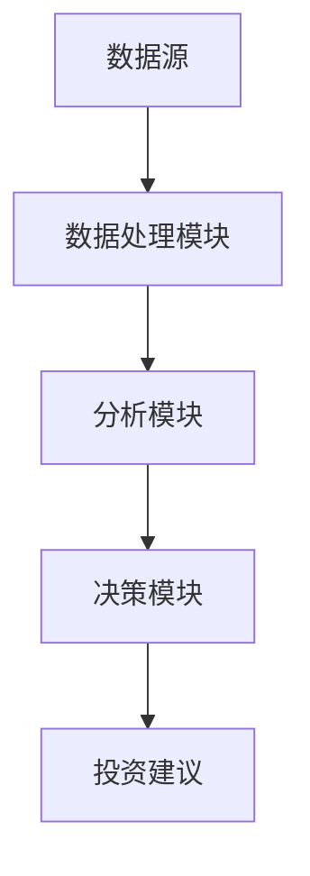

                 

# 沃尔特·施洛斯的价值投资实践指南

## 关键词：价值投资，沃尔特·施洛斯，内在价值，安全边际，投资策略，投资组合，风险管理

## 摘要：  
本文深入探讨了沃尔特·施洛斯的价值投资实践，分析了其核心理念、策略和方法。通过详细讲解安全边际、内在价值、市场先生等核心概念，结合实际案例和系统架构设计，为读者提供了一套可操作的价值投资指南。文章还讨论了投资组合构建、风险管理以及如何在实际操作中应用这些理论。

---

## 第一部分：价值投资的背景与基础

### 第1章：价值投资的起源与发展

#### 1.1 价值投资的定义与核心理念  
价值投资是一种以基本面分析为基础的投资策略，强调以低于内在价值的价格购买优质资产。其核心理念包括：  
- **安全边际**：购买价格低于内在价值，以降低投资风险。  
- **长期导向**：关注企业的长期价值，而非短期市场波动。  
- **逆向思维**：在市场恐慌时寻找低估资产，在市场狂热时保持冷静。  

#### 1.2 沃尔特·施洛斯的生平与投资哲学  
沃尔特·施洛斯是价值投资的代表人物之一，被誉为“价值投资之父”。他通过长期持有优质股票，创造了令人瞩目的投资业绩。其投资哲学包括：  
- **专注基本面**：只投资于自己理解的公司。  
- **安全边际优先**：坚持以合理价格买入优质资产。  
- **长期持有**：避免频繁交易，降低交易成本。  

---

## 第二部分：价值投资的核心概念与原理

### 第2章：安全边际与内在价值

#### 2.1 安全边际的定义与重要性  
安全边际是指购买价格与内在价值之间的差距，是投资者的“缓冲区”。公式为：  
$$\text{安全边际} = \text{内在价值} - \text{市场价格}$$  
例如，如果某股票的内在价值为50元，市场价格为40元，安全边际为10元。  

#### 2.2 内在价值的计算方法  
内在价值是企业未来现金流的现值。常用的方法是现金流折现模型（DCF），公式为：  
$$\text{DCF} = \frac{\text{自由现金流}}{(r - g)}$$  
其中，$r$为折现率，$g$为永续增长率。  

### 第3章：市场先生与投资者心态

#### 3.1 市场先生的概念与角色  
市场先生是本杰明·格雷厄姆提出的概念，代表市场情绪的波动。投资者需要与市场先生“对话”，避免被其情绪左右。  

#### 3.2 投资者心态对投资决策的影响  
投资者的心理偏差（如贪婪和恐惧）会影响决策。克服情绪干扰，保持理性是成功投资的关键。  

---

## 第三部分：价值投资的策略与方法

### 第4章：基本面分析与竞争优势

#### 4.1 基本面分析的定义与步骤  
基本面分析包括对企业财务状况、行业地位和盈利能力的全面评估。步骤如下：  
1. 收集财务数据（如利润表、资产负债表）。  
2. 计算关键指标（如市盈率、市净率）。  
3. 分析行业环境和竞争优势。  

#### 4.2 竞争优势的识别与评估  
竞争优势是企业长期盈利的保障。常用指标包括：  
- 市场占有率。  
- 核心竞争力。  
- 财务健康状况。  

### 第5章：投资组合构建与风险控制

#### 5.1 投资组合的构建策略  
投资组合应根据个人风险承受能力和投资目标进行配置。常见的配置方法包括：  
- 股票与债券的组合。  
- 分散投资以降低风险。  

#### 5.2 风险管理的实践  
风险管理包括设定止损点和定期调整投资组合。例如，当某股票价格下跌超过20%，可考虑止损。  

---

## 第四部分：价值投资的系统架构与实战案例

### 第6章：系统架构设计

#### 6.1 系统功能设计  
- 数据收集：获取公司财务数据和市场信息。  
- 分析模块：计算内在价值和安全边际。  
- 决策模块：基于分析结果制定投资策略。  

#### 6.2 系统架构图  

### 第7章：项目实战分析

#### 7.1 案例分析：可口可乐公司  
假设可口可乐的内在价值为50元，市场价格为45元，安全边际为5元。投资者可考虑买入。  

#### 7.2 投资组合优化  
假设投资组合包括10%的现金、40%的股票和50%的债券，定期调整以平衡风险与收益。  

---

## 第五部分：总结与展望

### 第8章：最佳实践与小结

#### 8.1 最佳实践  
- 保持对企业的深入了解。  
- 坚持安全边际原则。  
- 长期持有优质资产。  

#### 8.2 小结  
价值投资是一种科学且艺术的投资方法。通过基本面分析和长期持有，投资者可以在市场波动中实现稳健收益。

---

## 注意事项  
- 投资有风险，需谨慎决策。  
- 建议在实际操作前，进行充分的研究和风险评估。  

---

## 拓展阅读  
- 《The Intelligent Investor》 by Benjamin Graham  
- 《沃伦·巴菲特的午餐：价值投资的秘密》  

---

## 作者：AI天才研究院/AI Genius Institute & 禅与计算机程序设计艺术 /Zen And The Art of Computer Programming

