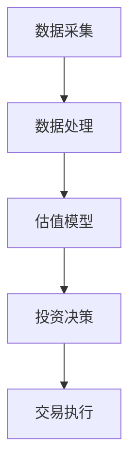

                 

# 沃尔特·施洛斯的小盘股价值投资策略

> 关键词：小盘股投资，价值投资，沃尔特·施洛斯，安全边际，内在价值，投资策略

> 摘要：本文深入分析了沃尔特·施洛斯的小盘股价值投资策略，从其投资理念、核心方法论到数学模型和系统架构，全面阐述了如何通过小盘股投资实现长期稳定的收益。文章结合实际案例，详细讲解了投资策略的实现过程，并提供了最佳实践和注意事项。

---

## 第一部分: 沃尔特·施洛斯的小盘股价值投资策略概述

### 第1章: 沃尔特·施洛斯与小盘股投资概述

#### 1.1 沃尔特·施洛斯的生平简介

沃尔特·施洛斯（Walter Schloss）是20世纪著名的投资家，以小盘股投资闻名。他出生于1910年，早年在父亲的影响下进入金融行业，曾在父亲的公司工作，并逐渐形成了自己的投资理念。施洛斯的投资风格以保守和稳健著称，他注重安全边际，追求以低于内在价值的价格买入优质股票。

#### 1.2 小盘股投资的背景与重要性

小盘股是指市值较小的公司股票，通常具有较高的增长潜力，但也伴随着较高的风险。小盘股市场相对流动性较低，市场参与者较少，因此更容易出现价格波动。然而，小盘股市场也提供了许多未被市场充分认知的投资机会，尤其是对于那些具有强大基本面和竞争优势的公司。

#### 1.3 施洛斯的投资理念

施洛斯的投资理念基于价值投资原则，他强调买入低估的股票并长期持有。他认为，市场波动为投资者提供了以合理价格买入优质资产的机会。施洛斯特别关注公司的基本面，如盈利能力、资产负债表状况和管理层质量。他相信，通过深入研究和严格筛选，小盘股市场中可以找到那些具有长期增长潜力且估值合理的公司。

---

### 第2章: 小盘股投资的核心方法论

#### 2.1 价值投资的核心概念

价值投资是一种以公司基本面分析为基础的投资策略，旨在通过识别市场价格低于内在价值的股票来实现超额收益。施洛斯的价值投资方法强调以下几点：

1. **内在价值**：公司股票的真正价值取决于其未来现金流的现值。施洛斯通过分析公司的财务报表和行业地位，估算其内在价值。
2. **安全边际**：买入价格低于内在价值，以确保在市场价格波动时仍能获得收益。
3. **长期持有**：施洛斯倾向于长期持有股票，避免频繁交易，以减少交易成本和市场波动的影响。

#### 2.2 小盘股投资的具体策略

1. **筛选标准**：
   - **低市盈率（P/E）**：市盈率是衡量股票价值的重要指标，低市盈率通常意味着股票被低估。
   - **低市净率（P/B）**：市净率反映了股票价格与账面价值的关系，低市净率可能表明股票价格低于其资产价值。
   - **高股息率**：高股息率可能意味着公司具有稳定的盈利能力和较强的分红能力。

2. **组合管理**：
   - **分散投资**：通过投资多只股票降低风险。
   - **定期调整**：根据市场变化和公司基本面，定期审视和调整投资组合。

---

### 第3章: 小盘股投资的数学模型与算法

#### 3.1 内在价值的计算

内在价值是价值投资的核心，以下是计算内在价值的简化模型：

$$
\text{内在价值} = \sum_{t=1}^{n} \frac{\text{现金流}_t}{(1 + r)^t}
$$

其中，$r$ 是折现率，$\text{现金流}_t$ 是第 $t$ 年的自由现金流。

#### 3.2 安全边际的量化

安全边际是内在价值与市场价格之间的差额。施洛斯通常寻找市场价格低于内在价值30%以上的股票。

$$
\text{安全边际} = \text{内在价值} - \text{市场价格}
$$

---

### 第4章: 小盘股投资的系统架构与实现

#### 4.1 系统架构设计

以下是小盘股投资系统的简要架构：

#### 4.2 实现步骤

1. 数据采集：收集目标公司的财务数据和市场数据。
2. 数据处理：清洗和整理数据，计算各项指标。
3. 估值模型：使用内在价值公式计算股票的内在价值。
4. 投资决策：根据安全边际和筛选标准，决定是否买入。
5. 交易执行：执行交易指令并记录结果。

---

### 第5章: 项目实战——基于施洛斯策略的小盘股投资案例分析

#### 5.1 项目背景

假设我们有一个小盘股投资组合，目标是寻找具有低市盈率和高股息率的公司。

#### 5.2 数据分析

以下是某公司的财务数据和估值结果：

| 指标       | 数据       |
|------------|------------|
| 市盈率（P/E） | 12         |
| 市净率（P/B） | 1.5        |
| 股息率      | 5%         |
| 内在价值    | $50        |
| 市场价格    | $40        |

#### 5.3 投资决策

根据数据，市场价格（$40）低于内在价值（$50），安全边际为 $10。因此，建议买入该股票。

---

### 第6章: 最佳实践与投资策略小结

#### 6.1 投资策略的总结

施洛斯的小盘股投资策略强调基本面分析和安全边际，通过长期持有优质股票实现稳定收益。投资者应注重分散投资和风险控制，避免过度集中。

#### 6.2 注意事项

1. **市场波动**：小盘股市场波动较大，投资者需做好心理准备。
2. **持续学习**：市场环境不断变化，投资者需持续更新知识和策略。
3. **风险管理**：设置止损点，避免重大损失。

---

## 作者信息

作者：AI天才研究院/AI Genius Institute & 禅与计算机程序设计艺术 /Zen And The Art of Computer Programming

---

通过本文的详细分析，读者可以全面了解沃尔特·施洛斯的小盘股价值投资策略，并将其应用于实际投资中。希望本文能为投资者提供有价值的参考和启发。

