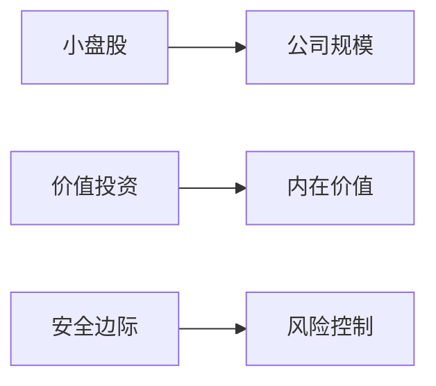
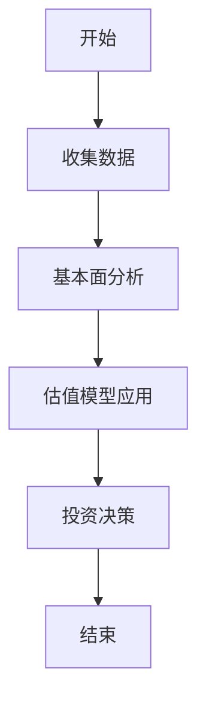
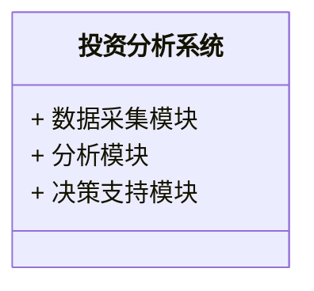
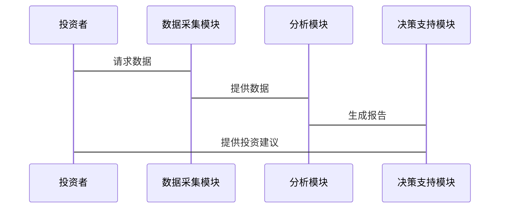

                 


# 沃尔特·施洛斯的小盘股研究方法论

> 关键词：小盘股、价值投资、沃尔特·施洛斯、安全边际、基本面分析、投资策略、风险管理

> 摘要：本文深入探讨了沃尔特·施洛斯的小盘股研究方法论，分析了其投资理念、选股标准、价值评估模型及其在现代投资中的应用。通过系统的方法和实际案例，展示了如何在小盘股市场中实现稳健投资。

---

## 第一部分: 小盘股投资的背景与重要性

### 第1章: 小盘股的定义与特点

#### 1.1 小盘股的定义与特点

- **小盘股的定义**：小盘股是指市值较小的公司股票，通常在50亿至20亿美元之间。
- **小盘股的特点**：
  - 市场流动性较低，波动性较大。
  - 成长潜力大，但风险也较高。
  - 通常集中在新兴行业或细分市场。

#### 1.2 小盘股投资的历史发展

- **起源**：20世纪初，小盘股投资开始受到关注。
- **发展**：20世纪70年代，施洛斯等人推动了小盘股投资的系统化。
- **现状**：小盘股投资在全球范围内成为一种重要的投资策略。

#### 1.3 小盘股投资的重要性

- **波动性**：小盘股市场波动剧烈，提供了套利机会。
- **机会**：小盘股可能成长为大盘股，带来高额回报。
- **风险与回报**：高风险伴随着高回报，需要谨慎选择。

### 第2章: 沃尔特·施洛斯的投资方法论

#### 2.1 施洛斯的生平与投资理念

- **生平简介**：施洛斯是一位价值投资者，专注于小盘股。
- **投资理念**：注重安全边际，寻找被低估的股票。
- **价值投资**：买入被市场低估的股票，长期持有。

#### 2.2 施洛斯的小盘股研究方法

- **核心要素**：低市盈率、低市净率、高股息率。
- **步骤与流程**：数据收集、基本面分析、估值模型应用。
- **工具与资源**：财务报表、行业分析、市场趋势。

#### 2.3 施洛斯的选股标准

- **低市盈率与低市净率**：寻找价格低于内在价值的股票。
- **高股息率与稳定的股息支付**：股息稳定，回报率高。
- **公司基本面分析**：关注盈利能力、财务状况和竞争优势。

---

## 第二部分: 小盘股研究的核心概念与联系

### 第3章: 核心概念的定义与解释

- **小盘股**：公司市值较小，流动性较低。
- **价值投资**：买入低于内在价值的股票，长期持有。
- **安全边际**：买入价格远低于内在价值，以降低风险。

### 第4章: 核心概念的对比分析

- **小盘股与大盘股**：小盘股波动大，风险高，但成长潜力大。
- **价值投资与成长投资**：价值投资注重低估，成长投资注重高增长。
- **安全边际与风险控制**：安全边际通过价格折扣降低风险，风险控制通过 diversification 和止损。

### 第5章: 实体关系图



---

## 第三部分: 小盘股研究的算法原理

### 第6章: 算法原理概述

#### 6.1 价值评估模型

- **现金流折现法**：预测未来现金流，折现计算现值。
- **市盈率与市净率分析**：比较股票价格与盈利或资产比率。

#### 6.2 算法流程图



#### 6.3 Python代码实现

```python
def calculate_intrinsic_value(FCFF, WACC):
    # 计算未来现金流现值
    PV = FCFF / (1 + WACC)
    return PV
```

---

## 第四部分: 系统分析与架构设计

### 第7章: 系统分析与架构设计方案

#### 7.1 项目介绍

- **目标**：构建一个基于施洛斯方法的小盘股分析系统。
- **功能需求**：数据采集、分析、决策支持。

#### 7.2 系统架构设计



#### 7.3 系统交互设计



---

## 第五部分: 项目实战

### 第8章: 项目实战

#### 8.1 环境安装

- **工具**：Python、Pandas、Matplotlib。
- **数据源**：金融数据库，如Yahoo Finance。

#### 8.2 核心代码实现

```python
import pandas as pd
import numpy as np

def calculate_intrinsic_value(free_cash_flow, discount_rate):
    return free_cash_flow / (1 + discount_rate)
```

#### 8.3 案例分析

- **案例**：某小盘股公司，分析其财务数据，计算内在价值，做出投资决策。

---

## 第六部分: 最佳实践

### 第9章: 投资中的注意事项

- **分散投资**：降低风险。
- **持续学习**：市场变化快，需不断更新知识。
- **风险管理**：设定止损点。

### 第10章: 总结

- **小结**：施洛斯的方法论在小盘股投资中依然有效。
- **未来展望**：结合新技术，如大数据和人工智能，提升投资效率。

---

## 作者

作者：AI天才研究院 & 禅与计算机程序设计艺术

---

这篇博客文章详细探讨了沃尔特·施洛斯的小盘股研究方法论，结合理论与实践，为投资者提供了系统的指导。

