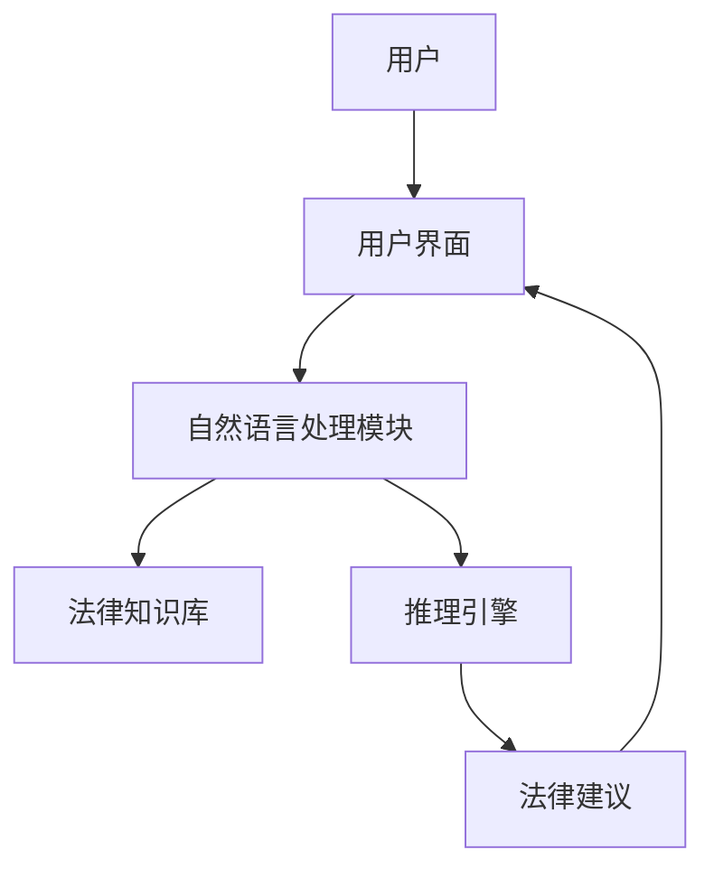

                 


# 法律顾问 AI Agent：LLM 在法律咨询与合规检查中的应用

## 关键词：法律顾问 AI Agent, LLM, 法律咨询, 合规检查, 人工智能, 大语言模型

## 摘要：  
本文探讨了法律顾问 AI Agent 在法律咨询与合规检查中的应用，详细分析了大语言模型（LLM）在法律领域中的核心原理、系统架构及实际应用。通过结合理论与实践，本文展示了如何利用AI技术提升法律咨询服务的效率与准确性，同时降低企业的合规成本。文章最后提出了最佳实践建议，为读者提供了全面的视角。

---

# 第1章: 法律顾问 AI Agent 的背景与核心概念

## 1.1 法律顾问 AI Agent 的背景

### 1.1.1 法律科技的发展与挑战
随着人工智能技术的快速发展，法律科技（LegalTech）逐渐成为行业变革的重要推动力。传统的法律咨询服务依赖于律师的个人经验和专业知识，但这种方式存在效率低、成本高等问题。AI技术的引入为法律咨询与合规检查带来了新的可能性。

**问题背景**：  
- **法律咨询的复杂性**：法律问题通常涉及复杂的法律条文和案例分析，需要深厚的法律知识和经验。  
- **合规检查的繁琐性**：企业合规涉及多个领域，如数据隐私、合同合规等，需要逐一检查和分析。  
- **法律咨询成本高昂**：传统法律咨询服务通常需要支付高昂的律师费用，尤其是中小企业难以负担。  

**AI 的优势**：  
- **高效性**：AI可以通过快速分析大量法律文本，提供即时的法律建议。  
- **成本降低**：AI可以显著降低法律咨询和合规检查的成本，使其更加普惠。  
- **可扩展性**：AI可以同时处理大量法律咨询请求，满足企业对快速响应的需求。  

---

## 1.2 法律顾问 AI Agent 的核心概念

### 1.2.1 AI Agent 的定义与特点
法律顾问 AI Agent 是一种基于人工智能技术的智能助手，能够理解用户提出的法律问题，并提供相应的解答和建议。其特点包括：  
- **智能化**：通过自然语言处理（NLP）技术，能够理解和生成人类语言。  
- **自主性**：能够在没有人工干预的情况下，独立完成法律咨询任务。  
- **可扩展性**：能够处理多种类型的法律问题，并根据上下文提供相关建议。  

### 1.2.2 法律顾问 AI Agent 的核心功能
法律顾问 AI Agent 的核心功能包括：  
1. **法律问题解答**：能够回答用户提出的法律问题，如合同条款解释、法律条文解读等。  
2. **合同审查与合规检查**：能够自动检查合同或文档是否符合相关法律法规，并提出修改建议。  
3. **法律信息检索**：能够快速检索相关的法律案例、法规和法律文献，为用户提供准确的信息支持。  
4. **法律建议生成**：基于用户提供的信息，生成初步的法律建议或合规方案。  

---

## 1.3 法律顾问 AI Agent 的核心目标

### 1.3.1 提供高效法律咨询服务
通过AI技术，法律顾问 AI Agent 能够快速响应用户的法律咨询请求，减少用户的等待时间，并提供准确的解答。  

### 1.3.2 实现合规检查自动化
企业合规检查通常涉及大量繁琐的文档审查工作，AI Agent 可以通过自动化的方式，快速识别潜在的合规风险，并提出解决方案。  

### 1.3.3 降低法律咨询成本
传统的法律咨询服务成本高昂，而 AI Agent 的引入可以显著降低企业的法律咨询成本，使其更加普惠。  

---

## 1.4 本章小结
本章介绍了法律顾问 AI Agent 的背景、核心概念和目标。通过分析传统法律咨询的痛点和 AI 技术的优势，我们明确了法律顾问 AI Agent 在法律领域的潜力和应用价值。接下来，我们将深入探讨法律顾问 AI Agent 的核心算法和系统架构设计。

---

# 第2章: 法律顾问 AI Agent 的算法原理与数学模型

## 2.1 大语言模型（LLM）的基本原理

### 2.1.1 大语言模型的定义与特点
大语言模型（Large Language Model，LLM）是一种基于深度学习的自然语言处理模型，具有以下特点：  
- **大规模训练数据**：通常使用 billions 级别的文本数据进行训练。  
- **多任务学习能力**：能够处理多种自然语言处理任务，如文本生成、问答、翻译等。  
- **上下文理解能力**：能够通过上下文理解语义，并生成合理的回复。  

### 2.1.2 LLM 的训练过程
1. **监督学习**：模型通过大量标注数据进行训练，学习语言的规律和模式。  
2. **无监督学习**：通过无标签数据的自监督学习，进一步提升模型的泛化能力。  
3. **微调（Fine-tuning）**：在特定领域数据上进行微调，以适应具体任务的需求。  

### 2.1.3 LLM 的数学模型
大语言模型通常基于转换器（Transformer）架构，其核心组件包括编码器（Encoder）和解码器（Decoder）。编码器负责将输入文本转换为向量表示，解码器则根据编码器的输出生成回复。

---

## 2.2 法律顾问 AI Agent 的算法实现

### 2.2.1 文本生成算法
法律顾问 AI Agent 的文本生成算法通常基于生成式模型，如 GPT（Generative Pre-trained Transformer）。生成式模型通过概率生成的方式，为用户提供个性化的法律建议。

### 2.2.2 文本理解算法
文本理解算法通过词袋模型（Bag-of-Words）或词嵌入（Word Embedding）技术，将用户输入的文本转换为向量表示，以便模型理解其含义。

---

## 2.3 算法的数学模型

### 2.3.1 编码器-解码器架构
编码器将输入文本转换为向量表示，解码器根据编码器的输出生成回复。数学表示如下：  
$$
\text{Encoder}(x) \rightarrow z \\
\text{Decoder}(z) \rightarrow y
$$  

### 2.3.2 注意力机制
注意力机制通过计算输入文本中每个词的重要性，聚焦于关键信息，提升模型的理解能力。数学表示如下：  
$$
\text{Attention}(Q, K, V) = \text{softmax}(\frac{QK^T}{\sqrt{d}})V
$$  

---

## 2.4 本章小结
本章详细介绍了大语言模型（LLM）的基本原理和法律顾问 AI Agent 的算法实现。通过数学模型的分析，我们了解了AI Agent 如何通过文本生成和理解技术，为用户提供法律咨询服务。接下来，我们将探讨法律顾问 AI Agent 的系统架构设计。

---

# 第3章: 法律顾问 AI Agent 的系统架构与实现

## 3.1 系统架构设计

### 3.1.1 系统功能模块划分
法律顾问 AI Agent 的系统架构通常包括以下功能模块：  
1. **用户界面（UI）**：用户与AI Agent 的交互界面。  
2. **自然语言处理（NLP）模块**：负责理解和生成文本。  
3. **法律知识库**：存储法律条文、案例等知识。  
4. **推理引擎**：根据用户输入进行逻辑推理，生成法律建议。  

### 3.1.2 系统架构图
以下是法律顾问 AI Agent 的系统架构图：



---

## 3.2 系统实现

### 3.2.1 用户界面设计
用户界面是用户与AI Agent 交互的主要入口，通常包括文本输入框、历史记录显示等模块。

### 3.2.2 自然语言处理模块
自然语言处理模块负责将用户的输入文本进行分词、句法分析等处理，并生成相应的回复。

### 3.2.3 推理引擎
推理引擎基于用户的输入和法律知识库，进行逻辑推理，生成法律建议。

---

## 3.3 系统实现代码示例

```python
# 示例代码：法律顾问 AI Agent 的核心逻辑实现

class LegalAI:
    def __init__(self):
        self.knowledge_base = self._initialize_knowledge_base()

    def _initialize_knowledge_base(self):
        # 初始化法律知识库
        return {"contract_terms": ["必须包含条款A", "必须包含条款B"], 
                "compliance_rules": ["符合法规X", "符合法规Y"]}

    def analyze_query(self, query):
        # 分析用户查询
        terms = self._extract_terms(query)
        compliance = self._check_compliance(terms)
        return compliance

    def _extract_terms(self, query):
        # 提取关键条款
        return [term for term in query.split() if term in self.knowledge_base["contract_terms"]]

    def _check_compliance(self, terms):
        # 检查合规性
        compliant = all(term in self.knowledge_base["compliance_rules"] for term in terms)
        return compliant

# 使用示例
ai = LegalAI()
query = "我们需要在合同中包含条款A和条款B。"
result = ai.analyze_query(query)
print(f"合规性检查结果：{result}")
```

---

## 3.4 本章小结
本章详细介绍了法律顾问 AI Agent 的系统架构与实现，包括功能模块划分、系统架构图和代码实现。通过实际代码示例，我们了解了AI Agent 如何通过自然语言处理和法律知识库，为用户提供法律咨询服务。接下来，我们将探讨法律顾问 AI Agent 的实际应用案例。

---

# 第4章: 法律顾问 AI Agent 的实际应用案例

## 4.1 合同审查与合规检查

### 4.1.1 案例背景
某企业在起草合同时，需要确保合同符合相关法律法规。通过法律顾问 AI Agent，企业可以快速检查合同中的条款是否符合合规要求。

### 4.1.2 实施步骤
1. **输入合同文本**：用户将合同文本输入AI Agent。  
2. **条款提取与分析**：AI Agent 提取合同中的关键条款，并与法律知识库进行对比。  
3. **合规性检查**：AI Agent 根据提取的条款，生成合规性检查报告。  

### 4.1.3 案例结果
通过AI Agent 的帮助，企业能够快速发现合同中的潜在风险，并及时进行修改，确保合同的合规性。

---

## 4.2 法律问答与咨询

### 4.2.1 案例背景
某用户在经营过程中遇到法律问题，需要快速获得法律建议。通过法律顾问 AI Agent，用户可以即时获得初步的法律解答。

### 4.2.2 实施步骤
1. **用户提出问题**：用户输入问题，如“公司解散需要哪些法律程序？”  
2. **AI Agent 分析问题**：AI Agent 通过自然语言处理技术，理解用户的问题。  
3. **生成法律建议**：AI Agent 根据法律知识库，生成相应的法律建议。  

### 4.2.3 案例结果
用户能够快速获得初步的法律建议，并根据需要进一步咨询专业律师。

---

## 4.3 本章小结
本章通过实际案例，展示了法律顾问 AI Agent 在合同审查、法律问答等场景中的应用。通过这些案例，我们了解了AI Agent 如何为用户提供高效、准确的法律咨询服务。

---

# 第5章: 法律顾问 AI Agent 的优化与未来展望

## 5.1 系统优化建议

### 5.1.1 模型优化
1. **优化训练数据**：增加法律领域的高质量训练数据，提升模型的准确性。  
2. **微调模型**：在特定法律领域上进行微调，提升模型的适应性。  

### 5.1.2 系统性能优化
1. **提升响应速度**：优化系统架构，减少用户等待时间。  
2. **增强安全性**：确保用户数据的安全性和隐私保护。  

---

## 5.2 未来展望

### 5.2.1 技术进步
随着大语言模型技术的不断进步，法律顾问 AI Agent 的功能和性能将不断提升，未来可能会实现更复杂的法律推理和分析。

### 5.2.2 应用场景扩展
法律顾问 AI Agent 的应用将从简单的法律咨询扩展到更复杂的合规管理、法律风险管理等领域。

---

## 5.3 本章小结
本章总结了法律顾问 AI Agent 的优化建议，并展望了其未来的发展方向。通过技术的进步和应用场景的扩展，法律顾问 AI Agent 将在法律领域发挥越来越重要的作用。

---

# 作者：AI天才研究院/AI Genius Institute & 禅与计算机程序设计艺术 /Zen And The Art of Computer Programming

---

以上是关于《法律顾问 AI Agent：LLM 在法律咨询与合规检查中的应用》的技术博客文章的完整目录和内容概要。如需进一步展开每个章节的具体内容，请随时告知！

