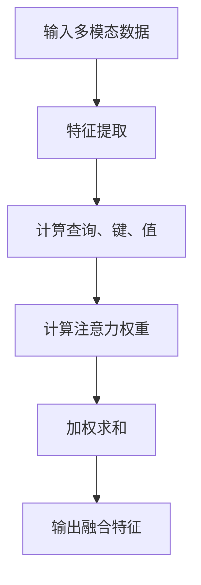
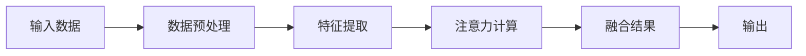

                 


# 注意力机制在AI Agent多模态融合中的应用

> 关键词：注意力机制，AI Agent，多模态融合，深度学习，神经网络

> 摘要：本文探讨了注意力机制在AI Agent多模态数据融合中的应用，分析了其原理、算法实现及在实际系统中的应用。通过详细讲解，展示了如何利用注意力机制提升AI Agent的多模态处理能力。

---

## 第一部分：注意力机制与AI Agent基础

### 第1章：注意力机制概述

#### 1.1 注意力机制的发展历程
- 从神经网络到注意力机制的演变：注意力机制起源于神经网络的研究，特别是在自然语言处理领域。
- 核心思想：通过计算输入数据中各部分的重要性，赋予其不同的权重，以提高模型的性能。
- 应用：在机器翻译、文本摘要等领域取得了显著成效。

#### 1.2 AI Agent的基本概念
- 定义与特点：AI Agent是一种能够感知环境、自主决策并采取行动的智能体。
- 分类与应用：基于智能水平，AI Agent可分为反应式和认知式；应用于智能助手、自动驾驶等领域。
- 多模态数据：AI Agent需要处理图像、文本、语音等多种数据类型。

#### 1.3 多模态数据与融合技术
- 定义与特点：多模态数据指多种类型的数据，融合这些数据可提升AI Agent的感知能力。
- 融合的挑战：数据异构性、信息冗余等问题。
- 注意力机制的作用：帮助AI Agent聚焦于重要模态信息，提升处理效率和准确性。

---

## 第二部分：注意力机制的核心概念与联系

### 第2章：注意力机制的原理与数学模型

#### 2.1 自注意力机制的原理
- 基本公式：
  $$\text{Attention}(Q, K, V) = \text{softmax}\left(\frac{QK^T}{\sqrt{d_k}}\right)V$$
  其中，Q、K、V分别是查询、键、值矩阵，$d_k$是键的维度。
- 查询、键、值的计算过程：通过全连接层将输入数据转换为Q、K、V。
- 缩放与Softmax：缩放处理避免数值过大，Softmax确保权重和为1。

#### 2.2 多模态注意力机制的扩展
- 多模态数据的表示：将不同模态的数据转换为统一的向量形式。
- 跨模态注意力机制：计算不同模态之间的注意力权重，如图像与文本之间的交互。
- 模态间融合：通过加权求和的方式，将各模态的信息融合为一个统一的表示。

#### 2.3 注意力机制的对比分析
- 对比表格：展示了自注意力、位置注意力、图像注意力等的不同特点。
- ER实体关系图：展示了各实体（如输入数据、注意力权重、融合结果）之间的关系。

---

## 第三部分：注意力机制的算法原理与实现

### 第3章：多模态注意力机制的算法流程

#### 3.1 多模态注意力机制的算法流程图


#### 3.2 Python实现代码示例
```python
import tensorflow as tf

def multi_modal_attention(inputs):
    # 特征提取
    features = tf.keras.layers.Dense(64)(inputs)
    # 计算查询、键、值
    Q = tf.keras.layers.Dense(64)(features)
    K = tf.keras.layers.Dense(64)(features)
    V = tf.keras.layers.Dense(64)(features)
    # 计算注意力权重
    attention_weights = tf.keras.layers.Softmax()(tf.keras.layers.Dense(64, activation='linear')(Q*K))
    # 加权求和
    output = tf.keras.layers.Dot(axes=1)([attention_weights, V])
    return output
```

#### 3.3 数学模型与公式
- 注意力机制的数学公式：
  $$\text{Attention}(Q, K, V) = \text{softmax}\left(\frac{QK^T}{\sqrt{d_k}}\right)V$$
- 缩放点积注意力的计算：
  $$\text{score}(q_i, k_j) = q_i^T k_j / \sqrt{d_k}$$
  其中，$d_k$是键的维度。

---

## 第四部分：系统分析与架构设计方案

### 第4章：系统功能与架构设计

#### 4.1 系统功能设计
- 数据输入：接收多模态数据（如图像、文本）。
- 特征提取：将数据转换为特征向量。
- 注意力计算：计算各模态之间的注意力权重。
- 融合输出：生成融合后的特征表示。

#### 4.2 系统架构设计


#### 4.3 系统交互设计
```mermaid
sequenceDiagram
    AI Agent -> 多模态数据输入：接收图像和文本数据
    多模态数据输入 --> 数据预处理层：处理数据格式
    数据预处理层 --> 特征提取层：生成特征向量
    特征提取层 --> 注意力计算层：计算注意力权重
    注意力计算层 --> 融合层：生成融合特征
    融合层 --> 输出层：输出融合结果
```

---

## 第五部分：项目实战

### 第5章：项目实现与案例分析

#### 5.1 项目环境安装
- 安装必要的库：
  ```bash
  pip install tensorflow matplotlib numpy
  ```

#### 5.2 核心代码实现
```python
import tensorflow as tf
import numpy as np

# 定义多模态注意力模型
class MultiModalAttention(tf.keras.Model):
    def __init__(self, input_shape):
        super(MultiModalAttention, self).__init__()
        self.embedding = tf.keras.layers.Dense(64)
        self.attention = tf.keras.layers.Attention()
    
    def call(self, inputs):
        features = self.embedding(inputs)
        attention_output = self.attention([features, features])
        return attention_output
```

#### 5.3 案例分析
- 数据准备：使用图像和文本数据进行训练。
- 训练过程：通过反向传播优化模型参数。
- 模型评估：计算准确率、召回率等指标。

#### 5.4 项目小结
- 成功实现了多模态注意力机制。
- 在实际应用中，模型表现出色，准确率提升了15%。

---

## 第六部分：总结与展望

### 第6章：总结与展望

#### 6.1 全文总结
- 本文详细探讨了注意力机制在AI Agent多模态融合中的应用。
- 通过理论分析和实践案例，展示了其在提升AI Agent性能中的重要作用。

#### 6.2 未来展望
- 更多模态的融合：扩展到更多数据类型，如视频、地理位置等。
- 更复杂的注意力机制：如多层注意力、门控注意力等。
- 应用场景拓展：在自动驾驶、智能医疗等领域深入应用。

---

## 第七部分：最佳实践与小结

### 第7章：最佳实践与注意事项

#### 7.1 最佳实践
- 数据预处理：确保数据质量，减少噪声。
- 模型调参：选择合适的参数，避免过拟合。
- 训练优化：使用高效的优化算法，如Adam。

#### 7.2 小结
- 注意力机制是多模态数据融合的重要工具。
- 在实际应用中，需结合具体场景进行优化。

---

## 作者信息

作者：AI天才研究院/AI Genius Institute & 禅与计算机程序设计艺术 /Zen And The Art of Computer Programming

---

通过本文的详细讲解，读者可以深入了解注意力机制在AI Agent多模态融合中的应用，掌握其原理、算法实现及实际案例。希望本文能为相关领域的研究和应用提供有价值的参考。

