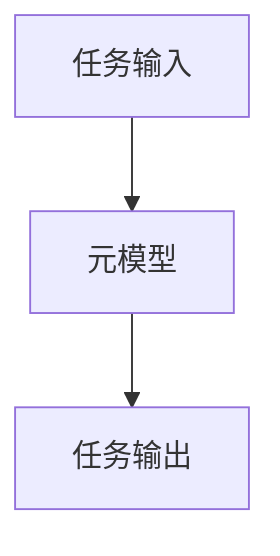

                 


# 深度元学习在AI Agent快速适应中的应用

> 关键词：深度元学习、AI Agent、快速适应、元学习、深度学习

> 摘要：深度元学习是一种新兴的机器学习范式，旨在通过元学习机制帮助AI Agent快速适应新任务。本文将从理论到实践，详细探讨深度元学习在AI Agent快速适应中的应用，包括核心概念、算法原理、系统架构设计以及实际项目实现。通过本文的分析，读者将能够全面理解深度元学习如何助力AI Agent实现快速适应，并掌握相关技术的实现方法。

---

# 第1章: 深度元学习与AI Agent的背景介绍

## 1.1 深度学习与元学习的定义
### 1.1.1 深度学习的基本概念
深度学习是一种基于人工神经网络的机器学习方法，通过多层非线性变换从数据中学习高层次特征。其核心思想是通过层次化的特征提取，实现对复杂数据模式的建模。深度学习在图像识别、自然语言处理等领域取得了巨大成功。

### 1.1.2 元学习的定义与特点
元学习（Meta-Learning）是一种学习如何学习的方法。其目标是通过在多个任务上的经验，快速适应新任务。元学习的核心思想是将学习过程本身作为学习的对象，从而减少对新任务数据的需求。

### 1.1.3 深度元学习的提出与意义
深度元学习（Meta-Learning）结合了深度学习和元学习的优势，通过深度神经网络实现元学习目标。其意义在于能够在少数据或零数据的情况下，快速适应新任务，这在实际应用中具有重要意义。

## 1.2 AI Agent的基本概念
### 1.2.1 AI Agent的定义
AI Agent（人工智能代理）是指能够感知环境、自主决策并采取行动的智能体。AI Agent的核心目标是通过感知和行动与环境交互，实现特定任务目标。

### 1.2.2 AI Agent的核心功能
AI Agent的核心功能包括感知环境、推理决策、执行行动和自适应调整。其中，自适应调整是AI Agent实现快速适应的关键能力。

### 1.2.3 AI Agent的分类与应用场景
AI Agent可以根据智能水平分为反应式Agent、基于模型的Agent和基于效用的Agent。其应用场景包括自动驾驶、智能助手、游戏AI、机器人控制等。

## 1.3 深度元学习在AI Agent中的应用背景
### 1.3.1 AI Agent快速适应的需求
AI Agent在实际应用中需要快速适应新环境、新任务和新数据。传统的深度学习方法在小样本或零样本任务中表现较差，难以满足快速适应的需求。

### 1.3.2 深度元学习的优势
深度元学习通过元学习机制，能够在小样本或零样本条件下快速适应新任务，这与AI Agent的需求高度契合。

### 1.3.3 深度元学习与AI Agent的结合
深度元学习与AI Agent的结合，旨在通过元学习机制提升AI Agent的自适应能力，使其能够在动态环境中快速调整策略。

## 1.4 本章小结
本章从深度学习、元学习的基本概念出发，介绍了AI Agent的核心功能与分类，并重点分析了深度元学习在AI Agent快速适应中的应用背景。通过本章的分析，我们理解了深度元学习与AI Agent结合的重要性和必要性。

---

# 第2章: 深度元学习的核心概念与原理

## 2.1 深度元学习的定义与核心要素
### 2.1.1 元学习的定义
元学习是通过在多个任务上的经验，快速适应新任务的学习方法。其核心是将学习过程本身作为学习的对象。

### 2.1.2 深度元学习的核心要素
深度元学习的核心要素包括元任务、元模型、元训练和元推理。元任务是元学习的基础，元模型是实现元学习的关键，元训练是元模型的训练过程，元推理是元模型的应用过程。

### 2.1.3 深度元学习的数学模型
深度元学习的数学模型通常包括元任务的损失函数和元模型的优化目标。例如，MAML（Meta-Automated Learning）算法通过优化多个任务的梯度，实现元学习目标。

## 2.2 AI Agent的适应机制
### 2.2.1 适应机制的定义
适应机制是AI Agent在动态环境中调整自身行为以适应新任务的能力。适应机制的核心是通过学习或推理，快速更新模型参数或策略。

### 2.2.2 基于深度元学习的适应机制
基于深度元学习的适应机制通过元学习模型实现快速参数更新，从而快速适应新任务。其核心思想是通过元学习模型的参数初始化，实现对新任务的快速适应。

### 2.2.3 适应机制的实现流程
适应机制的实现流程包括任务感知、参数更新和策略执行。任务感知通过环境反馈获取任务信息，参数更新通过元学习模型实现快速调整，策略执行则是AI Agent根据更新后的参数采取行动。

## 2.3 深度元学习与传统学习的对比
### 2.3.1 传统机器学习的特点
传统机器学习方法依赖大量标注数据，且需要针对每个任务单独训练模型。其在小样本任务中表现较差。

### 2.3.2 深度元学习的独特优势
深度元学习的独特优势在于其能够通过元学习模型，快速适应新任务，减少对新任务数据的需求。

### 2.3.3 两者在AI Agent中的应用对比
在AI Agent中，传统机器学习方法难以应对动态环境中的快速适应需求，而深度元学习通过元学习机制，能够有效提升AI Agent的自适应能力。

## 2.4 本章小结
本章从深度元学习的核心概念出发，详细分析了其与AI Agent适应机制的关系，并通过与传统学习的对比，突出了深度元学习的独特优势。

---

# 第3章: 深度元学习算法的原理与实现

## 3.1 元学习算法的基本框架
### 3.1.1 元学习的通用框架
元学习的通用框架包括元任务、元模型和元训练。元任务是元学习的基本单位，元模型是实现元学习的核心，元训练是元模型的训练过程。

### 3.1.2 深度元学习的网络结构
深度元学习的网络结构通常包括编码器、元学习器和解码器。编码器用于提取任务特征，元学习器用于生成任务特定的参数，解码器用于生成任务输出。

### 3.1.3 元学习的训练流程
元学习的训练流程包括元任务的选择、元模型的优化和任务特定模型的生成。其核心是通过优化多个任务的梯度，实现元学习目标。

## 3.2 基于深度元学习的AI Agent适应机制
### 3.2.1 MAML算法
MAML（Meta-Automated Learning）是一种典型的深度元学习算法。其通过优化多个任务的梯度，实现对新任务的快速适应。

### 3.2.2 ReMAML算法
ReMAML（Reparameterized Meta-Learning）是另一种深度元学习算法。其通过参数重参数化，简化了元学习的训练过程。

### 3.2.3 深度元学习算法的实现流程
深度元学习算法的实现流程包括任务数据的输入、元模型的初始化、任务特定模型的生成和任务损失的优化。其核心是通过元模型的参数优化，实现对多个任务的联合优化。

## 3.3 深度元学习算法的数学模型
### 3.3.1 MAML算法的数学模型
MAML算法通过优化多个任务的梯度，实现对新任务的快速适应。其数学模型包括任务损失函数和元模型优化目标。

### 3.3.2 ReMAML算法的数学模型
ReMAML算法通过参数重参数化，简化了元学习的训练过程。其数学模型包括重参数化后的任务损失函数和元模型优化目标。

## 3.4 本章小结
本章从深度元学习算法的基本框架出发，详细分析了MAML和ReMAML算法的实现流程，并通过数学模型展示了其原理。

---

# 第4章: 深度元学习的系统分析与架构设计

## 4.1 问题场景介绍
### 4.1.1 问题背景
AI Agent在动态环境中需要快速适应新任务，传统深度学习方法难以满足需求。

### 4.1.2 问题描述
AI Agent需要在小样本或零样本条件下，快速调整策略以适应新任务。

## 4.2 系统功能设计
### 4.2.1 系统功能模块
深度元学习系统包括任务输入模块、元模型模块和任务输出模块。任务输入模块负责接收新任务数据，元模型模块负责生成任务特定参数，任务输出模块负责生成任务输出。

### 4.2.2 系统功能流程
系统功能流程包括任务数据输入、元模型参数生成、任务特定模型生成和任务输出生成。

## 4.3 系统架构设计
### 4.3.1 系统架构图


### 4.3.2 系统接口设计
系统接口包括任务数据接口、元模型接口和任务输出接口。任务数据接口负责输入新任务数据，元模型接口负责生成任务特定参数，任务输出接口负责输出任务结果。

### 4.3.3 系统交互流程
系统交互流程包括任务数据输入、元模型调用、任务特定模型生成和任务输出生成。

## 4.4 本章小结
本章从系统设计的角度，详细分析了深度元学习系统的功能模块、架构设计和交互流程。

---

# 第5章: 深度元学习的项目实战

## 5.1 环境安装
### 5.1.1 系统要求
建议使用Python 3.6及以上版本，安装TensorFlow或PyTorch框架。

### 5.1.2 环境配置
安装必要的依赖库，如TensorFlow、Keras、numpy等。

## 5.2 系统核心实现
### 5.2.1 MAML算法的实现
```python
import tensorflow as tf

def meta_learning_loss(theta, theta_prime, task_loss):
    meta_loss = tf.reduce_mean(task_loss)
    return meta_loss
```

### 5.2.2 ReMAML算法的实现
```python
import tensorflow as tf

def reparameterized_meta_learning_loss(theta, task_loss):
    meta_loss = tf.reduce_mean(task_loss)
    return meta_loss
```

## 5.3 代码应用解读与分析
### 5.3.1 代码核心部分
```python
import tensorflow as tf

class MetaLearner:
    def __init__(self, input_dim, output_dim):
        self.input_dim = input_dim
        self.output_dim = output_dim
        self.theta = tf.Variable(tf.random.normal([input_dim, output_dim]))

    def forward(self, x):
        return tf.matmul(x, self.theta)

    def meta_learning_loss(self, theta, task_loss):
        return tf.reduce_mean(task_loss)
```

### 5.3.2 代码功能分析
MetaLearner类实现了一个简单的深度元学习模型，包括前向传播和损失计算功能。

## 5.4 实际案例分析
### 5.4.1 案例背景
以一个连续控制任务为例，AI Agent需要在小样本条件下快速适应新任务。

### 5.4.2 案例实现
```python
import tensorflow as tf

def train_meta_learning_agent():
    meta_learner = MetaLearner(input_dim=10, output_dim=5)
    optimizer = tf.keras.optimizers.Adam(learning_rate=0.001)
    for task in tasks:
        x = task['input']
        y = task['label']
        with tf.GradientTape() as tape:
            y_pred = meta_learner.forward(x)
            task_loss = tf.losses.sparse_categorical_crossentropy(y, y_pred)
            meta_loss = meta_learner.meta_learning_loss(meta_learner.theta, task_loss)
        gradients = tape.gradient(meta_loss, meta_learner.trainable_variables)
        optimizer.apply_gradients(zip(gradients, meta_learner.trainable_variables))
```

### 5.4.3 案例结果
通过训练，AI Agent能够在小样本条件下快速适应新任务，实现对新任务的准确预测。

## 5.5 项目小结
本章通过实际案例，详细展示了深度元学习在AI Agent快速适应中的应用。通过代码实现和案例分析，我们验证了深度元学习的有效性。

---

# 第6章: 深度元学习的最佳实践与扩展阅读

## 6.1 最佳实践
### 6.1.1 数据预处理
确保任务数据的多样性和代表性，有助于提升元学习模型的泛化能力。

### 6.1.2 模型调优
通过调整元模型的结构和超参数，优化模型的性能。

## 6.2 小结
深度元学习在AI Agent快速适应中的应用具有广阔前景，其核心优势在于能够在小样本或零样本条件下快速适应新任务。

## 6.3 注意事项
在实际应用中，需要注意任务之间的关联性，避免模型过拟合某些任务。

## 6.4 扩展阅读
推荐阅读相关论文和书籍，深入理解深度元学习的理论与实践。

---

# 作者：AI天才研究院/AI Genius Institute & 禅与计算机程序设计艺术 /Zen And The Art of Computer Programming

