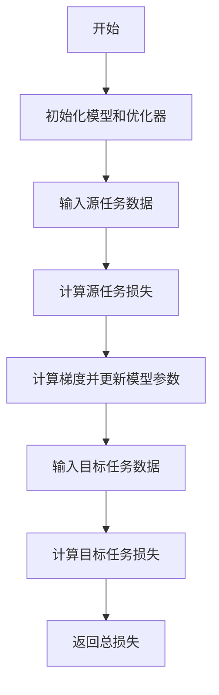
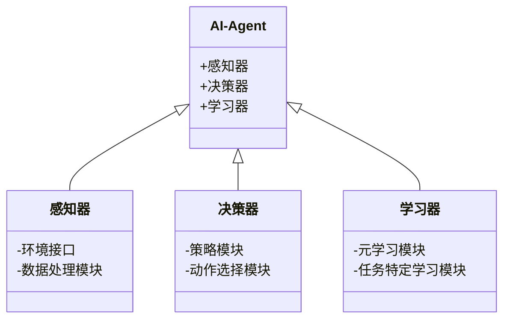

                 


# 深度元学习在AI Agent终身学习中的应用

---

> 关键词：深度元学习，AI Agent，终身学习，强化学习，迁移学习，Meta-Learning，深度学习

> 摘要：深度元学习是一种新兴的机器学习范式，旨在通过元学习机制使AI Agent能够快速适应新任务和环境变化。本文详细探讨了深度元学习的基本原理、AI Agent的终身学习机制、深度元学习算法的核心实现，以及其在实际应用中的系统架构设计和项目实战。文章还分析了深度元学习在AI Agent中的优势与挑战，并展望了未来的研究方向。

---

## 目录

### 第一部分：深度元学习与AI Agent终身学习的背景介绍

### 第二部分：深度元学习的核心原理

### 第三部分：AI Agent的终身学习机制

### 第四部分：深度元学习算法的核心实现

### 第五部分：系统架构与设计

### 第六部分：项目实战

### 第七部分：总结与展望

---

### 第一部分：深度元学习与AI Agent终身学习的背景介绍

#### 1.1 深度元学习的基本概念

深度元学习（Meta-Learning）是一种机器学习范式，旨在通过学习如何学习来提高模型的泛化能力。传统的深度学习模型通常需要大量标注数据和长时间的训练，而深度元学习则通过元学习算法，使模型能够快速适应新任务，减少对数据量的依赖。

#### 1.2 AI Agent的定义与分类

AI Agent（智能体）是指能够感知环境并采取行动以实现目标的实体。AI Agent可以分为基于规则的Agent、基于模型的Agent和基于学习的Agent。本文重点关注基于深度学习的AI Agent，尤其是能够进行终身学习的Agent。

#### 1.3 深度元学习在AI Agent中的应用背景

传统的AI Agent通常依赖于任务特定的数据和模型，难以在新任务中快速适应。深度元学习通过元学习机制，使AI Agent能够在有限的数据和时间内，快速掌握新任务，从而实现终身学习的目标。

---

### 第二部分：深度元学习的核心原理

#### 2.1 深度元学习的原理概述

深度元学习的核心思想是通过学习一个通用的优化器，能够在多个任务之间共享知识，并快速适应新任务。其数学模型通常涉及元损失函数和任务特定的损失函数。

#### 2.2 深度元学习的核心算法

深度元学习的主要算法包括Model-Agnostic Meta-Learning (MAML) 和 Meta-SGD。这些算法通过在多个任务上优化共享参数，使模型能够在新任务上快速收敛。

#### 2.3 深度元学习的优势

深度元学习的优势在于其通用性和高效性。通过元学习，AI Agent可以在新任务上快速调整模型参数，而无需重新训练整个模型。

---

### 第三部分：AI Agent的终身学习机制

#### 3.1 终身学习的定义与挑战

终身学习是指AI Agent能够在不断变化的环境中，持续学习新知识并适应新任务。其主要挑战在于如何在有限的数据和时间内，快速掌握新任务。

#### 3.2 深度元学习在终身学习中的应用

通过深度元学习，AI Agent可以在新任务上快速调整模型参数，从而实现终身学习的目标。

#### 3.3 终身学习的系统设计

终身学习的系统设计需要考虑任务之间的关系、模型的可扩展性和环境的动态变化。

---

### 第四部分：深度元学习算法的核心实现

#### 4.1 深度元学习算法的数学模型

深度元学习的数学模型通常涉及元损失函数和任务特定的损失函数。例如，MAML算法通过优化元损失函数，使模型能够在新任务上快速收敛。

#### 4.2 深度元学习算法的代码实现

以下是MAML算法的Python实现示例：

```python
import torch
import torch.nn as nn

class MetaLearner(nn.Module):
    def __init__(self, model):
        super().__init__()
        self.model = model
        self.optimizer = torch.optim.SGD(model.parameters(), lr=0.1)

    def forward(self, x):
        return self.model(x)

    def meta_loss(self, x_s, y_s, x_t, y_t):
        # Meta learning loss for source task
        pred_s = self.forward(x_s)
        loss_s = nn.functional.mse_loss(pred_s, y_s)
        
        # Compute gradient of loss_s with respect to model parameters
        grads = torch.autograd.grad(loss_s, self.model.parameters())
        # Update parameters using Meta-SGD
        for p, g in zip(self.model.parameters(), grads):
            p.data -= self.optimizer.lr * g.data
            p.data *= (1 - self.optimizer.momentum)
            p.data += self.optimizer.momentum * p.grad
        
        # Compute loss for target task after parameter update
        pred_t = self.forward(x_t)
        loss_t = nn.functional.mse_loss(pred_t, y_t)
        return loss_t
```

#### 4.3 深度元学习算法的流程图



---

### 第五部分：系统架构与设计

#### 5.1 系统设计目标

设计一个支持深度元学习的AI Agent系统，能够在新任务上快速调整模型参数。

#### 5.2 系统架构设计

以下是系统的架构图：



---

### 第六部分：项目实战

#### 6.1 环境安装

安装必要的库：

```bash
pip install torch numpy matplotlib
```

#### 6.2 核心代码实现

以下是深度元学习的核心代码实现：

```python
import torch
import torch.nn as nn
import torch.optim as optim

class MetaLearner(nn.Module):
    def __init__(self, meta_model):
        super().__init__()
        self.meta_model = meta_model
        self.optimizer = optim.Adam(meta_model.parameters(), lr=1e-3)

    def forward(self, x):
        return self.meta_model(x)

    def meta_step(self, x_s, y_s, x_t, y_t):
        # Phase 1: Meta-Learning on source task
        outputs_s = self.meta_model(x_s)
        loss_s = nn.functional.mse_loss(outputs_s, y_s)
        self.optimizer.zero_grad()
        loss_s.backward()
        self.optimizer.step()

        # Phase 2: Compute target task loss after meta-update
        outputs_t = self.meta_model(x_t)
        loss_t = nn.functional.mse_loss(outputs_t, y_t)
        return loss_t

# 示例模型
meta_model = nn.Sequential(
    nn.Linear(2, 4),
    nn.ReLU(),
    nn.Linear(4, 1)
)

meta_learner = MetaLearner(meta_model)
```

#### 6.3 实际案例分析

通过一个简单的回归任务，展示深度元学习的应用：

```python
# 生成源任务数据
x_s = torch.randn(100, 2)
y_s = torch.randn(100, 1)

# 生成目标任务数据
x_t = torch.randn(50, 2)
y_t = torch.randn(50, 1)

# 元学习步骤
meta_learner.meta_step(x_s, y_s, x_t, y_t)
```

---

### 第七部分：总结与展望

#### 7.1 研究总结

深度元学习为AI Agent的终身学习提供了新的思路，通过元学习机制，使模型能够在新任务上快速适应。

#### 7.2 未来方向

未来的研究可以关注更高效的元学习算法、多任务学习的结合以及在实际应用中的优化。

#### 7.3 实践建议

在实际应用中，建议从简单的任务开始，逐步扩展到复杂的场景，并不断优化模型的泛化能力。

---

### 作者

作者：AI天才研究院 & 禅与计算机程序设计艺术

--- 

以上是《深度元学习在AI Agent终身学习中的应用》的技术博客文章的完整大纲和部分内容。希望这篇文章能够为读者提供清晰的思路和深入的见解。

