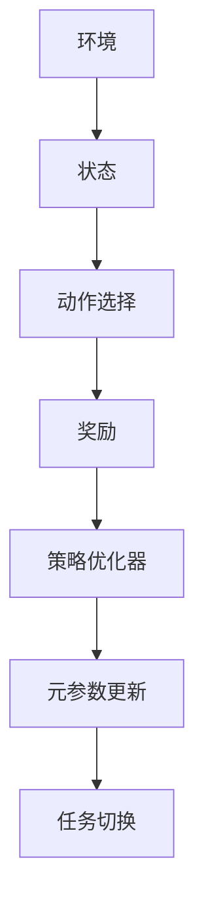

                 


# 深度元强化学习在AI Agent策略适应中的应用

**关键词**：深度元强化学习、AI Agent、策略适应、强化学习、元学习

**摘要**：  
深度元强化学习是一种结合深度学习和元学习的新兴技术，旨在提升AI Agent在复杂动态环境中的策略适应能力。本文从基础概念、算法原理、系统架构到实际应用，全面探讨深度元强化学习的核心思想和实现方法，为AI Agent的策略优化提供新的思路。

---

## 第一部分: 深度元强化学习基础

### 第1章: 深度元强化学习概述

#### 1.1 深度元强化学习的基本概念  
深度元强化学习（Deep Meta-Reinforcement Learning）是强化学习（Reinforcement Learning, RL）与元学习（Meta-Learning）的结合。通过深度神经网络，AI Agent能够在多任务或动态环境中快速适应策略，无需额外的训练数据。

**特点**：  
1. **快速适应性**：通过元学习，AI Agent能够快速调整策略以应对新任务或环境变化。  
2. **深度表示能力**：利用深度学习的强大表示能力，捕捉复杂环境中的特征。  
3. **端到端优化**：从输入到输出的端到端优化，简化传统强化学习中的特征工程。  

**与传统强化学习的区别**：  
- 传统RL需要大量任务特异性数据，而深度元强化学习通过元学习，能够在少量数据或经验中快速适应新任务。

---

### 第2章: 深度元强化学习的核心概念与联系

#### 2.1 元学习的机制  
元学习的目标是学习如何学习。通过优化元参数，AI Agent能够快速适应新任务。例如，在Meta-Q网络中，元参数用于优化Q值函数，使其适用于不同任务。

**优化目标**：  
$$ \theta^{(t+1)} = \theta^{(t)} - \alpha \nabla_{\theta} \mathcal{L}(\theta) $$  
其中，$\theta$ 是元参数，$\mathcal{L}$ 是损失函数，$\alpha$ 是学习率。

#### 2.2 深度学习在元强化学习中的作用  
深度学习通过强大的特征提取能力，帮助元学习更好地捕捉环境中的有用信息。例如，在Meta-Policy网络中，深度神经网络用于表示策略函数，通过元学习优化策略参数。

---

## 第二部分: 深度元强化学习的算法原理

### 第3章: 深度元强化学习的算法实现

#### 3.1 Meta-Q网络的算法流程  
Meta-Q网络通过元学习优化Q值函数，适用于多任务强化学习场景。其流程如下：

1. **初始化**：随机初始化元参数 $\theta$ 和任务参数 $\phi$。  
2. **元训练**：通过多个任务的数据，更新元参数 $\theta$，使其能够快速适应新任务。  
3. **任务训练**：在特定任务中，优化任务参数 $\phi$，使其适应当前任务。  

**数学模型**：  
$$ Q(s, a; \theta) \text{：状态-动作值函数} $$  
$$ \theta^{(t+1)} = \theta^{(t)} - \alpha \nabla_{\theta} \sum_{i} \mathcal{L}_i(\theta) $$  

---

### 第4章: 深度元强化学习的系统架构设计

#### 4.1 系统功能设计  
系统功能包括：  
- **环境交互**：与动态环境交互，获取状态和奖励。  
- **策略优化**：通过元学习优化策略参数，适应新任务。  
- **任务切换**：支持多任务切换，快速调整策略。  

#### 4.2 系统架构图  


---

## 第三部分: 深度元强化学习的应用与实践

### 第5章: 深度元强化学习的项目实战

#### 5.1 环境安装  
- 安装Python和深度学习框架（如TensorFlow或PyTorch）。  
- 安装强化学习库（如OpenAI Gym）。  

#### 5.2 核心代码实现  
```python
import tensorflow as tf

class MetaQNetwork:
    def __init__(self, state_dim, action_dim):
        self.state_dim = state_dim
        self.action_dim = action_dim
        self.theta = tf.Variable(tf.random.normal([state_dim, action_dim]))
    
    def call(self, state):
        return tf.matmul(state, self.theta)
    
    def update(self, gradients):
        self.theta = self.theta - self.alpha * gradients
```

#### 5.3 应用案例分析  
通过训练一个AI Agent在迷宫中导航，展示深度元强化学习的策略适应能力。通过Meta-Q网络，AI Agent能够在不同迷宫布局中快速调整策略，找到最优路径。

---

### 第6章: 深度元强化学习的最佳实践

#### 6.1 框架选择  
- 根据任务需求选择合适的深度学习框架（TensorFlow、PyTorch等）。  
- 确保框架版本兼容，避免依赖冲突。  

#### 6.2 数据预处理  
- 对环境数据进行标准化或归一化处理，提升模型训练效果。  
- 确保数据多样性，覆盖不同任务或环境状态。  

#### 6.3 调参技巧  
- 逐步调整学习率（$\alpha$）和批量大小，找到最佳参数组合。  
- 使用早停机制防止过拟合。  

---

## 第四部分: 总结与展望

### 7.1 本章小结  
深度元强化学习通过结合深度学习和元学习，为AI Agent的策略适应提供了新的解决方案。其核心思想是通过元学习优化策略，使其能够在复杂动态环境中快速调整和适应。

### 7.2 注意事项  
- 深度元强化学习的计算开销较大，需要高性能计算资源。  
- 在实际应用中，需注意任务切换的效率和策略的稳定性。  

### 7.3 拓展阅读  
- 建议阅读相关论文，如《Meta-Q-Networks for Zero-Shot Reinforcement Learning》。  
- 关注最新研究，了解深度元强化学习的前沿进展。  

---

## 作者：AI天才研究院/AI Genius Institute & 禅与计算机程序设计艺术 /Zen And The Art of Computer Programming

