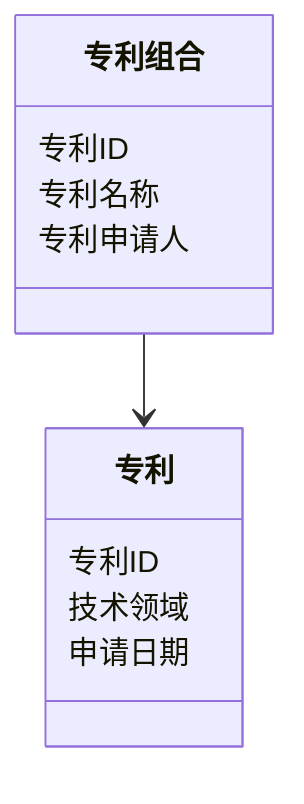

                 


# 深度学习分析公司专利组合价值

## 关键词：深度学习，专利组合，价值评估，技术分析，企业战略

## 摘要：本文探讨了如何利用深度学习技术分析公司专利组合的价值。通过构建深度学习模型，分析专利数据，评估其商业价值，为企业制定战略提供数据支持。文章从背景、概念、算法、系统设计、实战到最佳实践，全面阐述了深度学习在专利组合分析中的应用。

---

## 第一部分：背景介绍

### 第1章：问题背景与描述

#### 1.1 问题背景
- **专利在企业价值中的作用**：专利是企业核心竞争力的体现，影响市场地位和收益。
- **传统专利评估方法的局限性**：传统方法依赖人工分析，耗时且难以量化。
- **深度学习在专利分析中的优势**：自动化处理大量数据，发现隐藏关联。

#### 1.2 问题描述
- **专利组合的定义与特征**：一组相关专利的集合，具有技术相关性和战略目的。
- **专利组合价值评估的挑战**：数据复杂性高，需综合技术、法律和市场因素。
- **深度学习在专利组合分析中的应用前景**：提高评估效率和准确性。

#### 1.3 问题解决与边界
- **深度学习如何解决专利组合价值评估问题**：自动分类、特征提取、价值预测。
- **问题的边界与外延**：仅限于技术评估，不考虑法律因素。
- **核心概念与要素组成**：专利数据、模型、评估指标。

---

## 第二部分：核心概念与联系

### 第2章：专利组合分析的核心概念

#### 2.1 专利组合的定义与特征
- **定义**：一组相关专利的集合，用于保护技术解决方案。
- **特征对比**：技术相关性、法律稳定性、市场覆盖度。
- **专利组合与公司价值的关系**：增强市场竞争力，创造经济价值。

#### 2.2 核心概念的ER实体关系图
```mermaid
er
  entity 专利组合 {
    <属性> 专利ID, 专利名称, 专利申请日期
    <关系> 包含 [1..n] 专利
  }
  entity 专利 {
    <属性> 专利ID, 专利名称, 专利申请人
    <关系> 属于 [0..1] 专利组合
  }
```

---

## 第三部分：算法原理讲解

### 第3章：深度学习模型的构建与训练

#### 3.1 模型结构与原理
- **模型选择**：使用序列模型处理专利文本数据。
- **模型输入与输出**：输入专利文本，输出价值评分。
- **模型训练过程**：数据预处理、特征提取、模型训练。

#### 3.2 模型的数学公式
- **损失函数**：$$L = \frac{1}{2} \|y_{\text{预测}} - y_{\text{真实}}\|^2$$
- **优化算法**：梯度下降，$$\theta_{\text{新}} = \theta_{\text{旧}} - \eta \cdot \nabla L$$

#### 3.3 深度学习模型实现
```python
import tensorflow as tf
from tensorflow.keras import layers

model = tf.keras.Sequential([
    layers.Embedding(input_dim=vocabulary_size, output_dim=embedding_dim),
    layers.LSTM(units= lstm_units, return_sequences=False),
    layers.Dense(1, activation='sigmoid')
])
```

---

## 第四部分：系统分析与架构设计方案

### 第4章：系统架构设计

#### 4.1 问题场景介绍
- 系统目标：分析专利组合价值。
- 项目介绍：构建一个基于深度学习的专利分析系统。

#### 4.2 系统功能设计
- 领域模型类图：


#### 4.3 系统架构图


---

## 第五部分：项目实战

### 第5章：深度学习项目实战

#### 5.1 环境安装
- 安装TensorFlow和Keras。

#### 5.2 核心代码实现
```python
import pandas as pd
import numpy as np
from sklearn.model_selection import train_test_split
from tensorflow.keras import layers, models

# 数据预处理
data = pd.read_csv('patent_data.csv')
X_train, X_test, y_train, y_test = train_test_split(data['专利文本'], data['价值评分'])

# 模型构建
model = models.Sequential()
model.add(layers.Embedding(input_dim=10000, output_dim=16))
model.add(layers.LSTM(64, return_sequences=False))
model.add(layers.Dense(1, activation='sigmoid'))

model.compile(optimizer='adam', loss='binary_crossentropy', metrics=['accuracy'])

# 训练模型
model.fit(X_train, y_train, epochs=10, batch_size=32, validation_data=(X_test, y_test))
```

#### 5.3 代码解读与分析
- **数据预处理**：将专利文本转换为数值表示。
- **模型构建**：嵌入层、LSTM层、全连接层。
- **训练过程**：优化器选择Adam，损失函数为二进制交叉熵。

#### 5.4 实际案例分析
- 使用模型分析某公司的专利组合，预测其市场价值。

---

## 第六部分：最佳实践

### 第6章：项目小结与经验分享

#### 6.1 小结
- 深度学习在专利组合分析中的优势明显，但仍需结合人工分析。

#### 6.2 注意事项
- 数据质量影响模型性能，需谨慎处理。
- 模型解释性不足，需结合业务背景。

#### 6.3 拓展阅读
- 推荐阅读相关技术书籍，深入学习深度学习与专利分析的结合。

---

## 结论

深度学习为公司专利组合价值评估提供了新的方法。通过构建深度学习模型，企业能够更高效、准确地评估专利组合的价值，从而制定更有效的战略决策。

---

## 作者：AI天才研究院/AI Genius Institute & 禅与计算机程序设计艺术 /Zen And The Art of Computer Programming

---

希望这篇文章的结构和内容符合您的要求。如果需要进一步修改或补充，请随时告诉我。

